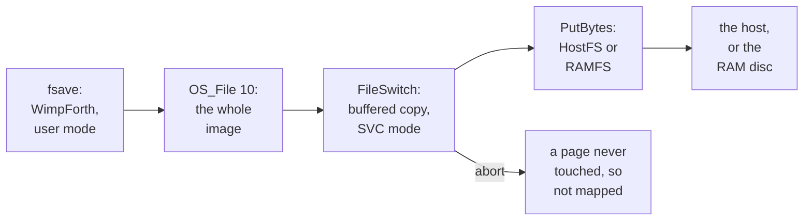

# 2. A second opinion

A second look at the case came back with six points. They are summarised here, lightly
edited.

<!-- doccrate:keep-together:start -->
## The HostFS that was read was not the one running

The farm's ROM carries HostFS 2.03. The HostFS source read for the case was the retired
1.x module, and the two save files differently.

On 2.x, whole-file save is retired. `OS_File 10` never reaches `FSEntry_File 0`. Instead
FileSwitch builds the save out of Open, a run of buffered PutBytes calls with a
1,024-byte buffer, and Close. Each PutBytes goes over the `C_FS_PUTBYTES` command, which
passes the guest's logical address and walks the MMU page by page.

The mismatch the case had noted between an 8,192 and a 4,032 `VMCH_MAX_ARG` was an
artefact of comparing 1.x with 2.x: a red herring.
<!-- doccrate:keep-together:end -->

<!-- doccrate:keep-together:start -->
## HostFS 2.x has a path that can abort the guest

The emulator's device cannot fault a guest page in: it can only read pages that are
already mapped. So on a short transfer HostFS first runs
[`touch_pages`](https://github.com/albanread/RISCOSQEMUA72/blob/riscos-pi4/riscos-pi4/hostfs/dde/c/hostfs#L651), which reads one byte of every page, in the guest's SVC
mode, to make sure they are.

Its own comment says what would happen with a wild range — it aborts there — and names
the fix: validate the range with `OS_ValidateAddress` first.

That fitted the symptoms. The 27 KB kernel image had only just been written, so it was
mapped and never needed the fallback. The `FSAVE` range covered the whole task, much of
it never touched.
<!-- doccrate:keep-together:end -->

<!-- doccrate:keep-together:start -->
## The crash address had lost a digit

`OS_ConvertHex8` always prints eight digits, so `&2006E08` — seven — lost one when it was
copied down. Which digit matters, because the RISC OS 5.3 memory map puts the two
candidates in very different places.

| Address range | What lives there |
|:---|:---|
| `&8000` to `&1FFFFFFF` | application space |
| from `&20000000` | the RMA — module code and data |
| from `&30000000` | the system heap |
<!-- doccrate:keep-together:end -->

So `&02006E08` is ordinary application space, which needs a slot of at least 32 MB, while
`&20006E08` is in the RMA, among module code. And "Application has gone wrong" is the
Wimp's wording, not WimpForth's.

<!-- doccrate:keep-together:start -->
## The first probe should not be discarded

An earlier reading gave `coldstart = &2008000`. That is exactly `&8000` plus 32 MB — the
top of a 32 MB slot — and `here = &2006E08` sits just below it, so the two readings
agree with each other.

Later readings of `A3800` and `2F0Ax` fit a 640 KB slot instead. Both can be true, of
different launches: `WimpTask` from the job runner, against `!RUN` with its own
`WimpSlot` line. The advice was to measure the slot at the moment of the crash.
<!-- doccrate:keep-together:end -->

<!-- doccrate:keep-together:start -->
## A plan, and a fix worth making regardless

The order to run things in:

| Step | Why |
|:---|:---|
| 1. `*ShowRegs` and `*Where`, redirected to a file | the mode says user or SVC; `*Where` names the module |
| 2. The same save to RAMFS | is this HostFS at all? |
| 3. The failing save with `VMCH_TRACE` on | where the device loses the mapping |
| 4. Log R4, R5 and the slot size from inside `"fsave` | the real range, at the real moment |
| 5. Only then, bisect size and range | |
<!-- doccrate:keep-together:end -->

Whatever the outcome, PutBytes and GetBytes should call `OS_ValidateAddress` before
touching pages, and return an error instead of aborting.

<!-- doccrate:keep-together:start -->
## The save path, and where it faults

<!-- doccrate:keep-together:end -->
