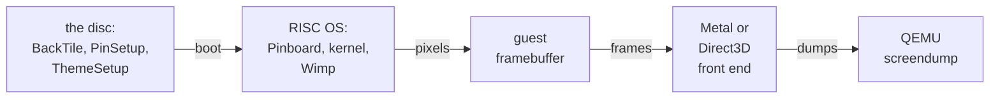

# 1. A layer beneath the desktop

This chapter sets the scene. It describes the background that RISC OS used to draw
for itself and why that stopped being good enough. It then states the idea in one
paragraph, lists the constraints the design had to meet, shows where each piece
lives, and gives the order in which the commits landed.


<!-- doccrate:keep-together:start -->

## The watermark it replaces

On 13 September the fork's desktop design settled on an Acorn look: a flat sage
ground, dark ink for pinboard text, and a quiet watermark in the middle. The
watermark is a "ghost" acorn, the acorn silhouette in a single tone just off the
ground (`#ADB7A8` on `#B7C0B4`), so it reads as a mark rather than a picture. A
small design tool made it as a 220-pixel, 32bpp sprite. The boot sequence's
`PinSetup` file then asked Pinboard to centre that sprite on a sage fill:

```
Backdrop -Centre Boot:Resources.!ThemeDefs.Themes.Acorn.Backdrop -Colour &B4C0B700
```

<!-- doccrate:keep-together:end -->


RISC OS drew the result into its framebuffer at the resolution of the screen mode.
In the 800×600 desktop mode the icon bar takes the bottom 66 rows, which leaves an
800×534 background. The emulator's display front end then magnified the whole
desktop to fit the window. A 1646×1156 window on a Retina Mac is about twice the
mode's size in each direction, so the acorn's edge was only as crisp as the scaler
could make an 800×600 image. On a 4K screen it was softer still.

A picture backdrop had a second problem: it was expensive for RISC OS to draw.
Measured on an M4 Max with the end-user disc, one full redraw of the 800×534
background cost 0.505 ms with a picture held as a cached sprite, and 48.3 ms with a
JPEG. Pinboard redraws parts of the background whenever a window moves over it.

## The idea

The host should draw the background itself, at the window's own resolution and
beneath the desktop. RISC OS should say which of its pixels are background. The
host then composites the desktop over its own scene, so windows, menus, icons and
the icon bar stay RISC OS's pixels, magnified exactly as before. Only the
background pixels are replaced, and the replacement can be any size, any
sharpness, and even animated, at no cost to the guest.


<!-- doccrate:keep-together:start -->

## The constraints it had to meet

Four constraints shaped every later decision:

| Constraint | How the design meets it |
|:---|:---|
| **No RISC OS code changes** | Pinboard tiles a tagged sprite; the kernel's plot and the Wimp's copies keep the byte |
| **Nothing changes when it is off** | `backdrop=off` is the default: the byte is ignored and no menu is built |
| **The same picture on both hosts** | one key colour, one set of constants, the acorn maths ported line for line to HLSL |
| **A disc that looks right anywhere** | the tile is plain sage, so any other display shows a flat Acorn ground |

<!-- doccrate:keep-together:end -->


The last row matters for users. The disc that ships with a release can be booted
by an older emulator, by QEMU's own `cocoa` display, or with the layer switched
off. In each case, the tile's own colour is what appears.


<!-- doccrate:keep-together:start -->

## Where the pieces live



<!-- doccrate:keep-together:end -->


<!-- doccrate:keep-together:start -->

#### The files

| Piece | Files | Chapter |
|:---|:---|:---|
| the tagged tile | `riscos-pi4/tools/mkbacktile.py` | 3 |
| the disc patches | `riscos-pi4/tools/make-release.sh`, `riscos-pi4/tools/make-release.py` | 3 |
| the launchers | `riscos-pi4/app/launcher.zsh` (Mac), `riscos-pi4/app/win/launcher.c` (Windows) | 7 |
| the Mac front end | `ui/metal.m`, `ui/metal.c`, `ui/metal.h` | 4 to 8 |

<!-- doccrate:keep-together:end -->


<!-- doccrate:keep-together:start -->

#### The files, continued

| Piece | Files | Chapter |
|:---|:---|:---|
| the Windows front end | `ui/dx11.cpp`, `ui/dx11.c`, `ui/dx11.h`, `meson.build` | 4 to 8 |
| the display option | `qapi/ui.json`: `backdrop` on `DisplayMetal` and `DisplayDx11` | 7 |
| the screendump hook | `include/ui/console.h`, `ui/console.c`, `ui/ui-qmp-cmds.c` | 8 |
| the test harness | `riscos-pi4/tools/run.py` | 8 |

<!-- doccrate:keep-together:end -->


The design notes are in `riscos-pi4/MACOS.md`, section 7a, "The backdrop layer",
and in `riscos-pi4/tools/README.md`.


<!-- doccrate:keep-together:start -->

## The order it landed in

Seven commits over ten hours:

| Commit | When | What it added |
|:---|:---|:---|
| `9a9cd13460` | 14 Sep, 18:36 | Metal: the layer, the tag, both acorn scenes, pictures, a pipeline fix |
| `42ee6cf20a` | 14 Sep, 18:36 | the Mac release: `mkbacktile.py`, `BACKDROP=`, the launcher |
| `1cc6d04a18` | 14 Sep, 18:44 | Metal: the Backdrop menu, `tile:`, the 4096 cap, MACOS.md §7a |
| `e80479db19` | 14 Sep, 20:08 | the acorn's early exit, the 256-pixel tile, the measurements |

<!-- doccrate:keep-together:end -->


<!-- doccrate:keep-together:start -->

#### The order it landed in, continued

| Commit | When | What it added |
|:---|:---|:---|
| `84dfd3c071` | 14 Sep, 20:20 | the gate: `off`, the default, removes the feature and its menu |
| `c4024d236f` | 14 Sep, 21:47 | Direct3D 11: the layer and its menu; screen capture of the composite; `run.py` |
| `d535505fad` | 15 Sep, 04:46 | the Windows release: the tile on the disc, `backdrop=acorn` in the launcher |

<!-- doccrate:keep-together:end -->


The first two commits share a timestamp to the second: they are the feature and its
release packaging. Further work on the Mac menu
was in progress but not yet committed when this document was written. Chapter 9
describes it.

## What this is not

The layer is not a RISC OS module, and it is not an emulated device. The guest
runs no new code. It uses a byte that every 32bpp pixel already has and that the
operating system leaves at zero. All the new code is in the two display front ends
that already decode the guest's framebuffer on the GPU. The layer is one more
decision in their shaders and one more texture in their scale pass.

This has a practical consequence. The layer can only show through what RISC OS
draws in a 32bpp mode, because only 32bpp pixels have a spare byte. In a 16-bit or
8-bit mode there is no tag, the desktop shows no holes, and the Backdrop menu
explains why (chapter 7).
