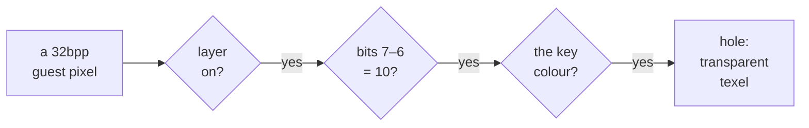

# 2. One byte, two bits

The whole contract between RISC OS and the host is one convention about one byte.
This chapter describes the byte, the two bits that carry the tag, the colour test
added on top of them, and how the host reads both from a pixel. The same
convention is written out in four places: `MACOS.md` §7a, the header comment of
`mkbacktile.py`, and comments in `ui/metal.m` and `ui/dx11.cpp`.


<!-- doccrate:keep-together:start -->

## A 32bpp pixel has a spare byte

In a 32bpp RISC OS screen mode, each pixel is one little-endian word written as
`&TTBBGGRR`. The low three bytes are red, green and blue. The top byte is the
**transfer** byte, which RISC OS also calls the supremacy byte:

| Byte in memory | Bits of the word | Holds |
|:---|:---|:---|
| `+0` | 7–0 | red |
| `+1` | 15–8 | green |
| `+2` | 23–16 | blue |
| `+3` | 31–24 | the transfer byte: **the tag** |

<!-- doccrate:keep-together:end -->


Everything the operating system draws leaves the transfer byte at zero, because the
kernel clears it when it plots. The claim was checked before anything was built on
it. A read of the live framebuffer of the Acorn desktop, taken out of guest memory,
found the byte at zero on all 480,000 pixels. The byte was therefore free to carry
information that RISC OS would never disturb by accident.


<!-- doccrate:keep-together:start -->

## Bits 7 and 6 are the tag

Only the top two bits carry meaning. The other six are reserved:

| Bits 7–6 | Meaning |
|:---|:---|
| `10` | **below**: the layer beneath shows through this pixel |
| `01` | **above**: reserved for a layer drawn over this pixel, such as an overlay |
| `00` | nothing: an ordinary pixel, which is what RISC OS writes |
| `11` | nothing: this is what the `&FF` written by some sprite tools looks like |

<!-- doccrate:keep-together:end -->


Two choices in that table are deliberate.

- **`&FF` means nothing.** Some sprite tools write `&FF` into the top byte, treating
  it as an opaque alpha channel. If one bit alone meant "below", sprites from those
  tools would punch holes wherever they were plotted. Requiring the pattern `10`
  keeps both the all-zero and the all-ones byte inert.
- **Bits 5–0 are reserved.** The host tests only bits 7–6, masking with `0xC0`, so
  a later use of the low six bits will not change how an older host reads the tag.
  Writers should set them to zero, as `mkbacktile.py` does.

## A tag alone is not enough: the key colour

A pixel tagged "below" becomes a hole only if it is also the backdrop **key
colour**, the Acorn theme's sage `#B7C0B4`. The reason is the Wimp's
exclusive-OR drawing.

When you drag a window outline or a rubber band across the desktop, the Wimp draws
the box by EOR-ing a colour into the pixels underneath and EOR-ing it again to
remove it. Over a tagged background, those box pixels change colour. Whether the
EOR also touches the transfer byte depends on how the operation is done. If the
tag survived and the host tested only the tag, the drag box would turn into holes,
and you would drag an invisible outline across the picture.

Testing the colour as well settles the question. Any change to the pixel's colour
takes it out of the key, so the host shows the pixel as ordinary desktop, and the
box stays visible over the scene. When the EOR is undone, the pixel returns to sage
with its tag, and the hole reappears. The commit that introduced the layer,
`9a9cd13460`, records that windows, menus, a dragged window and a rubber band over
the backdrop were all checked on screen.


<!-- doccrate:keep-together:start -->

### The host's test, as a decision



<!-- doccrate:keep-together:end -->


Every "no" exits to the same place: the pixel's own colour, fully opaque, as the
decode pass has always returned it. The first test is not on the pixel at all. It
checks whether the layer is switched on and has a scene, so a machine without the
layer never looks at the byte (chapter 7).


<!-- doccrate:keep-together:start -->

## The tagged pixel as a number

`mkbacktile.py` builds the word from the key colour and the tag:

| Part | Value | Shifted into place |
|:---|:---|:---|
| red | `0xB7` | `0x000000B7` |
| green | `0xC0` | `0x0000C000` |
| blue | `0xB4` | `0x00B40000` |
| tag "below", reserved bits zero | `0x80` | `0x80000000` |
| **the word** | | **`0x80B4C0B7`**, stored as bytes `B7 C0 B4 80` |

<!-- doccrate:keep-together:end -->


The host front ends compare the colour without the tag, so their key constant is
`0x00B4C0B7`, in `0x00BBGGRR` order. It is the same number in both front ends:

```c
#define METAL_BACKDROP_KEY   0x00B4C0B7u  /* 0x00BBGGRR: #B7C0B4 */
#define DX11_BACKDROP_KEY    0x00B4C0B7u  /* 0x00BBGGRR: #B7C0B4 */
```

The key is passed to the shaders at run time, in the first word of the backdrop
constants, rather than compiled into the shader source. The pinboard's own fill
colour is the same sage, written for `*Backdrop` as `&B4C0B700`, which is RISC OS's
`&BBGGRR00` colour form.


<!-- doccrate:keep-together:start -->

## Reading it in the shader

The Metal decode pass reads the four bytes of the pixel from the guest framebuffer
directly. A pixel-order flag swaps red and blue for framebuffers that store BGR. The
shader source is held in `ui/metal.m` as a C string, and this excerpt, like the
others in this document, leaves out the string quoting:

```c
if (BPP == 32) {
    uint tag;
    r = raw[row + bx * 4 + 0];
    g = raw[row + bx * 4 + 1];
    b = raw[row + bx * 4 + 2];
    tag = raw[row + bx * 4 + 3];
    if (P.misc.z == 0) { uint t = r; r = b; b = t; }   /* BGR order */
    /* The transfer byte's layer tag, bits 7-6: 10 is below, and a
     * below pixel in the backdrop key colour is a hole the layer
     * beneath shows through -- transparent, premultiplied. */
    if (P.bd.w != 0 && (tag & 0xC0) == 0x80
        && (r | (g << 8) | (b << 16)) == P.bd.x) {
        return float4(0.0);
    }
}
```

<!-- doccrate:keep-together:end -->


The Direct3D decode pass reads a whole word with a helper and shifts the same
fields out of it. Its test is the same, character for character, except that the
tag comes from `(w >> 24) & 0xC0` and the hole is written `float4(0, 0, 0, 0)`.


<!-- doccrate:keep-together:start -->

### What `P.bd` carries

Both shaders receive a four-word `bd` block of constants on every frame:

| Word | Metal | Direct3D 11 |
|:---|:---|:---|
| `bd.x` | the key, `0x00B4C0B7` | the key, `0x00B4C0B7` |
| `bd.y` | milliseconds into the live scene's 30-minute loop | the same |
| `bd.z` | the icon bar height, 66 guest pixels | the same |
| `bd.w` | 1 when a scene is drawn, else 0 | the scene number, 0 to 4 |

<!-- doccrate:keep-together:end -->


The only difference is the last word. On the Mac the scene is compiled into the
pipeline as a function constant, so the shader only needs an on/off flag. The
Windows shader branches on the scene number at run time. Chapter 4 compares the
two approaches. In both, `bd.w` is zero when the layer
is off or the scene is `none`, and then the decode pass returns tagged sage pixels
as ordinary sage.


<!-- doccrate:keep-together:start -->

## Why not another way

Other ways for the host to find the background come to mind. None of them is
discussed in the fork's notes; this is a comparison made for this document. Each
fails at least one of the constraints from chapter 1, while the tag costs nothing to
paint and moves with the pixels whenever the Wimp copies a block of the screen:

| Alternative | Where it falls short |
|:---|:---|
| treat every sage pixel as background | a sage icon, a sage window or sage text would become a hole |
| ask Pinboard for the background rectangles | needs guest code and a new channel, and goes stale as soon as a window moves |
| a second framebuffer holding a mask | RISC OS would have to draw everything twice |
| read the transfer byte as alpha | RISC OS writes zero everywhere, which as alpha would make the whole desktop transparent |

<!-- doccrate:keep-together:end -->


