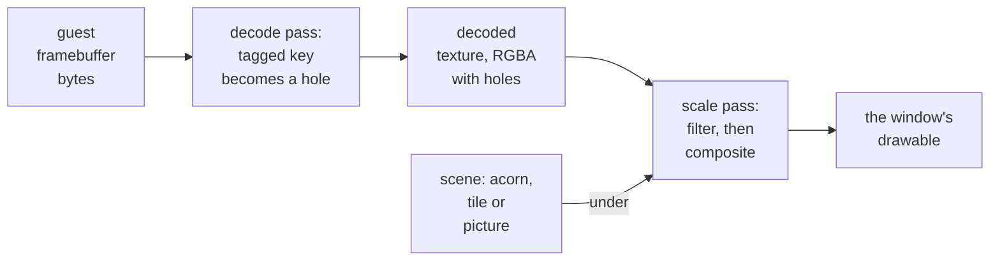

# 4. Holes, then over

Both display front ends already drew the guest's screen in two GPU passes. The
layer adds one decision to the first pass and a scene plus one line of blending to
the second. This chapter walks through both passes and explains why the hole is a
*premultiplied* transparent texel, with a worked example of an edge pixel. It then
compares the Metal and Direct3D versions and ends with a bug in the Mac's scale
pipeline that this work uncovered.

## Two passes, and what the layer adds

The **decode pass** runs once per guest pixel. It reads the guest's framebuffer
bytes, which are raw 32, 24, 16 or palettised 8-bit pixels, and writes a colour
texture at the guest's own resolution. The **scale pass** runs once per window
pixel. It samples that decoded texture with the chosen filter (sharp bilinear,
linear or nearest) and writes the window's drawable. The
[graphics walkthrough](../GraphicsSoundWalkthrough/index.md) covers both passes in
detail.


<!-- doccrate:keep-together:start -->

### The passes with the layer



<!-- doccrate:keep-together:end -->


Nothing else changes. The pointer is still drawn over the scaled frame by its own
pass. A guest in a 16-bit mode has no transfer byte and so no holes: every texel
stays opaque, and the window looks exactly as it did before.


<!-- doccrate:keep-together:start -->

## The hole is premultiplied

The decoded texture stores four channels for every guest pixel. An ordinary pixel
is its colour with alpha 1: `(r, g, b, 1)`. A hole is `(0, 0, 0, 0)`, fully
transparent. The scale pass then treats every texel as **premultiplied**, meaning
its colour channels have already been multiplied by its alpha. It composites the
texel over the scene colour `bg` with the standard "over" formula for
premultiplied colour:

```
out.rgb = c.rgb + bg × (1 − c.a)
```

<!-- doccrate:keep-together:end -->


For an ordinary pixel, `c.a` is 1, so `out` is the pixel. For a hole, `c` is all
zeros, so `out` is the scene. Both of those results would come out the same with
straight (non-premultiplied) alpha. The difference is in the pixels between them,
because the scale pass filters.


<!-- doccrate:keep-together:start -->

### A worked edge

Take a white window border pixel next to a hole, over the acorn scene's sage
ground, and a window pixel whose sample lands exactly halfway between the two
texels. The bilinear filter averages them. Red channel only, in the range 0 to 1:

| Step | Premultiplied, as the shader does it | Straight alpha, for comparison |
|:---|:---|:---|
| texels | white `(1, 1)`, hole `(0, 0)`, as (red, alpha) | the same |
| filtered sample `c` | red 0.5, alpha 0.5 | red 0.5, alpha 0.5 |
| scene `bg` | sage red 183/255 = 0.718 | 0.718 |
| composite | 0.5 + 0.718 × 0.5 = **0.859** | 0.5 × 0.5 + 0.718 × 0.5 = **0.609** |
| halfway between white and sage | 0.859 | 0.859 |

<!-- doccrate:keep-together:end -->


The premultiplied result is exactly halfway between white and sage, which is what
an edge half-covered by the window should show. The straight-alpha formula comes out
darker than both of the colours it blends, because the hole's black colour is
counted twice: once by the filter, and again by the alpha weighting. Every window
edge over the scene would have a dark fringe. The commit messages describe the
chosen behaviour in one phrase: a filtered edge "blends the way every other edge
does".

The same arithmetic holds for any number of texels averaged together, which
matters on Windows. The Direct3D front end builds a mipmap chain of the decoded
texture on every frame and samples it trilinearly, so a window smaller than the
mode averages every source pixel it covers. Averaging premultiplied texels gives a
correct partial coverage. Averaging straight-alpha texels would not. The Metal front
end samples the decoded texture with a linear filter and no mipmaps.


<!-- doccrate:keep-together:start -->

## The scale pass, line by line

The end of the Direct3D 11 scale pass, from `ui/dx11.cpp`, after the filtered sample
`c` and the optional scanlines. The image branches, elided here, are in chapter 6:

```c
    if (P.bd.w == 0) {
        return float4(c.rgb, 1);          /* no layer: the guest's pixels */
    }

    float3 bg;
    if (P.bd.w >= 3) {
        ...
    } else {
        bg = backdrop_scene(v.pos.xy, outPx, srcPx);
    }
    /* The decoded texel is premultiplied, so this is "over": where the
     * guest tagged a hole its alpha is 0 and the layer shows whole, and
     * at a filtered edge it shows in proportion. */
    return float4(c.rgb + bg * (1.0 - c.a), 1);
```

<!-- doccrate:keep-together:end -->


<!-- doccrate:keep-together:start -->

### What each branch does

Scenes are numbered as in the front ends' `enum`. The number is `P.bd.w` on
Windows and the `BACKDROP` function constant on the Mac:

| Number | Scene | `bg` comes from |
|:---|:---|:---|
| 0 | off, or `none` | nothing: the early return gives the guest's pixel, exactly as before the layer |
| 1 | `acorn` | `backdrop_scene`, the distance field (chapter 5) |
| 2 | `acorn-live` | `backdrop_scene`, with the lights and vignette (chapter 5) |
| 3 | `picture:` | the image, scaled to fill and centred (chapter 6) |
| 4 | `tile:` | the image, repeated from the top left through a wrapping sampler (chapter 6) |

<!-- doccrate:keep-together:end -->


Three details are worth noticing:

- **The early return keeps the old path.** With no layer the pass returns
  `float4(c.rgb, 1)`, which is what it returned before this work. With no holes in
  the decoded texture, `c.a` is 1 everywhere, so the composite would give the same
  answer anyway, but the early return skips the scene entirely.
- **Scanlines never stripe the scene.** The optional CRT scanlines darken `c.rgb`
  on alternate rows before the composite. At a hole `c.rgb` is zero, so the
  darkening has nothing to act on, and the scene shows at full brightness. Only
  the desktop is striped.
- **The output is opaque.** The pass always returns alpha 1, so the window never
  shows what is behind it.

## Metal and Direct3D, side by side

The two front ends compute the same picture from the same numbers, but they were
written in their own platform's idiom. The shaders differ in how the scene is
selected:


<!-- doccrate:keep-together:start -->

#### How the scene is selected

| | Metal (`ui/metal.m`) | Direct3D 11 (`ui/dx11.cpp`) |
|:---|:---|:---|
| **scene selection** | a function constant `BACKDROP`, fixed when the pipeline is built | a run-time branch on `P.bd.w` |
| **image texture and sampler** | declared only when `BACKDROP_IMAGE`, that is scene 3 or 4 | always bound, as `t1` and a wrapping `s1`; `t1` may be empty |
| **changing scene** | `fb_release_scale()` drops the pipeline and the next frame rebuilds it | nothing to rebuild: the next frame's constants carry the scene |
| **decode flag `bd.w`** | 1 or 0 | the scene number |

<!-- doccrate:keep-together:end -->


<!-- doccrate:keep-together:start -->

#### How the texture is filtered and compiled

| | Metal (`ui/metal.m`) | Direct3D 11 (`ui/dx11.cpp`) |
|:---|:---|:---|
| **filtering the decoded texture** | linear, no mipmaps | trilinear, over mipmaps generated every frame |
| **shader source** | Metal Shading Language, specialised by function constants | HLSL, with `#if` blocks for pixel format, scaling and scanlines |

<!-- doccrate:keep-together:end -->


The practical effect is the same on both hosts: a scene chosen from the menu
appears on the next frame the window draws, after a pipeline rebuild on the Mac.
`84dfd3c071` records a check on the Mac: choosing Acorn, None, Acorn, None from the
menu updated the window within 0.3 s each time, in a resized window too.


<!-- doccrate:keep-together:start -->

#### When the Mac rebuilds

The Metal side releases the pipeline only when the scene *number* changes. Choosing
one tile and then another keeps the same pipeline and swaps only the texture:

```objc
    [backdrop.spec release];
    backdrop.spec = [[NSString alloc] initWithUTF8String:spec];
    if (mode != backdrop.mode) {
        backdrop.mode = mode;
        fb_release_scale();
    }
    backdrop.t0 = CFAbsoluteTimeGetCurrent();
```

<!-- doccrate:keep-together:end -->


## A fix found on the way

Adding a function constant to the scale pipeline exposed an older bug in the Mac
front end. The scale pipeline was built in `metal_backend_init`, before `-display`'s
own options had been read, and it was never rebuilt. The `scaling=` and
`scanlines=` options therefore never reached the shader. The v1 release binary
started with `scanlines=on` shows uniform rows. A build with the fix shows
alternating ones.

Since `9a9cd13460`, `fb_release_scale()` drops both the window's scale pipeline
and the screenshot pipeline (chapter 8) whenever an option or the scene changes,
and the next frame rebuilds them. The comment above `metal_glue_video_opts` puts
the cost plainly: "one frame at worst of the old look, which is also what a mode
change costs."
