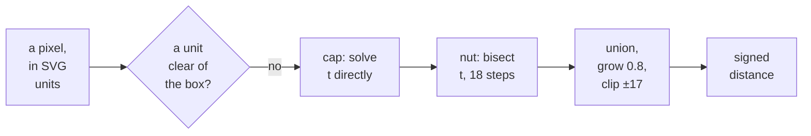

# 5. The acorn as a distance

The `acorn` scene redraws the old watermark on the host, at the window's own
resolution, and without a bitmap. The shader describes the acorn by its curves. For
every window pixel it computes how far that pixel is from the acorn's edge, then
turns the distance into coverage. This chapter walks through the function that does
it: where the acorn is placed, the two curves, the step from a curve to a distance,
the early exit that made it cheap, and the moving `acorn-live` variant.

## Why a distance

A **signed distance function** takes a point and returns how far it is from a
shape's edge: positive inside the shape and negative outside. A shader can turn
that number into the fraction of a pixel the shape covers. The edge is then
antialiased at whatever resolution the window has, and no texture is needed.

The function reproduces the watermark faithfully. At the guest's own resolution, it
covers all 37,784 pixels of the 220-pixel sprite RISC OS used to draw, plus 48
sub-pixel extras at the edge. MACOS.md records that a composited desktop differs from
the old sprite-drawn one only on the acorn's edge.


<!-- doccrate:keep-together:start -->

## Where the acorn sits

The mark is defined in the units of the design's `acorn.svg`, which has a 34-unit
view box. The function works about the centre of that box, with y increasing
downwards. The scene maps those units onto the window:

```c
    /* view px per guest px, per axis: a window the user has resized away
     * from the mode's shape stretches the desktop unevenly */
    float2 k = outPx / srcPx;
    /* 220 guest px for the SVG's 34 units, centred above the icon bar,
     * exactly where *Backdrop -Centre put the watermark sprite; the
     * centre follows the stretch, the mark keeps its shape */
    const float unitPx = 220.0 / 34.0;
    float2 centre = float2(srcPx.x * 0.5, (srcPx.y - float(P.bd.z)) * 0.5) * k;
    float d = acorn_distance((px - centre) / (unitPx * k.y));
    float cover = clamp(d * unitPx * k.y + 0.5, 0.0, 1.0);
    float3 c = lerp(ground, ghost, cover);
```

<!-- doccrate:keep-together:end -->


The centre is the middle of the background area, not the middle of the screen: half
the width, and half of the height above the icon bar. It is scaled by `k` on both
axes, so it stays centred when the window is stretched. The *size* uses `k.y` for
both axes, so a stretched window moves the acorn without distorting it.


<!-- doccrate:keep-together:start -->

### A worked placement

An 800×600 desktop mode in a 1646×1156 Retina window:

| Quantity | Expression | Value |
|:---|:---|:---|
| stretch `k` | 1646 / 800, 1156 / 600 | 2.058, 1.927 |
| centre, in guest pixels | 800 / 2, (600 − 66) / 2 | 400, 267 |
| centre, in window pixels | × `k` | 823, 514.4 |
| one SVG unit | 220 / 34 × 1.927 | 12.47 window pixels |
| the 34-unit view box | 34 × 12.47 | 423.9 window pixels tall |

<!-- doccrate:keep-together:end -->


## The shape: a cap and a nut

The acorn is the union of two shapes, each bounded by one curve and mirrored about
the vertical axis. The function works on the right half only, using `abs(x)`.

- **The cap** is a quadratic Bézier from `(0, −20)` with control point `(16, −20)`
  to `(15, −7)`. Expanded, it is `x = 32t − 17t²` and `y = −20 + 13t²`. The second
  equation can be solved for `t` directly: `t = √((y + 20) / 13)`.
- **The nut** is a cubic Bézier from `(0, 18)` through control points `(9, 18)` and
  `(15, 7)` to `(13, −7)`. Its `y` falls steadily as `t` rises, but a cubic has no
  simple inverse, so the function finds `t` for a given `y` by bisection.

The cap's base and the nut's top meet at `y = −7`.


<!-- doccrate:keep-together:start -->

### The steps of `acorn_distance`



<!-- doccrate:keep-together:end -->


A "yes" at the first test returns at once, with the distance to the box as the
answer. That exit is what made the scene cheap, and it has its own section below.

## From a curve to a distance

For a point at height `y`, the function finds `xb`, the curve's `x` at that height.
The horizontal offset `xb − |x|` is positive inside and negative outside. Where the
edge slopes, the perpendicular distance is shorter than the horizontal one, so the
offset is divided by `√(1 + (dx/dy)²)`, using the curve's slope at that height. The
result is exact for a straight edge and very close near a gently curved one. Close
to the edge is the only place where the value affects coverage.


<!-- doccrate:keep-together:start -->

#### The first half: the exit and the cap

Here is the first half of the function, in HLSL. The Metal version does the same
arithmetic in the same order; only a few names and comments differ:

```c
static float acorn_distance(float2 q)
{
    const float grow = 0.8;
    float ax = abs(q.x);

    /* Nothing of the mark reaches past 16 units across or 17 down, so a
     * pixel a unit clear of that box is plainly outside: say so, and skip
     * the curve solve below, which is most of the scene's cost. */
    float outside = max(ax - 16.0, abs(q.y) - 17.0);
    if (outside > 1.0) {
        return -outside;
    }

    /* cap: right side (0,-20) Q (16,-20) (15,-7): x = 32t - 17t^2, y = -20 + 13t^2 */
    float cy = clamp(q.y, -20.0, -7.0);
    float ct = sqrt((cy + 20.0) / 13.0);
    float cxb = 32.0 * ct - 17.0 * ct * ct;
    float ck = (32.0 - 34.0 * ct) / max(26.0 * ct, 1e-3);
    float cap = min((cxb - ax) / sqrt(1.0 + ck * ck), -7.0 - q.y);
```

<!-- doccrate:keep-together:end -->


`ck` is the cap's slope `dx/dy`: the derivative of `x`, which is `32 − 34t`, divided
by the derivative of `y`, which is `26t`. The `max(…, 1e-3)` guards the division at
the apex, where `t` is zero. The final `min` with `−7 − q.y` closes the cap with its
flat base.


<!-- doccrate:keep-together:start -->

#### The second half: the nut and the join

The second half solves the nut and joins the two shapes:

```c
    /* nut: right side (0,18) C (9,18) (15,7) (13,-7); y falls as t rises */
    float ny = clamp(q.y, -7.0, 18.0);
    float lo = 0.0, hi = 1.0;
    for (int i = 0; i < 18; i++) {
        float tt = 0.5 * (lo + hi), uu = 1.0 - tt;
        float by = uu * uu * uu * 18.0 + 3.0 * uu * uu * tt * 18.0
                 + 3.0 * uu * tt * tt * 7.0 - tt * tt * tt * 7.0;
        if (by > ny) { lo = tt; } else { hi = tt; }
    }
    float t = 0.5 * (lo + hi), u = 1.0 - t;
    float nxb = 3.0 * u * u * t * 9.0 + 3.0 * u * t * t * 15.0 + t * t * t * 13.0;
    float ndx = 3.0 * (u * u * 9.0 + 2.0 * u * t * 6.0 - t * t * 2.0);
    float ndy = 3.0 * (2.0 * u * t * -11.0 - t * t * 14.0);
    float nk = ndx / min(ndy, -1e-3);
    float nut = min(min((nxb - ax) / sqrt(1.0 + nk * nk), 18.0 - q.y), q.y + 7.0);

    return min(max(cap, nut) + grow, 17.0 - abs(q.y));
}
```

<!-- doccrate:keep-together:end -->


Eighteen halvings pin `t` to within 2⁻¹⁸ of the parameter range, about four
millionths. `ndx` and `ndy` are the cubic's derivatives, written out from the control
points' differences: `9, 6, −2` across and `0, −11, −14` down. Because `y` always
falls along the nut, `ndy` is never positive, and `min(ndy, −1e-3)` keeps the
division away from zero at `t = 0`, where the curve runs level across the bottom of
the nut.


<!-- doccrate:keep-together:start -->

## Union, grow and clip

The last line of the function combines the pieces with three operations:

| Operation | Code | Why |
|:---|:---|:---|
| union | `max(cap, nut)` | with positive-inside distances, a point is inside the union if it is inside either shape |
| grow | `+ 0.8` | the SVG draws the outline with a stroke; growing by its half-width gives the drawn silhouette |
| clip | `min(…, 17 − abs(q.y))` | the 34-unit view box cuts the mark, which is why the watermark had a flat top and bottom |

<!-- doccrate:keep-together:end -->


The clip explains two of the curve constants. The cap's apex is at `y = −20` and the
nut's base at `y = 18`, both outside the view box's ±17. The box cuts them off, just
as it did when the SVG was rendered into the sprite.

## The early exit

Nothing of the mark reaches more than 16 units to either side of the centre, or
more than 17 above or below it. The cap is the widest part: it is widest where
`32 − 34t = 0`, at `x ≈ 15.06`, and the 0.8 growth brings that to 15.86.
A pixel more than one unit outside that box is plainly outside the mark, so the
function returns its distance to the box without solving either curve.

The exit cannot change the picture. Coverage is zero for any pixel more than half a
window pixel outside the edge, and the early answer is at least one unit, which is
6.47 guest pixels. The comment in the Metal source states the bound: coverage is
zero "for any window taller than 50 pixels, as the exact distance would give". By
simple arithmetic, the box plus its one-unit margin is about 12% of the 800×534
background, so the curve solve is skipped for most of the window.


<!-- doccrate:keep-together:start -->

### What the exit bought

Commit `e80479db19` rendered both acorn scenes offscreen at 160×120, 400×300,
1646×1156 and 3840×2160. Every output was pixel-identical to the version without the
exit. The GPU time per frame changed like this:

| Scene | 3840×2160, before | 3840×2160, after |
|:---|:---|:---|
| `acorn` | 0.45 ms | 0.095 ms |
| `acorn-live` | 0.44 ms | 0.14 ms |

<!-- doccrate:keep-together:end -->


<!-- doccrate:keep-together:start -->

## Coverage and colour

The distance is in SVG units. Multiplying by `unitPx × k.y` converts it to window
pixels, and adding 0.5 centres a one-pixel ramp on the edge:

| Distance from the edge | `cover` | Colour |
|:---|:---|:---|
| more than half a pixel outside | 0 | the ground, `#B7C0B4` |
| on the edge | 0.5 | halfway between ground and ghost |
| more than half a pixel inside | 1 | the ghost, `#ADB7A8` |

<!-- doccrate:keep-together:end -->


The two colours are the ones the old sprite used: the sage ground, and the single
ghost tone just off it. The difference between them is only 10, 9 and 12 levels in
red, green and blue, which is why the mark reads as a watermark.


<!-- doccrate:keep-together:start -->

## `acorn-live`: two lights and a vignette

The moving scene draws the same acorn and then adds three things: two soft lights
that drift slowly over the ground, a faint vignette, and a dither against banding.

```c
    if (P.bd.w == 2) {
        float tau = 6.2831853 * float(P.bd.y) / 1800000.0;
        float2 uv = px / outPx;
        float aspect = outPx.x / outPx.y;
        float2 l1 = float2(0.5 + 0.34 * sin(7.0 * tau), 0.42 + 0.22 * sin(5.0 * tau + 1.3));
        float2 l2 = float2(0.5 + 0.34 * sin(11.0 * tau + 2.1), 0.58 + 0.22 * cos(9.0 * tau));
        float2 d1 = (uv - l1) * float2(aspect, 1.0);
        float2 d2 = (uv - l2) * float2(aspect, 1.0);
        c += 0.075 * exp(-dot(d1, d1) * 3.5) * float3(1.0, 1.0, 0.96);
        c += 0.05 * exp(-dot(d2, d2) * 4.5) * float3(0.95, 0.72, 0.42);
        float2 v = (uv - 0.5) * float2(aspect, 1.0);
        c *= 1.0 - 0.07 * dot(v, v);
        float n = frac(52.9829189 * frac(dot(px, float2(0.06711056, 0.00583715))));
        c += (n - 0.5) / 255.0;
    }
```

<!-- doccrate:keep-together:end -->


The excerpt leaves out the source's comments, which say the same as the table below.
On the Mac the test is `BACKDROP == 2`, against the function constant.


<!-- doccrate:keep-together:start -->

### What each part does

| Part | How | Effect |
|:---|:---|:---|
| the clock | `bd.y` is milliseconds modulo 1,800,000; `tau` turns it into an angle | one 30-minute loop |
| light 1 | a Gaussian spot, strength 0.075, near-white | drifts at 7 and 5 cycles per loop |
| light 2 | a smaller, weaker spot, strength 0.05, warm orange | drifts at 11 and 9 cycles per loop |

<!-- doccrate:keep-together:end -->


<!-- doccrate:keep-together:start -->

#### What each part does, continued

| Part | How | Effect |
|:---|:---|:---|
| aspect | offsets scaled by width over height | round lights in a wide window |
| vignette | darkens with the square of the distance from the centre, about 7% at the corners of a wide window | a faint frame |
| dither | interleaved gradient noise, less than half a level either way | hides 8-bit banding |

<!-- doccrate:keep-together:end -->


The half-hour loop keeps the numbers small. The clock is sent to the GPU as whole
milliseconds and converted to a 32-bit float there. 1,800,000 is well below 2²⁴,
the range in which a 32-bit float still represents every integer, so the angle
loses no precision after a long session. The source comment says as much: the loop
is there "so the float time never loses precision".

The dither is needed because the lights and the vignette change the colour very
gradually. In 8-bit colour, a gradient that gentle shows visible bands. Adding noise
smaller than one level breaks the bands up without visibly speckling the ground.
