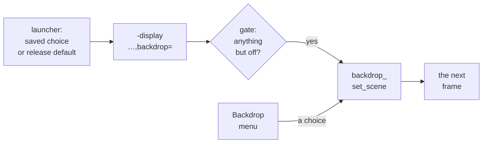

# 7. The gate and the menu

A feature like this should cost nothing for someone who does not use it, and be
easy to change for someone who does. This chapter covers both sides. First, the
gate: the option that decides at start-up whether the layer exists at all. Then the
Backdrop menu on each host, the launchers that choose the first scene, and the hint
the menu shows when RISC OS is not painting the tag.

## Off unless asked for

Since `84dfd3c071`, the `backdrop=` display option is both the feature's gate and
its first scene. The QAPI schema adds it as an optional string, `'*backdrop' :
'str'`, to both `DisplayMetal` and `DisplayDx11`. If the option is absent or `off`,
the feature is left out entirely:

- the decode pass ignores the transfer byte, so tagged pixels show as plain sage;
- nothing is drawn beneath the desktop;
- there is no Backdrop menu.

Any other value switches the feature on and names the scene. The gate is decided
once, at start-up. After that, the menu only changes the scene.

<!-- doccrate:keep-together:start -->

### `off` and `none` are different

| | `off` | `none` |
|:---|:---|:---|
| **the Backdrop menu** | not shown | shown |
| **the decode pass** | ignores the byte | ignores the byte, because no scene is drawn |
| **what the window shows** | the guest's own pixels | the guest's own pixels |
| **can the menu change it?** | no: the gate is closed for the session | yes: pick any scene |

<!-- doccrate:keep-together:end -->

The window looks the same either way. The difference is whether the feature is
there to switch on. Before `84dfd3c071` the menu's None item meant off, and after it
None means "on, with no scene".

<!-- doccrate:keep-together:start -->

### How a scene gets chosen



<!-- doccrate:keep-together:end -->

<!-- doccrate:keep-together:start -->

### The gate on each host

On the Mac the Backdrop menu item is built early, before the display options are
read, so it is created hidden. `ui/metal.c` calls the gate only when the option was
given, and the gate shows the item:

```objc
void metal_glue_backdrop(const char *spec)
{
    backdrop.enabled = spec && *spec && strcmp(spec, "off") != 0;
    [backdrop.menu_item setHidden:!backdrop.enabled];
    if (backdrop.enabled) {
        backdrop_set_scene(spec);
    } else {
        backdrop_set_scene("none");
        metal_log("backdrop: gated off");
    }
}
```

<!-- doccrate:keep-together:end -->

<!-- doccrate:keep-together:start -->

#### The Windows gate

On Windows the gate builds the submenu itself. The window is created before the
display options are read, and the comment on `backdrop_attach_menu` explains the
timing: this "is the first moment we know the feature is wanted at all".

```c
extern "C" void dx11_glue_backdrop(const char *spec)
{
    backdrop.t0 = GetTickCount64();
    if (!spec || !*spec || !strcmp(spec, "off")) {
        backdrop.enabled = false;
        backdrop.mode = DX11_BACKDROP_OFF;
        snprintf(backdrop.spec, sizeof(backdrop.spec), "off");
        return;
    }
    backdrop.enabled = true;
    backdrop_set_scene(spec);
    backdrop_attach_menu();
    dx11_log("backdrop: %s", backdrop.spec);
}
```

<!-- doccrate:keep-together:end -->

`84dfd3c071` records the Mac check. With no option, and with `backdrop=off`, the
Machine menu read Grab Pointer, Save Screenshot, Load Snapshot, Toggle Full Screen,
and the log said "gated off". With `backdrop=none`, the Backdrop item was there.

<!-- doccrate:keep-together:start -->

## The Mac: Machine › Backdrop

The Mac menu is rebuilt each time it opens, in the menu delegate's
`menuNeedsUpdate:`. Rebuilding means that an image dropped into the folder is
listed next time, without a restart. This is the middle of that method:

```objc
    [menu addItem:backdrop_item(@"Acorn", @"acorn", self)];
    [menu addItem:backdrop_item(@"Acorn, Moving", @"acorn-live", self)];
    [menu addItem:backdrop_item(@"None", @"none", self)];
    [menu addItem:[NSMenuItem separatorItem]];

    sub = [[[NSMenuItem alloc] initWithTitle:@"Tiles" action:NULL keyEquivalent:@""] autorelease];
    [sub setSubmenu:backdrop_list(@"Tiles", @"tile",
        @[ backdrop_images([dir stringByAppendingPathComponent:@"Tiles"], ext) ], self)];
    [menu addItem:sub];
    sub = [[[NSMenuItem alloc] initWithTitle:@"Pictures" action:NULL keyEquivalent:@""] autorelease];
    [sub setSubmenu:backdrop_list(@"Pictures", @"picture",
        @[ backdrop_images([dir stringByAppendingPathComponent:@"Pictures"], ext),
           backdrop_images(@"/System/Library/Desktop Pictures", [NSSet setWithObject:@"heic"]) ],
        self)];
    [menu addItem:sub];
```

<!-- doccrate:keep-together:end -->

Each item stores its scene string, `tile:` or `picture:` followed by the file's full
path, and is ticked when that string matches the scene in force. The Pictures submenu has two
groups separated by a line: the user's own pictures, then macOS's own still
wallpapers, which are HEIC files. After the submenus come two commands. Open
Backdrops Folder creates the folder and its `Tiles` and `Pictures` subfolders if
needed, then opens it in the Finder. Choose Backdrops Folder… opens a sheet to pick a
different folder.

`backdrop_images` lists a folder in the Finder's own order, using
`localizedStandardCompare:`. It skips hidden files, keeps only image extensions
(PNG, JPEG, HEIC, HEIF, TIFF, GIF, BMP and WebP), and stops at 200 images.

<!-- doccrate:keep-together:start -->

#### Saving the choice

A choice applies at once and is saved:

```objc
- (void)backdropAction:(NSMenuItem *)sender
{
    NSString *spec = [sender representedObject];

    if (spec && backdrop.enabled) {
        backdrop_set_scene([spec UTF8String]);
        [[NSUserDefaults standardUserDefaults] setObject:backdrop.spec forKey:@"backdrop"];
    }
}
```

<!-- doccrate:keep-together:end -->

<!-- doccrate:keep-together:start -->

### Three settings on the Mac

| Setting | Where it lives | Written by | Read by |
|:---|:---|:---|:---|
| `backdrop` | the app's user defaults | the menu, or `defaults write` | the launcher, at the next start |
| `backdropFolder` | the app's user defaults | Choose Backdrops Folder… | the menu, each time it opens |
| `RISCOSBackdrop` | the app's `Info.plist` | `make-release.sh` | the launcher, when `backdrop` is not set |

<!-- doccrate:keep-together:end -->

<!-- doccrate:keep-together:start -->

#### The launcher's order

The launcher, `app/launcher.zsh`, resolves the scene in that order and passes it on:

```sh
BACKDROP="$(pref backdrop)"
[[ -n "$BACKDROP" ]] || BACKDROP="$(/usr/libexec/PlistBuddy -c 'Print :RISCOSBackdrop' "$CONTENTS/Info.plist" 2>/dev/null)"
BACKDROP="${BACKDROP:-off}"
```

<!-- doccrate:keep-together:end -->

It then starts QEMU with `-display "metal,vsync=30,backdrop=$(q "$BACKDROP")"`. The
last fallback is `off`, so an app built without the setting starts without the
feature. A user's saved choice always beats the release's default.

<!-- doccrate:keep-together:start -->

## Windows: the window menu

The Windows front end adds a Backdrop submenu to the window menu, the menu behind
the title bar's icon. Items in that menu report through `WM_SYSCOMMAND`, and the
system reserves the low four bits of the command, so every identifier is a multiple
of 16:

```c
#define DX11_SC_BD_ACORN  0x0200
#define DX11_SC_BD_LIVE   0x0210
#define DX11_SC_BD_NONE   0x0220
#define DX11_SC_BD_OPEN   0x0230
#define DX11_SC_BD_IMG0   0x0300        /* one per listed image, step 16 */
#define DX11_SC_BD_IMGS   200           /* as many as the Metal menu lists */
```

<!-- doccrate:keep-together:end -->

<!-- doccrate:keep-together:start -->

#### From an identifier back to a scene

Images take identifiers from `0x0300` upwards, 16 apart. A table of 200 strings,
`backdrop_menu_spec`, holds the scene each one selects. The window procedure
rebuilds the submenu on `WM_INITMENUPOPUP` whenever it is about to open, and passes
each command to `backdrop_command`, which turns an identifier back into a slot:

```c
    if (id >= DX11_SC_BD_IMG0 && id < DX11_SC_BD_IMG0 + DX11_SC_BD_IMGS * 16
        && (id - DX11_SC_BD_IMG0) % 16 == 0) {
        char *spec = backdrop_menu_spec[(id - DX11_SC_BD_IMG0) / 16];

        if (spec) {
            backdrop_set_scene(spec);
            return true;
        }
    }
    return false;
```

<!-- doccrate:keep-together:end -->

The window procedure checks its snapshot and HostNet items first. When
`backdrop_command` returns `false` as well, the command goes to Windows' default
handling.

<!-- doccrate:keep-together:start -->

### The Windows menu, against the Mac's

| | Mac | Windows |
|:---|:---|:---|
| **where** | Machine › Backdrop | the window menu, Backdrop |
| **folder** | `backdropFolder`, or `~/Pictures/RISC OS Backdrops` | `QEMU_BACKDROPS`, or `%USERPROFILE%\Pictures\RISC OS Backdrops` |
| **order** | the Finder's, `localizedStandardCompare:` | Explorer's: `CompareStringEx` with digits as numbers, case ignored |

<!-- doccrate:keep-together:end -->

<!-- doccrate:keep-together:start -->

## The hint: is RISC OS painting the tag?

A backdrop can only show through a disc that tiles the tagged sprite, in a 32bpp
mode. When either is missing, choosing a scene would appear to do nothing. So both
menus open with a note when the guest is not painting the tag. The Windows version
of the check:

```c
static int backdrop_guest_state(void)
{
    Dx11FbView v;

    if (!fb.up || !dx11_glue_fb_view(&v) || !v.fb) {
        return -2;
    }
    if (v.bpp != 32) {
        return -1;
    }
    for (uint32_t y = 0; y < v.yres && y + v.yoffset < v.rows; y += 7) {
        const uint8_t *row = (const uint8_t *)v.fb
                           + (size_t)(y + v.yoffset) * v.pitch;

        for (uint32_t x = 0; x < v.xres; x += 7) {
            const uint8_t *px = row + (size_t)(x + v.xoffset) * 4;
            uint32_t rgb = v.pixo ? (px[0] | px[1] << 8 | px[2] << 16)
                                  : (px[2] | px[1] << 8 | px[0] << 16);

            if ((px[3] & 0xC0) == 0x80 && rgb == DX11_BACKDROP_KEY) {
                return 1;
            }
        }
    }
    return 0;
}
```

<!-- doccrate:keep-together:end -->

<!-- doccrate:keep-together:start -->

### What the menu shows

The function samples one pixel in every 7 across and 7 down, 1 in 49, and stops at
the first tagged key pixel. The Mac version samples the newest frame uploaded to the
GPU instead of the live framebuffer, with the same grid and results:

| Result | Meaning | The note at the top of the menu |
|:---|:---|:---|
| 1 | a tagged key pixel was found | none |
| 0 | a 32bpp mode, but no tag found | "RISC OS is not drawing a backdrop to show through" |
| −1 | not a 32bpp mode | "Backdrops need a 16 million colour screen mode" |
| −2 | no frame yet | none |

<!-- doccrate:keep-together:end -->

`1cc6d04a18` records the check: the hint appeared when the guest switched back to
its untagged watermark.

<!-- doccrate:keep-together:start -->

## The launchers and the test harness

The Windows launcher is a small C program compiled by `make-release.py`. The scene
is a compile-time constant, defaulting to the acorn:

```c
#ifndef BACKDROP
#define BACKDROP L"acorn"
#endif
```

<!-- doccrate:keep-together:end -->

It is spliced into the emulator's command line as
`L"-display dx11,backdrop=" BACKDROP L" -serial null "`. Before `d535505fad`, the
launcher passed a bare `-display dx11`, and the commit message records the result:
the installed Windows app had no Backdrop menu at all.

For development, `run.py --backdrop SCENE` adds the option to a Windows run. As on
the command line, the feature is off unless the option is given.
