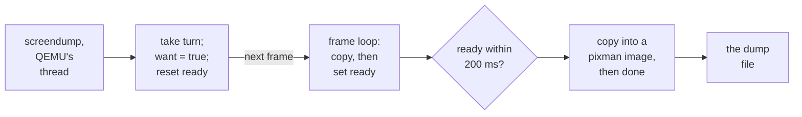

# 8. Capturing what is on screen

Once the host draws part of the picture itself, a screen capture has to decide
which picture it means. This chapter covers the change `c4024d236f` made on Windows,
where PrintScreen and QMP `screendump` now save what the window shows. That involves
a copy taken between the last draw and the flip, a handshake between two threads,
and a small hook in QEMU. The chapter then covers the Mac's screenshot, which
renders the composite again, and the test harness change that followed from all of
this.

## Two pictures of one screen

With the layer on, the guest's framebuffer and the window no longer hold the same
picture. Where the window shows the acorn, the framebuffer holds plain sage with a
tag. The window is also scaled to its own size, and the pointer is drawn over it by
the host. Before `c4024d236f`, both Windows captures saved the decoded framebuffer.
The commit message describes that as "what the guest drew, at the mode's own size,
with no backdrop and no pointer".


<!-- doccrate:keep-together:start -->

### What each capture saves now

| Capture | Saves | Size | Backdrop | Pointer |
|:---|:---|:---|:---|:---|
| Windows, PrintScreen | the composited frame | the window's | yes | yes |
| Windows, `screendump` | the composited frame | the window's | yes | yes |
| Windows, `screendump` with a device | the guest's framebuffer | the mode's | no | no |
| Mac, Save Screenshot | the composite, drawn again | the mode's | yes | yes |
| Mac, `screendump` | the guest's framebuffer | the mode's | no | no |

<!-- doccrate:keep-together:end -->


MACOS.md records the Mac's behaviour: screenshots hold the composite, and QMP
`screendump` still returns the guest's own pixels. The hook that changes `screendump` is only registered by the Direct3D front
end.


<!-- doccrate:keep-together:start -->

## Windows: copy the back buffer before the flip

The composited picture only ever exists in the swap chain's back buffer. The window
uses a flip-model swap chain, and in the flip model the back buffer's contents are
undefined after `Present`. The copy therefore has to be taken inside the frame, after
the pointer is drawn and before the flip. The frame loop does exactly that:

```c
        if (dx11_acquire_target()) {
            if (!dx11_render_frame()) {
                dx11.context->ClearRenderTargetView(dx11.rtv, clear);
            }
            /* The screen as it will appear, while the back buffer still
             * holds it: the flip leaves its contents undefined. */
            comp_capture();
            HRESULT hr = dx11.swap->Present(1 /* vsync */, 0);
```

<!-- doccrate:keep-together:end -->


<!-- doccrate:keep-together:start -->

#### The capture's state

`comp_capture` returns at once unless someone has asked for a copy, so an ordinary
frame pays only for the test. Its state lives in one structure:

```c
static struct {
    CRITICAL_SECTION lock;      /* over the buffer; held while a reader has it */
    CRITICAL_SECTION turn;      /* one reader at a time */
    HANDLE ready;               /* set when a copy has landed */
    ID3D11Texture2D *staging;
    uint8_t *pixels;            /* BGRA, w * h * 4 */
    uint32_t w, h;
    size_t cap;
    bool want;                  /* a copy has been asked for */
    bool png;                   /* ... and PrintScreen wants a file of it */
    bool up;
} comp;
```

<!-- doccrate:keep-together:end -->


<!-- doccrate:keep-together:start -->

#### Copying the frame out

When a copy is wanted, `comp_capture` gets the back buffer and copies it to a
*staging* texture, which is the kind the CPU is allowed to map. The staging texture is
kept between captures and rebuilt only when the window's size or format changes. The
rest of the function maps it and copies the rows out:

```c
    dx11.context->CopyResource(comp.staging, back);
    back->Release();

    if (FAILED(dx11.context->Map(comp.staging, 0, D3D11_MAP_READ, 0, &map))) {
        return;
    }
    EnterCriticalSection(&comp.lock);
    png = comp.png;
    comp.png = false;
    comp.want = false;
    if (comp.cap < (size_t)bd.Width * bd.Height * 4) {
        free(comp.pixels);
        comp.cap = (size_t)bd.Width * bd.Height * 4;
        comp.pixels = (uint8_t *)malloc(comp.cap);
    }
    if (comp.pixels) {
        for (uint32_t y = 0; y < bd.Height; y++) {
            memcpy(comp.pixels + (size_t)y * bd.Width * 4,
                   (const uint8_t *)map.pData + (size_t)y * map.RowPitch,
                   (size_t)bd.Width * 4);
        }
        comp.w = bd.Width;
        comp.h = bd.Height;
    }
    LeaveCriticalSection(&comp.lock);
    SetEvent(comp.ready);
```

<!-- doccrate:keep-together:end -->


The rows are copied one at a time because a mapped texture's row pitch can be wider
than four bytes per pixel. The buffer grows when the window does and is never shrunk.
If PrintScreen asked, the PNG is written from the still-mapped data after the lock is
released, and then the texture is unmapped.

## The handshake with QEMU's thread

A `screendump` arrives on QEMU's main loop thread, while the frame loop runs on the
window's own thread. The two meet through the two critical sections and a
manual-reset event:


<!-- doccrate:keep-together:start -->

### One screendump, step by step



<!-- doccrate:keep-together:end -->


<!-- doccrate:keep-together:start -->

#### The reader's half

The reader's half is `dx11_glue_composite_get`:

```c
extern "C" int dx11_glue_composite_get(uint32_t *w, uint32_t *h,
                                       const void **pixels, int wait_ms)
{
    ...
    EnterCriticalSection(&comp.turn);
    EnterCriticalSection(&comp.lock);
    ResetEvent(comp.ready);
    comp.want = true;
    LeaveCriticalSection(&comp.lock);

    WaitForSingleObject(comp.ready, wait_ms < 0 ? 0 : (DWORD)wait_ms);

    EnterCriticalSection(&comp.lock);
    if (!comp.pixels || !comp.w || !comp.h) {
        LeaveCriticalSection(&comp.lock);
        LeaveCriticalSection(&comp.turn);
        return 0;                   /* no frame yet: the caller falls back */
    }
    *w = comp.w;
    *h = comp.h;
    *pixels = comp.pixels;
    return 1;
}
```

<!-- doccrate:keep-together:end -->


It returns holding both critical sections. `dx11_glue_composite_done` releases them.
While a reader holds `lock`, the frame loop cannot overwrite the pixels being read,
because `comp_capture` must take the same lock. `turn` keeps a second reader from
interleaving with the first.


<!-- doccrate:keep-together:start -->

## The QEMU side: a hook for compositing front ends

QEMU's `screendump` did not know that a front end could hold a better picture than
the console's surface. `c4024d236f` adds a hook to `include/ui/console.h`:

```c
typedef pixman_image_t *(*QemuUiComposite)(void);
void qemu_ui_set_composite(QemuUiComposite fn);
pixman_image_t *qemu_ui_composite(void);
```

<!-- doccrate:keep-together:end -->


<!-- doccrate:keep-together:start -->

#### `screendump` asks the hook first

`ui/console.c` keeps the function in a single static pointer, and
`qemu_ui_composite` calls it if it is set. In `ui/ui-qmp-cmds.c`, `qmp_screendump`
asks the hook first, unless the command named a device:

```c
    image = device ? NULL : qemu_ui_composite();
    if (!image) {
        /* No compositing front end, or it has not drawn a frame yet:
         * the guest's own framebuffer, as before. */
        surface = qemu_console_surface(con);
        if (!surface) {
            error_setg(errp, "no surface");
            object_unref(con);
            return;
        }
        image = pixman_image_ref(surface->image);
    }
```

<!-- doccrate:keep-together:end -->


Naming a device is therefore how to get the guest's own framebuffer back on Windows.
When no front end has registered, the hook returns `NULL` and the command behaves
exactly as before.


<!-- doccrate:keep-together:start -->

#### The Direct3D hook

The Direct3D front end registers the hook in `dx11_display_init`. Its function wraps
the handshake:

```c
static pixman_image_t *dx11_composite_image(void)
{
    const void *pixels;
    uint32_t w = 0, h = 0;
    pixman_image_t *image;

    if (!dx11_glue_composite_get(&w, &h, &pixels, 200)) {
        return NULL;
    }
    image = pixman_image_create_bits(PIXMAN_x8r8g8b8, w, h, NULL, 0);
    if (image) {
        memcpy(pixman_image_get_data(image), pixels, (size_t)w * h * 4);
    }
    dx11_glue_composite_done();
    return image;
}
```

<!-- doccrate:keep-together:end -->


Blue, green, red and alpha bytes in memory are pixman's `x8r8g8b8` format on a
little-endian host. The "x" means the fourth byte is ignored, and the source comment
explains why: "the alpha the compositor leaves behind is not ours to interpret".

## PrintScreen writes a PNG

PrintScreen sets both `want` and `png`, so the frame loop writes the file itself.
`comp_write_png` is a minimal PNG writer. It emits the signature and an `IHDR` for
8-bit RGB, then turns each BGRA row into a filter byte of 0 followed by RGB bytes. The
whole image is compressed with zlib's `compress2` at level 6 into one `IDAT` chunk,
and an `IEND` closes the file. The file is named `dx11-screenshot-001.png`, then
`002` and so on, in the emulator's current directory, and the numbering starts again
at each run.


<!-- doccrate:keep-together:start -->

## The Mac: render the composite again

The Mac's Save Screenshot does not copy the window. It reads the decoded texture back
at the guest's resolution. With a backdrop, the decoded texture has holes in it, so
the screenshot first runs the scale pass once more, at 1:1, into an RGBA8 texture:

```objc
    if (backdrop.mode != METAL_BACKDROP_OFF) {
        if (!fb.shot) {
            MTLFunctionConstantValues *scv = [[MTLFunctionConstantValues alloc] init];
            uint32_t nearest = METAL_SCALING_NEAREST;
            bool no = false;
            uint32_t bd = (uint32_t)backdrop.mode;

            [scv setConstantValue:&nearest type:MTLDataTypeUInt atIndex:1];
            [scv setConstantValue:&no type:MTLDataTypeBool atIndex:2];
            [scv setConstantValue:&bd type:MTLDataTypeUInt atIndex:3];
            fb.shot = metal_pipeline(@"ps_scale", scv, MTLPixelFormatRGBA8Unorm);
            [scv release];
        }
```

<!-- doccrate:keep-together:end -->


The screenshot pipeline is the window's scale pipeline specialised differently:
nearest scaling, since the output is 1:1, and no scanlines. It is cached in
`fb.shot`, and `fb_release_scale()` drops it together with the window's pipeline when
the scene changes (chapter 4).

A tile must look the same size relative to the desktop in the screenshot as in the
window, so its scale is carried into guest pixels:

```objc
            /* the window's tile size, carried into guest pixels */
            backdrop_params(&sp, m.layer.contentsScale * (double)fb.yres
                                 / MAX(m.layer.drawableSize.height, 1.0));
```


<!-- doccrate:keep-together:start -->

### A worked tile size

An 800×600 mode in a Retina window 1156 device pixels tall, with a plain tile:

| Quantity | In the window | In the screenshot |
|:---|:---|:---|
| pixels per point passed to `backdrop_params` | 2 | 2 × 600 / 1156 = 1.038 |
| output pixels per tile pixel | 2 device pixels | 1.038 guest pixels |
| output pixels per guest pixel | 1156 / 600 = 1.927 device pixels | 1 |
| tile pixel ÷ guest pixel | 2 / 1.927 = 1.038 | 1.038 |

<!-- doccrate:keep-together:end -->


The last row matches, which is the point: a tile covers the same share of the desktop
in both pictures. After the readback, the pointer is blended into the pixels with the
same straight alpha the window uses, and the file is written as
`metal-screenshot-N.png` in the app's Application Support folder.


<!-- doccrate:keep-together:start -->

## The test harness: a screen that never settles

`riscos-pi4/tools/run.py` starts a Windows machine and waits for the desktop by
polling `screendump` twice a second. It used to decide that the desktop had settled
when two dumps were byte-for-byte equal for two seconds. Once `screendump` returned
the composite, that could fail for ever: the moving scene changes almost every pixel
by a level on every frame, while the guest draws nothing. The comparison is now
sampled and tolerant. Here it is without its docstring:

```python
def frames_alike(a, b, step=97, tol=8, allow=0.005):
    if b is None or len(a) != len(b):
        return False
    n = bad = 0
    for i in range(0, len(a), step):
        n += 1
        if abs(a[i] - b[i]) > tol:
            bad += 1
    return bool(n) and bad <= allow * n
```

<!-- doccrate:keep-together:end -->


It reads one byte in every 97 of the dump's pixel data and counts a sample as changed
only if it differs by more than 8 levels. The two dumps count as alike when no more
than half a percent of samples changed. The commit message states the calibration:
the threshold "still ignores a blinking caret and still catches a line of text".

Two smaller changes came with it. The poll's "is anything drawn yet?" test changed
from "any non-zero byte" to "any byte brighter than 40", still among the first
48,000 bytes of pixel data, because a composited dump
taken before the first guest frame shows the window's clear colour, (13, 13, 20),
rather than black. And `run.py` had declared the `usb-net` device before the USB hub
it plugs into, so every launch with the emulated network card stopped with "usb port
1.3 not found". The device is now declared after the hub.
