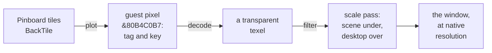

# The backdrop layer: a background the host draws beneath RISC OS

**How the RISC OS Pi 4 emulator came to draw the desktop's background itself, at
the window's own resolution, beneath RISC OS's windows, icons and menus. RISC OS
decides which pixels are background by setting two bits in each pixel's top byte,
and no RISC OS code was changed to do it.**

The Acorn theme used to paint its sage ground and ghost-acorn watermark inside
RISC OS, at the resolution of the screen mode. The host then magnified the whole
desktop to fit the window, so the acorn was only as sharp as an 800×600 mode.
The backdrop layer moves that background to the host. RISC OS still draws every
window, icon, menu and the icon bar. It also marks the pixels that belong to the
background, and the host draws its own scene through them at full resolution: the
acorn as a signed-distance field, a moving version with drifting lights, a tile,
or a picture.

It was built on the evening of 14 September 2026: first for the Mac's Metal display
and the Mac release, then for the Windows Direct3D 11 display. The Windows release
followed early on the 15th. There is no RISC OS module: the guest's part is one
sprite file and two changed lines in the boot sequence.

This document describes the fork's `riscos-pi4` branch as published at
`d535505fad`, 15 September 2026, and names commits by hash. The
[graphics and sound walkthrough](../GraphicsSoundWalkthrough/index.md) covers the
decode and scale passes this layer builds on. The
[HostFS walkthrough](../HostFSWalkthrough/index.md) covers the disc folder that the
release scripts patch.

<!-- doccrate:keep-together:start -->

## These documents

| Chapter | What it covers |
|:---|:---|
| [1. A layer beneath the desktop](01-the-idea.md) | the watermark it replaces, the pieces, and the order they landed in |
| [2. One byte, two bits](02-the-tag.md) | the transfer-byte tag, the key colour, and why both are needed |
| [3. Painting the tag from the guest](03-painting-the-tag.md) | a tagged sprite, the pinboard, the Wimp flag, and the release patches |
| [4. Holes, then over](04-holes-and-over.md) | the decode pass makes holes, and the scale pass composites over the scene |
| [5. The acorn as a distance](05-the-acorn.md) | the watermark rebuilt from its curves, and the moving scene |

<!-- doccrate:keep-together:end -->

<!-- doccrate:keep-together:start -->

#### These documents, continued

| Chapter | What it covers |
|:---|:---|
| [6. Tiles and pictures](06-tiles-and-pictures.md) | images from ImageIO and WIC, tile sizing, and filling the window |
| [7. The gate and the menu](07-gate-and-menu.md) | off by default, the Backdrop menu on both hosts, and the hint |
| [8. Capturing what is on screen](08-capture.md) | screenshots and QMP screendump of the composite, and the test harness |
| [9. Measured, and in progress](09-measured-and-open.md) | what the layer costs, and work in progress |

<!-- doccrate:keep-together:end -->

<!-- doccrate:keep-together:start -->

## At a glance

| | |
|:---|:---|
| **The tag** | bits 7–6 of a 32bpp pixel's transfer byte: `10` below, `01` above (reserved), `00`/`11` nothing |
| **The key** | a below pixel must also be the Acorn sage `#B7C0B4`, so that an EOR drag box stays visible |
| **Guest side** | a 256×256 tagged sprite tiled by Pinboard, plus one Wimp flag; no code changes |
| **Host side** | the decode pass returns a transparent texel; the scale pass composites `c.rgb + bg·(1 − c.a)` |

<!-- doccrate:keep-together:end -->

<!-- doccrate:keep-together:start -->

#### At a glance, continued

| | |
|:---|:---|
| **Scenes** | `acorn`, `acorn-live`, `tile:<file>`, `picture:<file>`, `none`; `off` (the default) removes the feature |
| **Cost** | 0.156 ms for RISC OS to redraw the whole background; 0.02–0.14 ms of GPU time per frame on the Mac |
| **Code** | `ui/metal.m`, `ui/dx11.cpp`, `ui/console.c`, `riscos-pi4/tools/mkbacktile.py`, the release scripts |

<!-- doccrate:keep-together:end -->

<!-- doccrate:keep-together:start -->

### One pixel, from the pinboard to the window

<!-- doccrate:keep-together:end -->

<!-- doccrate:keep-together:start -->

### Reading the diagrams

Every diagram colours its outlines by what each box is:

| Outline | Meaning |
|:---|:---|
| dark blue | code in this fork: the display front ends, the tools, the scripts |
| grey | code from elsewhere: QEMU, RISC OS, the host operating system |
| purple | a file or data artefact: a sprite, an image, a setting |
| teal | state at run time: guest memory, a texture, a buffer |
| amber | a decision or a test |
| green | the outcome the user sees |

<!-- doccrate:keep-together:end -->

