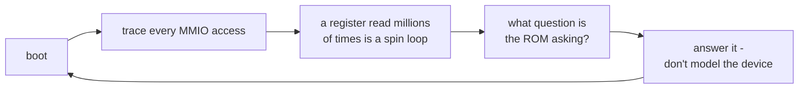

# 1. Don't build the machine you can borrow

Before the design rule, there was a decision about where to stand. The rule
only makes sense on top of it.


<!-- doccrate:keep-together:start -->

## Three ways to run RISC OS on a PC or a Mac

The project's design record lays out the options it weighed:

| route | cost | what you get |
|:---|:---|:---|
| write an emulator from scratch | "months" | total control, and every device to model yourself |
| a new HAL on QEMU's `virt` machine with VirtIO | a ROM of one's own | clean, and not the stock ROM anyone actually ships |
| **QEMU's `raspi4b` machine, running the stock Pi ROM** | days per blocker | a real CPU core for free, and a ROM people already have |

<!-- doccrate:keep-together:end -->


The third won, for a reason stated plainly: *the CPU side of a Pi 4 sandbox
costs nothing.* QEMU's TCG already translates ARM code, already models the
Cortex-A72, and already runs it in AArch32. What it does not do is model a
Raspberry Pi's peripherals the way RISC OS expects them.

The speed comparison the record keeps is worth having in view, because it sets
the ceiling for everything later:


<!-- doccrate:keep-together:start -->

| | MIPS |
|:---|---:|
| RPCEmu, interpreter | 205 |
| RPCEmu, dynarec | ~920 |
| **QEMU TCG, register-heavy** | **~2,000** |
| QEMU TCG, load/store-heavy | ~500 |

<!-- doccrate:keep-together:end -->


TCG is roughly in the class of a good dynamic recompiler. That is fast enough
to run a desktop, and — this becomes important in chapter 7 — slow enough that
the cost of an emulated device access is small next to the cost of emulating
the CPU around it.

## The ROM is the fixed point

Everything that follows is constrained by one commitment made at the start:

> *no RISC OS-side source changes (we are not rebuilding the ROM)*

That is a stronger constraint than it sounds. It means that when the ROM asks a
question QEMU cannot answer, the fix has to be on the QEMU side — or in a module
the ROM loads through its own sanctioned mechanisms. It rules out the easy
answer of changing the driver that asks.

It also turned out to be the right constraint for a second reason, recorded
later in the sound work: answering the ROM's questions *"is smaller than
patching, and survives the next ROM release."* A patched ROM is a fork of RISC
OS to maintain. An answered question is not.

## The method: trace, don't theorise

The records are emphatic about how the blockers were found, and the emphasis
comes from having been wrong.

The first diagnosis of why the display hung was a theory about VCHIQ — the
VideoCore messaging interface that published work on other Pi models had named
as the blocker. The theory was wrong. The design record's summary of the lesson:

> *Every hypothesis formed any other way … was wrong.*

The method that worked was to instrument QEMU's device layer, boot, and count
what the guest actually touched. The record keeps the event volumes from
successive fixes:

```
1,049,989  →  6,024  →  5,685,747  …
```

Each number is the MMIO access count for a boot attempt. A number like 1 million
concentrated on one register is not "a slow boot" — it is a spin loop, and the
register it spins on names the device that is not answering. The first real
blocker was found exactly that way: the HAL posted a request on mailbox channel
0 and then read `MAIL0_STATUS` **3.9 million times in twelve seconds**, with no
timeout, waiting for a reply QEMU never sent.

That single observation is the template for the whole project:

1. boot and trace
2. find the register the guest spins on
3. work out what question it is asking
4. answer the question — do not model the device

## Reading before writing

A second habit mattered as much. Before the VCHIQ peer was written, its data
structures were read **out of a live guest**: the shared-memory layout, the slot
format, the handshake state, all observed rather than assumed from a header.

That turned out to matter again months later in the sound work, when the
BCM2711's page-list encoding proved to differ from the one in Linux's header.
The record's line on that is the best summary of why reading beats assuming:

> *Where the two differ, only one of them is the guest.*


<!-- doccrate:keep-together:start -->



<!-- doccrate:keep-together:end -->


## What "the machine you can borrow" does not include

Borrowing QEMU's `raspi4b` machine gets a CPU, a memory map and a set of
peripheral models. It does not get peripheral models that behave the way RISC OS
needs — they were written for Linux, which boots a Pi very differently. The
companion [QEMU A72 walkthrough](../QemuA72Walkthrough/index.md) is the account
of each of those Linux-shaped assumptions. This document is about the decision
of what to do once you have found one: model the device properly, or answer the
question and move on.

The answer, almost every time, was the second. [Chapter 2](02-soft-and-fake.md)
is where that became a rule.
