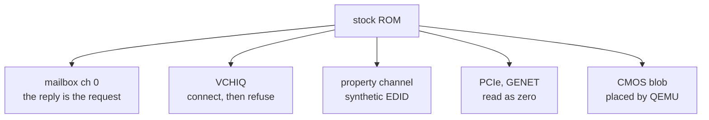

# 2. As soft and fake as possible

## The words, and when they were said

The rule is recorded in section 11 of the design record, under the heading *"The
design principle that produced all of this"*:

> *rather than emulating videocore; we should emulate the functions needed by
> risc os … let's be as soft and fake as possible and emulate hardware only if
> we are desperate … we probably do need interrupts though, the whole system is
> running off timers.*

And the record's own gloss, directly beneath it:

> *Real interrupts where the OS genuinely depends on them. Functional shims
> everywhere else. The VCHIQ peer is about 250 lines and models no hardware; it
> answers questions.*

The history is short and precise:

<!-- doccrate:keep-together:start -->

| when | what |
|:---|:---|
| 2026-09-09, 14:10 | the channel-0 power fix lands — the first answered question |
| 2026-09-09, 15:59 | the VCHIQ peer lands; its commit message already says *"This is not a VideoCore"* and *"Refusing is deliberate"* |
| 2026-09-09, 17:09 | the design record is written down, with the rule in it |

<!-- doccrate:keep-together:end -->

The principle was acted on before it was named. That is common with good design
rules: the words arrive after the first instance proves them.

## What it was a reaction to

Three things, all visible in the record.

**The prospect of emulating VideoCore.** Earlier published work on QEMU's older
Pi models had named VCHIQ as the display blocker, and the first plan budgeted
*"days"* for a VCHIQ peer with *"enough handshake that BCMVideo completes"*.
The rule opens *"rather than emulating videocore"* because that was the road it
was declining.

**A diagnosis that had been wrong.** The display hang had first been blamed on
the wrong thing. Having been wrong once, the project stopped trusting theories
about what the hardware must be doing.

**Heavier alternatives on the table.** A from-scratch emulator (*"months"*);
prior art that modelled more hardware, such as a full USB network chip; and ROM
maintainers' stated preference for a new HAL on QEMU's `virt` machine, which
would need a ROM nobody has.

## How the rule spread

It did not stay a one-off. It was restated, in new words, each time it met a
new subsystem:

<!-- doccrate:keep-together:start -->

| when | restatement | where |
|:---|:---|:---|
| sound | *"a conversation, not a chip"* | SOUND.md |
| graphics | *"there is no GPU in QEMU — we are the GPU"* | GPUDESIGN.md |
| files | *"Do as much work in the host as possible, and as little in the guest as possible"* | FSDESIGN-V1.md |
| EDID | the timings table exists *"to be believed"* | `bcm2835_property.c` |

<!-- doccrate:keep-together:end -->

The file-system restatement is a second-generation version of the rule, and
worth pausing on. It is not about hardware at all. It is about *where logic
lives*, and its argument is an asymmetry of tooling: code in the host is written
and debugged with a modern compiler, a debugger and fast builds; code in the
guest is ARM assembler or C under a 1990s toolchain in an emulator. The record
puts it exactly:

> *Every line of logic moved from the second to the first is bought at a large
> discount.*

## The constraint that decided where fakes could go

The no-rebuild commitment from chapter 1 has a sharp consequence. If the ROM
cannot change, a substitute can only sit in one of two places:

1. **at a firmware protocol the stock ROM already speaks** — mailbox, VCHIQ,
   property tags — so the ROM's existing drivers get answers they recognise; or
2. **on a sanctioned OS extension point** — a vector, a filing-system interface —
   through a module the ROM loads the ordinary way.

And a third principle keeps the second kind safe:

> *correctness never depends on coverage*

Anything a substitute module does not handle passes through to the ROM's own
code. So a substitute can be partial — it can take only the cases it is sure of
— without ever making the system wrong. That principle is why the blitter in
[chapter 5](05-a-blitter.md) can decline most of what it sees.

## The first five fakes

These were the blockers on the road to a first desktop. Each is small, and each
is a different flavour of "answer the question".

### 1. Mailbox channel 0: the reply is the request

The HAL asks the firmware to power on the USB host controller, then spins on
the status register with no timeout — 3.9 million reads in twelve seconds.

The substitute is a 146-line peer whose entire logic is in one comment:

> *Since every device we model is always powered, the reply is the request.*

In an emulator, every device is on. So "please power on device X" is answered
by echoing it back as done. The plan had estimated about thirty lines. It can be
proven without RISC OS at all: a test tool prints `00000080` where stock QEMU
prints `TIMEOUT`.

### 2. VCHIQ: shake hands, then refuse everything

This is the purest example of the rule, and the most counter-intuitive.

RISC OS's sound driver calls `VCHIQ_Connect` unconditionally during start-up and
blocks — *"no timeout, no deadline, and no register the guest re-reads."* The
only way out is a genuine CONNECT message appearing in shared memory, followed by
a doorbell interrupt.

The peer supplies exactly that: it marks the VideoCore side initialised, queues
a CONNECT, and rings the VideoCore-to-ARM doorbell. And then **it answers every
subsequent request to open a service by closing it.**

Why refusal is correct rather than lazy: accepting the audio or TV service would
lead straight into further untimed waits. Declining leaves the OS's
*"GPU mode available"* flag at zero, so the display driver falls back to the
property channel — which QEMU already models completely. The README's note is
that refusal *"is deliberate rather than lazy."*

The peer was later taught to accept selected services, once there was something
real behind them — the record's phrase is *"the refusal was right until
something stood behind it."* [Chapter 4](04-we-are-the-gpu.md) is what stood
behind it.

### 3. Firmware answers on the property channel

The screen mode RISC OS picks depends on the monitor's EDID block, which on a Pi
the firmware supplies. The substitute is a synthetic EDID table, answered on the
property channel. Before it, the desktop came up at 640×256; after it, at a
proper table of modes from 640×480 upward.

Tellingly, the *emulated* alternative was tried first and removed: an EDID
EEPROM on the I2C bus. It failed because RISC OS probes that I2C address looking
for a real-time clock, and reads the EDID bytes as clock data. On an emulated Pi
with no clock, *"NACK is the correct answer."*

### 4. Read-as-zero stubs

On a Pi 4 only, RISC OS probes the PCIe root complex for the USB 3 chip. Against
unmapped memory those probes took external aborts — fourteen of them in a
30-second boot. An "unimplemented device" region that simply reads as zero means
*link down*, and the aborts dropped to one. The commit message has the best line
in the set:

> *the difference between 'there is nothing here' and 'the bus is on fire'*

The same stub sits over the Ethernet MAC. It does not save the boot on its own —
the Ethernet driver dereferences a pointer it never filled in, *"which no amount
of device modelling can prevent"* — so the fix there is in software too: a CMOS
bit that unplugs the driver.

Modelling the USB 3 controller over PCIe was deliberately declined: *"a large
project for a peripheral we want mainly as a keyboard."*

### 5. CMOS: QEMU is the firmware

A Pi has no CMOS chip. The firmware leaves a blob of settings in memory after
the OS image, and the HAL reads it. Under emulation, the fork notes, *QEMU is the
firmware* — so QEMU's generic loader simply places a CMOS blob at the address the
ROM's header implies. It *"needs no device model at all."*

Two consequences follow, both good. The VideoCore firmware is never executed —
the ROM is loaded directly — which also keeps Broadcom's firmware licence out of
scope entirely. And later, CMOS persistence needed no NVRAM device either: the
host file system saves it to the host after each write.

<!-- doccrate:keep-together:start -->

## The five, side by side

| blocker | what would normally be emulated | what was done | kind |
|:---|:---|:---|:---|
| channel 0 | VideoCore power | echo the request | fake reply |
| VCHIQ | the VideoCore and its services | handshake, then refuse | protocol peer |
| EDID | a monitor on I2C | a synthetic table on the property channel | fake reply |
| PCIe, GENET | root complex, USB 3, Ethernet MAC | read as zero | stub |
| CMOS | NVRAM and firmware boot | a blob placed by QEMU's loader | host service |

<!-- doccrate:keep-together:end -->

<!-- doccrate:keep-together:start -->

<!-- doccrate:keep-together:end -->

