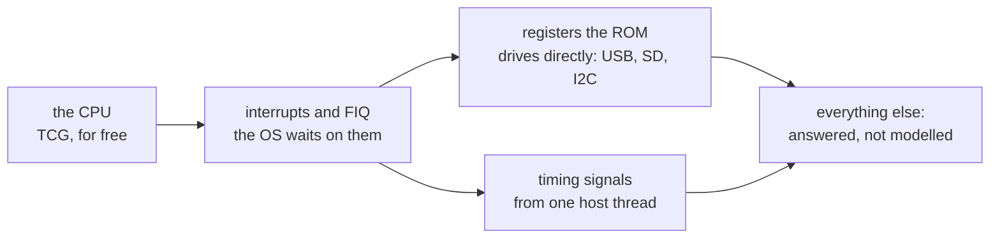

# 3. What the OS genuinely waits for

The rule has an exception written into it: *"we probably do need interrupts
though, the whole system is running off timers."* This chapter is that exception
— what was kept real, why, and the one place even the "real" parts turned out to
be substitutes.

## RISC OS runs on interrupts

RISC OS is interrupt-driven down to its bones. The cooperative desktop, the
mouse, sound buffers, disc I/O and the centisecond ticker all depend on
interrupts arriving, at the right rate, on the right lines. Faking an interrupt
is not like faking a mailbox reply — the OS does not ask for it, it simply waits
for it, and a late or missing one is a hang or a stutter rather than an error.

So interrupts are where the design says to stop faking. But it does not say to
model the timer silicon.

## Signals from one host thread

The design record states the approach:

> *RISC OS is interrupt-driven … Rather than model those blocks, the fork
> provides the signals from one host thread.*

A single high-resolution host thread — a Windows waitable timer, or a POSIX
condition wait on macOS — fires deadlines. Each deadline raises the right
interrupt line under QEMU's big lock. The timer *registers* the guest reads and
writes stay, but they are cut down to what traces show is used:

- the ARM timer becomes *"a latch … Nothing counts down here"*
- the SMI block becomes a latch where *"only CS does anything here"*
- vsync is *"what the VideoCore firmware does for the ARM on a real Pi, done by
  the high-resolution timer thread"*

The acknowledge registers *"stay as thin latches that only record what was
written."* They exist so the ROM's drivers see the registers they expect; they do
no timing of their own.

<!-- doccrate:keep-together:start -->

### Why a thread, and not QEMU's own timers

Because QEMU's main-loop timers were not good enough. Measured:

| | ticks per second | worst gap |
|:---|---:|---:|
| QEMU main-loop timers | 88.7 | 222 ms |
| **dedicated host thread** | **100.0** | **11.6 ms** |
| same thread, macOS POSIX branch | — | 12.54 ms |

<!-- doccrate:keep-together:end -->

A centisecond ticker that delivers 88.7 ticks a second is a clock that runs 11%
slow, and a 222 ms gap is visible as a stutter. The thread hit the target rate
exactly. The macOS branch was close enough that the heavier `mach_wait_until`
primitive was measured as unnecessary and not used.

### The cost: snapshots

Moving time into a host thread created one bug worth remembering. Restoring a
saved machine brought back the timer compare registers but not the armed
deadlines inside the host thread — so the ticker never fired again after a
restore. The fix re-arms every deadline in the device's post-load hook.

It is the general shape of the risk: **state that lives outside the device model
is state a snapshot does not know about.**

## What stayed emulated, and why

Here is the part of the design that is easy to miss when describing it as "fake
everything". A good deal was kept as real register-level emulation. The rule for
what stayed is consistent:

> **Where a stock-ROM driver reads and writes real registers, the register model
> stays** — cut down to what the traces show is used.

<!-- doccrate:keep-together:start -->

### The devices that stayed

| kept real | why |
|:---|:---|
| Cortex-A72 in AArch32 under TCG | it costs nothing; QEMU already had it |
| the GIC and the BCM2711 legacy interrupt and FIQ controller | the USB driver runs from the FIQ handler |
| system-timer compare semantics, including waiting for the wrap | the HAL's own re-arm loop depends on it |
| the DWC2 USB controller, HID keyboard and tablet | the stock ROM's only input path |
| the SD card controller | the reference boot medium |
| the I2C controller | the HAL probes for clocks, and needs a correct NACK |
| DMA, the framebuffer, the UART, the secondary-core stub | the display driver programs them directly |

<!-- doccrate:keep-together:end -->

The FIQ path is the most striking entry. RISC OS's USB driver services the USB
controller from the FIQ handler, not an IRQ, so a faithful fast-interrupt path is
not optional — the keyboard and mouse do not work without it. That controller was
built from the BCM2711 datasheet.

## The network: cheaper emulation, not paravirtualisation

One entry is worth singling out because it shows the rule applied to a device
that *did* need emulating.

The Pi 4's Ethernet MAC is GENET. Modelling it faithfully is a large job. But
RISC OS's USB network driver has a generic CDC-Ethernet back end — and QEMU
already has a USB network device. With a new `rndis=off` property it presents only
the CDC-ECM configuration, and QEMU's user-mode networking answers DHCP.

The record calls this *"the soft answer and the one the design principle asks
for."* It is, strictly, still emulation: the whole USB controller path is
modelled. But it swaps a large, unmodelled device for a small, already-modelled
one, which is the same instinct applied at a different level. The DHCP wait
vanished and the boot reached the desktop in 27 seconds.

## When "real" emulation still bites

Keeping emulation is not free either. Typing through the emulated USB keyboard
drops or garbles keys under TCG unless the input is paced — the emulated
controller cannot keep up with a host that types instantly. That shaped how the
project's scripting and automation had to work, and a fast-typing crash in the
USB driver remains open.

<!-- doccrate:keep-together:start -->

<!-- doccrate:keep-together:end -->

