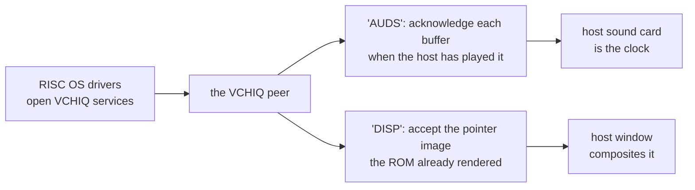

# 4. We are the GPU

Chapter 2 ended with the VCHIQ peer refusing every service. This chapter is what
happened when the project decided some services were worth accepting — and how
it accepted them without emulating a single piece of audio or display silicon.

The graphics record puts the stance in one line:

> *there is no GPU in QEMU — we are the GPU*

## Sound: a conversation, not a chip

### The finding

The first thing the sound work established reframed the whole problem:

> *There is no audio hardware to emulate.*

On a Pi 4, RISC OS does not drive a sound chip. Its sound driver opens a VCHIQ
service called `'AUDS'` and hands PCM buffers to the VideoCore firmware, which
does the rest. The entire exchange is a handful of message types and one bulk
data transfer. The record's summary is *"a conversation, not a chip."*

So the substitute is not a sound device. It is the other half of that
conversation, living in the VCHIQ peer. The obvious hardware route — modelling
the Pi's PWM or I2S audio — was explicitly declined, because it *"would be
emulating hardware the guest never touches."*

### The clock is the sound card

This is the cleverest idea in the sound work, and it only makes sense once you
see what the conversation carries.

RISC OS generates sound at the rate the firmware *acknowledges* buffers. Each
completion message tells the OS a buffer has been played, and the OS fills the
next. So the rate of completion messages **is** the rate at which RISC OS makes
sound.

The first attempts paced those acknowledgements from QEMU's virtual clock. The
result was sound that played slowly:

<!-- doccrate:keep-together:start -->

| pacing source | speed against real time |
|:---|---:|
| virtual-clock pacer, attempt 1 | 0.76× |
| virtual-clock pacer, attempt 2 | 0.71× |
| **the host sound card** | **0.998×** |

<!-- doccrate:keep-together:end -->

The fix was to stop pacing at all. The peer now reports a buffer complete
exactly when the host's audio back end has accepted it — so the host sound card,
which genuinely runs in real time, becomes the clock the guest is driven by. The
record:

> *the two quantities are the same quantity*

It is a good example of the rule working at its best. A hardware model would
have needed its own timing, and would have had to keep that timing in step with
the host. Answering the conversation lets the host's real clock do the job
directly.

### Two bugs the conversation surfaced

Neither would have existed with a chip model, and both are instructive.

**Slots were never recycled.** The peer consumed the guest's message slots and
never handed them back. Sound played perfectly and then stopped — after exactly
1,265 buffers, the moment the slots ran out. A bug with a precise, repeatable
count is a resource leak, and this was one.

**The page-list encoding was not Linux's.** The BCM2711 encodes the physical
pages of a bulk transfer in a 36-bit form that differs from the encoding in
Linux's VCHIQ header. Following the header produced corrupt audio. Reading what
the guest actually wrote produced sound. Hence the line quoted in chapter 1:

> *Where the two differ, only one of them is the guest.*

## The pointer: `'DISP'`, and the ROM does the pixel work

### Why bother

Refusing the `'DISP'` display service had a visible cost. With no hardware
pointer, the kernel painted a software pointer instead — saving and restoring a
32×32 block of the screen underneath it on every single plot. That is work on
every mouse movement, done in emulated ARM code.

### The substitute

The peer answers the small subset of the dispmanx display protocol the pointer
actually uses. The kernel then does what it does on real hardware: it renders the
pointer shape itself and hands the "GPU" a finished image plus a position. The
host window composites that image over the screen — on macOS in the Metal front
end, on Windows in the DirectX 11 one.

The division of labour is the point:

> *The ROM does the pixel work.*

The host never needs to understand RISC OS sprites, palettes or pointer shapes.
It receives a finished ARGB image and a rectangle. The record calls that *"the
pleasure of answering rather than emulating."*

### Measured, and one honest cost

Enabling the service cut eleven refused open requests to a single accepted one,
and a typical boot now sends 69 shape writes and around 356 moves. Each move
costs three messages, which has not yet been measured against the software
pointer it replaced.

The fidelity cost is small and specific: because the pointer is composited by
the host window, it no longer appears in a QEMU screen dump. That matches real
hardware, where a hardware pointer is not in the framebuffer either — but it
surprised the tooling.

## DMA: the one piece of GPU that stayed, made fast

Not everything graphical was replaced. The Pi's DMA controller is used by RISC
OS's display driver for block copies, and the driver programs its registers
directly — so by chapter 3's rule, it stayed emulated.

It stayed, and it was made fast. The model had refused transfers wider than 128
bits while the display driver believed they had completed, leaving a partly drawn
desktop after every window move. Rows are now moved whole, and pattern fills take
a fast path.

The graphics record treats that as *"the existence proof"*: if the host can
execute the display driver's copies correctly and quickly, it can answer render
requests. [Chapter 5](05-a-blitter.md) is where that idea went next.

<!-- doccrate:keep-together:start -->

<!-- doccrate:keep-together:end -->

