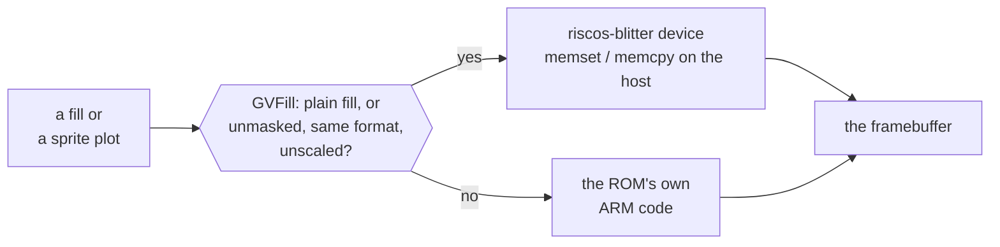

# 5. A blitter RISC OS never had

This chapter covers the blitter as an *instance of the principle*. Its full
design — the module, the host code, damage tracking and the Windows and Mac
displays — is the [Graphics and Sound walkthrough](../GraphicsSoundWalkthrough/index.md).

## The premise

The sprints record opens the idea with a sentence that is half joke and half
specification:

> *RISC OS draws with a blitter it does not have.*

RISC OS's graphics driver interface offers two accelerated operations: copy a
rectangle, and fill one. On the Pi, no code in the ROM ever asks the GPU to do
either. The display driver declines fills outright, and sprites are plotted by
the sprite module in ARM code, pixel by pixel. Under emulation, every one of
those ARM instructions is translated and executed by TCG.

The Pi has no 2D blitter to emulate. So the fork **invented one**.

## A device that models no hardware

The `riscos-blitter` device sits at a physical address the Pi's hardware
abstraction layer never names. Its header is unusually direct about what it is:

> *It models no real BCM2711 hardware.*

Its interface is a set of registers and a GO write, and each design choice has a
stated reason:

<!-- doccrate:keep-together:start -->

### Four design choices

| choice | reason |
|:---|:---|
| registers plus a GO write, not a command block in memory | *"Eleven writes cost about a microsecond"*, whereas a block needs a physical address, which costs an OS call |
| the framebuffer addressed by byte offsets | no guest addresses to translate for the common case |
| the sprite source given as a guest *virtual* address | *"Letting the host walk the guest's page tables costs the guest nothing"* |
| the host does the work with `memset` and `memcpy` | synchronous, simple, and fast — see below |

<!-- doccrate:keep-together:end -->

That third row is the idea that later reshaped HostFS, in
[chapter 6](06-a-doorbell.md).

## A module that sits on the OS's own extension points

On the guest side, a small module called GVFill makes the device useful. It
finds the device by mapping its physical page and checking a magic word, then
claims two of RISC OS's own vectors: the graphics driver vector and the sprite
vector.

It takes only cases it is certain of:

- **plain-colour rectangle fills**
- **sprite plots that are unmasked, the same pixel format as the screen, and
  unscaled**

Everything else passes straight through to the ROM's own code. That is the
*"correctness never depends on coverage"* principle from chapter 2 in its purest
form: the module can be as conservative as it likes, and the system stays
correct. And it can be backed out instantly — `*RMKill GVFill` returns the
machine to pure ROM drawing.

## Why the host CPU, not the host GPU

A natural assumption is that host-side drawing should use the host GPU. It was
measured, and it should not:

<!-- doccrate:keep-together:start -->

| one real redraw on an M4 | time |
|:---|---:|
| `memset` on the host CPU | ~81 µs |
| the same fill through Metal | ~2.6 ms |

<!-- doccrate:keep-together:end -->

The blit has to be synchronous — the guest expects the pixels to be there when
the call returns — and submitting GPU work and waiting for it costs thirty times
more than simply writing the bytes. For a fill, the fastest GPU is the CPU's
`memset`.

<!-- doccrate:keep-together:start -->

## Measured

| | per sprite plot |
|:---|---:|
| ROM drawing in emulated ARM | 490 µs |
| **through the blitter** | **80 µs** |
| speed-up | **6.1×** |
| differing pixels, Mac | **0 of 2,304,000** |

<!-- doccrate:keep-together:end -->

The first version managed 4.2×. Getting to 6.1× was a matter of removing fixed
costs, the largest being an object-model lookup per sprite that fell from 43.9 µs
to 2.4 µs.

## Where the principle met its limit

The blitter is also where the approach came closest to failing, and the records
say so.

**Masked sprites drew the desktop wrong.** Accelerating sprites with masks was
implemented and then backed out, after a bisect found the desktop differing by
484,513 pixels. With masked sprites taken back out, the blitter covers **94.3%**
of sprite pixels. (The README still quotes an older 98.2%; that figure was
measured on the build that was backed out.)

**Coverage depends on configuration.** At one Windows machine's default colour
depth, the desktop scrolled with *zero* blitter operations — every plot fell
through, because none matched the pixel format the module accepts.

**Position on a vector matters.** When GVFill was spliced into the ROM rather
than loaded later, it *"never sees a sprite plot"* — a module further along
claims the sprite vector first.

None of those is a correctness bug in the final design, because fall-through
protects correctness. All three are coverage gaps, and the difference between
the two is exactly what the principle was built to guarantee.

<!-- doccrate:keep-together:start -->

<!-- doccrate:keep-together:end -->

