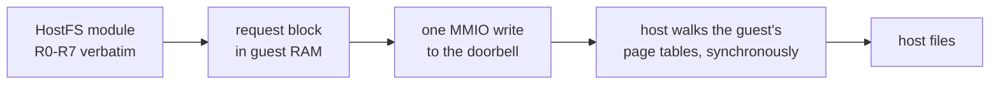

# 6. A doorbell and a filing system

This chapter covers the guest–host channel and HostFS as an *instance of the
principle*. The full filing-system design is the
[HostFS walkthrough](../HostFSWalkthrough/index.md).

## Three dead ends first

The project needed a way to get files in and out of the guest. It tried the
routes that model hardware or reuse existing protocols before building anything:

<!-- doccrate:keep-together:start -->

| route | what happened |
|:---|:---|
| the emulated SD card | works, and remains the reference — but a disc image is a poor way to edit files from the host |
| LanManFS over QEMU's user networking | *"no guest code at all"* was the appeal; it died because the ROM speaks only SMB1 and the Windows host speaks only SMB2 |
| an emulated USB stick backed by a host folder | the stick enumerated and was never mounted |

<!-- doccrate:keep-together:end -->

The LanManFS failure is worth noting because it was the "softest" option — no
new guest code whatsoever — and it failed on a protocol-version mismatch neither
end could be persuaded to change.

## The doorbell

What was built instead is the third substitution kind from the index: a
**paravirtual device at an address the hardware abstraction layer never names.**
The filing-system record explains why that address is safe:

> *RISC OS on the Pi reads no device tree, so a hole the HAL does not name does
> not exist as far as it is concerned.*

The device, `vmchannel`, has almost nothing in it:

- the guest writes a request block — a 64-byte header plus inline data — into its
  own memory
- it writes the block's address to a single command register
- the host does all the work **synchronously, inside that one MMIO write**, and
  the status register always reads "done"

The record lists what that design does *not* need, and it is a long list:

> *no ring, no interrupts, no reorder window, nothing to migrate beyond four
> registers*

It is not free, and the record says that too: *"A slow host disc stalls the
vCPU."* A synchronous doorbell means the guest CPU waits for the host's file
system. Under emulation that is acceptable; it is a real cost to name.

### Why a device rather than trapping the CPU

Earlier RISC OS emulators reached the host by intercepting SWIs — recognising a
particular software-interrupt number and handling it outside the guest. The
doorbell deliberately does not do that:

> *no CPU state is forged and any guest code could use it*

Nothing in the guest's register state is faked. A module writes to a memory
address, as a driver writes to any device. There is no hypercall, no
secure-monitor call and no semihosting trap anywhere in the guest modules.

## v0 → v1: moving the logic to the host

The first HostFS was shaped like POSIX. The guest module translated RISC OS
filing-system calls into open/read/write/close requests, passed physical
addresses to the host, and translated every 4 KiB chunk of guest memory itself.
It worked, and it put RISC OS semantics — the hardest part — in guest code.

It also had a fallback that was dangerous by design. If translating an address
failed, it used the identity mapping instead. The record is blunt:

> *Silent corruption is the designed behaviour of that fallback.*

Version 1 inverted the design, applying the file-system restatement of the rule
from chapter 2 — *do as much work in the host as possible*:

<!-- doccrate:keep-together:start -->

| | v0 | v1 |
|:---|:---|:---|
| what the module sends | POSIX-shaped requests | RISC OS's registers R0–R7, verbatim |
| addresses on the wire | physical, translated by the guest | **logical, translated by the host** |
| names, types, dates, errors | worked out in the guest | worked out on the host |
| stated goal | — | *"no RISC OS semantics left in the module"* |

<!-- doccrate:keep-together:end -->

And the headline number: a 256 KiB read went from **130 doorbells to one.**

## "The host walks the guest's MMU"

This is the idea v1 borrowed from the blitter. All guest addresses on the wire
are *logical* — as the guest program sees them — and the host translates them by
walking the guest's own page tables, the same way a debugger reads a running
program's memory. The record names its precedents: QEMU's semihosting memory
access, the 9p file system's metadata handling, and the property channel's DMA
idiom, adopted *"because real silicon cannot walk guest page tables."*

That last clause is the whole principle again. A real device cannot do this. An
emulator can, cheaply, so it should.

### The bug that taught the most

Walking the guest's page tables exposed a genuinely confusing failure. Reads
into ordinary application memory failed at address `0x9000`, even though the
program could clearly use that memory.

The diagnosis took several theories to reach, and the eventual root cause is a
good lesson in trusting instruments:

> *RISC OS maps application space lazily, and the debug walk was telling the
> truth the whole time.*

The pages simply did not exist yet. RISC OS maps application memory on first
touch, so a freshly allocated buffer the program has never written has no page
table entries — and a debugger-style walk correctly reports that. A proof line
touched every page from BASIC first, and the failure address moved exactly as far
as the touching had.

### The fix: fault the buffer in, from the guest

The host cannot cause a guest page fault. So the division of labour is:

1. the host moves data page by page, and reports how far it got
2. on a short count, the **guest module touches one byte per page** — through
   the operating system's own abort handler, which maps the page
3. it retries once

Measured on a freshly allocated 256 KiB BASIC array: the first attempt moved 252
bytes; after touching, the full transfer went through. If an error survives the
retry, it names the offset.

## Honesty over silence

Two decisions in HostFS are the same decision, and they are worth stating
together because they are the opposite of v0's fallback.

- An earlier version reported a failed transfer as success. The record: *"Silence
  is the worst possible failure here."*
- `*SetType` used to succeed without doing anything. The code comment: *"A silent
  lie is worse than an error."*

And the module refuses to load against an old host rather than falling back —
because *"a silent fallback to the path that corrupts memory is worse than not
loading."*

<!-- doccrate:keep-together:start -->

<!-- doccrate:keep-together:end -->

