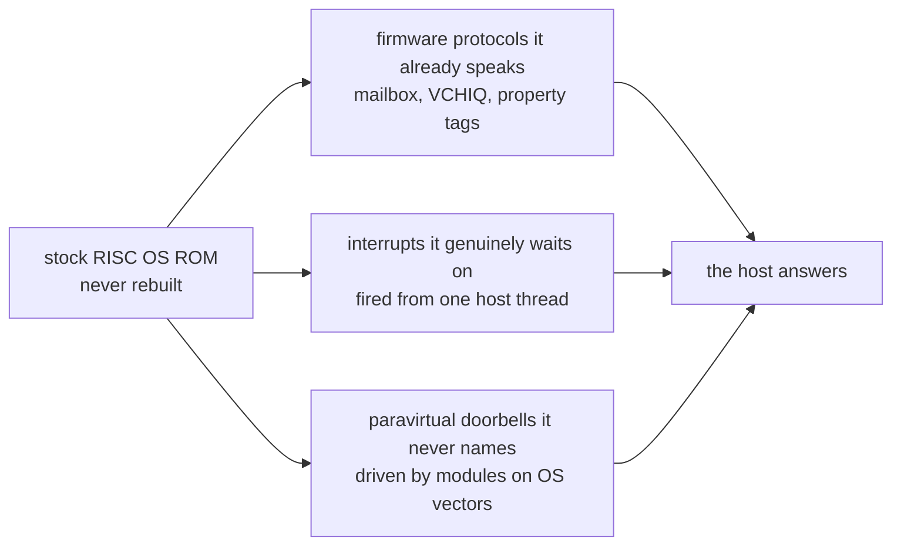

# Fake it in software

**RISC OS 5 boots on an emulated Raspberry Pi 4 by modelling almost none of the
Pi's hardware. It answers the operating system's questions instead.**

The fork runs the stock RISC OS Open 5.30 Pi ROM on QEMU's `raspi4b` machine,
with the Cortex-A72 in AArch32 mode. What makes that tractable is one design
rule, recorded in the project's design notes in the owner's own words:

> *rather than emulating videocore; we should emulate the functions needed by
> risc os … let's be as soft and fake as possible and emulate hardware only if
> we are desperate … we probably do need interrupts though, the whole system is
> running off timers.*

That sentence is the subject of this document. It explains what gets modelled
faithfully — very little — what gets answered instead, how a RISC OS module
talks to the host without a single forged CPU register, and what the approach
genuinely cost.

<!-- doccrate:keep-together:start -->

## These documents

| Chapter | What it covers |
|:---|:---|
| [1. Don't build the machine you can borrow](01-borrow-the-machine.md) | Why QEMU and a Pi 4, and the tracing method that found every blocker |
| [2. As soft and fake as possible](02-soft-and-fake.md) | The rule, its origin, and the first five fakes |
| [3. What the OS genuinely waits for](03-what-the-os-waits-for.md) | Interrupts and time from one host thread, and what stayed emulated |
| [4. We are the GPU](04-we-are-the-gpu.md) | Sound and the pointer, by impersonating the firmware's own protocols |

<!-- doccrate:keep-together:end -->

<!-- doccrate:keep-together:start -->

#### The chapters, continued

| Chapter | What it covers |
|:---|:---|
| [5. A blitter RISC OS never had](05-a-blitter.md) | A device with no silicon behind it, and a module that knows when to decline |
| [6. A doorbell and a filing system](06-a-doorbell.md) | The guest–host channel, and why the host walks the guest's MMU |
| [7. Booting from the host](07-booting-from-the-host.md) | Splicing a module into a stock ROM, and an honest reading of what it bought |
| [8. The bill](08-the-bill.md) | Silent failures, module coupling, lost fidelity, and the method that kept it honest |

<!-- doccrate:keep-together:end -->

<!-- doccrate:keep-together:start -->

## At a glance

| | |
|:---|:---|
| **Machine** | QEMU `raspi4b`, Cortex-A72 in AArch32, under TCG |
| **Guest** | the stock RISC OS Open 5.30 Pi ROM — never rebuilt, never patched in place |
| **Emulated faithfully** | the CPU, interrupt and FIQ plumbing, and the devices the ROM drives by register |
| **Answered instead** | firmware power, VCHIQ, sound, the pointer, EDID, CMOS, timers, drawing, files |
| **Guest–host channels** | firmware protocols the ROM already speaks, and two paravirtual doorbells |

<!-- doccrate:keep-together:end -->

## The shortest possible summary

A real Raspberry Pi 4 is mostly a VideoCore GPU with an ARM attached. Emulating
that GPU would be months of work and would still be wrong, because almost none
of its behaviour is documented.

The observation that unlocked the project is that **RISC OS does not need a
VideoCore. It needs the answers a VideoCore gives.** The ROM asks the firmware
to power a device, and waits. It opens a sound service, and waits. It reads an
EDID block to pick a screen mode. Every one of those is a question at a protocol
boundary the ROM already speaks — and a question can be answered by a few
hundred lines of software that model no silicon at all.

So the fork emulates only three kinds of thing: the CPU, the interrupt and timer
plumbing the OS genuinely blocks on, and the handful of devices whose stock
drivers write registers directly. Everything else is one of three substitutions:

1. **Impersonate the firmware** at the protocol boundary the ROM already uses.
2. **Supply signals from a host thread** instead of modelling timer blocks.
3. **Add a paravirtual doorbell** at an address the ROM never names, driven by a
   RISC OS module sitting on one of the OS's own extension points.

The records are unusually honest about the result. The approach made the boot
possible; under TCG it did not make it dramatically faster. Chapter 8 is that
account.

<!-- doccrate:keep-together:start -->

<!-- doccrate:keep-together:end -->

