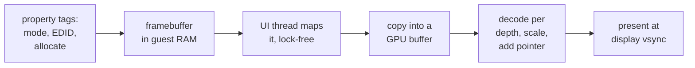

# 1. We are the GPU

On a real Raspberry Pi, the ARM cores never touch the display hardware directly.
RISC OS asks the VideoCore GPU for a framebuffer, draws into it, and the GPU scans
it out to HDMI. The same GPU mixes sound and composites the hardware mouse
pointer. All of it runs Broadcom's closed firmware.

The emulator runs none of that firmware. This chapter covers what it does instead:
the questions RISC OS asks, the answers QEMU gives, and where the pixels actually
live.

## The principle

The fork's graphics design states the principle it follows in one paragraph:

> The design principle, landed where it belongs: **there is no GPU in QEMU — we
> are the GPU.** Everything the ROM asks its GPU, the host answers: the property
> channel, `'AUDS'`, and now `'DISP'`.

It is the graphics form of the project's broader rule: emulate the *functions* RISC
OS needs, and emulate hardware only as a last resort. Nothing VideoCore-like exists
in the fork. There is no GPU command stream, no 3D core and no HDMI encoder. There
are answers.


<!-- doccrate:keep-together:start -->

## What RISC OS asks its firmware

RISC OS's video and sound drivers talk to the VideoCore through two channels:

| Channel | What it carries | Who answers in the fork |
|:---|:---|:---|
| mailbox channel 8, property tags | modes, EDID, framebuffer allocation, palette | QEMU's property model, extended |
| mailbox channel 3, VCHIQ | named services: sound, the pointer, and others | the fork's VCHIQ peer |

<!-- doccrate:keep-together:end -->


The property channel was already in QEMU; the fork extended it with an EDID answer
and wide modes. VCHIQ was new. The
[QEMU A72 walkthrough](../QemuA72Walkthrough/03-tracing.md) tells how the peer was
built to get past a wait with no timeout.


<!-- doccrate:keep-together:start -->

### VCHIQ: refused, then answered

The VCHIQ peer began by refusing every service the guest opened. That was correct
at the time: accepting `'AUDS'` led into a second wait with no timeout. A refusal
also leaves the video driver setting modes through the property channel, which QEMU
already modelled. The graphics and sound work then turned two of those refusals
into answers:

| Service | What it is | Today |
|:---|:---|:---|
| `'AUDS'` | the sound service: PCM out to the GPU | **accepted**: chapter 8 |
| `'DISP'` | dispmanx: display elements, used for the hardware pointer | **accepted**: chapter 4 |
| `'UPDH'` | update notifications, a companion to `'DISP'` | opened; nothing is ever sent |
| `'GCMD'`, `'TVSV'` | GPU commands, TV service | still refused |

<!-- doccrate:keep-together:end -->


The accept-or-refuse decision is a short branch on the service's four-character
code, in `hw/misc/bcm2835_vchiq.c`. Anything it does not recognise gets a `CLOSE`,
which the guest treats as a clean refusal before carrying on:

```c
if (fourcc == VCHIQ_FOURCC_AUDS && !s->auds_open) {
    s->auds_open = true;
    s->auds_port = srcport;
    replies += vchiq_queue_msg_data(s,
        VCHIQ_MAKE_MSG(VCHIQ_MSG_OPENACK, VCHIQ_AUDS_VC_PORT, srcport),
        &ack, 4);
} else if (fourcc == VCHIQ_FOURCC_DISP && !s->disp_open) {
    ...                                     /* the same, for the pointer */
} else {
    replies += vchiq_queue_msg(s,
        VCHIQ_MAKE_MSG(VCHIQ_MSG_CLOSE, 0, srcport), 0);
}
```

Accepting `'DISP'` did not move mode setting off the property channel. The ROM's
dispmanx initialisation runs after the framebuffer is allocated, so modes are still
negotiated through property tags.


<!-- doccrate:keep-together:start -->

## Where the screen lives

The framebuffer is **ordinary guest RAM**. QEMU's `bcm2835_fb` model reserves
VideoCore memory, 64 MiB by default, at `vcram_base`:

| Address | Contents |
|:---|:---|
| `vcram_base` | the palette: 256 words of `0x00BBGGRR`, written by the set-palette tag |
| `vcram_base + 1 MiB` | the framebuffer itself, `pitch × rows` bytes |

<!-- doccrate:keep-together:end -->


The video driver negotiates the mode through a batch of property tags: size, depth,
pixel order, pitch, then an allocate. The property model gathers the tags into one
configuration, committed once per mailbox buffer.

### A seqlock around the configuration

A front end reads the configuration from its own thread without taking any QEMU
lock. So the fork made the commit a **seqlock**, a pattern where a generation
number tells a reader whether the data changed underneath it:

```c
s->generation++;                     /* odd: write in flight */
s->config = *newconfig;
s->generation++;                     /* even: committed */
```

A reader takes the generation, copies the configuration, and checks the generation
again. An odd number, or a changed one, means a write overlapped the read.
Chapter 9 records one reader edge case, found by reading the code.

### A cleared screen, as the firmware gives

The same commit zero-fills a *fresh* allocation — a new base, virtual size or depth
— because the real firmware hands out a cleared framebuffer. Without it, the window
showed whatever was in guest RAM between the mode being set and the first paint:
the boot began with a screen of garbage. A pure pan reuses the allocation and keeps
its contents.


<!-- doccrate:keep-together:start -->

## How the guest draws

Everything RISC OS draws ends up as bytes in that buffer. It gets there by four
different routes, and they matter because later chapters move some of them onto the
host:

| What is drawn | Route on a stock system | With this fork |
|:---|:---|:---|
| text and lines | the kernel writes pixels directly | unchanged |
| rectangle copies: drags, scrolls | the video driver, through the DMA controller in 2D mode | DMA model executes rows whole, on the host |
| rectangle fills: backgrounds | the video driver declines, so the kernel loops in ARM | **the blitter device**, via GVFill |
| sprites: icons, pictures | SpriteExtend compiles and runs ARM code | **the blitter device**, via GVFill |

<!-- doccrate:keep-together:end -->


The mouse pointer is different again. It is never drawn into the buffer at all
(chapter 4).


<!-- doccrate:keep-together:start -->

### The display pipeline



<!-- doccrate:keep-together:end -->


The guest's own timing does not come from the window. Its vertical sync and
half-frame pulses come from a generator on the fork's timer thread, 30 Hz by
default. The front end's render loop sends the guest nothing, so the guest keeps
the same time whether the window is visible, minimised or absent.

## Input goes back the same way

The front ends turn host keyboard and mouse events into QEMU input events:

- keys as scan codes, for the emulated USB keyboard
- the pointer as **absolute** coordinates, for an emulated USB tablet

That needed one QEMU fix, covered in the
[QEMU A72 walkthrough](../QemuA72Walkthrough/05-fiq.md). RISC OS switches every HID
device to report protocol, and QEMU's tablet had refused the request. Each input
call takes QEMU's big lock only for the microseconds the input API needs.
