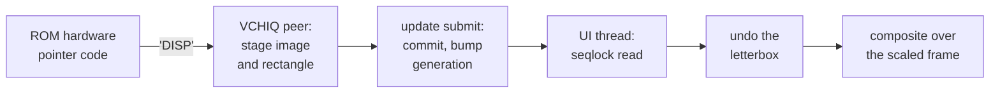

# 4. The pointer is a sprite again

On a real Pi 4 the mouse pointer is not drawn into the framebuffer. RISC OS's video
driver asks the GPU to place a small image — a *display element* — on top of the
screen, and the GPU composites it at scan-out. That is what makes a hardware
pointer cheap: moving it touches no pixels.

While the VCHIQ peer refused every service, RISC OS fell back to a software pointer.
The kernel painted the arrow into the framebuffer itself, saving the pixels
underneath and restoring them around every plot while the pointer was on screen.
Commit `9d23dc53c2` made the pointer a hardware pointer again, with the host as the
hardware.


<!-- doccrate:keep-together:start -->

## What the ROM sends

The ROM's hardware-pointer code talks to the GPU's *dispmanx* display manager over
the VCHIQ service `'DISP'`. The fork's peer implements only the subset the pointer
uses:

| Command | What the ROM means | What the peer does |
|:---|:---|:---|
| display open, get info | which display, and how big is it? | mints a handle; answers the display size |
| resource create | a 32 × 32 ARGB image | mints a resource handle |
| bulk write | here are the image's pixels | gathers them from guest pages into a staging copy |
| update start | begin a transaction | starts a fresh one |

<!-- doccrate:keep-together:end -->


<!-- doccrate:keep-together:start -->

#### What the ROM sends, continued

| Command | What the ROM means | What the peer does |
|:---|:---|:---|
| element add, on the pointer layer | put the image here | records the destination rectangle, pending |
| element change attributes | move it | records the new rectangle, pending |
| element remove | hide it | records *not visible*, pending |
| **update submit** | **commit the transaction** | **applies image and rectangle atomically** |

<!-- doccrate:keep-together:end -->


Every other command is refused, and only an element on the pointer layer is
accepted. The image bytes arrive by the same page-list walk that chapter 8's sound
path built.

### Commit at update submit

The key property is atomicity. Nothing the ROM sends during a transaction is
visible until it submits:

```c
static void disp_commit(BCM2835VchiqState *s)
{
    if (s->disp_stage_len) {
        memcpy(s->ptr_image, s->disp_stage, s->disp_stage_len);
        s->disp_stage_len = 0;
    }
    if (s->disp_tx_pending) {
        s->ptr_visible = s->disp_tx_visible;
        s->ptr_x = s->disp_tx_x;
        s->ptr_y = s->disp_tx_y;
        s->ptr_w = s->disp_tx_w;
        s->ptr_h = s->disp_tx_h;
        /* the sprite's own resolution: the resource's, never the dest
         * rect's -- the plane is mode-independent and the rect may be
         * scaled by the ROM's display arithmetic */
        s->ptr_img_w = s->disp_res_w;
        s->ptr_img_h = s->disp_res_h;
        s->disp_tx_pending = false;
        ...
    }
    ...                             /* then the generation is bumped once */
}
```

The compositor can therefore never see half a move: the new image with the old
position, or the other way round.

## Reading the pointer from the UI thread

Both front ends read the committed pointer every frame, from the UI thread, without
QEMU's lock. The read uses the same seqlock discipline as the framebuffer
configuration:

```c
gen = qatomic_read(&s->ptr_gen);
smp_rmb();
out->generation = gen;
out->visible = s->ptr_visible;
out->x = s->ptr_x;
out->y = s->ptr_y;
...
out->argb = s->ptr_image;
smp_rmb();
out->stale = qatomic_read(&s->ptr_gen) != gen;
```

A stale read — one that raced a commit — tells the caller to keep the previous
frame's pointer rather than draw a mixed one.

**INFERRED:** there is one small window this does not close. The staleness check
happens before the caller copies the 64 × 64 image out of `ptr_image`. A commit that
lands between the check and the copy could tear the sprite for a frame.

## Three lessons from the wire

The Mac front end composited the pointer first. The graphics design records three
things the wire taught, each of which cost a build:

**1. The sprite is independent of the screen mode.** The first build indexed the
image using the destination rectangle's size. But the ROM scales that rectangle with
its own display arithmetic, so the indexing strode diagonally across the 32-pixel
image, and the arrow came out as sheared garbage. The image is now indexed by the
resource's own resolution and stretched to whatever rectangle arrives.

**2. The rectangle lives in display space.** The ROM asks for the display's size
before the first framebuffer exists. So the peer's answer is what the ROM's scale
and offset arithmetic runs against, and rectangles arrive in *display* pixels. The
compositor maps them back through the display space it answered. That is the honest
real-hardware meaning: the firmware scales the desktop into the display, and the
element sits in the display.

**3. A triangle through the exact corner loses half the sprite.** The pointer quad
is drawn with one covering triangle. A triangle whose long edge passes exactly
through the rectangle's corner drops everything past that diagonal, under the
rasteriser's fill rule. The busy timer kept its upper-left half, and the arrow lost
most of itself. The covering triangle now overshoots the rectangle, and the overhang
is discarded in the fragment shader.

The shape data was verified before any geometry was trusted. The pixels are
little-endian `0xAARRGGBB` words. Those derive from the kernel's palette encoding
through the ROM's byte-reverse-plus-alpha, and 134 texels of the 32 × 32 image are
opaque arrow. A boot from the card sends 69 shape updates and about 356 move
transactions.

## Two display-space bugs

### The answer that was asked too early

The display size the peer reports is what the ROM scales everything by. At first the
peer answered with the *current framebuffer* size. The ROM asks once, during boot,
while the machine is still in its 640 × 480 start-up mode, and then scales its
pointer by that answer for the rest of the session. At 800 × 600 the error was a
barely visible 1.25×. At 1920 × 1200 the pointer came out 10 × 10 instead of 32 × 32,
confined to a third of the screen, and moving in three-pixel steps.

The peer now answers with **the EDID's preferred mode**, which does not change during
a session (commit `7ef62fa51f`).

### The letterbox the ROM draws

RISC OS places its screen on the display the way a GPU would: one scale factor for
both axes, the image centred, the rest left as margin. At 1280 × 1024 on a 16:10
display that is a scale of 1.172, with 210 pixels of margin each side. The compositor
stretched the framebuffer over the whole window, but placed the pointer as a fraction
of the *display*. So the pointer was confined to the middle 78% of the screen, in a
box whose edges the user could not reach.

Commit `d2bb315d5b` inverts exactly what the ROM did. The Windows twin shows the
transform:

```c
static void dx11_disp_transform(double disp_w, double disp_h,
                                double fb_w, double fb_h,
                                double *scale, double *mx, double *my)
{
    double k = disp_w / fb_w < disp_h / fb_h ? disp_w / fb_w : disp_h / fb_h;

    if (!(k > 0)) {
        k = 1.0;
    }
    *scale = k;
    *mx = (disp_w - fb_w * k) / 2.0;
    *my = (disp_h - fb_h * k) / 2.0;
}
```

When the aspect ratios agree, the transform is the identity. That is why 1280 × 800
on a 1920 × 1200 display always worked, and that observation is what found the bug.
It was verified by driving the tablet to all four corners over QMP: the rectangle
RISC OS sent, spanning 186 to 1685 across, mapped back to guest pixels 0 to 1279 on
a 1280-wide screen.


<!-- doccrate:keep-together:start -->

### The pointer, end to end



<!-- doccrate:keep-together:end -->


The pointer is composited on top of the scaled frame, with straight alpha, so the
ROM's anti-fringe fill behaves as it does against the real firmware. It stays sharp
at any window scale. It is never in guest RAM: `screendump` shows the desktop
without it, and `screenshot` blends it in.
