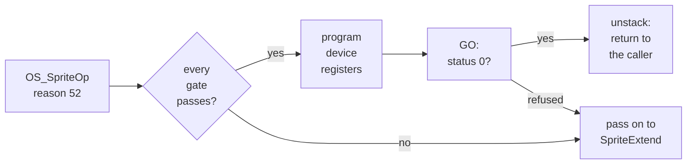

# 6. GVFill, line by line

The blitter device does nothing on its own. Something inside RISC OS has to notice a
fill or a sprite plot, decide whether the host can do it, program the device, and
tell the kernel the job is done. That is **GVFill**, a RISC OS relocatable module of
under a thousand lines of ARM assembly. This chapter walks through it, at version
1.03 on the published branch. It also tells two stories from its history: a feature
that drew the desktop wrong and was backed out, and one register that nearly sank
the ROM version.

## Built with no relocations

GVFill is pure assembly. It is assembled with clang and turned into a module image
with `llvm-objcopy`, and no RISC OS linker is involved. That imposes one hard rule,
and the build script enforces it:

```bash
n=$("$READOBJ" -r blitmod.o | grep -c R_ARM || true)
```

A module is loaded wherever the RMA (RISC OS's module area) has room, and nothing
relocates it. So any relocation left in the object is a branch into nowhere. It does
not fail at load time. As the README puts it, it takes the desktop black minutes
later. So `build.sh` refuses to produce a module with any `R_ARM` relocation left.

Two consequences run through the source:

- **`ADR` reaches only about a kilobyte**, and the handler outgrew that twice. The
  second time it broke code that had previously assembled.
- So **data is reached through `r12`**, the workspace pointer that vector dispatch
  provides for exactly this purpose, as `[r12, #offset]` loads.

## The module header

A RISC OS module begins with a table of offsets to its entry points. GVFill's is
thirteen words:

```asm
_start:
base:
    .word   0                       @ start
    .word   init    - base
    .word   final   - base
    .word   sv_service - base       @ service call handler
    .word   title   - base
    .word   help    - base
    .word   cmdtab  - base
    .word   0                       @ SWI chunk
    ...
    .word   modflags - base
...
modflags:
    .word   1                       @ 32-bit compatible
```

Every entry is written as a label minus `base`, which is what makes the table
position-independent.


<!-- doccrate:keep-together:start -->

#### Three star commands

The module adds three commands, for testing and measuring:

| Command | What it does |
|:---|:---|
| `*BlitFill` | paints a 200 × 100 test rectangle through the device, without involving GraphicsV |
| `*SprStats` | sprite plots seen, taken and passed, by count and by area, and which gate declined the rest |
| `*SprBench` | 1,000 plots of a 512 × 512 sprite on the host, then 1,000 through SpriteExtend |

<!-- doccrate:keep-together:end -->


## Workspace: nothing in the image is ever written

Version 1.03 keeps all writable state in a **172-byte structure claimed from the RMA
at initialisation**. That is the shape the DDE gives C modules, written here in
assembly. The module image itself is never written after the build, which is what
makes it safe to place in read-only ROM. The private word carries the structure's
address to every entry point.

The initialisation that claims it contains the trap that nearly sank this version:

```asm
    @ The size goes in R3 and the block comes back in R2 -- ModHand's
    @ RMAClaim_Chunk rounds R3 up for the heap, and a size left in the
    @ wrong register claims a garbage-sized block whose neighbours our
    @ zero loop then flattens.  Found the hard way: the flatten took out
    @ our own literal pool.
    MOV     r0, #ModClaim
    MOV     r1, #0
    LDR     r3, =WS_END
    SWI     XOS_Module
```

**`OS_Module 6` takes the claim size in R3, not R2.** With the size left in R2, the
module claimed a garbage-sized block. Its zeroing loop then flattened the
neighbouring memory, including the module's own literal pool with the device's
address in it. The device magic then read back as anything but `'BLIT'`, and
initialisation reported no blitter. It was found by parking the mapped address and
the value read into the structure, and reading them out of guest RAM (commit
`c0a55e4f44`).

## Initialisation

With the workspace claimed and zeroed, `init` maps the device and claims two
vectors:

```asm
    MOV     r0, #MapIOPermanent     @ OS_Memory 13
    LDR     r1, =BLIT_PHYS          @ 0xFD404000
    MOV     r2, #0x1000
    SWI     XOS_Memory
    MOVVS   r9, r0
    BVS     init_undo
    STR     r3, [r11, #WS_BLITLOG]  @ the logical address
    LDR     r2, [r3]
    LDR     r4, =BLIT_MAGIC
    TEQ     r2, r4
    ADRNE   r9, err_nodev           @ "No host blitter at this address"
    BNE     init_undo

    MOV     r0, #GraphicsV
    ADR     r1, gv_handler
    MOV     r2, r10                 @ the private word
    SWI     XOS_Claim
    ...
    MOV     r0, #SpriteV
    ADR     r1, sv_veneer
    MOV     r2, r10
    SWI     XOS_Claim
```

Claiming each vector with the private word as `r2` means every handler arrives with
`r12` pointing at it. A failed initialisation undoes itself: it releases whatever it
claimed and frees the workspace. `final` releases both vectors with the same values
and frees the structure.

Running on a machine without the device fails cleanly. The magic check produces a
proper RISC OS error instead of an abort.

## The fill handler

GraphicsV carries every video driver call, so the handler's first job is to get out
of the way fast. Only reason 13, Render, with operation 2, FillRectangle, is
examined:

```asm
gv_handler:
    STMFD   sp!, {r0-r3, r5-r11, lr}    @ not r4: the answer goes there
    LDR     r12, [r12]                  @ workspace, via the private word
    AND     r5, r4, #0xFF
    TEQ     r5, #GraphicsV_Render
    BNE     gv_pass
    TEQ     r1, #GVRender_FillRectangle
    BNE     gv_pass
```

### The colour block, found by looking

No video driver had ever implemented FillRectangle, so nothing settled what the
colour parameter points at. The kernel's workspace header describes it one way; one
of the two call sites builds something else. The fork settled it by observing both
call sites on a live desktop (commit `35eb1d8836`). Both pass **sixteen words of
interleaved `(ora, eor)` pairs**, and a fill computes `(dest ORR ora) EOR eor` for
each word. The desktop's grey appeared as `FFFFFFFF`/`FF888888` pairs.

When every `ora` is all ones, that expression reduces to a constant. That is the
only case the handler takes:

```asm
    LDR     r6, [r2, #16]           @ the colour block
    LDR     r9, [r6, #4]
    MVN     r9, r9                  @ r9 = the pixel word
    MOV     r8, #8
gv_chk:
    LDR     r0, [r6], #4
    CMN     r0, #1                  @ EQ only if 0xFFFFFFFF
    BNE     gv_pass
    LDR     r0, [r6], #4
    MVN     r0, r0
    TEQ     r0, r9
    BNE     gv_pass
    SUBS    r8, r8, #1
    BNE     gv_chk
```

Any other GCOL action needs the destination read back, so it is left to the kernel.

### Geometry, then eleven writes

The handler reads the screen's line length, depth and height with
`OS_ReadVduVariables`, and declines depths below 8 bpp, where a pixel is not a whole
number of bytes. It converts the inclusive, bottom-left-origin rectangle into a
top-left byte offset and a size in bytes. Then it programs the device:

```asm
    MOV     r1, #OP_FILL
    STR     r1, [r0, #BLIT_OP]
    MOV     r1, #F_FB
    STR     r1, [r0, #BLIT_FLAGS]
    STR     r11, [r0, #BLIT_DEST]   @ byte offset of the top left
    STR     r3, [r0, #BLIT_WIDTH]   @ bytes
    STR     r6, [r0, #BLIT_HEIGHT]  @ rows
    STR     r5, [r0, #BLIT_DSTRIDE] @ one line length
    MOV     r1, #4
    TEQ     r9, r9, ROR #8
    MOVEQ   r1, #1                  @ every byte equal: 8bpp plain colour
    BEQ     gv_patlen
    TEQ     r9, r9, ROR #16
    MOVEQ   r1, #2                  @ halfwords equal: 16bpp plain colour
gv_patlen:
    STR     r1, [r0, #BLIT_PATLEN]
    STR     r9, [r0, #BLIT_PATTERN]
    ...
    STR     r9, [r0, #BLIT_GO]

    LDR     r1, [r0, #BLIT_GO]      @ status
    TEQ     r1, #0
    BNE     gv_pass                 @ refused: let the kernel do it
    ...
    MOV     r4, #GraphicsV_Complete
gv_pass:
    LDMFD   sp!, {r0-r3, r5-r11, pc}
```

The pattern length is a neat detail. The device refuses a width the pattern length
does not divide. So the handler reports the *shortest* length the colour word
repeats at: one byte for an 8 bpp plain colour, which also lets the device use a
`memset`. Odd widths stay fillable.

The status read is the whole contract. On success the handler returns
`r4 = GraphicsV_Complete`, and the kernel skips its own plot. On any refusal it
leaves `r4` alone, and the kernel does the fill as before.


<!-- doccrate:keep-together:start -->

## The sprite handler

SpriteV carries every sprite operation, and **claiming the vector at all costs
something**. The kernel takes an internal fast path only while it is the sole owner
of SpriteV. Once GVFill claims the vector, every sprite operation goes down it,
so the handler must be cheap to pass through and must leave every register alone. It takes one reason, 52, a scaled
sprite plot, and only when every gate passes:

| Gate | Why |
|:---|:---|
| output is the screen, not a sprite | a plot into a sprite belongs in that sprite |
| the sprite is given by pointer | not looked up by name |
| unmasked | masked plots are declined; see below |
| plot action is a plain store | other actions need the destination |
| no left-hand wastage | the first pixel starts on a word boundary |

<!-- doccrate:keep-together:end -->


<!-- doccrate:keep-together:start -->

#### The gates, continued

| Gate | Why |
|:---|:---|
| equal scale factors | not really scaling |
| sprite format matches the screen | 32 bpp: type 6; 8 bpp: type 4; 16 bpp: type 5, only on a 5:5:5 screen |
| at 8 bpp, no private palette | byte indices only copy when both sides mean the same colours |

<!-- doccrate:keep-together:end -->


The 16 bpp gate is subtle. The Pi's 16 bpp screen is 5:6:5, where old type-5
sprites are 5:5:5 and genuinely need conversion: a copy would re-tint them. So those
go to SpriteExtend.

### Two kinds of VDU variable

Reading VDU variables on every plot was a measurable share of the guest's overhead.
The handler splits them. The comment in the source explains the split:

```asm
    @ Five of these are mode constants and six are not: the graphics
    @ window and origin are set per redraw rectangle, so the Wimp
    @ changes them between one plot and the next.  Read the constants
    @ only when the mode or the output has changed under us.
```

The service handler marks the cached constants stale on `Service_ModeChange`. Since
version 1.03 it also does so on `Service_SwitchingOutputToSprite`. A boot's first
plots go *into a sprite*, and while output is a sprite, `OS_ReadVduVariables`
answers with that sprite's geometry. Caching those values once left every later plot
failing the depth gate. The same service call now also sets the *output is a sprite*
flag, so such plots are passed.

### Programming the device, and a claim by stack

After converting OS units to pixels, and the bottom-left origin to a top-left one,
the handler programs a sprite blit. It hands over the sprite's **logical** address,
and the host walks the page tables:

```asm
    MOV     r11, #OP_SPRITE
    STR     r11, [r10, #BLIT_OP]
    MOV     r11, #F_SRC_VIRT        @ rows run top down, as the screen does
    STR     r11, [r10, #BLIT_FLAGS]
    LDR     r11, [r2, #spImage]
    ADD     r11, r11, r2            @ logical: the host walks the page tables
    STR     r11, [r10, #BLIT_SRC]
    ...
    STR     r11, [r10, #BLIT_GO]
    LDR     r11, [r10, #BLIT_GO]
    TEQ     r11, #0
    BNE     sv_pass                 @ refused: leave it to SpriteExtend
```

Taking a plot off a vector needs a trick, because a vector handler normally passes
on by returning. RISC OS's vector dispatch pushes the caller's return address before
walking the chain. So *passing on* is an ordinary return, and *intercepting* is
unstacking the handler's own frame and then returning straight to the caller:

```asm
    @ Claim.  CallVector pushed the caller's return address before
    @ walking the chain, so passing on is MOV pc, lr and intercepting is
    @ taking that address off the stack once our own frame is gone.
    LDMFD   sp!, {r0-r11, lr}
    MSR     CPSR_f, #0              @ V clear: no error
    LDMFD   sp!, {pc}
```

Every declined plot is also counted by *area*, not only by call. The split that
matters is pixels, and pixels decide whether the next case is worth writing.

## The feature that drew the desktop wrong

Masked sprites — icons with transparent edges — looked like the next four points of
coverage. Commit `10ba10b52c` added them. A one-bit-per-pixel mask was merged on the
host, whole groups of 32 pixels were moved at a time, and a pixel comparison came
back clean. Coverage rose from 94.3% to **98.2%** of sprite pixels.


<!-- doccrate:keep-together:start -->

#### The bisection

Loading the module then corrupted the screen: parts of windows drawn in the wrong
place, and content showing through where it should have been covered. A bisection
against a reference redraw found where it started (commit `8b1d43fb4b`):

| Module at | Pixels differing |
|:---|---:|
| `a3f6b6fafe`, before masks | 0 |
| `10ba10b52c`, masked sprites | 484,513 |
| `1011ad8aea`, packed sources added | 421,534 *(contaminated)* |
| `05cc1f5a8c`, mask gated on the plot action | 749,019 *(contaminated)* |

<!-- doccrate:keep-together:end -->


The last two counts are contaminated: the Wimp does not repaint areas it believes
are still valid, so damage carries over from one run to the next. The commit
records that gating the mask on the plot action reduced the damage without curing
it. **The module went back to `a3f6b6fafe`**,
which measures identical to no module at all. The commit's verdict: masked sprites
were worth about four points of coverage, and not worth a wrong screen.

Two theories died on the way, and were recorded so nobody retries them: the
framebuffer's pan offset, and RISC OS drawing into a second screen bank. It
allocates one, but the offset stays at 0,0 throughout, even while scrolling.

## Plot-action bit 4

With masks gone, the declined plots were counted gate by gate: named 0, wastage 0,
scaling 0, mask 0, depth 3, no table 0 (commit `05cc1f5a8c`). That leaves the plot
action declining **56 of 59** calls. Their raw values are 16 and 24, so **bit 4 is
set on every one**. SpriteExtend's plot compiler reads only the low four bits, so
ignoring bit 4 looked safe. It is not: accepting those calls changed 3,468 pixels in
a cluster of filer icons. Whatever bit 4 means is consumed somewhere between the SWI
and that compiler, and until it is known, those plots are declined.


<!-- doccrate:keep-together:start -->

## Soft-loaded, or in the ROM

Version 1.03 runs either way, but the two are **not equivalent**:

| Loaded | Fills | Sprites |
|:---|:---|:---|
| soft-loaded from the host share at boot | yes | yes |
| spliced into the ROM with `tools/mkrom.py` | yes: 26 fills in one boot's trace, 1–2 µs each | **never sees a plot** |

<!-- doccrate:keep-together:end -->


In the ROM, something later in the boot claims SpriteV in front of GVFill and answers
the plots itself. A vector's handlers are called most-recent-first, and the ROM is
the earliest place to initialise. Killing eight likely claimants in turn changed
nothing, and `*RMReInit GVFill` put it back in front. So the decision recorded on
13 September is that only HostFS and its filer go into the ROM. GVFill loads from
the share's `$.Modules` directory before the desktop starts. The
[HostFS walkthrough](../HostFSWalkthrough/index.md) covers that boot path.

`*RMKill GVFill` takes the module out of the drawing path instantly. The README
names it as the first thing to try if anything on screen looks wrong.


<!-- doccrate:keep-together:start -->

### A plot's path through GVFill



<!-- doccrate:keep-together:end -->


