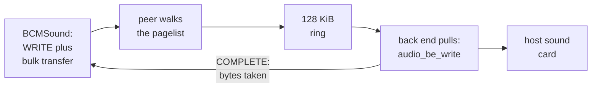

# 8. COMPLETE is the clock

RISC OS on the emulated Pi 4 was silent for its first day. The sound design that
changed that opens with a finding that shaped everything after it: **the sound path
is a conversation, not a chip.** This chapter follows that conversation: why
accepting it once hung the machine, the one message whose rate *is* RISC OS's audio
clock, two protocol bugs that only sound could expose, and why Windows stayed silent
for two days after the Mac had sound.

## There is nothing to emulate

On a Raspberry Pi 4, RISC OS's `BCMSound` module does not drive an audio chip. It is
a client of a VideoCore service. It opens VCHIQ service `'AUDS'`, and ships 16-bit
PCM to the GPU over it. No PWM, I2S or codec is reachable.

QEMU, for its part, modelled no Raspberry Pi audio at all. The I2S block is an
unimplemented-device stub, and `hw/audio` contains nothing from Broadcom. So there
was nothing to fix and nothing to build on. The design's summary: sound is **nine
message types and one bulk transfer**, on a channel the fork already owned, handed to
QEMU's audio back end — CoreAudio on the Mac, DirectSound on Windows, both already
compiled in.

## Why accepting `'AUDS'` once hung the machine

The VCHIQ peer had refused `'AUDS'`, because accepting it walked BCMSound into a
blocking wait. The sound design traced exactly where.


<!-- doccrate:keep-together:start -->

#### The three requests that wait

BCMSound has a send-and-wait routine for requests that need an answer. It spins on a
result flag with interrupts enabled and **no timeout**. Three requests use it:

| Request | When BCMSound sends it | Needs |
|:---|:---|:---|
| `CLOSE` | a sample-rate change; module shutdown | a `RESULT` |
| `CONFIG` | every sample-rate change | a `RESULT` |
| `CONTROL` | a mixer change | a `RESULT` |

<!-- doccrate:keep-together:end -->


Initialisation sends only `OPEN`, and does not wait. So accepting the service costs
nothing at boot. The hang comes only when something touches the sample rate. That is
why sprint S1 was worth doing even if nothing had followed: it removed a hang from a
path RISC OS takes whenever anything touches the rate.


<!-- doccrate:keep-together:start -->

## The whole conversation

A message is a 32-bit type plus 16 bytes of payload, 20 bytes in all:

| Direction | Message | Payload | Reply |
|:---|:---|:---|:---|
| to the GPU | `OPEN`, `CLOSE` | none | `RESULT` for `CLOSE` |
| to the GPU | `CONFIG` | channels, sample rate, bits | `RESULT` |
| to the GPU | `CONTROL` | volume, destination | `RESULT` |
| to the GPU | `START`, `STOP` | draining flag for `STOP` | none |
| to the GPU | `WRITE` | count, two cookies, silence, max packet | `COMPLETE`, repeatedly |
| from the GPU | `RESULT`; `COMPLETE` | success; count and cookies | — |

<!-- doccrate:keep-together:end -->


The protocol matches the definitions in Linux's Pi audio driver, and BCMSound agrees
with them message for message. `CONFIG` always asks for **two channels at 16 bits**, at one of nine rates from 8,000
to 48,000 Hz. That maps exactly onto QEMU's audio settings: signed 16-bit,
little-endian, stereo. BCMSound sends zero cookies and ignores them; Linux sends and
checks its own. The peer echoes whatever arrives, which keeps both clients happy.

## `COMPLETE` is the clock

This is the part of the design that makes it cheap, and it follows from how BCMSound
counts. Paraphrasing its callback: each `COMPLETE` reports a number of bytes
consumed, with bit 30 as an *audio starved* flag. BCMSound adds the counts up. Each
time the total crosses one buffer's worth, it tells the sound system a buffer
completed, and the sound system fills the next one.

So **the rate at which `COMPLETE` arrives is the rate at which RISC OS generates
sound.** There is no other clock in the loop.

That means the pacing should come from the audio device itself. QEMU's output API is
a *pull* model. The back end calls a device callback with the number of bytes it can
accept, at the real rate the host's sound card consumes. Report exactly what the back
end took, and the guest is clocked by the actual output device:

```c
/*
 * The sound card's pull. Whatever it takes out of the ring is what the
 * guest is told has played, so the reports come out at the rate the host
 * actually consumes audio -- no timer to tune and nothing to drift
 * against. Called from the audio timer on the main loop, BQL held, which
 * is what makes it safe to queue a message and ring the doorbell here.
 */
static void auds_audio_cb(void *opaque, int avail)
{
    BCM2835VchiqState *s = opaque;
    uint32_t reported = 0;

    if (!s->auds_open || !s->voice) {
        return;
    }
    while (avail > 0 && s->ring_used) {
        uint32_t run = MIN((uint32_t)avail, s->ring_used);
        size_t took;

        /* One contiguous piece at a time: the ring wraps, the API does not */
        run = MIN(run, s->ring_size - s->ring_tail);
        took = audio_be_write(s->audio_be, s->voice, s->ring + s->ring_tail,
                              run);
        if (!took) {
            break;
        }
        s->ring_tail = (s->ring_tail + took) % s->ring_size;
        s->ring_used -= took;
        reported += took;
        avail -= took;
    }
    if (reported) {
        auds_complete(s, reported);
        vchiq_signal_guest(s, s->slave_base + VCHIQ_SS_TRIGGER);
    }
}
```

One ring buffer, 128 KiB, sits between the two sides. The VCHIQ side fills it from
bulk transfers, the callback drains it into the sound card, and the bytes drained
become the next `COMPLETE`. Both ends run under QEMU's big lock, which is where the
peer already queues messages and rings the doorbell.

If the ring is ever full, the oldest audio is dropped, not the newest:

```c
if (len > space) {
    /*
     * Only reachable if the host stopped consuming: the guest sends
     * more only when we report, so it cannot outrun us by itself.
     * Drop the oldest rather than the newest, so what plays next is
     * what the guest sent most recently.
     */
    uint32_t drop = len - space;
    ...
    s->ring_tail = (s->ring_tail + drop) % s->ring_size;
    s->ring_used -= drop;
}
```


<!-- doccrate:keep-together:start -->

### The audio loop



<!-- doccrate:keep-together:end -->


Priming matters too. On `START`, BCMSound sends a burst of buffers up front, about 50
milliseconds' worth, and the ring must be able to take the whole burst before the
first `COMPLETE` goes back.

## Bug 1: the stall at exactly 1,265 buffers

The first build, with the service accepted and the loop paced, stalled after exactly
**1,265 buffers**. It did so in three runs, headless and windowed alike, so it was not
a race. There was no error and no `STOP` from the guest. The peer's last act each
time was a `COMPLETE` the guest never answered.

The cause was in VCHIQ itself, not in sound. VCHIQ's slot protocol is symmetrical.
Each side hands the other's used message slots back: it appends the slot index to the
owner's queue, bumps a recycle counter, and fires a recycle event. The guest did that
faithfully for the peer's slots. **The peer had never done it for the guest's.** It
had never mattered, because before sound the peer received a `CONNECT` and four
`OPEN`s in its whole life, comfortably inside one 4 KB slot. Sound sends 48 bytes per
buffer. After about fifteen slots the guest ran out, and blocked with nothing to say.

The fix is nine lines:

```c
static void vchiq_recycle_slot(BCM2835VchiqState *s, uint32_t slot)
{
    uint32_t n = vchiq_ld(s, s->slave_base + VCHIQ_SS_SLOT_QUEUE_RECYCLE);

    vchiq_st(s, s->slave_base + VCHIQ_SS_SLOT_QUEUE + (n % s->per_side) * 4,
             slot);
    vchiq_st(s, s->slave_base + VCHIQ_SS_SLOT_QUEUE_RECYCLE, n + 1);
    trace_bcm2835_vchiq_recycle(slot, n + 1);
    vchiq_signal_guest(s, s->slave_base + VCHIQ_SS_RECYCLE);
}
```

Afterwards the loop ran indefinitely: 5,883 buffers in a 100-second run. The sound
design's comment on it: a bug that sits harmless in a peer that barely talks, and
becomes a hard stop the moment one does.

## Bug 2: silence that looked like working code

Sprint S2 read the actual samples, and wrote them to a WAV file to be looked at.
A bulk transfer does not carry the buffer's address. It carries the address of a
*pagelist*: a length, a type, an offset, then a list of entries, each a run of
physical pages. Built to Linux's documented packing, the WAV file was **digital
silence** while the guest was demonstrably playing.

The trace showed two pagelists alternating, as a double buffer should, and both
resolving to the same address. Dumping the raw structure instead of the
interpretation showed entries of `0x00201a00` and `0x00201b00`. Those were 256 bytes
apart, which cannot be two 2 KB buffers, and not page-aligned, which the Linux
encoding requires. Masking with `~0xfff` had rounded both down to a page of zeros.

RISC OS's own VCHIQ port explains it. Paraphrasing: the entry encoding depends on the
width of a physical address. With 32-bit addresses, the top 20 bits are the address
and the low 12 are a page count. **With 36-bit addresses, the address is shifted
right by four, and only the low 8 bits count pages.** A BCM2711 is a 36-bit part.
Decoded that way, the two buffers come out at `0x201a000` and `0x201b000`, one page
apart:

```c
entry = vchiq_ld(s, pagelist + VCHIQ_PAGELIST_ADDRS + entry_index * 4);
base = (uint64_t)(entry & ~VCHIQ_PL36_COUNT_MASK)
       << VCHIQ_PL36_ADDR_SHIFT;
pages = (entry & VCHIQ_PL36_COUNT_MASK) + 1;
```

The design draws the lesson in one sentence: Linux's driver is the specification for
the *protocol*, but RISC OS's port is the specification for what RISC OS puts on the
wire, and where they differ, only one of them is the guest.


<!-- doccrate:keep-together:start -->

## The clock, measured

Sprint S1 had paced `COMPLETE` from the fork's virtual clock, because there was no
audio device to ask yet. Sprint S3 deleted that clock:

| Build | Audio delivered | Of real time |
|:---|:---|---:|
| S1: a timer deadline per buffer | 73.4 s of 96 s | 0.76× |
| S1: one virtual clock, reporting what has played | 68.3 s of 96 s | 0.71× |
| **S3: the sound card is the clock** | **29.95 s of 30.0 s** | **0.998×** |

<!-- doccrate:keep-together:end -->


The design is precise about why S3 works. It is not that the new code is more
careful: there is no longer a model of how fast audio should play. The host's sound
card consumes at the real rate *because it is* the real rate. Reporting its
consumption verbatim makes the guest's clock the same clock, with nothing to tune and
nothing to drift.

The measurement needed care of its own. The first two attempts divided the audio
delivered over a whole run by a *guessed* start time, and gave 0.65× and 0.68×. That
sent the investigation looking for a starvation bug that did not exist: the ring sat
steady at 10,240 bytes throughout. Sampling over a known thirty-second interval gave
0.998×. The ratio was always right; the denominator was a guess.

With no audio back end at all, the old virtual-clock pacer takes over again, so the
guest's sound loop still turns. Silence that still boots is not an error.

## Why Windows was silent for two days

Sound landed on 10 September and played on the Mac. On Windows it was reported as not
working, and the protocol was not the problem. Commit `e61d3314bd` found two causes.

**Nothing on Windows asked for audio.** Sound needs two command-line options: a
back end, and the global property that hands it to the VCHIQ peer. The Mac launch
scripts passed both from the first day. The Windows launcher and the test farm passed
neither. Without them nothing fails and nothing warns. The service is accepted, the
loop turns, and **silence is the only symptom** — which is also the symptom of sound
never having been built.

**DirectSound then killed QEMU outright.** QEMU's DirectSound back end initialised
the *capture* device unconditionally, and treated failure as fatal. On a desktop with
speakers and no microphone, the whole audio device failed and QEMU exited. Recording
is now optional:

```c
if (SUCCEEDED(hr)) {
    hr = IDirectSoundCapture_Initialize (s->dsound_capture, NULL);
}
if (FAILED(hr)) {
    if (s->dsound_capture) {
        IDirectSoundCapture_Release(s->dsound_capture);
        s->dsound_capture = NULL;
    }
    warn_report("dsound: no recording device (%lx); playback still works,"
                " capture is unavailable", (unsigned long)hr);
}
```

The proof did not rely on listening. With the WAV audio back end over a 91-second
boot, peak amplitude was **16,302 of 32,767**, with signal at 1.0 s and 1.5 s for the
boot beeps and from 58.5 to 60.0 s for BASIC `SOUND` notes. A silent capture is a file
of zeros of the same size, so a growing file is not the test. The peak is.


<!-- doccrate:keep-together:start -->

## What is left

| Item | State |
|:---|:---|
| `CONTROL` volume and destination | acknowledged, not applied; use the host's volume |
| a mid-stream rate change | reopens the voice and drops the ring; RISC OS sets the rate once in practice |
| the starved bit | never set; a dry ring reports a smaller count instead |
| capture | not implemented |
| the ring across a snapshot | not migrated |

<!-- doccrate:keep-together:end -->


**INFERRED** — latency was never measured by the project. A 2,048-byte buffer at
44.1 kHz stereo is about 11.6 ms. The six-buffer priming burst is about 70 ms, and a
steady ring of 10,240 bytes is about 58 ms. Add the back end's own buffering and the
audio timer's 10 ms period.
