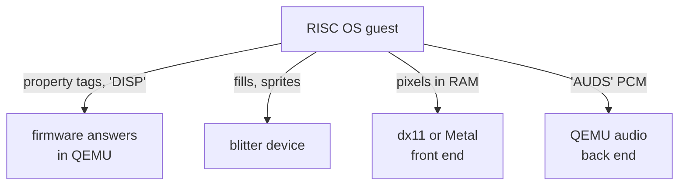

# Graphics and sound, done by the host

**How the RISC OS Pi 4 emulator puts a desktop in a window on Windows and on the
Mac, moves the drawing RISC OS does in ARM code onto the host, and plays sound —
all without emulating the GPU or any audio chip.**

A Raspberry Pi 4's graphics and sound belong to its VideoCore GPU and Broadcom's
closed firmware. The emulator models neither. It answers the few questions RISC
OS asks its firmware, reads the screen straight out of guest memory, and draws it
with the host's own GPU API. Sound is handled the same way: it is a conversation
over a message queue, answered by QEMU's audio back end.

> **There is no GPU in QEMU — we are the GPU.**

That line, from the fork's graphics design, is the thread through every chapter.

<!-- doccrate:keep-together:start -->

## These documents

| Chapter | What it covers |
|:---|:---|
| [1. We are the GPU](01-we-are-the-gpu.md) | what RISC OS asks for, and where the screen lives |
| [2. The window owns the thread](02-direct3d.md) | the Windows front end, Direct3D 11 |
| [3. The same program, another idiom](03-metal.md) | the Mac front end, Metal, and Apple Events |
| [4. The pointer is a sprite again](04-pointer.md) | the hardware pointer, answered by the host |

<!-- doccrate:keep-together:end -->

<!-- doccrate:keep-together:start -->

#### These documents, continued

| Chapter | What it covers |
|:---|:---|
| [5. Moving drawing to the host](05-blitter-device.md) | why not the GPU; the blitter device |
| [6. GVFill, line by line](06-gvfill.md) | the RISC OS module that feeds the blitter |
| [7. Knowing what the guest drew](07-damage.md) | tearing, the damage word, screen banks |
| [8. COMPLETE is the clock](08-sound.md) | sound over VCHIQ, clocked by the host |
| [9. Measured, and open](09-measured-and-open.md) | the numbers, the risks, the drift |

<!-- doccrate:keep-together:end -->

<!-- doccrate:keep-together:start -->

## At a glance

| | |
|:---|:---|
| **Screen** | guest RAM, mapped lock-free and decoded by a GPU shader every frame |
| **Windows** | `-display dx11`: Direct3D 11, C++17 behind a C boundary |
| **Mac** | `-display metal`: Metal, Objective-C, plus an Apple Events surface |
| **Blitter** | a new MMIO device plus GVFill, an assembly RISC OS module |
| **Sprite plot** | 490 µs in the guest, 80 µs on the host: **6.1×**, 0 pixels different |
| **Sound** | VCHIQ `'AUDS'`, clocked by the host sound card: **0.998×** real time |

<!-- doccrate:keep-together:end -->

<!-- doccrate:keep-together:start -->

### Where each piece runs

<!-- doccrate:keep-together:end -->

These documents build on two others. The
[QEMU A72 walkthrough](../QemuA72Walkthrough/index.md) covers the machine: the
mailbox and VCHIQ peers, the EDID answer, the timer thread and the DMA copies.
The [fake it in software walkthrough](../FakeItInSoftwareWalkthrough/index.md)
covers the design principle behind all of it.
