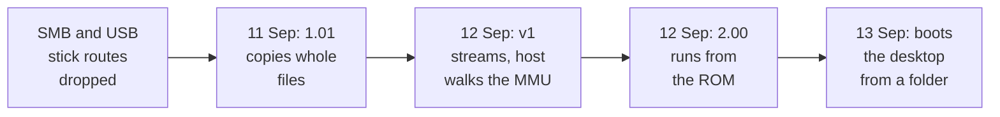

# 1. Why a host filing system

A developer using the emulator needs to move files in and out of the guest all the
time: a freshly compiled module, a source file edited on the host, a log. The SD card
image is a poor way to do that. It is a disc image, so files can only be written
into it with the machine stopped, and every change means re-attaching the image.
This chapter covers the three routes that were considered, why two of them were
dropped, and the shape of the one that was built.

## Route 1: the network, and a dialect gap

RISC OS ships an SMB client, LanManFS. QEMU's user-mode network puts the host at
`10.0.2.2`. If LanManFS could mount a Windows share, host files would arrive with
no guest code at all. That was worth a day to find out.

<!-- doccrate:keep-together:start -->

#### Two ends that cannot agree

It was ruled out from both ends. The guest reached the host fine: NetSurf browsed
through the network, and a ping to the host answered in 2 ms. But:

| Side | What it speaks |
|:---|:---|
| the ROM's LanManFS | exactly two dialects, both SMB1; no SMB2 or SMB3 dialect exists in the ROM |
| Windows 11 on the build machine | SMB1 disabled, and signing required |

<!-- doccrate:keep-together:end -->

`*LMount` brought up the login dialogue, and the logon failed as *Bad
authentication*, which is how LanManFS reports a refused negotiation. Re-enabling
SMB1 on the host would have worked, but it is a deprecated protocol with signing
turned off. The record calls that "not recommended, not the answer".

## Route 2: a USB stick made of a folder

QEMU's `vvfat` block driver can present a host directory as a FAT-formatted disc.
Attached as a USB mass-storage device, it would look to RISC OS like a USB stick.
That route needs no guest module at all.

The experiment on the Mac got partway. The ROM's USB and SCSI stack claimed the
device far enough to run the bulk-only transport: three bus resets, a LUN probe,
and one SCSI `INQUIRY` per reset. Then it stopped. There was no *test unit ready*,
no *read capacity* and no sector reads. The stick was visible on the bus and never
mounted. The note records the likely cause as either something in QEMU's `INQUIRY`
reply that the driver rejects, or a class driver that only a full boot loads. It
lists the next steps, and none of them was recorded as done. HostFS made the route
unnecessary.

## Route 3: a doorbell and a module

The plan that was built is the pattern RISC OS emulators already use. VirtualAcorn
and RPCEmu both ship a `HostFS:` whose module talks to the emulator. The difference
here is the transport: a small device, rather than intercepted SWIs. No CPU state is
forged, and any guest code could use the device.

<!-- doccrate:keep-together:start -->

#### The three layers

The design has three layers:

| Layer | Where | Job |
|:---|:---|:---|
| the HostFS module | the guest, registered with FileSwitch as filing system 220 | turn each FileSwitch call into one request |
| `vmchannel` | a QEMU MMIO device at a hole in the Pi 4 memory map | the doorbell: one write carries a request to the host |
| the host service | inside the device, in QEMU | do the filing-system work against a host directory |

<!-- doccrate:keep-together:end -->

### The governing rule

The second version of the design, written after the first had been measured and
found wanting, opens with the rule quoted on the index page: *as much work in the
host as possible, as little in the guest as possible*. It has concrete
consequences, and every later chapter is one of them:

- **The wire speaks FileSwitch, not POSIX.** The module copies RISC OS registers
  into a request and back out, without interpreting them. The host decodes them.
- **The host reaches guest buffers itself**, by walking the guest's page tables,
  instead of the guest translating addresses (chapter 4).
- **The host owns names, types and dates**, including the RISC OS load and execute
  words (chapter 5).
- **The guest module stays small.** The design targeted a few hundred lines. The
  built module is larger, at 1,724 lines of C plus 507 of assembly, and chapter 8
  says why.

<!-- doccrate:keep-together:start -->

## The timeline

| When | Commits | What happened |
|:---|:---|:---|
| 10 Sep | `af5a2cbed1` | the SMB route shown dead |
| 10 Sep | `99abaa1b9c`, `d034d7a17a` | the design, and the device with a bare-metal smoke test |
| 11 Sep | `0a63382fb3` … `8eb8209624` | the doorbell mirrored where the guest can reach it; file transfer end to end: version 1.01 |
| 12 Sep | `c5a13d181f` … `174a719248` | version 1: streams, the host walking the MMU, names and types |

<!-- doccrate:keep-together:end -->

<!-- doccrate:keep-together:start -->

#### The timeline, continued

| When | Commits | What happened |
|:---|:---|:---|
| 12 Sep | `bb79635c18` | HostFS 2.00 runs from a spliced stock ROM |
| 13 Sep | `cf1e8da677`, `509ab9d478` | the machine boots from the share; CMOS persists on it |
| 13 Sep | `676e664065` … `e7e6deffae` | 2.01 names every error; names Windows cannot store; 2.02 pages and sorts listings |

<!-- doccrate:keep-together:end -->

<!-- doccrate:keep-together:start -->

### From a folder to a boot disc

<!-- doccrate:keep-together:end -->

