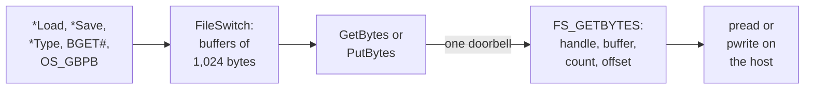

# 3. Speaking FileSwitch

RISC OS filing systems do not implement `open`, `read` and `write` directly.
They register a set of entry points with **FileSwitch**, the layer that sits under
every file SWI. FileSwitch calls those entries with register frames, in the shapes
the filing system declared when it registered. This chapter covers how HostFS
declared itself wrongly at first, the stream bug that resulted, the fix that made
it a buffered filing system, and the decision to keep only one data path.

<!-- doccrate:keep-together:start -->

## Version 1.01: a file copier

The first module that worked end to end, on 11 September, was a whole-file transfer
service. The private repository's record of it is blunt:

| Operation | Version 1.01 |
|:---|:---|
| list directories, copy whole files on and off, delete | worked |
| stream bytes on an open handle: `BGET`, `OS_GBPB` | failed |
| file types | every file listed as Text, undated |
| `*SetType` | reported success and changed nothing |
| `*Rename` | failed with *Bad rename* |

<!-- doccrate:keep-together:end -->

That version shipped on the card images the team uses, and it is still there. The
emulator keeps its version 0 commands so those images keep working.

## The stream bug, found in the source

On 12 September a measurement showed how far version 1.01 was from a real filing
system. Every entry in a `*Ex` listing read `FFFFFFFF`. `*Type` printed nothing, and
`BGET#` returned garbage before killing the handle.

The cause was a contradiction in what the module told FileSwitch (commit
`c5a13d181f`). When a file is opened, a filing system returns an *information word*
describing the stream. HostFS set **bit 28**, which declares *unbuffered block
transfers*: FileSwitch should send multi-byte transfers to the filing system's own
block-transfer entry. But HostFS had left that entry zero in its registration. So
every transfer was dispatched into nothing.

<!-- doccrate:keep-together:start -->

#### Three interfaces, one module

It was worse than one wrong bit. The commit found three interfaces in play:

| Interface | What the module did |
|:---|:---|
| unbuffered single-byte `GetBytes`: one byte in R0, C set at end of file | declared, by setting bit 28 |
| buffered `GetBytes`: buffer, count and offset in R2–R4 | **implemented**, in the handler |
| the block-transfer entry | left zero |

<!-- doccrate:keep-together:end -->

The module had declared one interface, implemented a second, and nulled the third.

## The fix: be a buffered filing system

Clearing bit 28 and returning a buffer size makes FileSwitch drive the handlers that
already existed, and the handlers were already the right shape. The open handler's
exit registers are now:

```c
r->r[0] = (int)((1u << 31) | (1u << 30) |
                ((type == 0) ? (1u << 29) : 0u));   /* 29: directory */
r->r[1] = (int)h;
r->r[2] = HOSTFS_BUFSIZE;
r->r[3] = (int)((type == 0) ? 0 : size);            /* extent */
/* allocated space: must be a multiple of the buffer size */
r->r[4] = (int)((size + (HOSTFS_BUFSIZE - 1u)) & ~(HOSTFS_BUFSIZE - 1u));
```

<!-- doccrate:keep-together:start -->

#### The exit registers

| Register | Value |
|:---|:---|
| R0 | the information word: readable, writable, bit 29 for a directory; bit 28 clear |
| R1 | the host's file handle, 1-based, because 0 means *no file* to FileSwitch |
| R2 | the buffer size: 1,024 bytes |
| R3 | the file's extent |
| R4 | the allocated size, rounded up to the buffer size |

<!-- doccrate:keep-together:end -->

FileSwitch requires the buffer size to be a power of two between 64 and 1,024.
HostFS takes the maximum, and the source gives the reason in one line: **the
doorbell, not the copy, is what a transfer costs.** Fewer, larger blocks mean fewer
crossings.

Being buffered changes three things for the module:

- **Buffered `GetBytes` has no exit registers**, so the only way to report a
  failure is to return an error.
- **The last block of a file routinely runs past its end.** The count is a whole
  number of buffers. The host zero-fills the tail and still delivers the full count.
- **FileSwitch tracks the file pointer and extent itself.**

Verified on the emulator with the module rebuilt inside the guest: `*Type` printed
the file, `BGET#` returned the right bytes, a 256 KiB `OS_GBPB` completed, and a C
program compiled from HostFS, linked and ran.

## One data path, not two

A second change removed the conditions for the bug altogether (commit
`1690fac252`). A filing system can let FileSwitch build `*Load` and `*Save` out of
open, read, write and close, instead of providing whole-file entries of its own.
RISC OS's own guide to writing a simple filing system recommends exactly that for a
filing system of this shape. HostFS now sets the two information-word bits that ask
for it.

The commit explains why this mattered in one sentence:

> Whole-file and streaming were two paths that could disagree, and they did: *Copy
> worked for months while *Type and BGET# returned garbage, because only the
> whole-file path was ever exercised.

The retired whole-file reasons still answer, with a named error, so a surprise call
says what happened. The transfer code now has exactly two callers, `GetBytes` and
`PutBytes`. Verified: a 256 KiB file copied in and back out through the stream path
alone was byte-identical, at **one doorbell in each direction**. A 29-byte `*Type`
became a single 1,024-byte block read.

<!-- doccrate:keep-together:start -->

### The shape after the fix



<!-- doccrate:keep-together:end -->

<!-- doccrate:keep-together:start -->

## Version 1: the wire speaks FileSwitch

The same day brought the transport change described in chapter 2. Version 1
commands carry the register frame itself. For `GetBytes`, that means:

| Register | Meaning |
|:---|:---|
| R1 | the filing system's handle |
| R2 | the caller's buffer, as a **guest logical address** |
| R3 | the byte count |
| R4 | the file offset, so there is no separate seek |

<!-- doccrate:keep-together:end -->

The module's transfer function collapsed accordingly (commit `475eb744d3`). The
old loop split every transfer at 4 KiB, called `OS_Memory` per chunk to find a
physical address, and issued a `SEEK` before each `READ`: two doorbells per page. A
256 KiB read went from **130 doorbells to 1**, five for the whole open, read and
close. Now one request carries the frame, and chapter 4 covers how the host reaches
the logical buffer:

```c
req->cmd = (uint32_t)(is_write ? C_FS_PUTBYTES : C_FS_GETBYTES);
req->arglen = 0;
REQW(1) = h;
REQW(2) = mem;
REQW(3) = n;
REQW(4) = ptr;
rc = vmch_go(ws);                /* one doorbell */
...
if (rc == RC_BADADDR) {
    return REQW(3);              /* how far the translation got */
}
```

<!-- doccrate:keep-together:start -->

### Built only partly

The version 1 design moves every FileSwitch entry onto register frames. The built
code does so only where it paid:

| Entry | Transport today |
|:---|:---|
| `GetBytes`, `PutBytes` | version 1 frames |
| `File` (read and write catalogue information) | version 1 frames |
| `Func` 30 and 35, `Args` 8 | version 1 frames |
| `Open`, `Close`, most `Args`, directory listing, delete | version 0 commands |

<!-- doccrate:keep-together:end -->

The design's own summary of this kind of state, elsewhere, is that the build is an
honest hybrid. It works, and the remaining version 0 commands are candidates for
moving rather than bugs.

## Filling in FileSwitch's contract

Booting and the desktop exercise far more of the filing-system interface than
copying files does. Each missing reason showed up as a named failure, and each was
added when something needed it. Two stories from that work are worth telling.

**Rename was answering the wrong question.** `FSEntry_Func` reason 8 is Rename. The
module answered reason 8 as *read disc name*, which is reason 11. So `*Rename` wrote
the disc name over the caller's new-pathname string, renamed nothing, and FileSwitch
reported *Bad rename*. The fix, in commit `4438a1b811`, moved the disc name to
reason 11. That exposed a second fault: once the disc-name call worked, FileSwitch
began putting the disc name into every path it passed, as `:HostFS.$.name`. So the
host's path resolver learned to skip that prefix.

**Listings had a ceiling and no order.** A directory listing came back in a single
reply, one 4 KiB page of 63 entries. A larger directory reported *directory too big*:
Python's library directory, with 334 entries, could not be listed. And entries came
back in the host's order, which on Apple's file system is a hash order. FileCore
keeps catalogues sorted, so a share ran `!Boot`'s start-up tasks in a different
order from the card they were copied from.

Version 2.02, commit `e7e6deffae`, fixes both in one place:

- the host collects the whole directory
- it sorts by the RISC OS leafname, folded case-insensitively as FileCore does
- it pages the result, with a continuation index in and a *more to come* flag out

Sorting is also what makes the page index a stable function of the directory, so the
two fixes share their code. It was verified with a 200-entry directory created in
scrambled order, and with a 3,126-file tree.

<!-- doccrate:keep-together:start -->

### The contract as it stands

| Entry | Reasons handled |
|:---|:---|
| `Open`, `Close`, `GetBytes`, `PutBytes` | all used |
| `Args` | 0–7, 8 (write zeroes), 9, 10 |
| `File` | 1–4 write catalogue information; 5, 9 read it; 6 delete; 7 create; 8 create directory; 10 block size |
| `Func` | 0, 1, 8 rename, 10 boot, 11 disc name, 14, 15, 19, 23, 24, 27, 30, 35, and others as no-ops |

<!-- doccrate:keep-together:end -->

Version 2.01 added one more discipline: **every error names what failed.** A host
answer the module did not expect used to fall through to *unsupported operation*.
It now reads, for example, *HostFS: host I/O error (FS_GETBYTES: cmd 257, rc 10)*,
spelt exactly as the trace spells it (commit `676e664065`).
