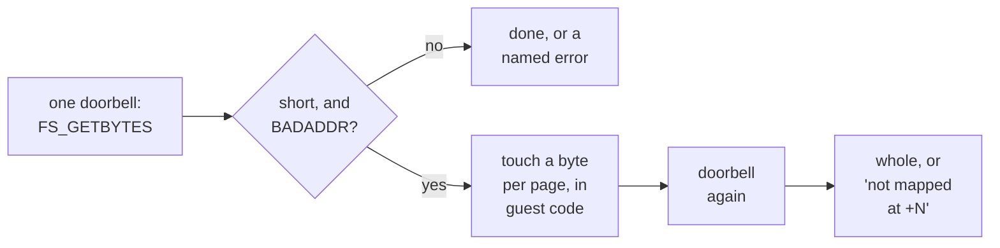

# 4. Reaching guest memory

A filing system's hardest job is moving bytes into and out of the caller's buffer.
Version 1 of HostFS made a bold choice about it: **the host reaches the buffer
itself, by walking the guest's page tables**, and the guest module never translates
an address. This chapter covers that choice, the puzzle it ran into — a transfer
that stopped after exactly 252 bytes — the wrong turn taken on the way to the
answer, and the guest-side fix. It ends with the protection caveats that come with
letting a device write through the MMU.

## The central move

The version 1 design states it without hedging: all guest addresses on the wire are
**logical**, exactly as FileSwitch passed them to the module, and **the host
translates**. QEMU has a precedent for this in semihosting, where a debug call
names a guest buffer by its virtual address and QEMU reads it.

The consequences are what the design wanted:

- **One doorbell per FileSwitch call**, whatever the size or alignment of the
  buffer.
- **The guest cannot mistranslate an address**, because it no longer translates one.
- **A failed translation is an error, not a guess.** The version 0 path fell back to
  the identity mapping when a translation failed, and the design calls silent
  corruption the designed behaviour of that path.

## How the host does it

The host's access routine borrows the method the blitter device had already proven
for reading sprites out of guest virtual memory (commit `2daf256a55`). It translates
one page at a time with QEMU's debug translation, then maps and copies through the
system address space:

```c
while (len) {
    TranslateForDebugResult tres;
    uint64_t page = addr & ~(uint64_t)0xFFF;
    uint32_t off = (uint32_t)(addr - page);
    uint32_t n = 0x1000 - off;
    hwaddr plen;
    void *host;

    if (n > len) {
        n = len;
    }
    if (!cpu_translate_for_debug(cpu, addr, &tres)) {
        vmch_trace("vmch: translate failed at va=%08llx\n",
                (unsigned long long)addr);
        vmch_dump_walk(cpu, addr);
        return false;
    }
    plen = n;
    host = address_space_map(&address_space_memory, tres.physaddr, &plen,
                             is_write, tres.attrs);
    ...
    if (is_write) {
        memcpy(host, p, n);
    } else {
        memcpy(p, host, n);
    }
    address_space_unmap(&address_space_memory, host, plen, is_write,
                        is_write ? n : 0);
    p += n;
    addr += n;
    len -= n;
}
```

QEMU's more obvious call for this, `cpu_memory_rw_debug`, was tried first. It routes
through the CPU's own address space rather than the system one, and it reports any
memory-transaction error as a translation failure. The rewrite avoids both.

A counted variant reports **how far it got**. A buffer is not necessarily reachable
end to end, and nothing on the host can fault a page in. So a partly reachable buffer
returns a short count with `RC_BADADDR`, and the count in R3, rather than quietly
delivering rubbish past the boundary.

## 252 bytes, and not one more

The new transport worked at once for most transfers. `*Copy` of a 256 KiB file moved
the whole file in one doorbell, from a buffer at `0x493aa000`: 64 pages, correct
bytes. `*Type`, the Filer, and the C compiler working off HostFS all worked.

One case did not. A BASIC program `DIM`med a 256 KiB buffer, which landed at
`0x8F04` in application space, and read the file into it with `OS_GBPB`. **252 bytes
transferred, and the page at `0x9000` would not translate.** 252 bytes is exactly the
distance from `0x8F04` to the next page boundary.


<!-- doccrate:keep-together:start -->

### Ruled out, by measurement

The investigation eliminated its suspects one at a time, and recorded each so nobody
re-runs them (commits `049aae171c` and `2daf256a55`):

| Suspect | Why it was ruled out |
|:---|:---|
| crossing a page boundary | a 12,320-byte transfer spanning four pages moved whole |
| the size of the transfer | the 256 KiB `*Copy` moved in one doorbell |
| the access path | rewritten on the blitter's proven pattern, it failed identically |
| QMP's address translation command as a witness | it said *unmapped* even for an address the same run had just transferred; it samples whatever task is current |

<!-- doccrate:keep-together:end -->


### The wrong turn

One test sent the investigation the wrong way. The obvious explanation was **lazy
mapping**: RISC OS might not have mapped the buffer's pages yet. So the pages were
touched from BASIC first, and the transfer still failed. The design record wrote
down *it is not lazy mapping*, and moved on to the translation code. That bullet is
still in the document, above the answer that contradicts it.


<!-- doccrate:keep-together:start -->

### The answer

Commit `1dd95655a9` found it. **RISC OS maps application space lazily, and the debug
walk was telling the truth the whole time.** The proof was one line of BASIC that
touches the buffer's pages and then transfers, *in a single execution by the client
itself*:

| Touched first | Result |
|:---|:---|
| nothing | 252 bytes; fails at `0x9000` |
| every 4,096th byte | 258,300 bytes; fails at `0x48000`, the one page that stride misses |
| every page, last byte included | the whole `0x40000` bytes, one doorbell, correct |

<!-- doccrate:keep-together:end -->


The failure address moved exactly as far as the touching did. The page tables were
never wrong: an untouched page genuinely had no entry, and the debug walk reported
that correctly. What made the difference was touching and transferring in the same
execution; the record does not say why the earlier, separate touches did not hold.

One casualty is recorded honestly. During the hunt, a change to QEMU's page-table
walker skipped a domain-fault check for debug translations. The commit that found
the answer keeps it, and says plainly that it *demonstrably fixes nothing here, and
can be dropped without loss*.

## The fix: fault it in from the guest

The host cannot fault a page in, but the guest can. Commit `fe63582be5` adds the
fix to the module's transfer function. It tries the single doorbell. On a short count
caused by an unmapped buffer, it touches the buffer and tries once more:

```c
static void touch_pages(uint32_t mem, uint32_t n)
{
    volatile const uint8_t *p = (volatile const uint8_t *)mem;
    uint32_t i;
    uint8_t sink = 0;

    if (n == 0) {
        return;
    }
    for (i = 0; i < n; i += 0x1000u) {
        sink = (uint8_t)(sink | p[i]);
    }
    sink = (uint8_t)(sink | p[n - 1]);   /* the final partial page */
    (void)sink;
}

static uint32_t xfer(struct hostws *ws, uint32_t h, uint32_t ptr,
                     uint32_t mem, uint32_t n, int is_write)
{
    uint32_t moved = xfer_once(ws, h, ptr, mem, n, is_write);

    if (moved != n && ws->w_xfer_rc == RC_BADADDR) {
        touch_pages(mem, n);
        moved = xfer_once(ws, h, ptr, mem, n, is_write);
    }
    return moved;
}
```

Each design choice has a reason:

- **It reads a byte per page, not writes one.** The touch goes through the guest's own
  abort handler, which maps the page, just as any other filing system's write into the
  buffer would. Reading leaves the buffer undisturbed if the transfer then fails.
- **It includes the last byte**, because the buffer's final partial page is exactly
  what a stride of 4,096 misses.
- **It retries once.** After touching, every page is present. The common case never
  reaches the retry, so the fast path stays at one doorbell.
- **It retries only an unmapped buffer.** Since version 2.01, any other refusal is
  reported at once, because it would only be refused again.

Measured on a fresh, untouched 256 KiB `DIM`: the first attempt moved 252 bytes, and
the retry moved the whole `0x40000`, with the first, middle and last bytes matching
the host file.

### Why it is safe here

The module's source explains why touching the caller's buffer is safe on this path.
In paraphrase of the programmer's reference: for the block-transfer calls, FileSwitch
knows the byte count and validates the buffer, whereas for certain `Func` reasons it
cannot. So a wild pointer should never reach the touch loop, only an in-range page the
client has not yet faulted in. If one ever did, the loop would take a data abort. The
source names the fix, a validation call before the loop, which those `Func` entries
must make for themselves.

## Errors must never be silent

Buffered `GetBytes` has no exit registers. So a short transfer that is not reported
is reported as success, and the module learned that the hard way. Before commit
`27c5d2f124`, an `OS_GBPB` reported *0 bytes not transferred* over a buffer holding 252
good bytes and 261,892 stale ones.

Now any short transfer returns an error that names what happened:

```c
if (moved != n) {
    return (ws->w_xfer_rc == RC_BADADDR) ? badaddr_at(ws, moved)
                                         : rc_to_error(ws, ws->w_xfer_rc);
}
```

The unmapped-buffer error carries the offset of the first unreachable byte, such as
*transfer buffer not mapped at +258300*. The source comment gives the reason: a short
transfer is nearly always a partial-coverage bug in whatever prepared the buffer, and
the offset points straight at it. A bare *not mapped* would have left that to a
diagnostic build.


<!-- doccrate:keep-together:start -->

### The retry path



<!-- doccrate:keep-together:end -->


A staging design was drawn as well: copy through a buffer in the module area, which
always translates, then `memcpy` in guest code. It was never built, because the touch
made it unnecessary.

## Caveats that come with the design

Letting a device write through the guest's MMU has consequences the project records,
and a few that reading the code suggests.

**Stated by the project:**

- **It relies on TCG.** Writing behind the CPU's back through debug translation is
  fine under TCG, and the design notes it needs revisiting under hardware
  virtualisation.
- **The share root is the only perimeter.** Any guest code can ring the doorbell. The
  design advises saying so in user documentation, since sharing a whole home
  directory would be a poor choice.

**INFERRED, from the code, and untested:**

- **Protection is not checked.** QEMU's debug translation applies no access-permission
  checks, and the walker change above skipped domain checks too. So a client could ask
  HostFS to read file data into pages it could not write itself. On this machine the
  ROM image is copied into RAM, so that includes the ROM's own pages.
- **Snapshots and open files.** The first design called snapshots free, because the
  device keeps no state between requests. But the device holds host file descriptors,
  and it has no migration state. A `loadvm` into a fresh QEMU process with files open
  would find those handles dead. No result of the planned snapshot test is recorded.
