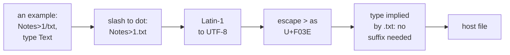

# 5. Names, types and dates

A RISC OS file and a host file disagree about almost everything a name carries.
RISC OS separates path components with a dot, and has no file extensions. Instead
each file carries a 12-bit *file type*, stored in its load address along with a
five-byte datestamp. It uses an 8-bit Acorn Latin-1 character set. A Mac or PC uses
dots in names, extensions for type, UTF-8, and forbids characters RISC OS allows.

Version 1 moved every one of these translations onto the host. This chapter covers
the rules as they now stand, and the bugs that shaped them, most of which appeared
only when a real disc's worth of files was copied through.

## The dot is a slash

RISC OS already has a convention for foreign names, used by its DOS filing system:
a dot in a foreign leafname appears as `/`. So `readme.txt` on the host lists in RISC
OS as `readme/txt`. HostFS follows it. `host_name_of` turns each `/` into `.` on the
way out, and the reverse mapping turns dots into slashes on the way in.

## The type rides the name

A host file's RISC OS type comes from its name, in this order:

1. **An explicit `,xxx` suffix**, three hex digits, gives the type, and the suffix is
   consumed. `hello,ffb` lists as `hello`, of type BASIC.
2. **Otherwise the extension** is looked up in a type table.
3. **Otherwise** the type is &FFF, Text. Directories take no type.

The host side of rule 1 had a subtle bug. The suffix was consumed, but what was left
could still contain a dot, as in `readme.txt,ff9`, and the dot was returned
untranslated. So the file listed as `readme.txt`, visible but impossible to open.
The fix passes the remainder through the same name translation:

```c
if (comma && strlen(comma + 1) == 3) {
    char *end;
    long t = strtol(comma + 1, &end, 16);

    if (end == comma + 4 && t >= 0 && t < 0x1000) {
        *type = is_dir ? 0 : (uint32_t)t;
        return guest_name_of(host_leaf, (size_t)(comma - host_leaf));
    }
}

out = guest_name_of(host_leaf, strlen(host_leaf));
if (is_dir) {
    *type = 0;
    return out;
}
dot = strrchr(host_leaf, '.');
*type = (dot && dot != host_leaf) ? type_for_ext(dot + 1) : 0xFFF;
return out;
```

## Load, execute, and a datestamp

RISC OS stores a typed, dated file's type and time in two 32-bit words. The top
twelve bits of the load word are all ones, the next twelve are the type, and the low
byte plus the whole execute word hold a five-byte count of centiseconds since 1900.
The host computes both words:

```c
static void load_exec_for(uint32_t type, uint64_t cs,
                          uint32_t *load, uint32_t *exec)
{
    *load = 0xFFF00000u | ((type & 0xFFFu) << 8) | (uint32_t)((cs >> 32) & 0xFF);
    *exec = (uint32_t)cs;
}
```

Moving this to the host fixed a visible bug. The module's own version had
special-cased type &FFF to all ones, so **every file in a `*Ex` listing came back
untyped and undated**.

## A type table, generated

The extension table is generated, not typed by hand. `tools/mktypemap.py` scrapes the
RISC OS Open wiki's file-types list and keeps its extension column. The result is 179
entries: 156 extensions from 1,216 types, plus a local block of text extensions.

### Inference must never produce an executable type

The generator drops every **executable type**: Module, Absolute, Utility, Obey, BASIC
and Command. The design explains why. Those types mean *run me* when double-clicked,
and guessing from an extension is not grounds for telling the desktop that an
arbitrary host file is code. Only an explicit `,xxx` suffix may yield them. The design
gives an example: mapping `.mod` to Module would hand a tracker music file to the module
loader, *a crash at best*.

### Two gaps between the table and its use

Reading the code shows two places where the table and its documentation part company:

- **`.mod` is in the table**, as type &CB6, the SoundTracker module format from the
  same wiki list. That is the right answer: a music file, not code. But the design
  document still says `.mod` is simply not in the table.
- **The generated table is not loaded by default.** Only a `VMCH_TYPEMAP`
  environment variable loads it, and no launcher sets it. So a normal launch uses a
  **23-entry built-in table**, a fact the private user documentation also records.
  The generator's docstring mentions a device property for the table that does not
  exist.

**INFERRED:** the device does not re-check entries loaded from a table file, so a
hand-edited line mapping `bas` to BASIC would be honoured, bypassing the executable
rule.

## Writing types back: `*SetType` renames

A type set in RISC OS has to survive on the host, and the host's only place to keep
it is the name. So on HostFS, **setting a file's type renames the host file**. The
policy, called `naming=smart` in the design, is spelt out in the source with examples:

```c
 *   "hello/c",  &FFF  ->  hello.c       the slash was a dot all along
 *   "notes",    &FFF  ->  notes         Text is the default: nothing to say
 *   "shot/png", &B60  ->  shot.png      the extension already says PNG
 *   "shot",     &B60  ->  shot,b60      nothing says PNG, so the suffix does
 *   "logo",     &FF9  ->  logo,ff9
 *   "data/png", &FFF  ->  data.png,fff  the extension says the wrong thing
```

A type is encoded only when it has to be. Text gets no decoration, because most files
are text and a share full of `,fff` would be unusable from the host side. A name that
already carries the right extension is left alone, so `hello.c` copies out as
`hello.c`.

The rule itself is short:

```c
static char *host_leaf_for(const char *host_base, uint32_t type)
{
    const char *dot = strrchr(host_base, '.');
    uint32_t implied = (dot && dot != host_base) ? type_for_ext(dot + 1)
                                                 : 0xFFF;

    if (type == 0 || type == implied) {
        return g_strdup(host_base);     /* a directory, or already says it */
    }
    return g_strdup_printf("%s,%03x", host_base, type);
}
```

### The bugs that shaped the rule

Both came from copying a real disc through HostFS (commit `569d875f8a`):

- **Typed files that could not be reopened.** An earlier rule *appended the table's
  extension*. A RISC OS file `SDIM0019` of type JPEG was created on the host as
  `SDIM0019.jpg`, which reads back as `SDIM0019/jpg`. `*Copy` creates a file and then
  opens it by the name it asked for, so every copied file with a type in the table
  failed with *file not found*. The rule now adds only `,xxx`, and only when the name
  would otherwise imply a different type.
- **Directories renamed `,ffd`.** `*Copy` writes a directory's catalogue information
  too, and the rename rule gave every directory a suffix. Directories now take no type,
  date or attribute changes.

The result was verified the practical way. A module copied out of RISC OS arrives on
the host as `HostFSv6,ffa`, and loads again with `RMLoad` without anyone setting its
type.


<!-- doccrate:keep-together:start -->

## Character sets

RISC OS names are 8-bit Acorn Latin-1. Apple's file system refuses names that are not
valid UTF-8. The card's own tree includes a *Beginners Guide* folder spelt with hard
spaces. Commit `569d875f8a` maps names both ways:

| RISC OS | Host |
|:---|:---|
| ASCII | unchanged |
| &A0, the hard space | a plain space |
| &80–&9F, Acorn's additions | a 32-entry table to Unicode |
| &A1–&FF | Latin-1 as UTF-8, normalised to NFC |
| anything unmappable, host to guest | shown as `_`, and still opens |

<!-- doccrate:keep-together:end -->


## Names the host cannot store

Windows forbids characters a RISC OS name may hold: `< > " | ? *`, a trailing dot or
space, and device names such as `NUL` and `CON`. A real card tree copied cleanly on
the Mac, and stopped partway on Windows. The trigger was a name, `TRUE>>>1`, inside
the StrongED editor's application tree.

Commit `7dd24ec446` maps each such character to **U+F000 plus the character**, in
Unicode's private-use area, and maps the whole U+F000–F0FF range back on the way in.
This is the same spelling WSL and Cygwin use. The private-use area is chosen because a
code point there cannot occur in an 8-bit Acorn name, so the mapping is total and needs
no escape character. The guest never sees it.

The mapping is applied unconditionally, even on hosts that would accept the name. The
commit explains why: the two cases that matter raise no error at all on NTFS. An
untyped file named `NUL` opens as the null device and swallows the data. A trailing
dot is silently dropped, so `foo/`, which is `foo.` on the host, collides with `foo`.
Only counting files catches either failure, which is why the tree-building tool in
chapter 7 counts.

```c
if (end > 0 && (ideal[end - 1] == '.' || ideal[end - 1] == ' ')) {
    trail = (unsigned char)ideal[end - 1];      /* Windows drops these */
    end--;
}
if (win32_reserved(ideal, end)) {
    g_string_append_unichar(out, 0xF000 + (unsigned char)ideal[0]);
    i = 1;                                       /* break the device name */
}
for (; i < end; i++) {
    unsigned char c = (unsigned char)ideal[i];

    if (c == '<' || c == '>' || c == '"' || c == '|'
        || c == '?' || c == '*') {
        g_string_append_unichar(out, 0xF000 + c);
    } else {
        g_string_append_c(out, (char)c);         /* ASCII or UTF-8 byte */
    }
}
if (trail) {
    g_string_append_unichar(out, 0xF000 + trail);
}
```

## Case

RISC OS names are case-insensitive. Most host file systems are case-sensitive, or
preserve case. Each path component is resolved with an exact `stat` first, then, if
that misses, a case-insensitive scan of the directory, comparing each entry's
*RISC OS* name. A name that is not found at all resolves to its natural host spelling,
ready for a create.

## Dates, and a question still open

**RISC OS datestamps have no time zone.** The host side converts a file's modification
time to centiseconds since 1900, and commit `174a719248` added the host's UTC offset
while doing so. The reasoning at the time, from the source comment: RISC OS keeps local
time in a filestamp, so without the offset every file read an hour early under British
Summer Time. It was verified: a file saved at 15:22:20 BST listed correctly.

A later section of the same design reverses that reasoning. RISC OS datestamps are
**UTC by definition**, it says. The guest's clock runs in UTC with no zone configured,
and the host maps datestamps as local time, so a file saved from the guest reads an
hour old on a Mac in BST. The right fix, in that section's words, is *UTC on the wire
and the zone configured in the guest, not a different offset in the host*. **The code
has not changed**, and the question is listed as open.

## Attributes

Only owner-write is read from the host: a read-only host file lists as not writable.
On the way back, RISC OS's *writable and not locked* maps to the owner-write bit.
Dates written from RISC OS are applied with `utime`. A tree copied through HostFS keeps
card dates from 1996 and 2012.


<!-- doccrate:keep-together:start -->

### A name's journey



<!-- doccrate:keep-together:end -->


