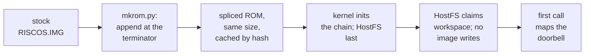

# 6. Into the ROM

Until 12 September, HostFS was loaded the way RISC OS loads most extensions: from the
SD card's boot sequence, after the machine had started. To boot *from* the share, that
cannot work. This chapter covers why, the two designs for getting the module into a
stock ROM, the one that was built, and what a module must give up to run from ROM.
That last part cost a day, and changed how every result is now tested.

## A filing system cannot load itself

The boot design puts the constraint first:

> Any scheme that loads the module from a filesystem in order to be that filesystem is
> a trap, and it fails late and confusingly rather than cleanly.

The boot filing system has to exist during the kernel's own module scan, before
anything looks for `!Boot`. That rules out loading HostFS from the card's start-up
sequence, and loading it with `*RMLoad` from anywhere. The third option, building a ROM
from the RISC OS sources, works, and it is what some emulator setups do. **It was ruled
out from the start**: the project runs the stock RISC OS Open ROM.

That leaves one route: put HostFS into the stock ROM image's list of modules, so the
kernel initialises it exactly as it initialises its own filing systems.

## The module chain

A RISC OS ROM holds its modules on a **chain**. It starts at a known place in the
kernel. Each module is preceded by a size word, which holds that module's length plus
the next size word, and a zero word ends the chain. The kernel walks it that way at
start-up, with no checksum and no bounds check.

That makes one operation easy: **append at the terminator**. The splicer's docstring
spells out why appending is also correct. Chain order is initialisation order, so a
module appended at the end initialises after every stock module, FileSwitch included,
which is what a filing system needs.


<!-- doccrate:keep-together:start -->

## Designed, and built

The boot design and the tool that was built differ on two points:

| | Designed | Built: `tools/mkrom.py` |
|:---|:---|:---|
| where | inside QEMU, spliced as the ROM loads, through a device property | a host-side tool, run by the launch scripts |
| image size | grown, with the header's size updated so the CMOS address moves with it | **not grown**: new modules go into the slack at the end |
| headroom | about 64 KiB assumed | 268 KiB of slack measured on the 5.31 image |

<!-- doccrate:keep-together:end -->


The design had mentioned a host-side tool only as an escape hatch. It became the
answer, and no in-QEMU injector exists.

### How the splice avoids growing the image

Between the chain's terminator and the footers at the end of the ROM, there is slack:
the credits text, then padding of `0xFF` bytes. The splicer writes the new modules over
the terminator, moves the credits forward by the same amount, and lets the padding
absorb the difference:

```python
insert = b''.join(struct.pack('<I', len(b) + 4) + b for _, b in bodies) \
    + struct.pack('<I', 0)
needed = len(insert) - 4          # net growth inside the slack
if needed > free:
    raise SystemExit(f'{needed} bytes needed, {free} of slack: '
                     'image would have to grow — not supported')

out = bytearray()
out += base[:term - 4]            # everything up to the old zero word
out += insert                     # our modules, then a new zero word
out += base[term:shift_end]       # credits, moved forward
out += b'\xFF' * (tail - len(out))  # padding absorbs the rest
out += base[tail:]                # footers, byte-for-byte, same place
assert len(out) == len(base), 'image size changed'
```

**No header field is touched.** The docstring gives the reasoning. The kernel finds the
footers from a constant fixed at build time, not from the image header. The HAL reads
the image size only to find the CMOS blob and to copy the ROM into RAM. So with the size
unchanged, everything that reads the image stays correct.

The docstring also records what growing the image would take, in case the slack ever
runs out. Both the image size and the *compressed* size in the header would need
updating, because the HAL copies by the compressed size, and the CMOS blob would need
re-placing. That is deliberately not implemented. The tool refuses instead.

A launch log shows the result: *chain 137 -> 139 modules … image size unchanged at
0x500000*. The launch scripts cache the spliced image under a hash of the stock ROM
and every module's contents, so editing a module rebuilds it and a relaunch does not.

## The first splice crashed, and not where expected

The plan for ROM safety looked simple. A module in ROM executes in place, from
read-only memory, so it must not write to its own image. So HostFS's variables moved
into one structure claimed from the RMA, the module area, with its address kept in the
module's private word. The plan also assumed the C compiler's module option would
handle the rest, and added a note: *verify this before trusting it*.


<!-- doccrate:keep-together:start -->

#### Three writes into the image

The first spliced boot died with *Abort on data transfer at &FC4BFC8C*. The design
record traced that address, and it was not in HostFS's code at all. It found three
separate ways the conventionally built module wrote into its own image, each read in
the source and confirmed in the binary (commit `bb79635c18`):

| Culprit | What it does at initialisation |
|:---|:---|
| **the linker's relocation code** | the `cmhg` header's init calls `__RelocCode`, which adds the load address to every absolute word in the module: 58 of them. The faulting PC was the `STR` in that routine |
| **the shared C library stubs** | initialising them writes branch instructions over the stub vectors, inside the image |
| **the C runtime** | stores its own block in the private word, which every `cmhg` veneer then loads from, so HostFS's plan to use that word would have broken every entry |

<!-- doccrate:keep-together:end -->


An earlier claim fell with it. Commit `cbee066699` had presented evidence that the
module was ROM-safe. That evidence came from a **soft-loaded** module, where the C
library copies the variables into the RMA anyway, so it proved nothing about ROM.

## The recipe that runs in place

The module is still built entirely with the RISC OS Open DDE, but in a way that writes
nothing into the image. The build script is short, and its comment names the rule:

```text
| No cmhg and no C:o.stubs.  cmhg's header imports __RelocCode, and the
| stubs patch their vectors in place: both write into the module image at
| initialisation, which from ROM is a data abort (see c.hostfs, s.head).
| o.relocs is decaof's list of relocations: it must hold only PC-relative
| ones, since an absolute address would be wrong wherever the module lands.
objasm -o o.head s.head
cc -c -zps1 -ffah -o o.hostfs c.hostfs
link -rmf -o HostFS,ffa o.head o.hostfs
decaof -r o.head o.hostfs { > o.relocs }
```

Step by step:

1. **`objasm` assembles `s.head`**: the module header, the entry veneers, a `swix`
   routine that calls any SWI, and the constant data C would otherwise reach through an
   absolute address — the filing-system information block and the error blocks, every
   word an offset.
2. **`cc -zps1` compiles the C** with no statics and no C library. That means no
   `printf` and no division, which the compiler turns into a library call. String
   literals are reached PC-relative.
3. **`link -rmf` links just those two objects.** The linker appends relocation code
   only to a module that imports it, and nothing does.
4. **`decaof -r` must show only PC-relative relocations.** At 2.00 there were 10 in the
   header and 19 in the C, all branches.

### Everything writable, in one structure

The C source makes the rule impossible to break by accident. There is no file-scope
pointer to the workspace, because that pointer would itself be a writable static.
Every handler receives the workspace from the private word, and every helper takes it
as an argument. Macros keep the old names readable, and **require a `ws` in scope**,
so code that was not given the workspace fails to compile:

```c
struct hostws {
    uint32_t w_freesave[8];             /* FreeEntry's registers, in s.head:
                                         * it must be first */
    volatile uint32_t *w_vmch;          /* doorbell, from OS_Memory 13 */
    struct vmreq *w_req;                /* page-aligned inside w_reqstore */
    uint32_t w_req_phys;                /* its physical address */
    ...
    uint8_t w_reqstore[sizeof(struct vmreq) + 4096];
};

#define WS_OF(pw)        (*(struct hostws **)(pw))

#define vmch             (ws->w_vmch)
#define req              (ws->w_req)
```

The structure is claimed with `OS_Module 6` — size in **R3**, the same register trap
the GVFill module met — and zeroed by hand, because the RMA is not guaranteed clean.


<!-- doccrate:keep-together:start -->

### Smaller, and verified

| Build | Image size |
|:---|---:|
| 1.01, `cmhg` and C library stubs | 12,260 bytes |
| version 1 streams, still with stubs | 12,644 bytes |
| **2.00, ROM-safe** | **7,632 bytes** |
| 2.01, every error named | 10,228 bytes |
| 2.02, paged and sorted listings | 10,300 bytes |

<!-- doccrate:keep-together:end -->


Verified on 12 September with a stock ROM spliced with 2.00, and nothing soft-loaded:
`*Modules` lists HostFS at `&FC4BCDA8`, a ROM address. Its 16,660-byte workspace is in
the RMA. `*Ex HostFS:` lists real types and dates, and a 256 KiB copy in and back out
is identical. The same image also soft-loads with `RMLoad` and passes the same tests.

One bug fell out on the way. `hostfs_final` rang the doorbell to close files even when
the doorbell had never been mapped, so killing an unused HostFS wrote near address
zero. The lazy mapping from chapter 2 turned out to be load-bearing too: initialisation
from the ROM chain runs even earlier than a soft-load.

## A new acceptance rule

The crash that `*Modules` could not see changed how every later result is judged. The
design now states it at the top of its remaining sprints:

> **A result counts only when it works from a spliced ROM with nothing soft-loaded.**
> `*Modules` showing a ROM address proves the module loaded onto the chain, not that it
> runs — a module can splice, list, and then abort on its first write.

A related warning is recorded about a parallel branch. `zcode/romloader`'s commit
`f5abc37686` converted the old module to run from ROM, but kept `cmhg` and the stubs,
kept a static workspace pointer, and passed the claim size in R2. The design record
says it should not be merged, because the relocation code would still abort before any
of it ran.


<!-- doccrate:keep-together:start -->

### From stock ROM to a running filing system



<!-- doccrate:keep-together:end -->


