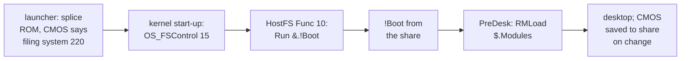

# 7. Booting from a directory

With HostFS in the ROM, the last step was to make it the disc the machine starts from.
The boot design describes the goal in one sentence:

> The card stops being the root of the world and becomes optional baggage.

This chapter walks through the pieces that achieved it on 13 September: the launch
scripts, the kernel's boot call, CMOS settings kept on the share, modules loaded from
it, and the tree of files that makes a share bootable. It also covers the traps found on
the way.


<!-- doccrate:keep-together:start -->

## The launch scripts

On the Mac, `tools/rom.zsh` is sourced by every launcher. Two environment variables
drive it:

| Variable | Effect |
|:---|:---|
| `RISCOS_HOSTFS=<dir>` | the share, **and** HostFS plus its icon-bar filer spliced into the ROM |
| `RISCOS_BOOT=hostfs` | a CMOS blob that configures HostFS as the boot filing system |

<!-- doccrate:keep-together:end -->


The splice logic puts the two HostFS modules ahead of any other modules requested, unless
a module with the same title was already named:

```zsh
if [[ -n "${RISCOS_HOSTFS:-}" ]]; then
    local list="${here:h}/hostfs/dde/HostFS,ffa ${here:h}/hostfs/filer/HostFSFiler,ffa"
    list="${RISCOS_HOSTFS_MODULES-$list}"
    hostfs_mods=(${=list})
    ...
    for hm in $hostfs_mods; do
        ...
        title="$(_rom_module_title "$hm")"
        (( ${titles[(Ie)$title]} )) || add+=("$hm")
    done
    mods=($add $mods)
fi
```

The design gives the reason for splicing whenever there is a share: no machine should
start with a share and no filing system to reach it. On Windows, `tools/rom.py` carries
the same logic for the `run.py` and farm launchers, as `--hostfs` and `--boot hostfs`.

### CMOS that says *boot from HostFS*

The boot filing system is a CMOS setting. So `RISCOS_BOOT=hostfs` builds a blob with
the CMOS tool from the QEMU walkthrough, setting filing system 220:

```zsh
[[ -e "$RISCOS_HOSTFS/CMOS,ff2" ]] && saved="$RISCOS_HOSTFS/CMOS,ff2"
...
base="${saved:-$CMOS}"
out="$images/cmos-hostfs.bin"
# Remade every launch: it is cheap, and the share may have changed.
# 220 is HostFS's filing system number (hostfs/dde/s.head).
python3 "$here/mkcmos.py" --symbols "$here/cmos-symbols-530.json" \
    --base "$base" --filesystem 220 -o "$out" 2>/dev/null || { ... }
if [[ -n "$saved" ]]; then
    print "cmos: from the share's ${saved:t}"
else
    cp "$out" "$RISCOS_HOSTFS/CMOS,ff2"
    print "cmos: FileSystem HostFS; the share now keeps it, as CMOS,ff2"
fi
```

If the share already holds a `CMOS,ff2` file, that is the starting point. Otherwise the
blob is seeded, and the share keeps a copy from then on.

## How the kernel boots a filing system

The design record confirmed the kernel's path in the RISC OS sources before building
anything:

1. At the end of start-up, unless Shift is held or the machine is set not to boot, the
   kernel calls `OS_FSControl 15`.
2. FileSwitch passes that to the **configured** filing system's `FSEntry_Func` reason 10.
3. That filing system performs its boot action.

FileCore's boot action, for boot option 2, runs `&.!Boot` — the `!Boot` application at
the root of the user's disc. HostFS does the same when the share has one:

```c
case 10:                           /* boot filing system */
    if (boot_option(ws) == 2) {
        _kernel_swi_regs cli;

        cli.r[0] = (int)"Run &.!Boot";
        return swix(XOS_CLI, &cli, &cli);
    }
    return NULL;
```

`boot_option` answers 2 when `$.!Boot` exists and 0 when it does not. There is no disc
record to hold any other value, so `*Opt 4` changes nothing. A share with no `!Boot`
quietly boots nothing, as option 0 would.

## A real disc on the icon bar

`HostFSFiler` 2.00 gives HostFS an icon on the icon bar, left of the discs, written on
the pattern of RISC OS's RAM filing system's filer and also run from the ROM. Clicking
it opens the share in a Filer window with every file's real icon. Its menu offers
*Free*, which opens RISC OS's free-space window on the host volume, reported through
the module's free-space entries: 954 GB, of which 544 GB free, on the machine that
measured it.

By mouse, a new directory, drag-copies both ways, *Info*, rename and delete were each
checked on the host.

## Modules on the share, not in the ROM

Only the filing system has to be in the ROM, because only the filing system has to load
itself. Every other module can be an ordinary soft-load from a disc that is already
there. So the decision recorded on 13 September is that **the ROM carries HostFS and its
filer, and nothing else**. Everything else lives in the share's `$.Modules` directory,
loaded before the desktop by one line in the boot sequence:

```text
| HostModules - load the modules kept on the HostFS share, before the desktop.
| HostFS itself is in the ROM, so the share is reachable by now; everything
| else lives in HostFS:$.Modules, where it is easy to add, update or remove.
| -Sort loads them in name order; -Continue keeps one that fails from
| stopping the rest (the first error is left in X$Error).
IfThere HostFS:$.Modules Then Repeat RMLoad HostFS:$.Modules -Type &FFA -Sort -Continue
```

Adding, updating or removing a module is copying a file on the host, with no ROM to
re-splice and no need to be ROM-safe.

The blitter module showed this is more than tidiness. Spliced into the ROM, GVFill never
sees a sprite plot, because something later in the boot claims the sprite vector in front
of it. Loaded from the share, it sees every plot. The
[graphics walkthrough](../GraphicsSoundWalkthrough/06-gvfill.md) has that story.

The loading line was tested against a failure. With a non-module named `Aardvark,ffa`
ahead of GVFill, GVFill still loaded, `X$Error` read *Illegal header field in module*, and
the desktop was unchanged.

## CMOS that persists

A real Pi keeps its CMOS settings in a file on the SD card. A module called SDCMOS saves
them there after every change, and unloads itself when there is no card. So a machine
booted from HostFS kept nothing: every `*Configure` was lost at power-off.

HostFS now does SDCMOS's job for the share (commit `509ab9d478`). After start-up, a
callback checks two things:

```c
r.r[0] = 161;                        /* OS_Byte 161: read CMOS */
r.r[1] = 5;                          /* FileLangCMOS: *Configure FileSystem */
if (swix(XOS_Byte, &r, &r) != NULL || r.r[2] != 220) {
    return;
}
r.r[0] = 23;                         /* OS_File 23: info with type */
r.r[1] = (int)"HostFS:$.CMOS";
if (swix(XOS_File, &r, &r) != NULL || r.r[0] != 1
    || (r.r[6] != 0xFF2 && r.r[6] != 0xFE4)) {
    return;
}
if (hostfs_cmos_hooks(pw, CMOS_BYTEV_CLAIM) == NULL) {
    ws->w_cmos_saving = 1;
}
```

Only if HostFS is the configured filing system **and** the share holds `$.CMOS` of a
configuration type does HostFS claim the CMOS write vector. It then runs `*SaveCMOS
HostFS:$.CMOS` after every CMOS write, writing the same 2,052-byte blob the HAL loads. A
share that is not the boot disc is never written to. The vector and callback addresses
come from `ADR` in the assembly header, because a function address taken in C would be an
absolute relocation.

Verified: `*Configure Delay 20` rewrote `CMOS,ff2` within a second. After power-off and
relaunch, `*Status Delay` said 20.

## Making a share bootable

A bootable share is a copy of a card's tree. The first was made by hand, inside a machine
with both the card and the share attached. Seven top-level directories — `!Boot`, `Apps`,
`Documents`, `Utilities`, `Printing`, `Public`, `Diversions` — were copied with `*Copy`:
**5,229 files, 320 MB, in 65 seconds**. One start-up file had to come out: it points at
the card's development tools and fails without the card.

The by-hand copy took a morning. Most of it went on not knowing that a recursive `*Copy`
had stopped five levels down, leaving the result 40% short while looking finished.
`tools/mktree.py` automates the sequence with the checking that was missing (commit
`624275c26c`). For each entry, it counts the entry on the card, copies it, counts what
landed on the host, and descends a level wherever the two disagree. That isolates the one
entry that will not copy instead of losing it and everything after it.

The tool records two rules learned the hard way:

- **Never count a HostFS directory from the guest.** At the time, a listing stopped at 63
  entries, so a complete 762-file directory counted as 364. The card is counted over
  SDFS, and the host by walking its own file system. Version 2.02 has since removed the
  limit.
- **Never trust the absence of an error.** Two name failures on NTFS raise nothing at all
  (chapter 5). Only counting files catches them.


<!-- doccrate:keep-together:start -->

## Traps worth knowing

| Trap | What happens | The answer |
|:---|:---|:---|
| **a card shadows the ROM** | a card's start-up file loads its own HostFS 1.01 unconditionally, and `RMLoad` replaces the ROM's 2.00 | make that line `RMEnsure HostFS 2.00`; the shared card images still need the change |
| **a snapshot decides its own ROM** | `-loadvm` restores RAM, and the ROM lives in RAM, so a machine saved without HostFS in ROM comes back without it | the Windows launcher refuses a HostFS boot with a snapshot |
| **pull, then rebuild** | a 2.00 module on an emulator binary older than the naming work answers `*Cat HostFS:` with *bad path*, which looks like a guest fault | rebuild the emulator, not just the module |

<!-- doccrate:keep-together:end -->


<!-- doccrate:keep-together:start -->

### The boot, end to end



<!-- doccrate:keep-together:end -->


With no card attached, a machine booted this way reached a clean desktop — the Raspberry
Pi backdrop, and the pinboard's NetSurf and StrongED, all from the share — in 13.5 to 14.3
seconds after launch. `Boot$Dir` is on HostFS, the scrap directory is on the share, and
the boot's own modules load from it. On the Windows test farm, an instance booted with no
card reached the desktop in 33 seconds, with the C compiler working from the share.
