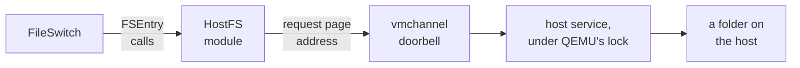

# HostFS: a host directory as a RISC OS disc

**How the RISC OS Pi 4 emulator gained a filing system whose files are ordinary
files in a folder on the Mac or the PC — and how that folder became the disc the
machine boots from, with no SD card at all.**

HostFS is three pieces working together. A RISC OS module registers a filing
system with FileSwitch. A new QEMU device, `vmchannel`, acts as a doorbell. And a
host service inside that device does the real work against a directory. The rule
that shaped every decision is written at the top of its design:

> Do as much work in the host as possible, and as little in the guest as possible.

Three days of work took HostFS from a first file transfer to a filing system in the
ROM that boots the desktop from a folder. This document follows that path, and
records where it went wrong along the way.

<!-- doccrate:keep-together:start -->

## These documents

| Chapter | What it covers |
|:---|:---|
| [1. Why a host filing system](01-why.md) | the network and USB-stick routes, and the shape chosen |
| [2. The doorbell](02-doorbell.md) | the vmchannel device, its request block, and where it lives |
| [3. Speaking FileSwitch](03-fileswitch.md) | a filing system that finally streams, and one data path |
| [4. Reaching guest memory](04-guest-memory.md) | the host walks the MMU; the 252-byte mystery |

<!-- doccrate:keep-together:end -->

<!-- doccrate:keep-together:start -->

#### These documents, continued

| Chapter | What it covers |
|:---|:---|
| [5. Names, types and dates](05-names.md) | `,xxx` suffixes, a generated type table, character sets, time |
| [6. Into the ROM](06-rom.md) | why a filing system cannot load itself, and splicing a stock ROM |
| [7. Booting from a directory](07-boot.md) | boot, CMOS on the share, modules on the share |
| [8. Measured, limited, unfinished](08-measured.md) | SD card against HostFS, the open list, the risks |

<!-- doccrate:keep-together:end -->

<!-- doccrate:keep-together:start -->

## At a glance

| | |
|:---|:---|
| **Filing system** | HostFS, number 220, registered with FileSwitch |
| **Transport** | `vmchannel`: a synchronous MMIO doorbell; one crossing per operation |
| **Module** | 2.02, 10,300 bytes, runs from ROM or soft-loaded |
| **Boot** | a stock ROM spliced with HostFS; `!Boot` and CMOS on the share |
| **Measured** | boot 14.4 s against 15.7 s from the card; 2,657 doorbells against 2.4 M register accesses |
| **Code** | `hw/misc/vmchannel.c`, `riscos-pi4/hostfs/dde`, `riscos-pi4/tools/mkrom.py` |

<!-- doccrate:keep-together:end -->

<!-- doccrate:keep-together:start -->

### Three layers

<!-- doccrate:keep-together:end -->

This document describes the fork as published at `e7e6deffae`, 13 September 2026.
The [QEMU A72 walkthrough](../QemuA72Walkthrough/index.md) covers the emulated
machine, and the [fake it in software walkthrough](../FakeItInSoftwareWalkthrough/index.md)
covers the design principle behind the doorbell.
