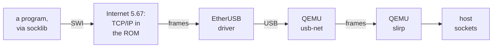

# 1. The network the guest used to have

Before HostNet, the emulated machine did its networking exactly as a Raspberry Pi 4
running RISC OS does, only with an emulated network card. This chapter describes
that path, the socket interface RISC OS programs use, and the measurements that
showed where it failed. Nothing here criticises the RISC OS stack itself. Above the
link layer it worked; the trouble was everything below it.


<!-- doccrate:keep-together:start -->

## The old path



<!-- doccrate:keep-together:end -->


Every box in that chain is someone else's working code, which is why the diagram
outlines them all in grey. A program built with the TCP/IP libraries makes a socket
call. The ROM's Internet module turns it into TCP and IP packets and Ethernet frames.
The EtherUSB driver sends those frames over USB to QEMU's emulated USB network
device, `usb-net`. QEMU's user-mode network, slirp, then unwraps the frames and makes
host socket calls to carry the data onwards.


<!-- doccrate:keep-together:start -->

### The modules in the ROM

Numbered by position in the 5.30 ROM, which is how a CMOS setting unplugs them:

| Chain | Module | Role in the old path |
|:---|:---|:---|
| 97 | MbufManager | the memory buffers the stack and drivers share |
| 98 | Internet 5.67 | the TCP/IP stack; provides the socket SWIs |
| 99 | Resolver | name lookups, over UDP sockets |
| 106 | EtherGENET | the Pi 4's own Ethernet driver; already unplugged, as no MAC is modelled |
| 107 | EtherUSB | the driver actually used, for the emulated USB card |
| 108 | DHCP | the address-configuration client |

<!-- doccrate:keep-together:end -->


<!-- doccrate:keep-together:start -->

### The emulated network

The launchers attached the card with `-netdev user` and `-device usb-net`, on port 3
of the emulated USB hub. slirp's network is fixed:

| Address | What it is |
|:---|:---|
| 10.0.2.0/24 | the whole network |
| 10.0.2.15 | the guest |
| 10.0.2.2 | the host, which is also the gateway |
| 10.0.2.3 | slirp's DNS forwarder, reachable only from inside slirp |

<!-- doccrate:keep-together:end -->


## The socket interface, as RISC OS programs see it

RISC OS programs do not call a socket library in the operating system. They are
built against the TCP/IP libraries, whose `socklib` turns each C call into a SWI in
the Internet module's chunk, starting at &41200: `Socket_Creat`, `Socket_Connect`,
`Socket_Recv` and so on.


<!-- doccrate:keep-together:start -->

#### Three facts that shaped HostNet

| Fact | What it means |
|:---|:---|
| **the registers are the C arguments** | the Internet module treats the register block as the BSD call's arguments; the result comes back in R0 |
| **an error is a number** | V set, with an error block numbered &20E00 plus the errno; `socklib` subtracts &20E00 and ignores the text |
| **there are two ABI generations** | six SWIs have an Internet 4 form, with a 16-bit family field in the address, and a 4.4BSD `_1` form; both are still used |

<!-- doccrate:keep-together:end -->


A module that copied R0 to R7 somewhere, had the call made, and put the result back in
R0 would therefore serve every existing program without the program knowing. That is
the idea chapter 2 builds on.

## What failed, measured

The Sprint 0 commit, `23fc9630c5`, gives the reason for the whole project in one
paragraph: measured over twelve boots, the stack above the link layer was fine, and
the link layer was not. Its conclusion is short: "The host has a network stack
already."


<!-- doccrate:keep-together:start -->

### What failed

| Finding | Number | Source |
|:---|:---|:---|
| DHCP obtained an address | 0 in 12 boots; the exchange itself took 2.5 s | `23fc9630c5` |
| USB packets | full speed only, 64-byte bulk packets, one 2 KB buffer | `dev-network.c` |
| one 1500-byte frame | 24 USB bulk transactions | `23fc9630c5` |

<!-- doccrate:keep-together:end -->


<!-- doccrate:keep-together:start -->

#### What was fixed, and what worked

| Finding | Number | Source |
|:---|:---|:---|
| failed USB control requests per boot | 6, then none | `75980f8cf8` |
| desktop time, DHCP against a static address | 49 s against 28 s | `d0de1c013c` |
| above the link layer | ARP, TLS and six parallel HTTPS connections worked | `23fc9630c5` |

<!-- doccrate:keep-together:end -->


<!-- doccrate:keep-together:start -->

### The link layer, in the source

The card's descriptors explain the 24 transactions: 64-byte bulk packets, a
full-speed descriptor only, and one 2 KB receive buffer, so a 1500-byte frame is 24
packets, each its own transaction, with no pipelining. From QEMU's
`hw/usb/dev-network.c`:

```c
                .bEndpointAddress      = USB_DIR_IN | 0x02,
                .bmAttributes          = USB_ENDPOINT_XFER_BULK,
                .wMaxPacketSize        = 0x40,
    ...
    .full = &desc_device_net,
    ...
    unsigned int in_ptr, in_len;
    uint8_t in_buf[2048];
    ...
    /* Only accept packet if input buffer is empty */
    if (s->in_len > 0) {
        return 0;
    }
```

<!-- doccrate:keep-together:end -->


<!-- doccrate:keep-together:start -->

## Two fixes that came first

Two commits earlier on 14 September tried to make the old path behave. Name lookups
still failed intermittently afterwards: when Sprint 2 was measured, NetSurf on the
old stack could not resolve a host name at all. What the two commits found made
HostNet the next step:

| Commit | What it changed | What it found |
|:---|:---|:---|
| `75980f8cf8` | `usb-net` answers the endpoint status requests EtherUSB makes, six per boot; slirp gains a domain name | DHCP still fails: slirp answers within the millisecond, and the guest discards the offer and falls back to a link-local address |
| `d0de1c013c` | the release disc sets the address, gateway and OpenDNS name servers directly | the desktop in 28 seconds instead of 49, with no DHCP on the wire |

<!-- doccrate:keep-together:end -->


