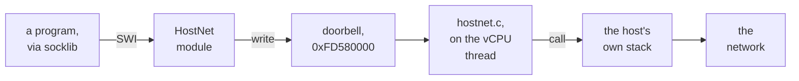

# 2. Where to cut

Taking networking out of the guest means choosing a boundary: everything above it
stays in RISC OS, and everything below it moves to the host. This chapter explains
why the boundary is the socket SWIs, lists the contract the guest module had to keep,
and follows the plan through the four sprints that landed on 14 September, including
what changed on the way.

## Three places to cut

<!-- doccrate:keep-together:start -->

### The candidates

| Cut at | What moves to the host | Why not, or why |
|:---|:---|:---|
| the link layer: a better emulated card | only the card | the guest still runs DHCP, ARP and IP over an emulated device, which is where the failures were |
| the library: a new `socklib` | the socket calls of programs rebuilt against it | every existing program would need rebuilding, and most cannot be |
| **the socket SWIs** | **everything below the program** | **every prebuilt program works unchanged, because the SWIs are the interface they already use** |

<!-- doccrate:keep-together:end -->

The SWI level wins because of the interface facts in chapter 1. Each socket SWI's
registers are the BSD call's arguments, and its result is R0 or an error numbered
from &20E00. A module that forwards R0 to R7 and returns R0 needs no knowledge of
what any call means. The guest module's own header comment says that this contract
"is why this module can be this small".

<!-- doccrate:keep-together:start -->

### The path after the cut

<!-- doccrate:keep-together:end -->

Compared with the old path, the Internet module, EtherUSB, DHCP, the emulated card
and slirp have all gone from the route a socket call takes. Resolver stays: it does
name lookups over UDP sockets, which HostNet now serves. TLS stays in the guest too.
The Sprint 2 commit says it this way: "HostNet carries bytes, not certificates."

## The contract

The module is small, but it has to satisfy everything on the disc that expects the
Internet module. Each line of this contract is recorded in the code or in a sprint
commit:

<!-- doccrate:keep-together:start -->

#### What the module promises

| Promise | Why |
|:---|:---|
| **Title `Internet`, version 6.00** | the boot sequence is full of `RMEnsure Internet 5.40` and `RMEnsure Internet 5.02`; 6.00 satisfies them all without an edit |
| **SWI chunk &41200, the same 35 SWIs in the same order** | programs call SWIs by number; the list is generated from one file so the order cannot drift |
| **The host never blocks** | the doorbell is answered inside the guest CPU's memory write, holding QEMU's global lock |
| **Resolver and TLS stay in the guest** | both already work over sockets, so they need nothing from the host but sockets |

<!-- doccrate:keep-together:end -->

<!-- doccrate:keep-together:start -->

#### What the module promises, continued

| Promise | Why |
|:---|:---|
| **The transport copies HostFS's** | a 64-byte header with R0 to R7 and guest logical addresses, reached by the same MMU walk; its own device, state and sequence numbers |
| **IPv4 only** | `AF_INET6` answers `EAFNOSUPPORT`; IPv6 is in no sprint |
| **Snapshots drop sockets** | a host socket cannot be saved in an image, so a restored machine's descriptors answer `EBADF` |
| **The guest is an application to the host** | its sockets are the host user's own sockets |

<!-- doccrate:keep-together:end -->

The name is the unusual part. Claiming another module's title and SWI chunk is
normally a mistake. Here it is the plan: the ROM's own Internet 5.67 is either
unplugged in CMOS or killed as HostNet loads, and every `RMEnsure Internet` check on
the disc sees a newer stack and proceeds. Chapter 7 shows why the same choice makes
it essential that the module refuses to load where there is no doorbell.

## Six sprints, four landed

The work was planned as six sprints. The first four each have a public commit, and
each commit message gives the test that closed it:

<!-- doccrate:keep-together:start -->

### The sprints

| Sprint | Goal | Status at `d535505fad` |
|:---|:---|:---|
| 0 | the transport; every call "not supported" | `23fc9630c5`, 19:09 |
| 1 | UDP, and a name resolved over it | `0f73da70af`, 19:52 |
| 2 | TCP, and NetSurf on the real web | `89013ef0f2`, 20:28 |
| 3 | listeners, message calls, event reasons | `5b882f2a4a`, 20:40 |
| 4 | shipping in every launcher | Windows done differently; Mac uncommitted |
| 5, 6 | hardening; host-side name lookup | not started |

<!-- doccrate:keep-together:end -->

The times are author timestamps on 14 September. The four sprint commits were
committed together at 20:45, and the plan they follow was written at 18:27 the same
day. The timestamps say when each step was recorded, not how much work each took.

<!-- doccrate:keep-together:start -->

### After the sprints

| Commit | When | What it changed |
|:---|:---|:---|
| `50ef1a1bcd` | 14 Sep, 20:50 | switched off, the whole doorbell window reads zero and ignores writes |
| `3c523600ea` | 14 Sep, 20:57 | the module refuses to load where there is no doorbell |
| `20bf267db5` | 15 Sep, 00:41 | the device builds on macOS |
| `e8bdae8d8d` | 15 Sep, 04:46 | the Windows release's switch: where the module file sits |

<!-- doccrate:keep-together:end -->

## What changed as it landed

A plan written before any code meets the code. The sprint commits record where the
two differed, and each difference is a small lesson about RISC OS or QEMU:

<!-- doccrate:keep-together:start -->

#### Plan against landed

| The plan said | What landed, and why |
|:---|:---|
| 36 socket SWIs | **35**, the number in the Internet module's own SWI table |
| unplug MbufManager with the rest | **MbufManager stays**: `!Internet`'s start-up would try to load a 26-bit copy from the disc, fail, and stop before the name servers were set |
| find the doorbell at its address | **map it with OS_Memory 13**: the physical address passes `OS_ValidateAddress`, and loading still takes a data abort |
| a plain request block | **`volatile`**: an optimised build folded the read of the result back to the value written a line earlier |

<!-- doccrate:keep-together:end -->

<!-- doccrate:keep-together:start -->

#### Plan against landed, continued

| The plan said | What landed, and why |
|:---|:---|
| would-block as an internal `EWOULDBLOCK` | **an explicit `HN_RC_RETRY` answer**: `EWOULDBLOCK` is kept for sockets the program set non-blocking |
| asynchronous notification in Sprint 3 | **pulled into Sprint 1**: Resolver sets `FIOASYNC` on its socket and then waits only for the event |
| readability by peeking one byte | **`poll()`, and `WSAPoll()` on Windows, from Sprint 2**: a connect finishing shows as writability |
| events on "became readable" | **events on "the reason changed"**: a socket with data that then breaks stays readable throughout |

<!-- doccrate:keep-together:end -->

<!-- doccrate:keep-together:start -->

#### Plan against landed, continued again

| The plan said | What landed, and why |
|:---|:---|
| a test module for Sprint 3 | **two BBC BASIC programs**: BASIC is the only language on a machine with no toolchain |
| splice HostNet into every ROM | **the Windows release loads it from the disc**: no ROM rebuild on a machine without Python |
| a module that loads and stays dormant without a host | **a module that declines to load**: dormant, it would shadow a real Internet module |
| a device that answers its magic number when off | **a window that reads zero when off**: EtherGENET reads offset 0 as a revision number |

<!-- doccrate:keep-together:end -->

The following chapters walk through each of these where it lives in the code.

<!-- doccrate:keep-together:start -->

## How the code grew

Lines in each file at each commit:

| Commit | Host `hostnet.c` | `hostnet.h` | Guest `hostnet.c` | `hostnet_entries.s` |
|:---|:---|:---|:---|:---|
| `23fc9630c5`, Sprint 0 | 250 | 118 | 329 | — |
| `0f73da70af`, Sprint 1 | 844 | 181 | 671 | 42 |
| `89013ef0f2`, Sprint 2 | 1,340 | 192 | 698 | 42 |
| `5b882f2a4a`, Sprint 3 | 1,578 | 214 | 730 | 42 |
| `d535505fad`, as published | 1,613 | 218 | 750 | 42 |

<!-- doccrate:keep-together:end -->

The guest module barely grew after Sprint 1, while the host device grew by about 770
lines. That is the design working as intended: each new socket verb is host code, and
the guest's part, copying registers, waiting and raising events, was essentially
complete once Sprint 1 had added the events.
