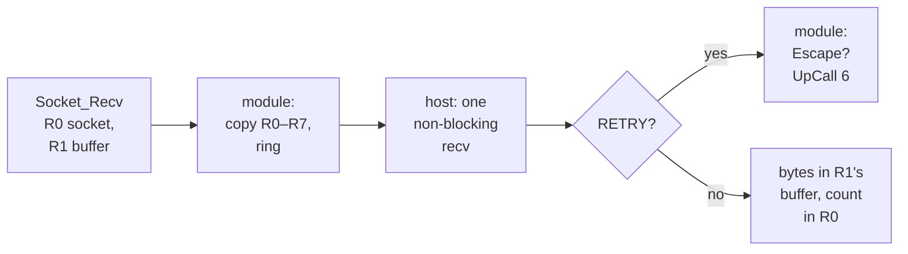

# 4. Never blocking the host

A socket call that waits, for data, a connection or a peer, is ordinary in any
program. For HostNet it is the central difficulty, because the host answers from a
place where it must not wait at all. This chapter explains that rule, then walks
through how the host reaches the program's buffers, the retry answer that moves all
waiting into the guest, the connect state machine, readiness on POSIX and on
Windows, and `Select`, which is split between the two.


<!-- doccrate:keep-together:start -->

## The rule

The comment at the top of `hw/misc/hostnet.c` states it:

```c
/*
 ...
 * Why the host must never block here: this runs synchronously inside the
 * vCPU's MMIO write, under the BQL.  A blocking recvfrom() would freeze
 * the display, the monitor and the machine.  So every host socket is
 * non-blocking, and an operation that would block on a socket the guest
 * believes is blocking comes back as HN_RC_RETRY — the guest spins its
 * own wait loop, which is exactly what it does today (tsleep() in the
 * Internet module's lib/c/unixenv spins on UpCall 6 and Portable_Idle:
 * there is no scheduler to sleep on).
 */
```

<!-- doccrate:keep-together:end -->


The doorbell handler runs on the thread of the guest CPU that wrote to the register,
while that CPU is stopped in the middle of the write. It also holds QEMU's big lock,
which the display, the monitor and every other device need. A host call that blocked
for a second would stop the whole emulator for a second.

The last sentence of the comment is the key to the solution. RISC OS has no
scheduler to put a waiting caller to sleep on. The Internet module's own blocking
calls wait by looping: they offer the machine to anyone who can use it and check
again. HostNet keeps that loop, and only moves the check to the host.


<!-- doccrate:keep-together:start -->

## Reaching the program's buffers

A socket call's registers hold pointers into the calling program's memory: the data
to send, the buffer to receive into, the address structure. The host reads and writes
them with `vmch_guest_rw`, a function exported from the HostFS device. Its contract,
in `include/hw/misc/vmchannel.h`:

```c
/*
 * Read or write guest memory by its *logical* address, walking the
 * guest MMU a page at a time.  Exported because HostNet (hw/misc/
 * hostnet.c) needs exactly this and for exactly the same reason: the
 * addresses in a request block are the ones the application passed,
 * so a socket buffer is read where it lies.  It will not fault a page
 * in — an address not mapped right now fails rather than being
 * invented.  Call only from a doorbell handler, where current_cpu is
 * the vCPU that rang and the BQL is held.
 */
bool vmch_guest_rw(uint64_t addr, void *buf, uint32_t len, bool is_write);
```

<!-- doccrate:keep-together:end -->


The walk translates one page at a time and copies through QEMU's physical memory
map. The [HostFS walkthrough](../HostFSWalkthrough/04-guest-memory.md) covers how it
works and why it will not fault a page in. For HostNet it means there is no copy in
the guest: the module passes the program's own pointers, and the host reads the data
where the program left it. On the host, a send copies the data into a temporary
buffer of at most 1 MiB before calling `send`, and a receive copies out of one.


<!-- doccrate:keep-together:start -->

## Always non-blocking underneath

Every host socket is switched to non-blocking mode the moment it is created or
accepted. The two platforms do it differently:

```c
static void hn_set_nonblock(int fd)
{
#ifdef _WIN32
    unsigned long one = 1;
    ioctlsocket(fd, FIONBIO, &one);
#else
    int fl = fcntl(fd, F_GETFL);
    if (fl >= 0) {
        fcntl(fd, F_SETFL, fl | O_NONBLOCK);
    }
#endif
}
```

<!-- doccrate:keep-together:end -->


On Windows `ioctlsocket` is one of the calls QEMU wraps, so it accepts the C runtime
descriptor that QEMU's socket functions hand out. The comment above the function
notes that failure is not checked, because a caller could do nothing useful with a
blocking socket anyway.

What the *program* asked for is recorded separately. `Socket_Ioctl` with `FIONBIO`
changes nothing on the host; it sets `nonblock[]` for that descriptor, and that flag
decides what a would-block means.


<!-- doccrate:keep-together:start -->

## The retry answer

When a host call reports that it would block, the verb calls `hn_wouldblock`:

```c
static void hn_wouldblock(HostNetState *s, HNReply *r, uint32_t id)
{
    if (id < HN_MAX_SOCKETS && !s->nonblock[id]) {
        r->rc = HN_RC_RETRY;
        return;
    }
    hn_errset(r, ROS_EWOULDBLOCK);
}
```

<!-- doccrate:keep-together:end -->


A program that set its socket non-blocking gets `EWOULDBLOCK`, exactly as it would
from the Internet module, and deals with it itself. A program that left its socket
blocking expects the call not to return until it can complete. For that program the
host answers `HN_RC_RETRY`, which is not an answer at all: it tells the module to
wait and ring again. The header's comment on the code says where that leaves RISC
OS's blocking semantics: "That is where RISC OS's blocking semantics actually live."


<!-- doccrate:keep-together:start -->

### One blocking `Socket_Recv`, round trip



<!-- doccrate:keep-together:end -->


The loop from "wait" back to "ring" is the module's `hn_wait_ring`, shown in chapter
7. Each turn checks for Escape, which ends the wait with `EINTR`, and makes
`OS_UpCall 6`, which lets a TaskWindow run other tasks while this one waits. Outside
a TaskWindow nothing takes up the offer, so the loop spins. As the module's comment
says, that "is what a blocking RISC OS SWI has always been".

The Sprint 3 test shows the loop working. `listen.bas` makes a blocking
`Socket_Accept_1` and waits for the host to connect. The trace shows seven
`HN_RC_RETRY` answers, then the accepted connection.


<!-- doccrate:keep-together:start -->

## Connect, without connecting twice

A non-blocking `connect` normally returns at once with "in progress", and the
connection completes later. The obvious retry, calling `connect` again, only reports
"already in progress" and says nothing about whether the connection worked. So
`hn_connect` remembers that a connection is in flight and, on the next call, asks
instead:

```c
    if (s->connecting[R[0]]) {
        int err = 0;
        socklen_t el = sizeof(err);

        if (!(hn_ready(fd, HN_W) & (HN_W | HN_X))) {
            hn_wouldblock(s, r, R[0]);       /* still on its way */
            return;
        }
        s->connecting[R[0]] = false;
        if (getsockopt(fd, SOL_SOCKET, SO_ERROR, (char *)&err, &el) < 0) {
            hn_fail(r);
            return;
        }
        if (err) {
            errno = err;
            hn_fail(r);
            return;
        }
        hn_ok(r, 0);
        return;
    }
```

<!-- doccrate:keep-together:end -->


<!-- doccrate:keep-together:start -->

### The connect state machine

| Call | Host state | What the guest gets |
|:---|:---|:---|
| first | `connect` says in progress; `connecting` set | `EINPROGRESS` if non-blocking, `HN_RC_RETRY` if blocking |
| later, not yet writable | still connecting | `EWOULDBLOCK` if non-blocking, `HN_RC_RETRY` if blocking |
| later, writable or failed | `connecting` cleared; `SO_ERROR` read | success, or the connection's error translated to a RISC OS errno |

<!-- doccrate:keep-together:end -->


A socket becomes writable when its connection completes, and reports an error
condition when it fails, which is why the test is for either.


<!-- doccrate:keep-together:start -->

## Readiness, on two platforms

Both `connect` and `Select` need to ask whether a socket is ready without waiting.
Sprint 1 answered "is it readable?" by peeking one byte with `recv`. That needed no
special handling on Windows, but it cannot answer "is it writable?", and Sprint 2
needed that for `connect`. The answer since then is `poll`, or `WSAPoll` on Windows:

```c
static short hn_revents(int fd, short ev)
{
#ifdef _WIN32
    WSAPOLLFD p;

    p.fd = (SOCKET)_get_osfhandle(fd);
    p.events = ev;
    p.revents = 0;
    if (p.fd == (SOCKET)INVALID_HANDLE_VALUE || WSAPoll(&p, 1, 0) <= 0) {
        return 0;
    }
    return p.revents;
#else
    struct pollfd p;

    p.fd = fd;
    p.events = ev;
    p.revents = 0;
    if (poll(&p, 1, 0) <= 0) {
        return 0;
    }
    return p.revents;
#endif
}
```

<!-- doccrate:keep-together:end -->


On Windows, QEMU's socket functions return C runtime file descriptors, each made from
a Windows `SOCKET` with `_open_osfhandle`. `WSAPoll` wants the `SOCKET` itself, so
`_get_osfhandle` recovers it. The timeout is zero on both platforms: the question is
always "now?", never "when?".

`hn_ready` turns the raw answer into what `Select` may report. Its comment explains
one deliberate choice: an error or hang-up counts as *readable* as well as
exceptional, so that a program waiting to read from a connection that has died wakes
up and gets the error from the read, rather than waiting for ever.


<!-- doccrate:keep-together:start -->

## `Select`, split in two

`Socket_Select` takes three descriptor sets and a timeout. The host cannot wait out
the timeout, so the call is split. The host's half makes one pass over the sets:

```c
    /*
     * Only written back when something is ready.  A zero answer leaves the
     * caller's input sets untouched, which is what lets the module ask
     * again without rebuilding them — and the module has to ask again,
     * because the timeout is the caller's and the host cannot wait.
     */
    if (count) {
        for (k = 0; k < 3; k++) {
            if (R[1 + k]) {
                vmch_guest_rw(R[1 + k], out[k], HN_FDSET_BYTES, true);
            }
        }
    }
    hn_ok(r, (int32_t)count);
```

<!-- doccrate:keep-together:end -->


Before that point, the function reads each 32-byte set from guest memory, answers
`EBADF` for a bit set on a closed descriptor, and counts one for each ready bit, as
BSD does.

The module's half, `hn_select`, owns the timeout. It computes a deadline from the
program's `timeval` using `OS_ReadMonotonicTime`, then loops: ring the host once;
return if the count is non-zero; return 0 if the deadline has passed; check Escape;
offer the machine with `OS_UpCall 6`; ring again. The deadline test is a signed
comparison, so a wrap of the centisecond counter cannot turn a short wait into a
very long one.


<!-- doccrate:keep-together:start -->

### Who does what in `Select`

| Part | Host, `hn_select` in `hostnet.c` | Guest module, `hn_select` |
|:---|:---|:---|
| **the descriptor sets** | read once per ring; written back only when something is ready | passed through untouched |
| **the timeout** | never seen | a deadline in centiseconds, checked each turn |
| **waiting** | never | the loop, with Escape and `OS_UpCall 6` |
| **the result** | the count of ready bits | R0: the count, or 0 at the deadline |

<!-- doccrate:keep-together:end -->

