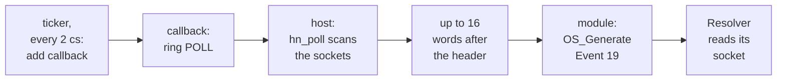

# 6. Internet Event 19 without an interrupt

Some RISC OS programs never ask whether a socket has data. They ask to be told, by
Internet Event 19, and then wait. The Internet module raised that event from its own
receive path. HostNet has no receive path in the guest, and the host device has no
interrupt and no way to call into the guest. This chapter shows how the module asks
instead, fifty times a second: a ticker, a callback, a doorbell command called
`POLL`, and an event for each socket that woke. It ends with the Sprint 3 change
from "became readable" to "the reason changed", and the test that proves it.


<!-- doccrate:keep-together:start -->

## Why events are not optional

The comment above the module's event code gives the reason, and it is a real
program, not a hypothetical one:

```c
/*
 * Internet Event 19 is how a RISC OS program finds out that a socket has
 * woken.  The Internet module raised it from its own receive path; there
 * is no receive path here, and the host cannot call into the guest, so the
 * module asks on a ticker and raises the events itself.
 *
 * This is not a nicety.  The stock Resolver sets FIOASYNC, sends its
 * query, and then does nothing at all until an event arrives — it never
 * polls and never reads.  Without this, DNS queries go out, answers come
 * back to the host, and the guest never asks for them.
 */
```

<!-- doccrate:keep-together:end -->


That is why events, planned for Sprint 3, were built in Sprint 1. Sprint 1's test was
a name lookup through the stock Resolver, and it could not pass without them.


<!-- doccrate:keep-together:start -->

## The chain, once per tick



<!-- doccrate:keep-together:end -->


Each step runs in a different context, and that is the reason for the chain's shape.
A ticker routine runs with interrupts disabled and very little of the operating
system available, so it does the one thing that is safe there: it adds a callback. A
callback runs later, when the operating system is in a normal state, so it can ring
the doorbell and raise events. The veneer comments in `hostnet_entries.s` note that
this is the same shape the Internet module uses for its own deferred work.


<!-- doccrate:keep-together:start -->

## The ticker and the callback

`hostnet_init` registers the ticker with `OS_CallEvery`, every 2 centiseconds. The
C code it reaches does almost nothing:

```c
void hostnet_c_tick(void)
{
    tick_count++;
    if (!live || cb_pending) {
        return;
    }
    cb_pending = 1;
    os_add_callback((uint32_t)hostnet_callback, static_base());
}
```

<!-- doccrate:keep-together:end -->


<!-- doccrate:keep-together:start -->

#### The callback

The callback asks the host, and raises one event for each socket in the answer:

```c
void hostnet_c_callback(void)
{
    uint32_t i, n;

    cb_pending = 0;
    cb_count++;
    if (!live) {
        return;
    }
    ...
    pollreq[H_CMD] = HN_CMD_POLL;
    pollreq[H_SEQ] = ++seq;
    pollreq[H_RC] = 0xFFFFFFFFu;
    hn_reg(HN_CMD / 4) = (uint32_t)pollreq;
    if (pollreq[H_RC] != HN_RC_OK) {
        return;
    }
    n = pollreq[H_RESULT];
    if (n > HN_POLL_MAX) {
        n = HN_POLL_MAX;
    }
    for (i = 0; i < n; i++) {
        uint32_t w = pollreq[H_WORDS + i];
        ...
        os_generate_event(19, (w >> 8) & 0xFFu, w & 0xFFu, w >> 16);
        event_count++;
    }
}
```

<!-- doccrate:keep-together:end -->


Clearing `cb_pending` first lets the next tick queue another callback, and the elided
loop zeroes the header. The callback uses its own request block, `pollreq`, not the
one the SWIs use. The comment explains
why: "a callback can land between a SWI writing the doorbell and
reading its answer, and sharing the block would let one overwrite the other."


<!-- doccrate:keep-together:start -->

### Two veneers, and a wrong SWI number

The ticker and the callback are entered with R12 holding the value passed when they
were registered. The module is built position-independent for its data, so its C
code finds its variables through R9. The module passes its static base as the R12
value, and a two-instruction veneer in `hostnet_entries.s` moves it into R9:

```asm
hostnet_tick:
    stmfd   sp!, {r0-r3, r9, lr}
    mov     r9, r12                 @ static base, as passed to OS_CallEvery
    bl      hostnet_c_tick
    ldmfd   sp!, {r0-r3, r9, lr}
    mov     pc, lr
```

<!-- doccrate:keep-together:end -->


The first version of Sprint 1 registered no ticker at all, and said nothing about
it. `OS_CallEvery` is SWI &3C; the code called &3D, which is
`OS_RemoveTickerEvent`, and removing a ticker that was never added succeeds silently.
The commit credits the new trace and `*HostNetInfo`'s counters with finding it. From
the host's side, "the guest never asked" and "the guest asked and there was nothing"
look the same, and a tick counter is what tells them apart. The Sprint 2 commit adds that
every SWI number in the module was then checked against the kernel's own table.


<!-- doccrate:keep-together:start -->

## The host's answer

`hn_poll` scans every slot. It looks only at sockets whose program asked for
`FIOASYNC`, and for each one it decides a *reason*:

```c
        if (s->fds[i] < 0 || !s->async[i]) {
            s->woke[i] = 0;
            continue;
        }
        re = hn_revents(s->fds[i], POLLRDNORM);
        now = (re & (POLLRDNORM | POLLPRI | POLLERR | POLLHUP)) != 0;
        ...
        if (re & (POLLERR | POLLHUP)) {
            reason = HN_EV_BROKEN;
        } else if (re & POLLPRI) {
            reason = HN_EV_URGENT;
        } else {
            reason = HN_EV_ASYNC;
        }

        if (!now) {
            reason = 0;
        }
        if (reason && reason != s->woke[i] && n < HN_POLL_MAX) {
            ...
            list[n++] = (port << 16) | (reason << 8) | (uint32_t)i;
        }
        s->woke[i] = (uint8_t)reason;
```

<!-- doccrate:keep-together:end -->


The elided lines explain the precedence and look up the socket's local port with
`getsockname`. After the loop, the list is written into guest memory straight after
the 64-byte header, and the count goes in `RESULT`.


<!-- doccrate:keep-together:start -->

### The three reasons

The reasons are Internet Event 19's own, which the header describes as SIGIO, SIGURG
and SIGPIPE "as a RISC OS program sees them":

| Value | Name | Meaning | Precedence |
|:---|:---|:---|:---|
| 1 | `HN_EV_ASYNC` | something to read | lowest |
| 2 | `HN_EV_URGENT` | out-of-band data | middle |
| 3 | `HN_EV_BROKEN` | the connection has gone | highest: broken is broken whatever else is true |

<!-- doccrate:keep-together:end -->


<!-- doccrate:keep-together:start -->

### One word per event

Each word packs the event's three register values, "ready to use". A worked
example, from the Sprint 3 trace below:

| Field | Bits | Value | Becomes |
|:---|:---|:---|:---|
| local port | 31–16 | 64641, 0xFC81 | R3 of the event |
| reason | 15–8 | 3, broken | R1 of the event |
| descriptor | 7–0 | 1 | R2 of the event |
| **the word** | | **0xFC810301** | `OS_GenerateEvent 19, 3, 1, 64641` |

<!-- doccrate:keep-together:end -->


The descriptor fits in eight bits because there are 256 slots. That leaves the middle
byte free for the reason, as the header's comment points out.

## Edges, not levels, and which edge

A readable socket stays readable until someone reads it. Reporting the *level* would
raise the same event fifty times a second until the program got round to reading, so
the poll reports *edges*: an event is raised only when something changes.

Sprint 1's edge was readability: not readable, then readable. Sprint 3 found the flaw
in that, and the header's comment on `woke[]` describes it: "a socket that has data
and then breaks stays readable throughout, so tracking readability alone reports the
first wake and silently swallows the disconnection -- which is the one a program most
needs to hear about."


<!-- doccrate:keep-together:start -->

### The same socket, under both rules

A connection receives a line of data, then the peer closes it:

| Moment | Readable? | Reason | Sprint 1 rule: readability changed | Sprint 3 rule: reason changed |
|:---|:---|:---|:---|:---|
| connected, idle | no | 0 | no event | no event |
| a line arrives | yes | async | **event**, async | **event**, async |
| the peer closes, data unread | yes | broken | no event: still readable | **event**, broken |
| the program reads and closes | — | — | no event | no event |

<!-- doccrate:keep-together:end -->


Under the Sprint 1 rule, a program that waits for events never learns the connection
has gone. Under the Sprint 3 rule it gets both events.


<!-- doccrate:keep-together:start -->

## The test: `evtest.bas`

`evtest.bas` is a guest client that does nothing on its own initiative. It connects
to a listener on the host, asks for `FIOASYNC`, and then sits in an empty loop for
nine seconds without touching the socket:

```basic
SYS "Socket_Creat", 2, 1, 0 TO s%
opt%!0 = 1
SYS "Socket_Ioctl", s%, &8004667D, opt%   : REM FIOASYNC
SYS "Socket_Connect", s%, sa%, 16
PROClog("connected, async requested")
REM Let the events happen.  A plain wait: nothing here touches the socket.
t% = TIME
REPEAT UNTIL TIME > t% + 900
SYS "Socket_Recv", s%, buf%, 256, 0 TO n%
```

<!-- doccrate:keep-together:end -->


A host program accepts the connection, sends a line, waits and closes. With
`HOSTNET_TRACE` set, the host's trace shows the two edges, at poll 577 and poll 743:

```
hostnet: POLL #577 -> 1 ready fd1=async:64641
hostnet: POLL #743 -> 1 ready fd1=broken:64641
```

The Sprint 3 commit adds that the program then read its eight bytes "on the strength
of the event alone".


<!-- doccrate:keep-together:start -->

## The trace heuristic

`hn_poll` does not log every poll; fifty lines a second would bury everything else.
It logs every poll that found something, the first three, and every 200th:

```c
    {   /* Every poll, not only the useful ones: "the ticker never
         * ran" and "the ticker ran and found nothing" look identical
         * from the guest, and they have completely different causes. */
        static uint32_t polls;
        if (n || polls < 3 || (polls % 200) == 0) {
            hn_trace("hostnet: POLL #%u -> %u ready%s\n", polls, n,
                     n ? hn_reasons(list, n) : "");
        }
        polls++;
    }
```

<!-- doccrate:keep-together:end -->


At 50 polls a second, every 200th is one line every four seconds: enough to show
that the ticker is alive, and too few to get in the way.


<!-- doccrate:keep-together:start -->

## What `*HostNetInfo` shows

The module's own counters answer the same question from the guest's side:

| Counter | Counts | A problem it reveals |
|:---|:---|:---|
| ticks | ticker entries | zero: the ticker was never registered, as in Sprint 1's first version |
| callbacks | callbacks run | far fewer than ticks: callbacks are not being delivered |
| events | Event 19s raised | zero while a program waits: the host has seen nothing wake |

<!-- doccrate:keep-together:end -->


`*HostNetInfo` prints the doorbell's state and these three numbers on one line.
`*HostNetPing` rings `PING` and prints nothing if the host answers with its magic
number.
