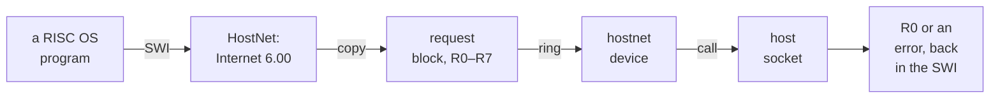

# HostNet: the guest's sockets, served by the host

**How the RISC OS Pi 4 emulator took networking out of the emulated machine. RISC OS
programs still make the same socket calls, but a small module hands each one to the
emulator, and the emulator makes it on the host. The guest has no IP stack, no
network card, no DHCP and no link layer.**

RISC OS used to reach the network the way a real Raspberry Pi does: its own TCP/IP
stack in ROM, a network driver, and an emulated USB network card on QEMU's user-mode
network. That path worked above the link layer and failed below it. DHCP obtained an
address in none of twelve measured boots, and the emulated card needed 24 USB bulk
transactions to move one 1500-byte frame.

HostNet replaces the lot at the socket API. A RISC OS module that calls itself
**Internet 6.00** claims the same 35 socket SWIs as the Internet module. Each SWI
copies its registers into a request block and rings a doorbell. A QEMU device at the
address of the Pi 4's unmodelled Ethernet controller answers by making real,
non-blocking socket calls on the host. HostFS already works the same way for files.

The design and Sprints 0 to 3 all landed on 14 September 2026. Two follow-ups
hardened the switch-off and start-up behaviour that evening, and the Windows release
shipped HostNet, switched on, on the 15th.

This document describes the fork's `riscos-pi4` branch as published at
`d535505fad`, 15 September 2026, and names commits by hash. Some design background
paraphrases the fork's private design record; everything else comes from the public
code and commit messages. The [HostFS walkthrough](../HostFSWalkthrough/index.md)
covers the first doorbell, whose transport HostNet copies.

<!-- doccrate:keep-together:start -->

## These documents

| Chapter | What it covers |
|:---|:---|
| [1. The network the guest used to have](01-old-network.md) | the ROM stack over an emulated USB card, and what was measured to fail |
| [2. Where to cut](02-the-cut.md) | the socket SWI level, the module's contract, the sprints and what changed as they landed |
| [3. A doorbell in the GENET window](03-doorbell.md) | the device, its registers, the request block, and switching it off |
| [4. Never blocking the host](04-never-blocking.md) | guest memory, the retry answer, connect, readiness and `Select` |
| [5. The verbs](05-verbs.md) | the 35 SWIs, and translating addresses, flags, options and errors |

<!-- doccrate:keep-together:end -->

<!-- doccrate:keep-together:start -->

#### These documents, continued

| Chapter | What it covers |
|:---|:---|
| [6. Internet Event 19 without an interrupt](06-events.md) | the ticker, the callback, the wake-up poll, and reasons that change |
| [7. Internet 6.00 in 750 lines](07-module.md) | the guest module: building it, finding the doorbell, waiting, refusing to load |
| [8. Shipping it](08-shipping.md) | the developer switch, the Windows release's module folder, the menu and the installer |
| [9. Proven, and what comes next](09-proven-open.md) | the tests, the numbers, the stated limits, and work in progress |

<!-- doccrate:keep-together:end -->

<!-- doccrate:keep-together:start -->

## At a glance

| | |
|:---|:---|
| **Guest module** | `Internet` 6.00, SWI chunk &41200, the Internet module's 35 socket SWIs in the same order |
| **Doorbell** | `hostnet` device at 0xFD580000, the BCM2711 GENET window; magic `'HNET'`, one 64-byte request block per call |
| **Host side** | real host sockets, always non-blocking; a would-block becomes `HN_RC_RETRY` and the guest waits |
| **Events** | a 50 Hz ticker asks the host which sockets woke, and the module raises Internet Event 19 |

<!-- doccrate:keep-together:end -->

<!-- doccrate:keep-together:start -->

#### At a glance, continued

| | |
|:---|:---|
| **Measured** | NetSurf loaded riscosopen.org over TLS in 1.3 s; the old stack could not resolve the name |
| **Switch** | `-global hostnet.sockets=on`; off, the whole window reads zero as before |
| **Shipped** | Windows release `RISCOSQEA72v7`, switched on, as `Modules\HostNet,ffa` on the disc |
| **Code** | `hw/misc/hostnet.c`, `include/hw/misc/hostnet.h`, `riscos-pi4/hostnet/`, `ui/dx11.c`, the release scripts |

<!-- doccrate:keep-together:end -->

<!-- doccrate:keep-together:start -->

### One socket call, from a program to the host

<!-- doccrate:keep-together:end -->

<!-- doccrate:keep-together:start -->

### Reading the diagrams

Every diagram colours its outlines by what each box is:

| Outline | Meaning |
|:---|:---|
| dark blue | code in this fork: the device, the module, the launchers and scripts |
| grey | code from elsewhere: RISC OS, QEMU, the host operating system |
| purple | a file or data artefact: a module file, a setting |
| teal | state at run time: a request block, a table, guest memory |
| amber | a decision or a test |
| green | the outcome |

<!-- doccrate:keep-together:end -->

