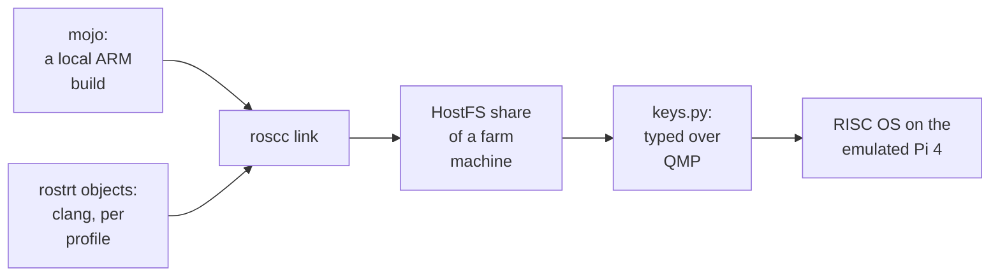

# 1. A language port as a runtime and a back end

This chapter sets out the shape of the work before the detail: which repository holds
which piece, the two RISC OS machines the output targets, and the decision that sent
Pi 4 testing to the QEMU fork. It ends with the full build chain, with every command
and flag the published scripts use.


<!-- doccrate:keep-together:start -->

## Five repositories, one toolchain

| Repository | What it holds | Licence |
|:---|:---|:---|
| **MojoRISCOS** | the Mojo fork: RISC OS documents, the generated `riscos/` bindings, three demos and a build script | Apache-2.0 with LLVM exceptions |
| **ROSCC** | roscc, the rostrt runtime, and the binding generator | MIT |
| **RISCOSQEMUA72** | the emulated Pi 4 the A72 programs run on, its four-machine farm, and the typing tool | GPL-2.0-or-later |

<!-- doccrate:keep-together:end -->


<!-- doccrate:keep-together:start -->

#### Five repositories, continued

| Repository | What it holds | Licence |
|:---|:---|:---|
| **RPCEMU_INSTRUMENT** | the StrongARM sandbox: an instrumented RPCEmu with a fault trap and a guest portal | GPL-2.0-or-later |
| **ROSASM** | a RISC OS assembler and disassembler; a sibling that names roscc as its C-compiler counterpart | — |

<!-- doccrate:keep-together:end -->


## Why a back end, not a code generator

The design turns a language port into two smaller problems. The ROSCC README argues
it directly. Porting a language to RISC OS normally means writing a RISC OS code
generator. With roscc, it means **writing a runtime**: teach the language how to reach
the OS, then hand roscc ordinary ARM objects.

That is already true of the tree, not just an aspiration. Every image roscc produces
links objects from **two independent toolchains**. The runtime and the SWI shims are
C and assembly compiled by clang, and the application code comes from the Mojo
compiler. Nothing in roscc knows which produced a given object. The README lists GCC,
Rust, Zig and FreePascal as candidates, without touching their back ends.


<!-- doccrate:keep-together:start -->

### What roscc knows, and what it does not

| roscc knows | roscc does not know |
|:---|:---|
| the AIF executable header, loaded at `&8000` | which compiler produced an object |
| the application slot, and where a heap can go | Mojo's types, its runtime, or its standard library |
| ARM ELF relocations, and how to apply them | how to generate code |
| RISC OS filetypes, through the `,ff8` suffix | anything about SWIs; the runtime issues them |

<!-- doccrate:keep-together:end -->


<!-- doccrate:keep-together:start -->

## Two profiles

RISC OS 5 runs on ARM machines from very different eras, and the port targets two:

| Profile | CPU | Runs on | Code constraints |
|:---|:---|:---|:---|
| `riscos-sa` | StrongARM SA-110, ARMv4 | RPCEmu, an emulated Risc PC | no hardware divide, no `movw`/`movt`, no unaligned loads and stores, ARM state only |
| `riscos-a72` | Cortex-A72, ARMv8-A in AArch32 | the emulated Raspberry Pi 4 | the modern instruction set; FP registers disabled in practice (chapter 2) |

<!-- doccrate:keep-together:end -->


The model is the classic one for RISC OS: compile for ARMv4 to run anywhere, and for
the A72 when the Pi has to work for a living. One runtime source serves both, and
`tools/build-rt.sh` builds it twice.

### The platform decision

A review of roscc on 10 September recorded one decision that shaped everything after
it: **the Pi 4 profile is tested on the QEMU fork, not on RPCEmu.** A plan to teach
RPCEmu's interpreter the A72 instruction set was dropped. RPCEmu stays the StrongARM
sandbox.

That decision is why the [QEMU A72 walkthrough](../QemuA72Walkthrough/index.md) begins
with a compiler: its first chapter explains that the emulated Pi 4 exists because
`roscc`'s output needs an ARMv8 core to run on.

## The chain, as it ran

On 12 September the published build script, `riscos-test/pi4.sh`, took a Mojo program
to the Pi 4 in four steps. The exact commands follow; host-specific install paths are
described rather than reproduced.

**1. Compile** with the fork's `mojo`, built locally with LLVM's ARM backend enabled:

```bash
"$MOJO" build --emit object \
        --target-triple $TRIPLE --target-cpu $CPU \
        --target-features +strict-align,-fpregs \
        -I "$ROOT/mojo/stdlib" -I "$ROOT" -I "$ROOT/riscos-test" \
        -o "build/$name.o" "$src" 2>"build/$name.log"
```

with `TRIPLE=armv8a-none-eabi` and `CPU=cortex-a72`.

**2. Link** with roscc, naming the runtime objects explicitly:

```bash
"$ROSCC" link --entry _start -o "$out" \
        "$RT/crt0-$TAG.o" "build/$name.o" \
        "$RT/rostrt-$TAG.o" "$RT/wimp-$TAG.o" \
        "$RT/swis_os-$TAG.o" "$RT/swis_wimp-$TAG.o" \
        "$RT/aeabi-$TAG.o" "$RT/atomics-$TAG.o"
```

The result is an AIF executable named with a `,ff8` suffix, which carries its RISC OS
filetype across a host file system, plus an `.elf` sidecar for disassembly.

**3. Deliver** by copying the image into a farm machine's HostFS share.

**4. Run** by typing into the guest over QMP:

```bash
keys.py alpha --taskwindow --line "Run HostFS:$.hello_world,ff8"
```


<!-- doccrate:keep-together:start -->

### The chain, with its tools



<!-- doccrate:keep-together:end -->


## Published, and not

Three pieces of what ran on 12 September are not in the published repositories. The
rest of this document says so each time it matters, and chapter 9 gathers them:

- **The ARM-enabled compiler.** The fork's published build configuration does not
  enable LLVM's ARM backend. The `mojo` used was a local build.
- **roscc's relocatable-module writer.** The ROSCC README advertises
  `roscc link --module`; the published source has no such option.
- **The console demos.** Both Wimp demos import helpers from a `demos/` directory that
  is not tracked, so a clone can build only `hello_world`.
