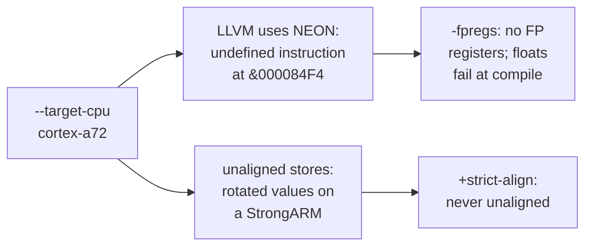

# 2. From `.mojo` to an ARM object

The first half of the chain is the compiler. This chapter covers the fork's history,
what it actually changes, how the compiler was made to emit 32-bit ARM, the two target
flags the Pi 4 build cannot do without, and the route the project took before the
compiler could emit ARM directly.

<!-- doccrate:keep-together:start -->

## The fork's history

The MojoRISCOS branch `riscos` holds 53,832 commits, but almost all of them are
upstream Mojo. The history has four parts:

| Part | Commits | What it is |
|:---|---:|:---|
| upstream Mojo, to base `f66d4d522c` (18 August 2026) | 53,617 | the compiler, standard library and tooling as published upstream |
| a Windows host port, on a separate root | 201 | the Mojo compiler built and run on Windows x64, which is where the RISC OS work began |
| the merge, `eec94331fb` (8 September) | 1 | adopts the Windows port's tree, and introduces `RISCOS-PORT.md` |
| after the merge | 13 | 3 housekeeping commits and 10 marked `[riscos]` |

<!-- doccrate:keep-together:end -->

The three housekeeping commits separate the fork from its upstream. They stop it
presenting as Modular's repository, add a `NOTICE` and a licensing safety rail in
`.gitignore`, and remove 1,149 files of Modular's documentation.

<!-- doccrate:keep-together:start -->

### The ten RISC OS commits

| Commit | When | What |
|:---|:---|:---|
| `b5c9ec59db` | 11 Sep 09:16 | record whole-OS shim generation, and what is still unbound |
| `f325531965` | 11 Sep 09:46 | track the generated bindings: `riscos/`, 48 files |
| `9db30e1167` | 12 Sep 20:29 | hello world through the OS library, built and run on the Pi 4 |
| `a720f9601a` | 12 Sep 20:59 | stop the Pi 4 target reaching for NEON |
| `7a3b81b82d` | 12 Sep 20:59 | Othello as a Wimp application, and the window support it needed |

<!-- doccrate:keep-together:end -->

<!-- doccrate:keep-together:start -->

#### The ten RISC OS commits, continued

| Commit | When | What |
|:---|:---|:---|
| `d41626b038` | 12 Sep 21:15 | build the console demos for the Pi 4, and run them there |
| `805c4551eb` | 12 Sep 21:25 | `Wimp_Initialise`: allocate the out-cell in a frame that survives |
| `6e23dc2431` | 12 Sep 21:25 | Othello: the score clear of the board, and legal moves shown |
| `c4b9c847dd` | 12 Sep 21:44 | the Mandelbrot set in a window, in Q16.16 |
| `3ce3feed0d` | 12 Sep 22:15 | Mandelbrot: Select zooms in, Adjust zooms out |

<!-- doccrate:keep-together:end -->

The branch was force-pushed with this full history after the last commit. An earlier
published snapshot, a single flattened commit without the `max/` directory, is no
longer part of it.

<!-- doccrate:keep-together:start -->

## What the fork changes, and what it does not

Reading the branch against its upstream base gives a clear answer. Every RISC OS change
in the tracked tree is in one of these places:

| Area | Change |
|:---|:---|
| documents | `RISCOS-PORT.md`, the dated port log; `README.md` rewritten for RISC OS |
| identity and licensing | `NOTICE`, `CONTRIBUTING.md`, and the `.gitignore` rail |
| bindings | `riscos/`: 45 generated modules, 2 hand-written appendices, and an `__init__` |
| demos | `riscos-test/`: `hello_world`, `othello_wimp`, `mandelbrot_wimp`, and `pi4.sh` |

<!-- doccrate:keep-together:end -->

The compiler itself (`KGEN/`), the build configuration (`bazel/`) and the standard
library (`mojo/stdlib`) contain **no RISC OS change at all**. The OS-facing bottom layer
that Mojo's standard library needs is C, in ROSCC's runtime, and not Mojo code.
Chapter 4 walks through it.

## Teaching the compiler to emit ARM

Mojo's compiler already treats 32-bit ARM as a known target, so no C++ change was needed
to emit AArch32. What was missing was the ARM code generator in LLVM itself. The fork's
build fetches LLVM through Bazel, and the backends it compiles are a list in the build
configuration. The port log's reconnaissance, dated 8 September, found the list and
concluded that adding `"ARM"` was the entire change.

That is gate **R1**, recorded as done the same day:

- the compiler was rebuilt with the ARM backend: **14,512 build actions, about an hour**
- `--emit asm` and `--emit object` produced correct AArch32 for both profiles, straight
  from a `.mojo` file: `.cpu cortex-a72` for the Pi 4, `.cpu strongarm110` for RPCEmu
- the first native image, `hellomojo,ff8`, was **432 bytes** of AIF, with its start-up
  code, `main` and `OS_Exit` confirmed by disassembly

**The published build configuration does not contain that change.** Its LLVM backend
list is `AArch64`, `NVPTX`, `RISCV`, `SPIRV` and `X86`. The build has a hook for extra
targets, and the module file does not use it. The `mojo` that built every program in
this document was a local build.

**INFERRED:** a clean clone would build a compiler that refuses `armv8a-none-eabi`, with
the *no available targets* error the port log records from before R1.

<!-- doccrate:keep-together:start -->

## No RISC OS target in the driver

The compiler driver does not know a `riscos` target. That is gate **R2**, still open.
The build uses the driver's stock options instead:

| Option | Value for the Pi 4 |
|:---|:---|
| `--emit` | `object`: stop at an ELF object |
| `--target-triple` | `armv8a-none-eabi` |
| `--target-cpu` | `cortex-a72` |
| `--target-features` | `+strict-align,-fpregs` |

<!-- doccrate:keep-together:end -->

The link is a separate, explicit `roscc` step, because the driver links with the host's
own linker, `link.exe` on Windows and `cc` elsewhere. Folding roscc into the driver's
platform configuration is what R2 would do.

## `+strict-align`

A StrongARM does not fault on a misaligned load or store; it **rotates** the value. So
code for these machines must never make an unaligned access, and the flag tells LLVM so.
It has been on the Pi 4 build line from its first commit, `9db30e1167`, as well as in
the StrongARM profile's constraints. Chapter 4 tells the story of a string that came
back with a hole in it because the runtime ignored an alignment request.

## `-fpregs`, and the fault that made it compulsory

The build script's comment is emphatic: the flag *is not optional*. Asked for a
Cortex-A72, LLVM assumes the A72's NEON unit is available, and uses it.

Commit `a720f9601a` records what happened. In a Wimp program, LLVM vectorised an ordinary
stack clear into two NEON instructions: a `vmov.i32 d0, #0` and a `vst1.64` store.
RISC OS had not enabled the floating-point unit for the program. So the program stopped
with *Internal error: undefined instruction at &000084F4*. The StrongARM builds had
never seen this, because ARMv4 has no NEON to reach for.

<!-- doccrate:keep-together:start -->

#### NEON instructions, counted

| Build | NEON-space instructions in the program |
|:---|---:|
| `cortex-a72` | 17 |
| `cortex-a72` with `-fpregs` | **0** |

<!-- doccrate:keep-together:end -->

`-fpregs` removes the floating-point registers from the target entirely. It was chosen
over the narrower `-neon` deliberately: with no FP registers at all, **any use of
floating point fails at compile time**, instead of at an address in a running program.

That fits the runtime. rostrt has no soft-float library, so a `Float64` anywhere fails at
link time anyway. The idiom is fixed point, which chapter 7 shows in action.

**INFERRED:** enabling the FP unit for a task, through RISC OS's `VFPSupport` module,
would let A72 programs use hardware floating point. No code in the runtime creates such
a context, and the database of SWIs the bindings come from does not include that module.
The fork's profile table still lists VFPv4 and NEON for the A72 profile. That entry is an
aspiration, not the current state.

<!-- doccrate:keep-together:start -->

### Why the flags matter

<!-- doccrate:keep-together:end -->

## The route before R1: `roscc ingest`

Before the compiler could emit ARM itself, roscc had a second job, which is still in its
source as `roscc ingest`. It took LLVM IR produced by the Windows build of Mojo for its
own host, and made an ARM object of it:

1. parse the IR text
2. retarget it to `armv8a-none-eabi`, with that target's data layout
3. **strip the function attributes** naming the host CPU and its features; the comment
   in the source cites the host's Alder Lake attributes
4. verify the module, and emit a static object through LLVM

The port log records that Mojo's IR retargeted cleanly to Cortex-A72. **INFERRED:** IR
generated for a 64-bit host has 64-bit pointer layouts baked in, and swapping the data
layout afterwards is not sound in general. That is a good reason for the move to a
compiler that emits ARM directly. The ingest route remains as history, alongside a
`roscc demo` subcommand that builds a two-function smoke-test object.
