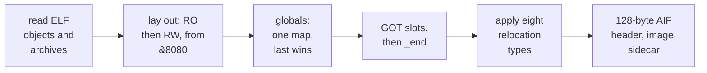

<!-- doccrate:keep-together:start -->

# 3. roscc: ELF in, AIF out

roscc's linker is small enough to read in an afternoon: 977 lines of Rust in three
files. LLVM is used only by the older `ingest` and `demo` subcommands; the linker and the
image writer are pure Rust. This chapter walks through the linker in the order it works —
reading objects, laying out sections, resolving symbols, building a GOT, applying
relocations and writing the AIF header — and ends with its known defects. Each defect
was checked with a small probe.

| File | Lines | Role |
|:---|---:|:---|
| `src/main.rs` | 371 | subcommands; the `link` arguments; attaching the runtime |
| `src/elf.rs` | 243 | an ELF32 ARM relocatable-object reader, and an `ar` archive reader |
| `src/aif.rs` | 363 | the static linker, the AIF writer, and the `.elf` sidecar |

<!-- doccrate:keep-together:end -->


## Reading objects

`elf.rs` accepts exactly one kind of file, and says precisely why it rejects anything
else:

```rust
if d.len() < 52 || &d[0..4] != b"\x7fELF" {
    return Err(format!("{path}: not an ELF file"));
}
if d[4] != 1 || d[5] != 1 {
    return Err(format!("{path}: not ELF32 little-endian"));
}
if rd_u16(d, 16) != 1 {
    return Err(format!("{path}: not relocatable (e_type)"));
}
if rd_u16(d, 18) != 40 {
    return Err(format!("{path}: not ARM (e_machine)"));
}
```


<!-- doccrate:keep-together:start -->

#### What the reader keeps

From an accepted object it keeps three things:

| Kept | Rule |
|:---|:---|
| symbols | every entry, index-exact; *global* means `STB_GLOBAL` binding only |
| sections | only allocated `PROGBITS` or `NOBITS` sections with non-zero size; `.bss` becomes real zeros; `.ARM.exidx`, notes and comments are dropped |
| relocations | `REL` sections only, and only those targeting kept sections |

<!-- doccrate:keep-together:end -->


An input can also be an `ar` archive. The comment explains why: `mojo build` emits an
archive for a multi-file program. **Every member is included**; there is no pulling in
only the members that satisfy undefined symbols.

## Layout

Sections are laid out in two passes over the objects, in command-line order: read-only
sections first, then writable ones, starting at `&8080`, just past the header:

```rust
let mut cursor = BASE + HDR;
for pass in 0..2 {
    for (oi, o) in objs.iter().enumerate() {
        for (si, s) in o.sections.iter().enumerate() {
            if (pass == 0) == elf::is_writable(s) {
                continue;
            }
            cursor = align4(cursor);
            addr.insert((oi, si), cursor);
            cursor += s.data.len() as u32;
        }
    }
}
```

`align4` rounds to a four-byte boundary. It does **not** read each section's own
alignment requirement. That is the first known defect: a probe that declared a C global
aligned to 16 bytes found it placed at `&933C`, which is not.

## Symbols

Global symbols go into a single hash map, from name to address:

```rust
for (oi, o) in objs.iter().enumerate() {
    for sym in &o.symbols {
        if sym.shndx == 0 || !sym.bind_global {
            continue;
        }
        if let Some(&si) = o.keep.get(&(sym.shndx as usize)) {
            let a = addr[&(oi, si)] + sym.value;
            globals.insert(sym.name.clone(), a);
        }
    }
}
```

Two more defects follow directly from these lines, and both were confirmed by probes:

- **A later definition silently replaces an earlier one.** Linking the same object twice
  succeeds.
- **Weak symbols are not global.** Only `STB_GLOBAL` counts, so a weak definition in one
  object called from another fails with `undefined: weak_fn`. The review noted why the
  demos survive this: Mojo emits `linkonce_odr` functions, and their references happen to
  stay within one object.

## A GOT, for a static link

A static executable normally needs no global offset table. Mojo's output uses one anyway:
it reaches its closures through `R_ARM_GOT_PREL` relocations even in a static link. So
roscc synthesises a GOT. It makes one slot per unique symbol name referenced that way,
places the slots after every section, and fills each with the symbol's address.

The code carries a comment about a bug found on 12 September (commit `d2ab069`):

```rust
// cursor has to move to got_base, not merely past it: the slots are
// placed from the aligned address while cursor was advanced from the
// unaligned one, so the image buffer came out up to 3 bytes short and
// the copy panicked. It only ever aligned by luck - every .bss so far
// had happened to be a multiple of 4.
let got_base = align4(cursor);
cursor = got_base;
```

## `_end`: where the image stops

After the GOT, roscc defines one symbol of its own:

```rust
// _end: the first address past the image, defined here because only the
// linker knows it. A runtime wanting a heap should claim it from the
// application slot - RISC OS hands a program everything from here up to
// the limit OS_GetEnv returns in R1 - rather than reserving one inside
// the image. Reserving it is what made a hello world 304 KB, of which
// 299,312 bytes were rostrt's heap_area and global_arena written out as
// zeros because .bss is materialised rather than declared.
globals.insert("_end".to_string(), align4(cursor));
```

This one symbol took hello world from 304 KB to under 10 KB. Chapter 4 shows the runtime
side.

## Relocations

The core of any static linker is applying relocations, and in roscc that is one function.
It handles the set a static ARM executable needs:

```rust
pub fn apply(rtype: u8, word: u32, s: u32, p: u32) -> Result<u32, String> {
    Ok(match rtype {
        // S + A, addend in place (REL form)
        R_ARM_ABS32 => s.wrapping_add(word),
        R_ARM_CALL | R_ARM_JUMP24 => {
            let off = (s as i64 - 8 - p as i64) / 4;
            if !(-0x80_0000..0x80_0000).contains(&off) {
                return Err(format!("branch out of range: {s:#x} from {p:#x}"));
            }
            (word & 0xFF00_0000) | ((off as u32) & 0x00FF_FFFF)
        }
        R_ARM_MOVW_ABS_NC => {
            let imm = s & 0xFFFF;
            (word & 0xFFF0_F000) | ((imm & 0xF000) << 4) | (imm & 0x0FFF)
        }
        R_ARM_MOVT_ABS => {
            let imm = (s >> 16) & 0xFFFF;
            (word & 0xFFF0_F000) | ((imm & 0xF000) << 4) | (imm & 0x0FFF)
        }
        R_ARM_V4BX => word,
        // S + A - P (A = signed in-place addend)
        R_ARM_REL32 => (s as i64 + word as i32 as i64 - p as i64) as u32,
        other => {
            return Err(format!(
                "unsupported relocation type {other} — extend the linker"
            ))
        }
    })
}
```


<!-- doccrate:keep-together:start -->

#### The relocation types

| Type | Number | Computes | Used for |
|:---|---:|:---|:---|
| `R_ARM_ABS32` | 2 | S + A | data words and literal pools |
| `R_ARM_REL32` | 3 | S + A − P | PC-relative data; added at R1 |
| `R_ARM_CALL`, `JUMP24` | 28, 29 | (S − 8 − P) / 4 into 24 bits, range-checked | `BL` and `B` |

<!-- doccrate:keep-together:end -->


<!-- doccrate:keep-together:start -->

#### Relocations, continued

| Type | Number | Computes | Used for |
|:---|---:|:---|:---|
| `R_ARM_V4BX` | 40 | nothing | marks a `BX` for ARMv4 |
| `R_ARM_MOVW_ABS_NC`, `MOVT_ABS` | 43, 44 | low and high 16 bits, packed as `imm4:imm12` | address loads on the A72 |
| `R_ARM_GOT_PREL` | 96 | GOT slot + A − P, handled before `apply` | Mojo's closures |

<!-- doccrate:keep-together:end -->


Anything else is a hard error that names its number, and asks for the linker to be
extended.

Reading the code shows the addend handling is uneven:

- `ABS32` and `REL32` honour the addend stored in the instruction.
- **Branches discard it**: the in-place addend is masked out. This is recorded as a
  defect.
- **INFERRED**: the MOVW and MOVT cases also ignore any in-place addend. That does not
  affect the runtime, whose address loads reference their string symbols directly.

## The AIF header

The output is always an **AIF executable**, loaded at `&8000`: 32 words, 128 bytes, then
the image. The source writes it field by field:

```rust
hdr[0] = NOP; // no decompression
hdr[1] = NOP; // not self-relocating
hdr[2] = NOP; // no zero-init code (bss materialised)
hdr[3] = bl(BASE + 0x0c, entry); // BL ImageEntryPoint
hdr[4] = SWI_EXIT; // last-ditch exit instruction
hdr[5] = ro_incl_hdr; // read-only size incl. header
hdr[6] = rw_size; // read-write size
hdr[7] = 0; // debug size
hdr[8] = 0; // zero-init size (materialised in file)
hdr[9] = 0; // debug type
hdr[10] = BASE; // image base
hdr[11] = 0; // workspace
hdr[12] = 32 | 0x100; // 32-bit mode + separate data base
hdr[13] = BASE + ro_incl_hdr; // data base
hdr[16] = NOP; // debug init
```

The first three words are no-ops, because the image needs no decompression, no
self-relocation and no zero-initialisation code. The fourth is a `BL` to the entry symbol,
which is why every image reports its entry at `&8080`. The fifth is `SWI OS_Exit`, in case
the entry ever returns. Word 12 declares 32-bit mode and a separate data base.

A probe with a C hello world for StrongARM decoded the header words exactly as written:
read-only 4,860 bytes and read-write 4,404, totalling the 9,264-byte file.

### The sidecar

Beside every image roscc writes a minimal ELF executable wrapping the same bytes, so
`llvm-objdump` can disassemble it. The README describes it as a sidecar *for symbols*.
**It carries none**: one program header and one section covering the image.


<!-- doccrate:keep-together:start -->

### From objects to an image



<!-- doccrate:keep-together:end -->


## Attaching the runtime

`roscc link --rt a72` or `--rt sa` prepends the runtime objects in link order — `crt0`,
`rostrt`, `wimp`, `swis_os`, `swis_wimp`, `aeabi`, `atomics` — from a directory found
relative to the roscc executable. The review noted that this lookup breaks for an
installed binary. The Pi 4 build script names the objects itself instead.


<!-- doccrate:keep-together:start -->

## Known defects

The ROSCC review of 10 September listed the linker's defects, and each was checked
against the published source:

| Defect | Checked |
|:---|:---|
| section alignment ignored | probe: a 16-byte-aligned global landed at `&933C` |
| duplicate definitions accepted; the last wins | probe: the same object linked twice succeeded |
| weak symbols treated as local | probe: `undefined: weak_fn` |
| branch addends discarded | reading the code |
| malformed input panics instead of reporting an error | reading the code: unchecked slices |

<!-- doccrate:keep-together:end -->


<!-- doccrate:keep-together:start -->

#### Known defects, continued

| Defect | Checked |
|:---|:---|
| no unit tests | no `#[test]` anywhere in `src/` |
| `.bss` written out as zeros, not declared as zero-init | header word 8 is 0 |
| no Thumb, no archive member pulling, no section garbage collection | reading the code |
| the sidecar has no symbols | probe |

<!-- doccrate:keep-together:end -->


**INFERRED, from reading the code:** a local symbol whose name matches a global elsewhere
binds to the global, and GOT slots for local symbols of the same name in two objects would
collide. The build also produces four compiler warnings, all for unused items.

None of these stopped the demos, which link a small, known set of objects. All of them
would matter the moment roscc links code it has not seen before — which is the whole
premise of a back end any compiler can use.
