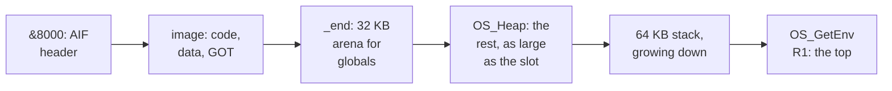

# 4. rostrt: the smallest runtime

A compiled Mojo program expects things from its environment: a stack, a heap, a way to
write bytes, a few entry points in the compiler's runtime library, 64-bit division and
atomic operations for reference counts. None of them exist on RISC OS until something
provides them. **rostrt** is that something: about 860 hand-written lines of C and
assembly, plus the generated SWI shims of chapter 5, compiled freestanding, and making no
calls but SWIs. This chapter walks through it, from the first
instruction a program executes to what is still missing.

## The first instructions

roscc's AIF header branches to `_start`, in `crt0.s`:

```asm
_start:
	swi	0x10		@ OS_GetEnv: R0 -> env strings, R1 = RAM limit
	mov	sp, r1		@ establish stack at top of our memory slot
	bl	rostrt_init	@ r0 = argc (argv via rostrt_argv_ptr)
	ldr	r1, =rostrt_argv_ptr
	ldr	r1, [r1]
	bl	main
	mov	r2, r0		@ exit code
	mov	r0, #0		@ OS_Exit reason: normal
	swi	0x11
```

The second line fixed the first bug a real machine found. **RISC OS gives an AIF or
Absolute image no stack**: the program must set `r13` itself. The first image aborted
with `r13 = &80000000`, and the instrumented RPCEmu's fault trap stopped on the faulting
instruction. `OS_GetEnv` returns the top of the program's memory in R1, which is the
natural stack top.

After that, the sequence is:

1. `rostrt_init` splits the command tail into up to 63 arguments, honouring quotes
2. `main(argc, argv)` runs the Mojo program
3. `OS_Exit` ends it

**INFERRED:** the exit code probably never reaches a caller. `OS_Exit` honours a return
code only when R1 holds a particular magic word, and neither `crt0` nor the runtime's
`os_exit` sets it.

## How the runtime issues a SWI

Every OS call in rostrt is a small C function that binds registers explicitly and issues
one `swi` instruction, using clang's register-binding form of inline assembly:

```c
__attribute__((noinline)) void os_write0(const char *s)
{
    register const char *r0 __asm("r0") = s;
    __asm__ volatile("swi 0x02" : : "r"(r0) : "r1", "r2", "r3", "r12", "lr", "memory");
}
```

The three lists after the instruction are outputs, inputs and clobbers. Getting those
lists exactly right turned out to be the whole game. Chapter 5 shows two bugs that came
from getting them wrong.


<!-- doccrate:keep-together:start -->

## What Mojo's standard library needs underneath

The fork's standard library is unchanged. Mojo code reaches a handful of C symbols by
name, and rostrt supplies each one:

| Symbol | What rostrt does |
|:---|:---|
| `write(fd, buf, n)` | one `OS_WriteC` per byte, with CR inserted before a bare LF; returns the full count |
| `KGEN_CompilerRT_AlignedAlloc`, `AlignedFree` | `OS_Heap`, over-allocating to honour alignment |
| `KGEN_CompilerRT_GetOrCreateGlobal` | a block from a bump arena, remembered in a 256-entry table |
| `SetArgV`, `PrintStackTraceOnFault`, `DestroyGlobals` | no-ops |

<!-- doccrate:keep-together:end -->


<!-- doccrate:keep-together:start -->

#### What the standard library needs, continued

| Symbol | What rostrt does |
|:---|:---|
| three `AsyncRT` CPU-device functions | return the constant 1 |
| `KGEN_CompilerRT_fprintf` | returns 0 |
| `memcpy` and friends, `__aeabi_mem*` | byte loops |
| 64-bit division, in both AEABI and compiler-rt spellings | assembly, in `aeabi.s` |
| `__atomic_*` | SWP loops on StrongARM, `LDREX`/`STREX` on the A72 |

<!-- doccrate:keep-together:end -->


Ten `KGEN_CompilerRT_*` symbols are defined in all. The fork's README still says seven.

### `print()` ends at one symbol

The most useful discovery of the port is recorded in the README: Mojo's `print` bottoms
out at exactly one C symbol, `write`. Implement it, and the whole formatting layer above
comes for free:

```c
long write(int fd, const void *buf, unsigned count)
{
    (void)fd; /* 1=stdout, 2=stderr: same stream on RISC OS for now */
    const unsigned char *p = buf;
    for (unsigned i = 0; i < count; i++) {
        if (p[i] == '\n' && (i == 0 || p[i - 1] != '\r'))
            os_writec('\r');
        os_writec(p[i]);
    }
    return (long)count;
}
```

The CR matters. To the RISC OS VDU drivers, LF means exactly *down one line*. Without a
CR, each line starts in whatever column the previous one ended. The source comment
describes the symptom: output walks diagonally across the screen, and looks like the
program is corrupting its own strings.

The full count must be returned, because the caller asserts on it.

## Memory, in three stages

### Stage 1: a bump arena

The first runtime, on 8 September, allocated from a static 32 KB arena, and free did
nothing. Every intermediate string leaked. Programs that built strings in a loop
produced wrong output, which read as a compiler bug.

### Stage 2: `OS_Heap`, and a string with a hole

On 9 September, commit `0797719` moved allocation onto RISC OS's own heap manager,
`OS_Heap`: initialise, claim and free. The three calls use the SWI's X form, the only
X-form SWIs in the runtime, so a failure returns an error instead of stopping the
program.

That commit also found the subtlest bug in the runtime. Mojo's `String` keeps short text
inline and moves it to the heap past 24 bytes, and the heap buffer is declared
**over-aligned**. `OS_Heap` promises word alignment and nothing more. The allocator
ignored the alignment argument. Then a copy into the buffer stored wider than the
address allowed — and a StrongARM does not fault on that, it **rotates** the value. So a
string of 25 characters came back with a hole in the middle, while its length stayed
correct.

The fix honours the alignment by over-allocating, and stashes the raw pointer in the
word just below the aligned one, so free knows what to give back:

```c
void *KGEN_CompilerRT_AlignedAlloc(u64 alignment, u64 size)
{
    u32 a = (u32)alignment;
    if (a < 8)
        a = 8;
    unsigned char *raw = heap_alloc(size + a + sizeof(void *));
    if (!raw) {
        puts_ro("rostrt: out of heap\n");
        os_exit(1, 0);
    }
    unsigned char *p = raw + sizeof(void *);
    u32 off = (u32)(unsigned long)p & (a - 1);
    if (off)
        p += a - off;
    ((void **)p)[-1] = raw;
    return p;
}
```

The project's own records disagree about whether that fully cured long strings. The same
commit's message still calls the hole unfixed, and the Othello demo prints with
character output because long strings came back corrupted. The status is recorded as
open in chapter 9.

### Stage 3: the application slot

The heap in stage 2 was a quarter-megabyte array in `.bss`. roscc writes `.bss` into the
image as real zeros, so **a hello world was 304 KB**, of which 299,312 bytes were empty
heap. Commit `d2ab069` moved the heap out of the image and into the **application slot**.
RISC OS hands a program all the memory between the end of its image and the limit
`OS_GetEnv` reports:

```c
static void slot_init(void)
{
    if (slot_ready)
        return;
    slot_ready = 1;

#ifndef ROSTRT_STATIC_HEAP
    u32 base = ((u32)_end + 15) & ~15u;
    u32 top = os_mem_limit();
    /* The two grow towards each other: the stack down from the slot top
     * that crt0 put in sp, the heap up from the end of the image. */
    if (top > base + STACK_BYTES + ARENA_BYTES + 16384) {
        top -= STACK_BYTES;
        global_arena = (unsigned char *)base;
        arena_bytes = ARENA_BYTES;
        heap_area = (unsigned char *)(base + ARENA_BYTES);
        heap_bytes = top - (base + ARENA_BYTES);
        return;
    }
    puts_ro("rostrt: application slot too small for a heap\n");
    os_exit(1, 0);
#else
    ...                             /* a module: static arrays, claimed from the RMA */
#endif
}
```

`_end` is the symbol roscc defines in chapter 3. The limit is asked for again rather than
reused. The comment explains why: a Wimp task may have changed its slot size since it
started.


<!-- doccrate:keep-together:start -->

### The application slot



<!-- doccrate:keep-together:end -->


<!-- doccrate:keep-together:start -->

### The result

| Image | Before | After |
|:---|---:|---:|
| `hello_world,ff8` | 304,248 bytes | **9,824** |
| `othello_wimp,ff8` | 308,276 bytes | **13,852** |
| `mandelbrot_wimp,ff8` | 306,656 bytes | **12,232** |

<!-- doccrate:keep-together:end -->


The heap also became as large as the slot allows, instead of a fixed 256 KB. Of hello
world's 9,824 bytes, Mojo's own code is **227**, as the commit records. **INFERRED** from
the sizes of the runtime objects, the rest is the 128-byte header, about 5 KB of runtime
code, and rostrt's remaining 4.4 KB of `.bss`: the image is about 97% runtime.

## Globals must be the same block every time

`GetOrCreateGlobal` gained a table in the same commit. The comment explains the contract
the name implies: ask twice for the same global, and you must get the same block back.
Allocating a fresh block each time is invisible in an application, whose `main` asks
once. It is quietly fatal in a relocatable module, whose entry points are called again
and again. The symptom there was formatted output assembled against a position counter
that kept resetting to zero.

**INFERRED, and worth verifying with the real compiler:** rostrt's signature for this
function is a hash, a size, a constructor and a destructor. The upstream compiler
runtime's is a name pointer and length, then an initialiser and destructor, and it
returns what the initialiser produces. On 32-bit ARM those arguments land in different
registers. Whether real programs are affected depends on how the compiler lowers the
call on this target, which could not be checked without the ARM-enabled compiler.

## Division and atomics

Mojo's `Int` is 64 bits, and no ARM core here divides 64-bit numbers in hardware.
`aeabi.s` provides restoring division: a 32-iteration core for 32-bit values, and a
64-iteration core for 64-bit ones. It defines both the AEABI names and the compiler-rt
spellings, because LLVM does not always emit the AEABI names. The printing path for an
`Int` first failed to link on `__moddi3`.

The algorithm is checked by `tools/test_div_model.py`. It mirrors the assembly loops in
Python and compares them with native division over 200,000 random pairs, plus ten
64-bit cases. It tests a model of the algorithm, not the assembled code, and its signed
64-bit path is computed but not asserted.


<!-- doccrate:keep-together:start -->

#### Atomics, per profile

Mojo's strings and lists keep reference counts, which reach the compiler's atomic
builtins. Two implementations serve the two profiles:

| Profile | Implementation |
|:---|:---|
| StrongARM | `SWP`-based loops. On a single core driven by interrupts, plain loads and stores are atomic enough for the rest |
| Cortex-A72 | `LDREX`/`STREX` for add and subtract; `dmb` for synchronise; LLVM inlines the others on ARMv8 |

<!-- doccrate:keep-together:end -->


<!-- doccrate:keep-together:start -->

## What is missing

| Missing | Consequence |
|:---|:---|
| a soft-float library | any `Float64` fails at link time; fixed point is the idiom |
| `GetArgV` | **INFERRED:** `sys.argv` should fail to link |
| the rest of the async runtime | **INFERRED:** `parallelize` and async should fail to link |
| `fprintf` output | **INFERRED:** `_printf` output is silently dropped |
| threads | none, by design; a Wimp task multitasks co-operatively through `Wimp_Poll` |

<!-- doccrate:keep-together:end -->


The last row is RISC OS, not a gap in the port. The Mandelbrot demo's source says so:
its long recompute blocks the whole desktop until it returns (chapter 7).
