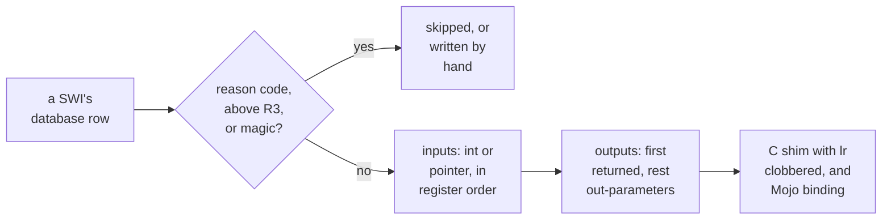

# 5. The PRM as data

A RISC OS program does its work through SWIs: numbered calls into the operating system,
with arguments in registers. The *Programmer's Reference Manuals* (PRMs) document about
six hundred of them. The port's stated objective is that **no end-user program issues a
SWI** or names a register. That needs a library covering the whole documented set, and
nobody writes six hundred bindings by hand twice — once in C, once in Mojo.

This chapter covers the pipeline that generates both from a database, the register model
it applies, the bugs that model had to learn about, and what regenerating the library
today would do.


<!-- doccrate:keep-together:start -->

## Two layers per SWI

Every bound SWI gets two functions with one contract:

| Layer | Where | What it is |
|:---|:---|:---|
| a C shim | `rostrt/swis_<chunk>.c` | one function, named exactly like the SWI, issuing one `swi` instruction |
| a Mojo binding | `riscos/<chunk>.mojo` | a Mojo function calling that C symbol by name |

<!-- doccrate:keep-together:end -->


A generated pair looks like this. The C shim:

```c
/* Wimp_SetColour (SWI &400E6). See PRM 3-191. */
void Wimp_SetColour(int colour)
{
    register int reg0 __asm("r0") = colour;
    __asm__ volatile("swi 0x400E6" : : "r"(reg0) : "r1", "r2", "r3", "r12", "lr", "memory");
}
```

and, emitted by the same loop in the generator, the binding shape:

```python
mojo_lines.append(f"def {fname}({', '.join(params)}) -> {mret}:")
mojo_lines.append(f'    """{name} (SWI &{num:X}).{pr}"""')
if retreg is not None:
    mojo_lines.append(
        f'    return external_call["{name}", Int32]({", ".join(call_args)})'
    )
```

So `wimp.set_colour(7)` in Mojo calls `Wimp_SetColour` in C, which issues SWI `&400E6`
with R0 = 7. The day the calling mechanism changes, only the generator changes.


<!-- doccrate:keep-together:start -->

## From manual to database

The pipeline starts outside the public repositories. A private tool parses the page
texts of the PRMs into a SQLite database. **The database is licensed-derived**: the
manuals' prose columns are Acorn's text, and the team keeps it private. The generator
reads only the database's **factual** columns: SWI names, numbers, which registers are
inputs and outputs, and page references.

| Database fact | Count |
|:---|---:|
| SWI rows | 784 |
| documented, with a number | 584 |
| index-only, with no contract | 200 |
| chunks, the SWI name prefixes | 49 |
| service calls | 108 |

<!-- doccrate:keep-together:end -->


### Citing, not reproducing

Commit `f75de12` settled how the manual appears in the published bindings: it does not.
Generated docstrings carry the SWI's name, number and page reference only. All 93
generated files were scanned for manual text afterwards. The generator's own comment
states the rule:

```python
# The PRM's own wording is not reproduced here. SWI names, numbers
# and register roles are facts; the manual's prose is Acorn's, and
# this package is published. A citation points a reader at it.
```

Parameter names get the same care. Commit `c9247da` derives them from each register's
description with pattern rules (`tools/argnames.py`), and falls back to a positional
`arg<N>` when the description does not name a value. That cut register-named parameters
from 228 to 21.

## The register model

For each documented SWI, the generator decides whether it can bind it, and how. First,
the skip rules, in order:

```python
if name in HAND_OVERRIDE:
    stats["hand"] += 1
    continue
...
if "reason" in on_entry or "reason code" in on_entry:
    stats["reason"] += 1
    continue
if any(reg_num(e[0]) > 3 for e in entry) or len(entry) > 4:
    stats["toomany"] += 1
    continue
# magic entry constants we cannot express generically
if "‘task’" in on_entry or "× 100" in on_entry or "'task'" in on_entry:
    stats["magic"] += 1
    continue
```


<!-- doccrate:keep-together:start -->

#### The skip rules, explained

| Skipped | Why |
|:---|:---|
| hand overrides | `Wimp_Initialise` and `Wimp_CloseDown`, written by hand (below) |
| reason-multiplexed SWIs | one number, many behaviours selected by R0, such as the `OS_File` family |
| an input above R3, or more than four inputs | a limit of the current shim writer, not of the SWIs |
| magic entry constants | values the generator cannot express generically |

<!-- doccrate:keep-together:end -->


Then, for a bindable SWI:

- **inputs** become C parameters in register order: a pointer if the description mentions
  a pointer, block, buffer or address, otherwise an `int`
- **outputs** described as *preserved* or *corrupt* are ignored
- **the first real output** becomes the return value, preferring R0; the rest become
  trailing `int *` out-parameters

## Two bugs in the clobber list

The inline assembly names what the SWI may destroy. Both runtime bugs that crashed
programs inside the ROM came from that list.

### `lr`, always

The generator adds `lr` to every shim's clobbers, and its comment explains why this is
not optional:

```python
# "lr" is not optional. SWI banks its return address into r14_svc,
# so code already running in SVC mode — which is every RISC OS module
# entry point — loses its own return address across the SWI. Without
# the clobber the compiler leaves a leaf shim's return address in lr
# and the `mov pc, lr` at the end jumps back into the shim: a one
# instruction infinite loop. Harmless in USR mode, fatal in a module,
# so declare it always and let leaf shims push lr.
```

In an application, which runs in user mode, a SWI never touches the program's `lr`. In a
module, which runs in supervisor mode, the SWI instruction itself overwrites `lr`. A leaf
shim that kept its return address there returned to itself, forever.

### The 'TASK' word in R3

`Wimp_Initialise` is one of the two hand-written shims, because its contract carries a
magic constant: `&4B534154`, the characters `TASK`. It also reads R3 as a pointer to a
list of messages the task wants. The first version named R3 only in the clobber list,
which told the compiler R3 was free scratch space. Commit `b3fe9b9` records what LLVM did
with that freedom: it staged the `TASK` constant through R3, and left it there. The Wimp
followed `&4B534154` as a message list and took a data abort **inside the ROM**, at
`&FC12C9C8`.

The fix makes R3 an explicit input, holding 0, which means every message:

```c
int Wimp_Initialise(int version, const char *name, int *out_version)
{
    register int r0 __asm("r0") = version;
    register int r1 __asm("r1") = 0x4B534154; /* 'TASK' */
    register const char *r2 __asm("r2") = name;
    register const int *r3 __asm("r3") = 0; /* all messages */
    __asm__ volatile("swi 0x400C0"
                     : "+r"(r0), "+r"(r1)
                     : "r"(r2), "r"(r3)
                     : "r12", "memory");
    if (out_version)
        *out_version = r0;
    return r1; /* task handle */
}
```

The lesson is written into the source in one line: **a register the SWI reads is an
input, never a clobber.** With R3 fixed, the `wimp_window` demo opened its window on
RPCEmu.


<!-- doccrate:keep-together:start -->

### A SWI's registers, classified



<!-- doccrate:keep-together:end -->


<!-- doccrate:keep-together:start -->

## Coverage

Commit `c08af21` ran the generator over every chunk, not just `OS` and `Wimp`. Counted by
the project's own coverage tool, which imports the generator's rules so the two cannot
drift:

| | SWIs |
|:---|---:|
| bindable by the generator | 438 |
| written by hand | 2 |
| **reachable** | **440 of 584, 75%** |
| reason-multiplexed, not bound | 51 |
| an input above R3, not bound | 93 |

<!-- doccrate:keep-together:end -->


<!-- doccrate:keep-together:start -->

#### Coverage, continued

| Chunk | Reachable of total |
|:---|:---|
| `OS` | 77 of 111 |
| `Wimp` | 49 generated + 2 hand of 61 |
| `Font` | 30 of 41 |
| `ColourTrans` | 29 of 36 |
| `FileCore` | 4 of 12 |

<!-- doccrate:keep-together:end -->


The generated library is 45 modules and 45 shim files: **439 bindings**, covering 438
distinct SWIs. All 45 shim files compile with zero warnings for both profiles. None of
them uses a SWI's X form, so an error from any generated call goes to the error handler
and stops the program. The unbound SWIs include most file operations and the
`OS_SpriteOp` and `OS_Byte` families. So the demos draw with `os.plot` and VDU codes.

The project's own counts do not reconcile: the README says 126, and commits say 449, 451
and 452. The generator's actual output is 439.

## Three generator bugs

**A wildcard in a prefix.** The generator selects each chunk's SWIs with SQL
`name LIKE chunk + "_%"`. In SQL, `_` is itself a one-character wildcard. So `Draw_%`
matches `DrawFile_DeclareFonts`, which is emitted into `draw.mojo` under the mangled name
`ile_declare_fonts`, as well as into its own `DrawFile` module. That is why one SWI is
bound twice. **INFERRED:** if both shim objects were ever linked together, roscc would
silently keep one of them, while a conventional linker would reject the pair.

**Rows with no inputs.** 82 generated functions take no arguments at all, because their
database rows list no entry registers. Some SWIs genuinely take nothing. Many cannot be
called usefully without inputs they need.

**`Wimp_Poll`'s third register.** The generated shim takes three arguments, and puts the
third in R3. The hand-written `poll(mask, block)` passes two. **INFERRED:** R3 is then
undefined, which is harmless unless the poll-word bit of the mask is set.

## Regenerating would undo real fixes

A check regenerated the whole library from the published generator and a copy of the
database. **All 45 shim files, and 47 of the 48 Mojo files, came out byte-identical** to
the published ones. The generator is faithful.

The one difference is `riscos/wimp.mojo`. The Othello and Mandelbrot work edited it by
hand in three commits, and those edits never went into the appendix file the generator
appends. So a regeneration would:

- remove `game_window`, `word`, `origin_x` and `origin_y`, `begin_redraw`,
  `next_rectangle`, `begin_update` and `alloc`
- bring back `PollBlock.words()`, which never compiled
- bring back the dangling out-cell in `initialise`, which crashed Othello

It would break both Wimp demos. Chapter 6 covers the fixes in question. Moving them into
`appendix_wimp.mojo` would make the generated output the source of truth again.

The objective, and its admitted compromise, are recorded together in commit `c08af21`.
No end-user program issues a SWI. The one-to-one mapping from SWI to function is
deliberately *not an abstraction*. And `Int32` for everything pointer- or size-like is
acknowledged to be wrong for a future 64-bit RISC OS.
