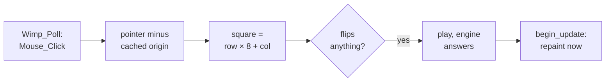

# 6. A Wimp application: Othello

A program that prints proves the chain works. A desktop application proves the library
works: it has to register with the Wimp, create a window, run a poll loop, redraw on
request, and turn mouse clicks into actions. This chapter walks through the first two
Mojo programs on the Pi 4 — a hello world that names no register, and an Othello game in
a window — and through the four library bugs that Othello found.

## Hello world, the way the objective says

The first program built and run on the Pi 4, on 12 September (commit `9db30e1167`), is
three lines of code:

```mojo
from riscos import os

fn main():
    os.write0("Hello RISC OS, from Mojo.\n")
    os.write0("Built on the host, run on the Pi 4.\n")
```

Its docstring explains why it exists. The older test program reached into the runtime
with `external_call["os_write0"]`. That works, and it is exactly what the library exists
to stop. This one imports `riscos.os` and names no SWI and no register. The one SWI is in
the C code behind `os.write0`, so the day the call mechanism changes, this file does not.

All four farm machines printed both lines.

## Othello in a window

`othello_wimp.mojo` (commit `7a3b81b82d`) is the same game as a console demo that plays
itself, with a person on one side. Black is the player. White is the console demo's
positional engine, which scores corners highly and the squares beside them negatively.
**The rules are imported, not rewritten**, so both programs play the same game.

The docstring states the design constraint: *no SWI appears here*. The board is drawn
with `os.plot`, and the window comes from `wimp.game_window`.

**Published only in part.** The game imports its rules from `demos.othello`, and its text
helpers from `demos.vdu`. Neither is in the published repository, so a clone cannot build
this demo.

### The board as geometry

```mojo
comptime SQ = Int32(64)                 # OS units down one side of a square
comptime BOARD = SQ * 8
comptime STATUS = Int32(52)             # strip along the top for the score
comptime W = BOARD
comptime H = BOARD + STATUS
```

RISC OS measures the desktop in **OS units**, not pixels, so a 64-unit square has the
same size on screen in any resolution. Colours are Wimp palette entries — 0 white, 1 grey,
7 black, 13 dark green for the felt, 10 bright green for hints — given names at the top of
the file instead of numbers at each call.

### Drawing with PLOT

The drawing primitives are two short functions over the VDU `PLOT` codes:

```mojo
fn fill_rect(x0: Int32, y0: Int32, x1: Int32, y1: Int32):
    """Filled rectangle in the current colour (PLOT 4 move, PLOT 101 fill)."""
    os.plot(4, x0, y0)
    os.plot(101, x1, y1)

fn fill_circle(cx: Int32, cy: Int32, r: Int32):
    """Filled circle: move to the centre, plot to a point on the rim."""
    os.plot(4, cx, cy)
    os.plot(157, cx + r, cy)
```

A window the program redraws itself is given no background, so every pixel is the
program's to fill, including the strip behind the score. The score itself is VDU 5 text,
drawn at the graphics cursor.

## The Wimp layer this needed

Othello needed four things the generated library did not provide. They were written by
hand into `riscos/wimp.mojo`, and each was found by needing it.

### A window the program draws itself

The library's `simple_window` hands redrawing to the Wimp and fills the work area with
icons. That is right for a dialogue and useless for a board. `game_window` builds a
`Wimp_CreateWindow` block for a window the program paints:

```mojo
def game_window(title: StringLiteral, width: Int32, height: Int32) -> WindowHandle:
    let block = _arena(Int32(88))

    _w(block, 0)[0] = 300
    _w(block, 1)[0] = 300
    _w(block, 2)[0] = 300 + width
    _w(block, 3)[0] = 300 + height
    _w(block, 4)[0] = 0                 # scroll x
    _w(block, 5)[0] = 0                 # scroll y
    _w(block, 6)[0] = -1                # open at the top of the stack

    _w(block, 7)[0] = (WF_NEW_STYLE | WF_TITLE_BAR | WF_CLOSE_ICON
                       | WF_BACK_ICON | WF_MOVEABLE)
    ...
    _w(block, 10)[0] = 0
    _w(block, 11)[0] = -height
    _w(block, 12)[0] = width
    _w(block, 13)[0] = 0

    _w(block, 14)[0] = IF_TEXT_INDIRECTED
    _w(block, 15)[0] = BUTTON_CLICK
    ...
    _w(block, 21)[0] = 0                # no icons: we draw everything

    return WindowHandle(create_window(block))
```

Three choices in that block matter:

- **The Wimp-redraws flag is left clear**, so redraw requests come to the program.
- **The work area runs from y = −height to 0.** The origin is at the top left, and y
  runs negative downwards, which is the Wimp's convention for a document.
- **The work-area button type is set.** That one is silent when wrong.

The source records the last point next to the constant:

```mojo
comptime BUTTON_CLICK = Int32(3) << 12
"""Work-area button type 3, in bits 12-15 of the window's +60 word.

Left at the default 0 the Wimp reports no clicks on the work area at all.
The events simply never arrive, which reads as a broken poll loop rather
than as a window that asked not to be told.
"""
```

The window block lives in the runtime's never-freed arena, because the Wimp keeps
pointers into it, such as the indirected title, for the window's whole life.

### Where the work area is on screen

Redraw requests, open requests and `Wimp_UpdateWindow` all leave the window's visible area
and scroll offsets in the same words of the block. So one piece of arithmetic gives the
screen position of the work-area origin:

```mojo
def origin_x(block: PollBlock) -> Int32:
    return word(block, 1) - word(block, 5)

def origin_y(block: PollBlock) -> Int32:
    """Screen y of the work-area origin: visible y1 minus scroll y."""
    return word(block, 4) - word(block, 6)
```

### Drawing now, not later

To repaint after a move, a program can ask the Wimp to redraw later, with
`Wimp_ForceRedraw`, or draw immediately, with `Wimp_UpdateWindow`. `Wimp_ForceRedraw` has
more than four input registers, so the generator never bound it. `begin_update` wraps the
other call, which is also the better one. It draws now, instead of asking to be asked
later:

```mojo
fn repaint(win: wimp.WindowHandle, block: wimp.PollBlock,
           b: UnsafePointer[UInt8, MutUntrackedOrigin],
           turn: Int32, over: Bool):
    """Draw now, rather than asking the Wimp to ask us later."""
    var more = wimp.begin_update(win, block, 0, -H, W, 0)
    while more != 0:
        draw(b, wimp.origin_x(block), wimp.origin_y(block), turn, over)
        more = wimp.next_rectangle(block)
```

The loop is the standard Wimp redraw loop. The Wimp hands out one visible rectangle at a
time, clipped, until there are none left.

### A method that had never compiled

`PollBlock.words()` views the 256-byte poll block as 32-bit words. It had never compiled:
it built an `Int32` pointer from a `UInt8` one, which does not typecheck. Nothing had
called it, and the compiler does not elaborate an uncalled method body, so it sat in the
library looking correct. It now uses `bitcast`:

```mojo
fn words(mut self) -> UnsafePointer[Int32, MutUntrackedOrigin]:
    return self.ptr.bitcast[Int32]()
```

## The poll loop

With those pieces, the main loop reads like any RISC OS application. The board is 64
bytes on the stack:

```mojo
while running:
    let event = wimp.poll(1, block)     # mask 1: no null events wanted

    if event == wimp.REDRAW_WINDOW_REQUEST:
        var more = wimp.begin_redraw(block)
        ox = wimp.origin_x(block)
        oy = wimp.origin_y(block)
        while more != 0:
            draw(b, ox, oy, turn, passes >= 2)
            more = wimp.next_rectangle(block)

    elif event == wimp.OPEN_WINDOW_REQUEST:
        wimp.open_window_from_poll(block)
        ox = wimp.origin_x(block)
        oy = wimp.origin_y(block)

    elif event == wimp.CLOSE_WINDOW_REQUEST:
        running = False

    elif event == wimp.MOUSE_CLICK:
        let dx = wimp.word(block, 0) - ox
        let dy = oy - wimp.word(block, 1) - STATUS
        if dx >= 0 and dx < BOARD and dy >= 0 and dy < BOARD:
            let sq = (dy // SQ) * 8 + (dx // SQ)
            if turn == BLACK and passes < 2 and flips(b, sq, BLACK) > 0:
                play(b, sq, BLACK)
                ...
```


<!-- doccrate:keep-together:start -->

### From a click to a move

The click handler relies on a detail recorded in its comment. **A mouse-click block
carries the pointer's position, not the window's.** So the origin used is the one cached
from the last redraw or open event. Every window move raises an open request, so the
cache stays current. Illegal squares do nothing, because `flips` returns zero for them.



<!-- doccrate:keep-together:end -->


## A bug that hid until an unrelated edit

A one-line change to the drawing code made Othello die at start-up with *Internal error:
abort on data transfer at &000086DC*. The faulting instruction was a store just after
`Wimp_Initialise` returned, in `main`, which had not been touched. Removing the drawing
change made it go away. Commit `805c4551eb` recognised this as the shape of a latent memory
bug rather than a new one.

`initialise` had taken its version out-cell from a helper:

```mojo
def _version_out() -> UnsafePointer[Int32, MutUntrackedOrigin]:
    """Scratch cell for the Wimp version out-value."""
    return stack_allocation[1, DType.int32, 4]()
```

That returns a pointer into the helper's own stack frame, which is dead as soon as the
helper returns. The stack just below `initialise` is exactly where the `Wimp_Initialise`
shim's frame then lands. The SWI wrote its version number through the stale pointer, over
the registers saved in the shim's live frame. `initialise` returned with a damaged stack
pointer, and the next store aborted. Whether that was fatal depended on inlining and frame
sizes, which is why it hid.

The fix allocates the cell in `initialise` itself, whose frame is live across the call:

```mojo
def initialise(name: StringLiteral) -> TaskHandle:
    var version_out = stack_allocation[1, DType.int32, 4]()
    let task = external_call["Wimp_Initialise", Int32](
        Int32(310), name.ptr(), version_out
    )
    return TaskHandle(task)
```

The commit adds that anything else returning `stack_allocation` from a helper would have
the same bug, and that this was the only one. The fix went into `wimp.mojo`, but not into
the appendix the generator reads, so regenerating the library would bring the bug back
(chapter 5).

## Polish, from watching it run

Commit `6e23dc2431` made two changes from watching the game played:

- **The score sat on the board.** VDU 5 text hangs *below* the point it is plotted at,
  rather than sitting above a baseline. So the y coordinate is the top of the text. A
  value of −34 in the 52-unit strip put the bottom of every glyph on the green; −12 centres
  a 32-unit character cell in the strip.
- **Legal moves are shown**, as small green dots, drawn after the discs. `flips` is zero
  for an occupied square, so a dot can never appear under a piece.


<!-- doccrate:keep-together:start -->

### Verified on the Pi 4

Recorded on farm machine alpha:

| Check | Result |
|:---|:---|
| click c4 | plays it, and flips d4 |
| the engine's reply | d3 |
| the score | Black 3, White 3 |
| illegal squares | ignored |
| the close icon | closes the game |
| hints in the opening position | d3, c4, f5 and e6, the four legal openings, and no others |

<!-- doccrate:keep-together:end -->


