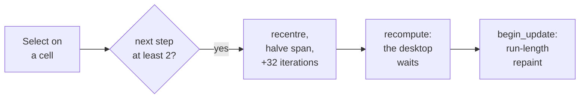

# 7. Fixed point on the desktop: Mandelbrot

The second Wimp demo draws the Mandelbrot set in colour, in a window, and zooms when
clicked. It is small, and every design choice in it answers a real constraint of this
platform: no floating point, a co-operatively multitasked desktop, a slow redraw path, and
a link line that names its objects by hand. This chapter walks through those choices.

## Q16.16, because there is no floating point

Chapter 2 removed the floating-point registers, and chapter 4 has no soft-float library,
so a `Float64` anywhere fails to link. The demo's docstring does not treat fixed point as
a workaround: *it is what you would have written for a StrongARM in 1996*, and far quicker
than any soft-float emulation.

In **Q16.16** a 32-bit integer holds a number times 65,536: sixteen bits of whole part and
sixteen of fraction.

```mojo
comptime ONE = 65536                    # 1.0 in Q16.16
comptime FOUR = 4 * ONE                 # escape radius, squared
```

The only non-trivial operation is multiplication. The product of two Q16.16 numbers needs
64 bits on the way through, before shifting back:

```mojo
@always_inline
fn qmul(a: Int32, b: Int32) -> Int32:
    """Q16.16 multiply: the product needs 64 bits on the way through.

    On a 32-bit ARM that is a register pair, and LLVM turns it into a
    single SMULL - an instruction even a StrongARM has.
    """
    return Int32((Int64(a) * Int64(b)) >> 16)
```

`SMULL` multiplies two 32-bit values into a 64-bit result in one instruction. So the inner
loop costs three multiplies per iteration, each a single instruction.

### Constants as integer arithmetic

One compile error shaped the source. `Int32(-0.75 * ONE)` does not compile, because a
float literal will not convert. So the starting view is written as exact integer
arithmetic:

```mojo
var centre_x = Int32(-3 * ONE // 4)
var centre_y = Int32(0)
var half = Int32(3 * ONE // 2)
```

The commit's comment: in a fixed-point program, the integer form is the honest one anyway.

## The escape loop

The view is a centre and a half-span rather than a pair of corners, because that is what
zooming acts on. Each cell iterates z ← z² + c until |z|² passes 4:

```mojo
var cy = upper
for row in range(ROWS):
    var cx = left
    for col in range(COLS):
        var zr: Int32 = 0
        var zi: Int32 = 0
        var n: Int32 = 0
        while n < max_iter:
            let zr2 = qmul(zr, zr)
            let zi2 = qmul(zi, zi)
            if zr2 + zi2 > FOUR:
                break
            let t = zr2 - zi2 + cx
            zi = qmul(zr, zi) * 2 + cy
            zr = t
            n += 1
        buf[row * COLS + col] = UInt8(colour_of(n, max_iter))
        cx += step
    cy -= step
```

Rows run down the screen while the imaginary axis runs up, so the loop starts at the top
of the range and subtracts. The escape count becomes one of eight Wimp colours, cycling;
points inside the set are black. The docstring explains the cycling: a steady ramp over
only sixteen desktop colours would put most of the interesting structure in one shade.

The grid is 128 × 128 cells of 4 OS units each. The vertical range is ±1.5, where the ASCII
demo uses ±1.25. That is not a different view, commit `c4b9c847dd` explains. Character cells
are twice as tall as they are wide, and these cells are square.

## Three design decisions

Commit `c4b9c847dd` names three things in the program as *design rather than detail*.

### 1. Compute before becoming a task

```mojo
fn main():
    # Before Wimp_Initialise on purpose: this takes a moment, and a task
    # that is not yet a task cannot hold up anybody else's redraw.
    let buf = wimp.alloc(Int32(COLS * ROWS))
    ...
    compute(buf, centre_x, centre_y, half, max_iter)

    let task = wimp.initialise("Mandelbrot")
```

RISC OS multitasks co-operatively. While a Wimp task is computing and not calling
`Wimp_Poll`, no other application on the desktop runs. A program that is not yet a task
holds nobody up. Computing inside the poll loop would freeze the desktop for the duration;
computing inside a redraw would repeat that on every expose.

### 2. Keep the picture, not just the maths

The result is kept as one byte per cell, so a redraw repaints instead of recomputing. The
buffer comes from `wimp.alloc`, which exposes the runtime's never-freed arena. In the
commit's words, a program that draws needs somewhere to keep what it drew.

### 3. Run-length encode each row

Drawing is the slow path: every rectangle is a `PLOT` call through the VDU drivers. The set
has long bands of one colour, so each row is drawn as runs:

```mojo
for row in range(ROWS):
    let y1 = plot_top - Int32(row) * CELL
    let y0 = y1 - CELL
    var col = 0
    while col < COLS:
        let c = Int32(buf[row * COLS + col])
        var run = 1
        while col + run < COLS and Int32(buf[row * COLS + col + run]) == c:
            run += 1
        wimp.set_colour(c)
        fill_rect(ox + Int32(col) * CELL, y0,
                  ox + Int32(col + run) * CELL - 1, y1 - 1)
        col += run
```

A band of one colour costs one rectangle instead of one per cell.

## Zoom, and its floor

Select zooms in on the clicked point, and Adjust zooms back out. That is the RISC OS
convention for a pair of opposite actions, and it saves inventing a menu for two verbs
(commit `3ce3feed0d`):

```mojo
if buttons == SELECT:
    let next_half = half // 2
    if step_for(next_half) >= MIN_STEP:
        let step = step_for(half)
        centre_x = centre_x - half + (dx // CELL) * step
        centre_y = centre_y + half - (dy // CELL) * step
        half = next_half
        depth += 1
        changed = True
elif buttons == ADJUST:
    if depth > 0:
        half = half * 2
        depth -= 1
        changed = True
```

Iterations rise with depth: 64 at the top, then 32 more per zoom, capped at 256. A deeper
view at a fixed 64 iterations reads as almost entirely inside the set.


<!-- doccrate:keep-together:start -->

### Q16.16 sets the floor

The fraction is sixteen bits, so the finest step is 1/65,536. From a span of 3.0 across
128 cells, the step between cells starts at 1,536 units and halves with each zoom:

| Zoom | Step between cells, in 1/65,536 |
|---:|---:|
| 0 | 1,536 |
| 3 | 192 |
| 6 | 24 |
| 9 | 3 |

<!-- doccrate:keep-together:end -->


By the ninth zoom the picture is visibly quantised. So zooming in is **refused** once the
next step would fall below 2, instead of letting the picture dissolve into blocks. The
docstring is precise about the remedy: more iterations do not help, and going deeper needs
a wider fixed point.


<!-- doccrate:keep-together:start -->

### One click, end to end



<!-- doccrate:keep-together:end -->


## No hourglass, and why

The recompute after a zoom blocks `Wimp_Poll`, and so blocks the whole desktop. The RISC OS
way of admitting that is an hourglass pointer, and the source says one belongs here. It
cannot have one yet:

```mojo
# An hourglass belongs here and cannot have one yet:
# hourglass.on() exists as a binding and as a C shim, but
# only swis_os and swis_wimp of the library's 45 modules
# are ever compiled and linked, so it fails with
# "undefined: Hourglass_On". The fix is the library
# becoming an archive the linker draws from, not another
# object hardcoded into the link line.
```

This is the link line from chapter 1 meeting the linker limit from chapter 3.
**INFERRED:** roscc reads archives but includes every member, so an archive alone would
link all 45 shim modules into every program — including both copies of the duplicated
`DrawFile` function from chapter 5. The fix the comment asks for also needs **archive
member pulling** in roscc: including only the members that resolve undefined symbols,
which is already on its list of gaps.

The comment also records the real answer if the recompute ever takes longer than a second
or so: slice the work across Wimp null events, so the desktop keeps running between rows.


<!-- doccrate:keep-together:start -->

### Verified on the Pi 4

Recorded on farm machine charlie:

| Action | Result |
|:---|:---|
| Select on the neck between the cardioid and the period-2 bulb | zoom 2, at 96 iterations, centred there |
| Adjust | back to zoom 1, at 64 iterations |
| the zoom's recompute | runs through the arena in the application slot, after commit `d2ab069` |

<!-- doccrate:keep-together:end -->


