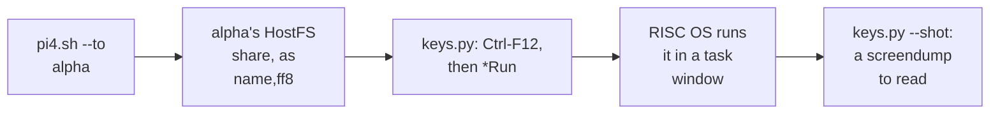

# 8. Running and verifying it

A toolchain that produces images proves nothing until something runs them and checks
what happened. This chapter covers how Mojo programs reached the emulated Pi 4 and were
checked there: the build script, the host share, the four-machine farm, a typing tool
that had to slow down, and self-checking programs. It ends with the StrongARM sandbox on
RPCEmu, where the earliest bugs were caught, and a ledger of what ran where.

## `pi4.sh`: build, link, deliver

The published build script takes program names and does the whole host side:

```text
riscos-test/pi4.sh hello_world                     build only
riscos-test/pi4.sh --to alpha hello_world          build, then into alpha's share
riscos-test/pi4.sh --to alpha --as hello hello_world
```

For each name, it compiles and links with the commands in chapter 1, then copies the
image into the named farm machine's share. Two behaviours came from use:

- **A failing program does not end the sweep** (commit `d41626b038`). The point of
  building them all is to find out how many are bad.
- **The image is written beside its source**, as `name_a72,ff8`, so the Pi 4 build and the
  StrongARM build of the same demo do not overwrite each other.

A failed compile prints the first three error lines from the compiler's log. A successful
link prints the image size, and where it was delivered.

## Getting the file into the guest

Each farm machine has a HostFS share: a directory on the host that the guest sees as a
filing system. The [HostFS walkthrough](../HostFSWalkthrough/index.md) covers how that
works. The build script's comment records what was measured on the farm, rather than
assumed, about getting a program to run from it.

The HostFS on the farm's card image at that time **stored no file metadata**. `*Ex` showed
load and exec as zero, and `*SetType` was accepted and silently discarded. But `*Run`
honours the `,ff8` suffix as the filetype. So the whole guest side is one command in a task
window:

```text
*Run HostFS:$.hello_world,ff8
```

Two guesses about what else was needed were both wrong, and the commit says so. The image
did not need copying to the card first. And there was no ten-character name limit to work
around.


<!-- doccrate:keep-together:start -->

## The farm

`riscos-pi4/tools/farm.py`, in the QEMU fork, runs **four named RISC OS machines that
cannot tread on each other**. Its docstring names the three things two copies of the
emulator would otherwise share, and each is a way for them to corrupt each other's work:

| Shared by default | What each farm machine gets instead |
|:---|:---|
| the disc | its own qcow2 overlay over one read-only card image; a new machine costs a few hundred kilobytes, not two gigabytes |
| the HostFS share | its own directory, so build outputs cannot collide |
| the QMP control port | its own port, 4471 to 4474; the single-machine launcher's 4461 is left alone |

<!-- doccrate:keep-together:end -->


The machines are named alpha, bravo, charlie and delta. The docstring's reason for names:
"charlie is wedged" is a sentence, while "instance 2 is wedged" is a lookup. They run
headless by default. QMP does screendumps and input perfectly well with no display, and
four windows is not something anyone wants.


<!-- doccrate:keep-together:start -->

#### The farm's commands

| Command | Does |
|:---|:---|
| `farm.py create` | makes, or repairs, all four instances |
| `farm.py up alpha`, `up all` | starts one, or all |
| `farm.py status` | which are running, on which port |
| `farm.py shot alpha` | a screendump into that machine's screen directory |

<!-- doccrate:keep-together:end -->


<!-- doccrate:keep-together:start -->

#### The farm, continued

| Command | Does |
|:---|:---|
| `farm.py hmp alpha "info registers"` | a QEMU monitor command |
| `farm.py down bravo` | stops one, politely and then firmly |
| `farm.py reset charlie` | throws away its disc writes and keeps its share |
| `farm.py ls` | names, ports and paths |

<!-- doccrate:keep-together:end -->


## Typing at a machine

`keys.py` types command lines into a farm machine over QMP, and reads the screen back:

```text
keys.py alpha --f12 --line "Cat HostFS:" --shot
keys.py alpha --line "Run HostFS:$.hello" --shot --wait 4
```

Its docstring records three decisions:

- **Explicit key-down and key-up events, never QMP's `send-key`.** `send-key` goes through
  a delayed queue, which interleaves with immediate events and scrambles the shift state
  halfway through a word.
- **The guest keymap is UK.** The shifted punctuation is not the US arrangement: `"` is
  Shift-2, and `@` is Shift-apostrophe.
- **Only the characters a command line needs are mapped.** Anything else raises an error,
  rather than silently typing something different.

### Why typing got slower

The first timings held each key for 30 ms. Commit `ac5223853d` doubled them after
`$.othello,ff8` arrived at the guest as `$>OHELL<FF*`, twice, on two different machines.
It was not a mapping error. The guest polls the emulated USB keyboard on its own schedule,
and with four machines running, key transitions that fell between two polls were never
seen. A missing *shift release* is the expensive case. The rest of the word arrives
shifted, and the line becomes a plausible-looking command that fails for a reason that has
nothing to do with typing. So the investigation goes to the filing system instead.

```python
HOLD = 0.06          # how long a key stays down
GAP = 0.06           # and the pause before the next one
MODGAP = 0.03        # settle after pressing a modifier, and before releasing
```

The commit ends on the point: *typing a command line is not a benchmark.*


<!-- doccrate:keep-together:start -->

### One program, from host to screen



<!-- doccrate:keep-together:end -->


<!-- doccrate:keep-together:start -->

## Programs that check themselves

A program that merely starts proves little. Commit `d41626b038` built all six console
demos for the Pi 4, and ran the two that **check their own answers**:

| Program | Prints | Expected |
|:---|:---|:---|
| fib | `fib(90) = 2880067194370816120` | 2880067194370816120 |
| sieve | `pi(10000) = 1229` | 1229, largest prime 9973 |

<!-- doccrate:keep-together:end -->


`fib(90)` does not fit in 32 bits, so that line also proves the runtime's 64-bit division
and arithmetic working on the A72. Both answers were checked again after the heap moved into
the application slot.

The same commit explains how the NEON fault in chapter 2 went unnoticed for so long. The
demo set had only ever been built for the StrongARM, which has no NEON for LLVM to reach
for. So the StrongARM builds got the right answer, for a reason that did not hold on a
Cortex-A72.


<!-- doccrate:keep-together:start -->

## The StrongARM sandbox

Before the Pi 4 farm existed, programs ran on **RPCEmu Instrument**, a fork of RPCEmu with
a headless interpreter driven by JSON-RPC:

| Tool | What it does |
|:---|:---|
| the fault trap | stops on the faulting instruction, and reads symbols from the ELF the toolchain writes beside its image |
| breakpoints and watchpoints | by address or by symbol |
| snapshots | a booted machine restored in 0.020 s from 1.5 MB, against a 9-second boot |
| the guest portal | a 504-byte RISC OS module that lets a host script drive the guest |

<!-- doccrate:keep-together:end -->


That sandbox caught the earliest runtime bugs. The fault trap found the missing stack in
chapter 4, with `r13 = &80000000`. The `Wimp_Initialise` register bug in chapter 5 aborted
inside the ROM there, and after the fix the `wimp_window` demo opened its window. The Mojo
README calls the tool a GDB stub. It is not one: it is the JSON-RPC fault trap.


<!-- doccrate:keep-together:start -->

## What ran, where

| Date | Where | What | Evidence |
|:---|:---|:---|:---|
| 8 Sep | build only | `hellomojo,ff8`, 432 bytes | disassembly |
| 9 Sep | RPCEmu, StrongARM | `wimp_window` opened a window | ROSCC `b3fe9b9` |
| 9 Sep | RPCEmu, StrongARM | `natural,ff8` printed through `print` | the review of 10 Sep |
| 10 Sep | RPCEmu, StrongARM | a Mojo relocatable module: 48 of 48 live checks | the review of 10 Sep |

<!-- doccrate:keep-together:end -->


<!-- doccrate:keep-together:start -->

#### What ran, where, continued

| Date | Where | What | Evidence |
|:---|:---|:---|:---|
| 12 Sep | Pi 4 farm, all four machines | `hello_world` printed both lines | `9db30e1167` |
| 12 Sep | Pi 4 farm | fib and sieve checked their own answers | `d41626b038` |
| 12 Sep | Pi 4, alpha | Othello played by mouse | `7a3b81b82d`, `6e23dc2431` |
| 12 Sep | Pi 4, charlie | Mandelbrot zoomed in and out | `3ce3feed0d` |
| 12 Sep | Pi 4 farm | all of them again, after the heap moved to the slot | ROSCC `d2ab069` |

<!-- doccrate:keep-together:end -->


Every entry is recorded by the project, in commit messages or its review. Screens were read
with screendumps, and the records note one rule of evidence: read the screendump just taken.

**Not recorded anywhere:** compile times, run times or benchmarks for any Mojo program on
either machine.
