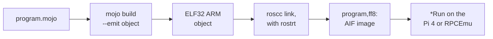

# Mojo for RISC OS

**How a fork of the Mojo compiler, a small Rust linker called roscc, and a C runtime
together put Mojo programs on RISC OS 5 — first on an emulated StrongARM, then on the
emulated Raspberry Pi 4 — and what the Wimp demos that run there teach about every
layer underneath.**

Porting a language to RISC OS normally means writing a RISC OS code generator. This
project took another route. The compiler emits ordinary ARM object files, and a
separate back end turns them into RISC OS programs. roscc's README puts the idea in
one line:

> roscc is **not a compiler**. It is the part that knows what RISC OS is: image
> formats, the application slot, the AIF header, filetypes.

So the port became a runtime and a linker, and not a new code generator. By the
evening of 12 September 2026, Mojo programs were printing to the screen, checking
their own arithmetic, and running as desktop applications — Othello and a zoomable
Mandelbrot set — on the emulated Pi 4.

<!-- doccrate:keep-together:start -->

## These documents

| Chapter | What it covers |
|:---|:---|
| [1. A language port as a runtime and a back end](01-shape.md) | the repositories, the two profiles, the chain |
| [2. From `.mojo` to an ARM object](02-compiler.md) | the fork, the ARM backend, and a NEON fault |
| [3. roscc: ELF in, AIF out](03-roscc.md) | a code walk of the linker |
| [4. rostrt: the smallest runtime](04-rostrt.md) | start-up, memory, output, what is missing |
| [5. The PRM as data](05-bindings.md) | generating a library for 440 SWIs |

<!-- doccrate:keep-together:end -->

<!-- doccrate:keep-together:start -->

#### These documents, continued

| Chapter | What it covers |
|:---|:---|
| [6. A Wimp application: Othello](06-othello.md) | a desktop task in Mojo, and the bugs it found |
| [7. Fixed point on the desktop: Mandelbrot](07-mandelbrot.md) | Q16.16, run-length redraw, and a zoom floor |
| [8. Running and verifying it](08-running.md) | the Pi 4 farm, typing over QMP, what ran |
| [9. The unpublished half](09-status.md) | modules, reproducibility, and an honest ledger |

<!-- doccrate:keep-together:end -->

<!-- doccrate:keep-together:start -->

## At a glance

| | |
|:---|:---|
| **Compiler** | a fork of Mojo, emitting ELF32 ARM objects for `armv8a-none-eabi` or `armv4-none-eabi` |
| **Back end** | roscc: 977 lines of Rust; ELF in, AIF executable out, at `&8000` |
| **Runtime** | rostrt: C and assembly, built with clang, one C shim per SWI |
| **Library** | 439 generated bindings covering 440 of 584 documented SWIs |
| **Targets** | Cortex-A72 on the QEMU Pi 4; StrongARM on RPCEmu |
| **Images** | hello world 9,824 bytes; Othello 13,852; Mandelbrot 12,232 |

<!-- doccrate:keep-together:end -->

<!-- doccrate:keep-together:start -->

### The chain, end to end

<!-- doccrate:keep-together:end -->

This document describes the published state on 13 September 2026: MojoRISCOS branch
`riscos` at `3ce3feed0d`, ROSCC at `707a35f`, and the QEMU fork at `e7e6deffae`. Where
part of the toolchain used for the runs is not in those repositories, the text says so.
