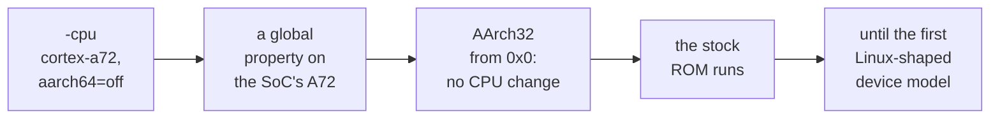

# 1. The premise

## A sandbox for a compiler

The project began as a testing problem, not an emulation hobby. The RISC OS compiler
toolchain, `roscc`, targets **ARMv8-A in 32-bit mode**, tuned for the Cortex-A72 in
a Raspberry Pi 4. Its output uses instructions that older ARM cores refuse:

- `CRC32` and `CRC32C`
- the load-acquire and store-release family, `LDA`, `STL`, `LDAEX`, `STLEX`
- the ARMv8 floating-point additions such as `VMAXNM`, `VSEL` and `VCVTA`

The existing test sandbox was RPCEmu, an emulated Acorn Risc PC — at heart a
StrongARM, an ARMv4-era core. Every one of those instructions fails there. A plan
already existed to teach RPCEmu's interpreter to decode A72 instructions. But that
would still be, in the design record's words, a Risc PC with a StrongARM
pretending.

The alternative was to emulate the machine the compiler actually targets: **a
Raspberry Pi 4, running RISC OS 5, on a real Cortex-A72 in AArch32.**

## One ROM for every Pi

RISC OS Open ships one Raspberry Pi ROM image for every model from the Pi 1 to the
Pi 4. It detects the SoC at run time and takes different paths in its hardware
abstraction layer (HAL). The first trace showed the detection working. The same
binary picked the peripheral base `0x3F000000` on QEMU's Pi 2 and `0xFE000000` on
its Pi 4.

So the ROM would run on QEMU's older `raspi2b` machine too, and did — as far as
the same early hang. That machine was ruled out for a different reason. Its CPU is
a Cortex-A7, an **ARMv7** core, which rejects the ARMv8 instructions `roscc`
emits. Moving the sandbox from ARMv4 to ARMv7 would not fix the problem it existed
to fix.

<!-- doccrate:keep-together:start -->

## The routes weighed

| Route | Why it was, or was not, taken |
|:---|:---|
| RPCEmu, extended | still a Risc PC; the A72 instructions are bolted onto an ARMv4 machine |
| QEMU `raspi2b` | runs the ROM, but a Cortex-A7 refuses what the compiler emits |
| A new emulator | a JIT is available off the shelf, but it is a user-mode core — no MMU, no banked registers, no exception vectors; *"months"* |
| **QEMU `raspi4b`** | **a real A72 translator and a Pi 4 memory map, already built** |

<!-- doccrate:keep-together:end -->

The new-emulator route was costed honestly and kept as a fallback. It had
conditions attached. It would be revisited only if the display path proved
structurally unfixable in QEMU, or if QEMU measured slower on real RISC OS code
than the RPCEmu interpreter already was. Neither happened.

<!-- doccrate:keep-together:start -->

## Speed was not the problem

The speed comparison that made QEMU credible was measured on the i7-12700:

| Emulator | Workload | Millions of instructions a second |
|:---|:---|---:|
| RPCEmu interpreter | RISC OS desktop, idle | 205 |
| RPCEmu dynamic recompiler | RISC OS desktop, idle | ~920 |
| QEMU TCG, `raspi2b` (A7) | two-instruction register loop | 2,016 |
| **QEMU TCG, `raspi4b`, A72 in AArch32** | **two-instruction register loop** | **2,071** |
| QEMU TCG, `raspi2b` (A7) | six-instruction load/store loop | 465 |
| **QEMU TCG, `raspi4b`, A72 in AArch32** | **six-instruction load/store loop** | **579** |

<!-- doccrate:keep-together:end -->

The QEMU figures come from a 100-byte bare-metal ARM blob, timed by the emulated
system timer and printed over the emulated serial port. For scale, a real Pi 4 core
is put at roughly 1,000–1,800 — an estimate reasoned from instructions per clock
cycle, not a measurement.

The design record reads its own numbers carefully. The register loop is an upper
bound, because TCG chains it into a tight host loop with no memory traffic. The
load/store figure is the realistic one, though still a synthetic loop rather than OS
code. The conclusion holds even so: QEMU is in the class of RPCEmu's dynamic
recompiler, several times its interpreter, and **on the right instruction set.**

## The CPU half was free

This is the finding that reframed the project. It was widely believed that
`raspi4b` is 64-bit only, because the machine hard-codes its CPU. The SoC model
names the Cortex-A72 directly, so `-cpu` looks as though it can do nothing there.

It can. When `-cpu cortex-a72,aarch64=off` is given, QEMU records the feature list
as **global properties on that CPU type**, applied when any instance of it is
created. The SoC never consults `-cpu`. But the A72 it creates still picks up
`aarch64=off`. Under TCG that is allowed whenever AArch32 is available at the
CPU's highest exception level, which on an A72 it is.

<!-- doccrate:keep-together:start -->

#### What `aarch64=off` changes

The evidence, from the first afternoon:

| Command | First instructions executed |
|:---|:---|
| `-M raspi4b` | AArch64 at `0x80000`: the ROM's 32-bit vectors decoded as A64 garbage. Dead |
| **`-M raspi4b -cpu cortex-a72,aarch64=off`** | **AArch32 from `0x0`, into the ROM. Reaches the HAL** |
| `-M raspi3b` | AArch64 at `0x80000`. Dead |
| `-M raspi2b` | AArch32, ROM at `0x10000`. Reaches the HAL |

<!-- doccrate:keep-together:end -->

The bare-metal benchmark confirmed the rest. In the 32-bit Pi 4 case the BCM2711
peripheral base at `0xFE000000` is live. The serial port at `0xFE201000` and the
system timer at `0xFE003004` both answered.

**No change to QEMU's CPU emulation was needed to run the ROM.** The fork's one
commit under `target/arm` came days later, during the HostFS work. That commit
itself records that it fixed nothing (chapter 7).

<!-- doccrate:keep-together:start -->

## What else QEMU already gave

A test sandbox needs more than a CPU, and QEMU already had most of it. These are
the needs the RPCEmu sandbox had identified, mapped onto what QEMU ships:

| Need | On QEMU |
|:---|:---|
| registers, memory, breakpoints, watchpoints, exact single-step | the gdbstub, plus `-accel tcg,one-insn-per-tb=on` |
| halt, continue, machine state | QMP: `stop`, `cont`, `query-status` |
| screenshots | QMP `screendump` |
| snapshots | `savevm` and `loadvm` against a qcow2 image |
| determinism | `-icount`, with record/replay on top |

<!-- doccrate:keep-together:end -->

The design record's one-line answer to "an interpreter and an optional JIT" was
that **QEMU is the JIT**. Setting one instruction per translation block, with the
gdbstub, gives the interpreter-shaped debugging mode.

## The machine half was the work

With the right CPU running the right instruction set from the right address, the
ROM starts — and a few thousand instructions later it stops, waiting for
something.

<!-- doccrate:keep-together:start -->

#### Linux and RISC OS, compared

Every blocker from there on was the same kind of thing: **an assumption in QEMU's
Raspberry Pi models that Linux satisfies and RISC OS does not.** Each difference in
this table turns into a section of a later chapter.

| Linux on a Pi | RISC OS 5 on a Pi |
|:---|:---|
| boots in AArch64 | boots in AArch32 |
| reads a device tree | reads no device tree; the HAL has a fixed device table |
| powers devices with property tag `0x28001` | powers USB through the legacy mailbox channel 0 |
| secondary cores use a 64-bit spin table | writes a 32-bit entry address to each core's mailbox |
| waits with timeouts | several waits have no timeout at all |
| never uses the legacy interrupt controller's FIQ banks | runs USB entirely from the FIQ |

<!-- doccrate:keep-together:end -->

A QEMU model can be perfectly good for Linux and still wrong for RISC OS in every
row of that table, because Linux never asks those questions.

<!-- doccrate:keep-together:start -->

### Where the work actually was

<!-- doccrate:keep-together:end -->

## Prior art

The fork was not the first attempt, and the design record lists what came before
so that nothing was rediscovered blind:

- **Two public projects from August 2026** boot the same stock 5.30 ROM on QEMU's
  older Pi 2 machine, with a large patch to QEMU 10.2. They reportedly add a
  channel-0 power device and a VCHIQ peer, among other fixes. Their channel-0
  diagnosis matches the one in chapter 2, which was reached independently. The
  design record treats that as the strongest evidence either way.
- **A 2013 effort** booted the RISC OS Pi desktop on an out-of-tree BCM2835 branch
  of QEMU, with both QEMU and the ROM patched.
- **The RISC OS Open forum record** shows hangs at module initialisation (2016),
  getting no further for want of a working timer (around 2021), and a lock-up when
  enabling USB power (2025). All of these are consistent with what chapters 2 and 3
  found.
- **A maintainer's position**, from 2023, argues against a QEMU fork. It favours a
  RISC OS HAL for QEMU's generic `virt` machine with VirtIO devices. Nobody has
  written that HAL. The design record notes it as the view of the people who
  maintain the OS.
