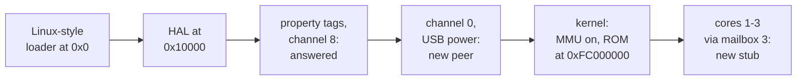

# 2. First light

Chapter 1 left the stock ROM running on an A72 in AArch32. This chapter follows
it through its first second of life. It covers the boot loader QEMU hands it to,
the mailbox call it never returns from, and the three secondary cores that were
quietly executing garbage.

## A loader that thinks it is booting Linux

When QEMU is given a raw image with `-kernel`, its generic ARM boot code assumes
**a Linux kernel**. There is no other kind of raw image it knows how to start. For
a 32-bit image that means:

- the image is loaded at the start of RAM plus `0x10000`
- a small primary loader is written at address 0; it sets `r0 = 0`, `r1` to a board
  number and `r2` to a boot-argument pointer, then jumps to the image — the Linux
  ARM boot protocol
- with no device tree, `r2` points at an ATAGS list at `0x100`
- any secondary cores are reset to a spin stub, which waits to be told where to go

RISC OS ignores all three registers. Its HAL simply begins at the load address,
and the ROM image has its HAL at file offset 0. The Linux loader therefore works
for RISC OS, but by an accident of layout rather than by design.

One consequence has not been checked. QEMU boots a "Linux" kernel non-secure and
enters it at EL2 when the CPU has EL2. It enables secure boot only for the older
BCM2835 and BCM2836 SoCs. **INFERRED:** so the RISC OS HAL is probably entered in
Hyp mode on this machine. The fork's records never discuss it. The register dumps
from the hang show supervisor mode, so the ROM evidently copes.

The fork changes nothing in the loader. It adds one comment to `raspi4b.c`,
noting that no device tree ever reaches a `-kernel` guest, so the device-tree
edits in that file do nothing for RISC OS.


<!-- doccrate:keep-together:start -->

## The first hang: `PC = 0x16764`

The first run used the released QEMU 11.1.0 binary, before any build from source.
It was driven over QMP, with `info registers` sampled across forty seconds. Both
Pi machines stopped in the same place:

| Machine | `R3` | `R15` (the PC) | Mode |
|:---|:---|:---|:---|
| `raspi2b` | `3F00B800` | `00016764` | supervisor |
| `raspi4b` + `aarch64=off` | `FE00B800` | `00016764` | supervisor |

<!-- doccrate:keep-together:end -->


`R3` is the VideoCore mailbox, at the peripheral base plus `0xB800`, and it differs
between the two runs. **The same ROM binary picked the BCM2836 base on one machine
and the BCM2711 base on the other.** So SoC detection worked, and the Pi 4 run
really was on the Pi 4 code paths.

The mailbox trace showed the property channel working well. The ROM sent a full tag
list — MAC address, serial number, ARM and VideoCore memory, board model and
revision, DMA channels, clock rates — and QEMU answered all of it. Then the ROM
posted one message on a different channel, and the trace became a single line
repeated millions of times:


<!-- doccrate:keep-together:start -->

#### The mailbox trace

| Access | Register | Value |
|:---|:---|:---|
| write | `MAIL1_WRITE` (`+0xa0`) | `0x80` |
| read | `MAIL0_STATUS` (`+0x98`) | `0x40000000` — *EMPTY*, 3.9 million times in 12 s |

<!-- doccrate:keep-together:end -->


## What the ROM was asking

The disassembly around the PC is short. In outline, the HAL's USB start-up does
this:

```text
message = (1 << 3) << 4 | 0     ; device bit 3, the USB host controller, on channel 0
write message to MAIL1_WRITE
loop:
    if MAIL0_STATUS has EMPTY set: goto loop     ; no timeout, no retry limit
read the reply
```

A mailbox message carries its channel in the low four bits. **Channel 0 is power
management.** The upper 28 bits are a mask of devices the ARM wants powered, and
the firmware replies on the same channel with the resulting power state. The HAL
is asking the VideoCore to power up the USB host controller, and it waits for an
answer with no timeout at all.

QEMU's mailbox model has defined `MBOX_CHAN_POWER` since the mailbox was first
modelled. **But nothing was ever attached to it.** Only channel 1 (framebuffer)
and channel 8 (property tags) had peers. A message on channel 0 was written into
an unmapped slot of the mailbox's address space and dropped. Nothing ever marked a
reply as available, so `MAIL0_STATUS` said *empty* forever.

Linux never notices, because it powers devices with the property tag `0x28001` on
channel 8 instead. RISC OS uses the legacy interface.

## The fix: a peer that says yes

The whole fix is a new 146-line device, `hw/misc/bcm2835_mbox_power.c`. Its logic
fits in two functions.

A write is the ARM posting a request. The device keeps the requested mask as the new
power state, marks a reply pending and raises the mailbox interrupt:

```c
case MBOX_AS_DATA:
    /* bcm2835_mbox checks our pending status before pushing */
    assert(!s->pending);
    /*
     * Everything we model is always on, so the new state is whatever was
     * asked for. Keep it so a read back reports the same mask.
     */
    s->state = value & ~0xfu;
    s->pending = true;
    qemu_set_irq(s->mbox_irq, 1);
    break;
```

A read is the ARM collecting the reply. The reply is the stored mask with the
channel number in its low nibble. Reading it clears the pending flag and drops the
interrupt:

```c
case MBOX_AS_DATA:
    res = s->state | MBOX_CHAN_POWER;
    s->pending = false;
    qemu_set_irq(s->mbox_irq, 0);
    break;
```

**Every device QEMU models is always powered, so the reply is simply the request.**
That is also exactly what the real firmware returns on success.

Two details follow the conventions of QEMU's existing mailbox peers. The `assert`
relies on the mailbox device checking for a pending reply before it pushes another
message. And the memory region disables QEMU's re-entrancy guard, because the
mailbox device calls into this region and then reads back from it. The property
channel's peer does the same.

## Proving it without RISC OS

A fix that can only be tested by booting a licensed ROM is a poor regression test.
So the fork added `tools/mboxtest.s.in`, a bare-metal ARM program of a few dozen
instructions. It posts the HAL's exact message — channel 0, device bit 3 — and
waits for the reply with a *bounded* spin. It prints the result over the serial
port:


<!-- doccrate:keep-together:start -->

#### The regression test

| Build | Output |
|:---|:---|
| stock QEMU 11.1.0, on `raspi2b` or `raspi4b` | `TIMEOUT` |
| with `bcm2835-mbox-power` | `00000080` — channel 0 in the low nibble, the USB bit set |

<!-- doccrate:keep-together:end -->


The same test was re-run unchanged when the fork reached the M4 Mac and again on
the Intel Mac. It is the one RISC OS-free check the fork carries. Chapter 7 returns
to the lack of in-tree tests.


<!-- doccrate:keep-together:start -->

## The second hang: three cores running garbage

With channel 0 answered, the boot went further. The volume of device traffic, which
the fork used as its progress meter, did not change at all:

| Build | MMIO events in ~12 s | Where it stops |
|:---|---:|:---|
| stock | 1,049,989 | mailbox channel 0, `PC = 0x16764` |
| + channel 0 | 1,049,989 | a new spin: `read 0xff8000c4` |

<!-- doccrate:keep-together:end -->


A histogram of the trace by address made it obvious. **Of the last 300,000 MMIO
events, 298,606 were reads of `0xff8000c4`** — a register in the BCM2711's
ARM-local peripheral block.

The RISC OS kernel starts the other three cores the standard Pi way:

1. It writes an entry address into **mailbox 3** of cores 1, 2 and 3, at
   `0xff80009c`, `0xff8000ac` and `0xff8000bc`.
2. Each secondary core is expected to be sitting in a tiny stub, polling its own
   mailbox 3. It sees the address, clears the mailbox, and jumps.
3. The new code running on each secondary signals back, and core 0 waits by
   polling **its own mailbox 1**, at `0xff8000c4`.


<!-- doccrate:keep-together:start -->

#### How upstream chose the stub

The secondaries never signalled, because they were not running a 32-bit stub.
QEMU's `setup_boot()` chose the secondary stub **by SoC generation**, not by what
the CPU was doing:

| SoC | Stub upstream chose |
|:---|:---|
| BCM2836 (Pi 2) | `write_smpboot`: a 32-bit stub with a board-setup trampoline |
| anything newer (Pi 3, Pi 4) | `write_smpboot64`: an **AArch64** spin table at `0xd8`–`0xf0` |

<!-- doccrate:keep-together:end -->


On a Pi 4 with `aarch64=off`, the three secondaries were reset into an AArch64 stub
while running in AArch32. They fetched 64-bit instructions as 32-bit ARM
instructions, executed them as garbage, and never parked on their mailboxes. This
bug is not specific to RISC OS: **any** 32-bit kernel booted on QEMU's `raspi3b`
or `raspi4b` would meet it. Nobody had hit it because nobody boots 32-bit guests
on those machines.

## The fix: `write_smpboot32`

Commit `86a43faa32` adds a 32-bit stub for the newer SoCs. It uses the same
protocol as the Pi 2 stub, with two differences: it has no board-setup trampoline,
which exists only on the BCM2835 and BCM2836, and it takes the local peripheral
base as a parameter.

```c
static const ARMInsnFixup smpboot[] = {
    { 0xee100fb0 }, /*    mrc     p15, 0, r0, c0, c0, 5 ;get core ID */
    { 0xe7e10050 }, /*    ubfx    r0, r0, #0, #2        ;extract LSB */
    { 0xe59f5014 }, /*    ldr     r5, [pc, #20]         ;load mbox base */
    { 0xe320f001 }, /* 1: yield */
    { 0xe7953200 }, /*    ldr     r3, [r5, r0, lsl #4]  ;read our mbox */
    { 0xe3530000 }, /*    cmp     r3, #0                ;spin while zero */
    { 0x0afffffb }, /*    beq     1b */
    { 0xe7853200 }, /*    str     r3, [r5, r0, lsl #4]  ;clear mbox */
    { 0xe12fff13 }, /*    bx      r3                    ;jump to target */
    { 0, FIXUP_BOOTREG }, /* (constant: mailbox 3 read/clear base) */
    { 0, FIXUP_TERMINATOR }
};
```

Reading it line by line:

- **`mrc` and `ubfx`** read the core's affinity number from MPIDR and keep the low
  two bits: 0 to 3.
- **`ldr r5`** loads a base address from the literal word at the end, which QEMU
  patches in when it writes the stub.
- **The loop** yields, then reads the word at `base + core × 16` — this core's
  mailbox 3 read/clear register — and spins while it is zero.
- **`str` and `bx`**: writing the value back clears the mailbox, and the core jumps
  to the address the kernel sent.

The base is the only thing that differs between SoCs. On the BCM2837 the
ARM-local block is at `0x40000000`, so the base is `0x400000cc`. The BCM2711 moved
the block to `0xff800000`, so its base is `0xff8000cc`.

The selection in `setup_boot()` now looks at the CPU's state rather than only its
generation:

```c
if (processor_id == PROCESSOR_ID_BCM2836) {
    s->binfo.write_secondary_boot = write_smpboot;
} else if (arm_feature(&cpu->env, ARM_FEATURE_AARCH64)) {
    s->binfo.write_secondary_boot = write_smpboot64;
} else {
    s->binfo.write_secondary_boot = processor_id == PROCESSOR_ID_BCM2838
                                  ? write_smpboot32_2838
                                  : write_smpboot32_2837;
}
```

That is the same test QEMU's generic boot code already uses to choose its *primary*
loader. The raspi code had simply never applied it to the secondaries.


<!-- doccrate:keep-together:start -->

### The result

| Build | MMIO events in ~12 s | Where it stops |
|:---|---:|:---|
| + channel 0 | 1,049,989 | secondary-core wait |
| **+ `write_smpboot32`** | **6,024** | **the guest goes quiet** |

<!-- doccrate:keep-together:end -->


A spinning guest produces a million events. A guest that has stopped producing
events has usually taken an exception it cannot recover from. That is where
chapter 3 begins.


<!-- doccrate:keep-together:start -->

### The first second of boot



<!-- doccrate:keep-together:end -->


