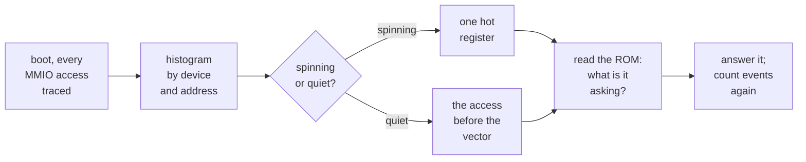
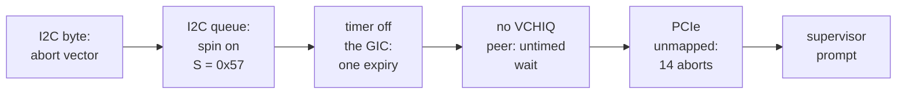

# 3. Tracing beats theorising

Between the secondary-core fix and the supervisor prompt lay five more blockers.
They were found in the space of one afternoon: an I2C controller with three bugs, a
system timer wired to nothing, a VCHIQ handshake with a single possible exit, and
an unmapped PCIe root complex. This chapter is about those fixes, and about the
method that found them. Every attempt to reason from first principles instead
turned out wrong.

## The method

The design record's own summary of the approach is blunt: *tracing beat theorising
every time.* In practice:

1. **Trace every device access.** QEMU's `-trace enable=memory_region_ops_*` logs
   each MMIO read and write with its device, offset and value.
2. **Histogram by device and by address.** A guest spinning on an unanswered
   question produces a million events, and nearly all of them hit one register.
   The blocker announces itself as a single hot address.
3. **If the guest goes quiet instead**, interleave `-d in_asm` (the instructions
   QEMU translates) with the MMIO trace, and read the seam. The last instruction
   before the exception vector is the one that faulted.
4. **Read the ROM at that point**, and work out what the guest was asking.
5. **Fix, and measure the MMIO volume again.** A change in volume shows whether
   the boot moved on.


<!-- doccrate:keep-together:start -->

### The loop that found every blocker



<!-- doccrate:keep-together:end -->


<!-- doccrate:keep-together:start -->

## Three theories that were wrong

The method earned its place by beating three plausible theories, and each one is
worth recording.

| Theory | Why it looked right | What the trace showed |
|:---|:---|:---|
| display bring-up blocks on GPIO tags | with the channel-0 call patched out of a scratch ROM, the last firmware calls before the hang were display-related tags that QEMU answered with nothing | those tags stop nothing |
| VCHIQ blocks the display | published work on the Pi 2 path said so | at that stage the guest had never posted to channel 3 at all |
| the monitor's EDID comes over I2C | an address `0x50` probe on the first I2C bus, where a monitor's EEPROM would sit | `0x50` is the HAL probing for a PCF8583 real-time clock |

<!-- doccrate:keep-together:end -->


The third cost the most, because it was built. An EEPROM model on the first I2C
bus made the probe succeed. RISC OS then read EDID bytes as its CMOS settings. A
real Pi has no clock chip there, so **the correct answer is no answer**. The model
was removed before it was ever committed.

That theory was wrong for a second reason too. QEMU's own `bcm2835-i2c-test`
attaches a temperature sensor at `0x50` on every bus, so any device placed there
would have collided with the upstream test. EDID does not travel over I2C on this
machine at all. It arrives through a firmware property tag, which is chapter 4's
story.

## The I2C controller, three bugs deep

After the secondary-core fix the guest went quiet at 6,024 events. The instruction
trace showed a byte-sized store to the I2C controller's FIFO register at offset
`0x10`, followed immediately by the data abort vector.

### Bug 1: a byte port that refused bytes

The BSC I2C controller's FIFO is a byte port. The HAL writes it with `STRB`,
which is the natural instruction for a byte port. QEMU's model declared every
register 4-byte-only, and QEMU's memory core turns a disallowed access size into a
bus error, which the guest takes as a data abort.

Commit `d742c3b617` widens the access sizes:

```c
.valid = {
    .min_access_size = 1,
    .max_access_size = 4,
},
/*
 * The FIFO is a byte port, and guests do use STRB/LDRB on it. Accesses
 * must reach the handlers at the size the guest used: letting the core
 * synthesise a byte access out of a 32-bit one would turn a byte write
 * into a read-modify-write, and reading the FIFO pops it.
 */
.impl = {
    .min_access_size = 1,
    .max_access_size = 4,
},
```

The subtle half is `impl`. QEMU separates the sizes a guest may use (`valid`) from
the sizes the handler implements (`impl`). If only `valid` had been widened, QEMU
would have emulated each byte write as *read the word, change one byte, write the
word*. For a FIFO both halves are wrong: the read pops a byte, and the write sends
three bytes the guest never sent.

### Bug 2: sub-word addresses

Allowing byte access was only half the job. A byte access at offset 1, 2 or 3 of a
register fell through to the "bad offset" case. On hardware it simply addresses
one byte of the 32-bit register. Commit `57724dbd8e` splits every address into a
word and a byte within it, and merges the written byte into the rest:

```c
hwaddr reg = addr & ~3;
unsigned shift = (addr & 3) * 8;

if (size < 4) {
    uint32_t mask = ((1u << (size * 8)) - 1) << shift;

    switch (reg) {
    case BCM2835_I2C_FIFO:
        if (shift) {            /* only the low byte is the data port */
            return;
        }
        break;
    case BCM2835_I2C_S:         /* write-1-to-clear: unwritten bytes clear nothing */
        writeval = (writeval << shift) & mask;
        break;
    default:                    /* a plain register: merge into the bytes not written */
        writeval = (bcm2835_i2c_shadow(s, reg) & ~mask)
                   | ((writeval << shift) & mask);
        break;
    }
}
```

Two registers need special care. The FIFO's upper bytes are not part of the port,
so reading them returns zero without popping, and writing them does nothing. The
status register is write-1-to-clear. For a plain register, the bytes the guest did
not write are filled in from the current value. Doing that here would clear
whatever bits happened to be set.

### Bug 3: a state machine that dropped the message

With byte access working, the guest spun again, on the status register. It read
`S = 0x57`: *transfer active* and *done* both set. The HAL's transfer loop waits for
*transfer active* to clear. QEMU cleared it only when the data length counted down
to zero, and the count never moved.

The documented way to drive the controller is:

1. set the slave address `A`
2. set the data length `DLEN`
3. fill the FIFO
4. **then** set `ST` in the control register to start

The HAL does exactly that. QEMU's model had two bugs that both break this order:

- **The start condition fired on `I2CEN` as well as `ST`.** Every write that merely
  *enabled* the controller began a transfer, and with `DLEN` still zero it ended
  that transfer at once. By the time the guest set `ST`, the model had opened and
  closed two transfers to the wrong address.
- **There was no transmit FIFO.** Bytes written to the FIFO went straight to
  `i2c_send()`, and were dropped if no transfer happened to be active. The HAL's
  bytes, written before `ST`, vanished.

Commit `59e0d5b5ea` requires `ST` to start a transfer, and adds the hardware's
16-byte transmit FIFO with a drain:

```c
if ((writeval & BCM2835_I2C_C_ST) && (writeval & BCM2835_I2C_C_I2CEN)) {
    bcm2835_i2c_begin_transfer(s);      /* which drains anything already queued */
    ...
}

static void bcm2835_i2c_tx_drain(BCM2835I2CState *s)
{
    while ((s->s & BCM2835_I2C_S_TA) && s->dlen > 0 &&
           !fifo8_is_empty(&s->tx_fifo)) {
        if (i2c_send(s->bus, fifo8_pop(&s->tx_fifo))) {
            s->s |= BCM2835_I2C_S_ERR;
        }
        s->dlen -= 1;
    }
    bcm2835_i2c_update_tx_status(s);
    if ((s->s & BCM2835_I2C_S_TA) && s->dlen == 0) {
        bcm2835_i2c_finish_transfer(s);
    }
}
```

The drain runs from two places. Starting a transfer drains bytes queued
beforehand, and a FIFO write drains bytes queued afterwards, so both orders work.
Clearing the FIFO and finishing a transfer both empty it. QEMU's own I2C test
still passes. The FIFO is new migrated state, so the device's migration version
goes from 1 to 2.

With the state machine fixed, the probe at `0x50` fails cleanly: *done* and
*error* are set, and *transfer active* is clear. The guest moves on to `0x68` on
the *second* I2C bus, where a Pi 4 would carry a DS1307-style clock, and gets the
same honest silence.


<!-- doccrate:keep-together:start -->

### The MMIO volume, fix by fix

| Build | MMIO events in ~12 s | Where it stops |
|:---|---:|:---|
| stock | 1,049,989 | mailbox channel 0 |
| + channel 0 | 1,049,989 | secondary-core wait |
| + 32-bit secondary stub | 6,024 | I2C FIFO byte store: data abort |
| + I2C byte access | 5,685,747 | the `0x50` probe answered by nobody |
| *+ EDID EEPROM (abandoned)* | *5,643,283* | *status spin, `S = 0x57`* |

<!-- doccrate:keep-together:end -->


## Two firmware tags, answered anyway

Two property-tag fixes from the same hour were the "display bring-up" theory's
leftovers. They turned out not to be blockers, but the answers were wrong and are
now right:

- **`f87fdd5f72`**: `SET/GET_TOUCHBUF` and `SET/GET_GPIOVIRTBUF` had fallen through
  to a zero-length reply. Each carries an address the guest gives the firmware and
  may ask for back — the touchscreen's state page, and the virtual GPIO page for
  the activity LED. The model now stores and returns it.
- **`42de159040`**: `SET/GET_GPIO_STATE` is now answered at its documented length,
  with the expander pins reported off. A guest that checks the reply length would
  otherwise see a failure.

## The clock that never ticked

With I2C out of the way, the guest ran on but never advanced. Every timed wait was
infinite. The trace said it plainly, over the whole run: **one** write to a
system-timer compare register, **one** timer expiry, and **no** interrupt
acknowledgement, ever.

The cause was in the SoC model. A BCM2711 has two interrupt controllers: the old
BCM2835-style controller and a GIC-400. A Pi 4 guest uses the GIC. QEMU's
`bcm2838_realize()` re-routes each peripheral's interrupt line from the legacy
controller to the GIC: UART0, AUX, I2C, mailbox, SDHOST, EMMC, MPHI, DWC2 and DMA.
**The system timer was missing from that list.** Its four compare outputs were
wired once, in the shared BCM2835 code, to the legacy controller, and nothing ever
forwarded them.

RISC OS uses compare 1 as its centisecond tick, and enables GIC interrupt 97 for
it. That is SPI 65: the legacy VideoCore interrupts appear at SPI 64 plus their
number. The timer expired once, set its status bit, and raised a line into a
controller nobody was listening to. The OS then waited for a clock that could not
advance.

Commit `57651d54ce` adds the missing loop:

```c
/*
 * Connect the system timer to the interrupt controller. Without this its
 * compare outputs reach only the legacy interrupt controller, which a
 * guest driving a BCM2711 through the GIC never looks at -- the timer
 * fires, sets its status bit, and nobody is told.
 */
for (int n = 0; n < 4; n++) {
    sysbus_connect_irq(SYS_BUS_DEVICE(&ps_base->systmr), n,
                qdev_get_gpio_in(gicdev, GIC_SPI_INTERRUPT_SYSTIMER0 + n));
}
```


<!-- doccrate:keep-together:start -->

### Before and after

| | Before | After |
|:---|---:|---:|
| timer expiries in ~20 s | 1 | 1,335 |
| timer interrupt acknowledgements | 0 | 1,335 |
| GIC acknowledge reads for interrupt 97 | 0 | 2,953 in 45 s |

<!-- doccrate:keep-together:end -->


This is the bug the RISC OS forum's history had described years earlier, as a boot
that got no further for want of a working timer. It affects any guest that uses the
system timer through the GIC on `raspi4b`. With it fixed, RISC OS services its tick,
dispatches SWIs, runs module code in RAM, starts probing the USB controller — and
posts its first message to mailbox **channel 3**.

## VCHIQ: a wait with exactly one exit

Channel 3 is VCHIQ, the message queue between the ARM and the VideoCore GPU. QEMU
has never had a device on it. The guest posts the bus address of a `slot zero`
structure — the queue's shared memory — and waits.

**The wait cannot be failed from outside.** The connect call blocks on a counting
semaphore with no timeout, no deadline and no register the guest re-reads. No value
QEMU could return and no error it could inject would end it. The only exit is a real
`CONNECT` message written into shared memory, followed by a doorbell interrupt.

The module making that call was not the video driver either. The ROM initialises
its modules in this order, and it is **BCMSound** whose initialisation calls
`VCHIQ_Connect` unconditionally:

> RTSupport → USBDriver → DWCDriver → XHCIDriver → VCHIQ → **BCMSound** → ScreenModes → BCMVideo

The display code never ran at all. The boot was stuck in the sound driver.


<!-- doccrate:keep-together:start -->

### Reading the structure out of a live guest

Before a line of the peer was written, the slot-zero structure was read out of the
stalled guest's memory:

| Field | VideoCore side, at `+0x20` | ARM side, at `+0x194` |
|:---|:---|:---|
| `initialised` | 0 | 1 |
| `slot_first` / `slot_last` | 2 / 32 | 34 / 64 |
| `tx_pos` | — | 8 |
| `slot_queue[0]` | — | 34 |

<!-- doccrate:keep-together:end -->


Slot 34 already held a `CONNECT`, written by the guest and never read. The peer
derives the stride between the two sides from the structure's own `slot_zero_size`
field rather than hard-coding it. A debug array sits at the end of the structure,
and its length is a build option.

### What the peer does

Commit `1013487c14` adds `hw/misc/bcm2835_vchiq.c`. It is not a VideoCore; it
completes the handshake and nothing more:

1. set the VideoCore side's `initialised` flag
2. fill the slot queue, which the guest zeroed and expects the VideoCore to own
3. arm its own trigger, and queue a `CONNECT` of its own
4. ring the VideoCore-to-ARM doorbell, at mailbox base `+0x40`, on SPI 34 (GIC
   interrupt 66, one above the mailbox)
5. then **refuse every service the guest opens**: `AUDS`, `GCMD`, `DISP`, `TVSV`

**Refusing is the correct answer, not a shortcut.** Accepting `AUDS` walks BCMSound
into a blocking message queue, and accepting `TVSV` arms two more spins with no
timeout. A clean refusal leaves the driver's `GPUModeAvailable` at zero. Mode
setting then falls back to the property channel, which QEMU already models
completely.


<!-- doccrate:keep-together:start -->

#### The tags that followed

The proof is the sequence of property tags that follows, which had never appeared
before:

| Tag | Meaning |
|:---|:---|
| `0x00010006` | get VideoCore memory: **BCMVideo's init, running at last** |
| `0x00030020` | get the EDID block |
| `0x00048001` | release the framebuffer |
| `0x00048003`–`0x00048007`, `0x00040008` | size, depth, pixel order, alpha, pitch |
| `0x00040001` | **allocate the framebuffer** |
| `0x00040002`, `0x0004800b` | unblank; set the palette |

<!-- doccrate:keep-together:end -->


### A doorbell that must be read to clear

One doorbell detail matters more than its size suggests:

```c
case VCHIQ_BELL0:
    /*
     * Read to clear. The guest's VCHIQ device declares no device-specific
     * interrupt clear, so this read is the only thing that lowers the
     * line -- and the interrupt is level triggered, so failing to lower
     * it here would put the guest in an interrupt storm.
     */
    val = s->bell0;
    s->bell0 = 0;
    qemu_set_irq(s->bell_irq, 0);
    return val;
```

The doorbells live inside the address range the mailbox device already claims. So
they are overlaid at a higher priority, rather than by reaching into the mailbox
model.

### Review fixes, the same evening

Commit `baddb065d3` came from review:

- **An over-strict address check went.** The peer had required the slot-zero
  address to use the `0xC0000000` bus alias. That holds on a Pi 2 and later, but a
  Pi 1 uses `0x40000000`. The device is built into *every* raspi machine through
  the shared peripherals code, so the check would have broken Pi 1 guests.
- **Every number read from the guest is now bounded**: the slot-zero size (an
  unsigned subtraction that could underflow), the slot range, the queue entries and
  each message's size field. None of these could reach host memory, because every
  access goes through the guest's DMA address space. But a confused guest could
  have had the device scribble over its own RAM.

The peer later grew well past a refuser. It accepts `AUDS` for sound and `DISP`
for the mouse pointer, and it is 1,581 lines at the head used here — see the
[graphics and sound walkthrough](../GraphicsSoundWalkthrough/index.md). Its header
comment still says it refuses every service.

## PCIe: "nothing here", not "the bus is on fire"

With VCHIQ answered, RISC OS completed its module initialisation, allocated a
framebuffer, and reached its supervisor prompt at 15:59. It also printed a data
abort on its own console.


<!-- doccrate:keep-together:start -->

#### The faulting registers

The faulting addresses were in the BCM2711's PCIe root complex:

| Offset | Register | Part of |
|:---|:---|:---|
| `0x9210` | `PCIE_RGR1_SW_INIT_1` | reset |
| `0x4008` | `PCIE_MISC_MISC_CTRL` | set-up |
| `0x402c` | `PCIE_MISC_RC_BAR1_CONFIG_LO` | the BAR probe |

<!-- doccrate:keep-together:end -->


That is the documented reset-and-probe sequence. RISC OS's `PCI_Init` runs it only on
a Pi 4, looking for the VL805 USB 3 controller behind the root complex. Nothing is
mapped there in QEMU, so each access took an *external* abort — a bus error rather
than a translation fault.

Commit `1a22c9b0b1` maps an unimplemented-device stub over the region, at low
priority:

```c
object_initialize_child(OBJECT(s), "bcm2838-pcie", &s->pcie,
                        TYPE_UNIMPLEMENTED_DEVICE);
qdev_prop_set_string(DEVICE(&s->pcie), "name", "bcm2838-pcie");
qdev_prop_set_uint64(DEVICE(&s->pcie), "size", BCM2838_PCIE_SIZE);
sysbus_realize(SYS_BUS_DEVICE(&s->pcie), &error_fatal);
memory_region_add_subregion_overlap(&s->peri_low_mr, BCM2838_PCIE_OFFSET,
        sysbus_mmio_get_region(SYS_BUS_DEVICE(&s->pcie), 0), -1000);
```

An unimplemented device reads as zero, and the guest reads zero as *link down*. It
gives up quietly. The stub does not pretend to be a root complex. As the commit
puts it, it is the difference between *there is nothing here* and *the bus is on
fire*. Aborts over a 30-second boot fell from **14 to 1**. The remaining one was
the network driver, and chapter 4 deals with it.


<!-- doccrate:keep-together:start -->

### Five blockers, five symptoms



<!-- doccrate:keep-together:end -->


About 2,900 interrupts were now serviced in a 30-second boot, from the tick and the
doorbell. They were real interrupts, where the OS genuinely depends on them, and
functional answers everywhere else.
