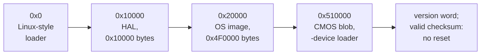

# 4. QEMU is the firmware

A real Raspberry Pi does not start the ARM first. The VideoCore GPU boots, runs
Broadcom's closed firmware, reads `config.txt` from the card, loads the OS image
and a CMOS settings file into memory, and only then releases the ARM cores. From
that point the firmware stays running. It answers mailbox calls, reports the
monitor's EDID and hands out the framebuffer.

**Under QEMU none of that firmware runs.** The kernel image is loaded straight into
memory with `-kernel`, and every job the firmware would have done falls to QEMU —
either as a device model's answer to a question, or as a file loaded at the right
address. This chapter covers the firmware duties that stood between the supervisor
prompt and a desktop.


<!-- doccrate:keep-together:start -->

#### Firmware duties, and who does them now

| Firmware duty on a real Pi | How the fork provides it |
|:---|:---|
| load the OS image | `-kernel RISCOS.IMG` |
| load the CMOS settings file | `-device loader`, with a blob built by `mkcmos.py` |
| answer mailbox channel 0 (power) | the new power peer (chapter 2) |
| answer VCHIQ on channel 3 | the new VCHIQ peer (chapter 3) |
| answer the EDID property tag | an EDID block built from a mode table |
| framebuffer, memory, board and clock tags | already in QEMU's property model |

<!-- doccrate:keep-together:end -->


## The CMOS blob

A Pi has no CMOS chip. The HAL reads its non-volatile settings from a blob the
firmware leaves in memory **immediately after the OS image**. It reads the blob
before the MMU is on and checks a version word. If the word is out of range, it
blanks every setting to `0xFF`.

Stock QEMU leaves nothing there, so every boot was a machine with no
configuration. It could reach the supervisor prompt, but never the desktop.


<!-- doccrate:keep-together:start -->

### Where the blob goes

The address is not a constant. The ROM file begins with the HAL, whose image is
`0x10000` bytes. The OS image follows at file offset `0x10000`, with a header
that starts with the magic word `OSIm`, then flags, then the OS image size. The
HAL works out the CMOS address from that size:

| Where the ROM is loaded | Address |
|:---|:---|
| QEMU `-kernel`: image at `0x10000` | `0x10000` + HAL `0x10000` + OS image `0x4F0000` = **`0x510000`** |
| a real Pi: image at `0x8000` | `0x8000` + HAL `0x10000` + OS image `0x4F0000` = `0x508000` |

<!-- doccrate:keep-together:end -->


The second row matches the real firmware's own `config.txt`, which loads the CMOS
file at `0x508000`. That agreement confirms the arithmetic. Under QEMU, one more
option supplies the blob:

```text
-device loader,file=cmos.bin,addr=0x510000,force-raw=on
```

That was the last thing between the supervisor prompt and the desktop. **It needed
no device model at all** — only the right bytes at the right address.

### Built from source, not transcribed

`tools/mkcmos.py` (commit `106a0b5554`) builds the blob without a single
hand-typed setting:

- **The layout** comes from RISC OS's own `hdr/CMOS` header. The tool simulates
  the assembler's storage-map directives over that file to compute each setting's
  byte address.
- **The defaults** come from parsing the kernel's `DefaultCMOSTable` and
  evaluating its expressions.
- **The load address** comes from the ROM's own `OSIm` header.
- **A cross-check** compares the computed layout with the address comments in the
  header. 72 of 73 agree, and the tool reports the one that does not.


<!-- doccrate:keep-together:start -->

#### Later options

Later options removed the need for a RISC OS source checkout:

| Option | What it does |
|:---|:---|
| `--symbols cmos-symbols-530.json` | uses a committed, pre-resolved symbol table instead of parsing headers |
| `--base CMOS` | starts from the SD card's own 2,048-byte CMOS file, which already sets the monitor type to EDID |
| `--unplug EtherGENET` | resolves a module name to its ROM chunk number by walking the ROM's module chain |
| `--filesystem 192` | boots from SDFS |
| `--language 1` | boots to the supervisor prompt on purpose; the stock default, 11, is the desktop |

<!-- doccrate:keep-together:end -->


### The checksum trap

One behaviour is worth knowing before anyone builds a blob by hand. **A valid
checksum makes the kernel skip its CMOS reset entirely.** So the blob must carry
every setting, not just the one being changed. A blob of zeros with a correct
checksum boots to a black screen. The problem it was meant to fix is gone, and so
is every other setting.


<!-- doccrate:keep-together:start -->

### Where the blob sits



<!-- doccrate:keep-together:end -->


## A network driver that crashes on no network

With a CMOS blob in place, one data abort was still left from chapter 3. It was
never the emulator's fault.

RISC OS 5.30's ROM carries **EtherGENET**, the driver for the Pi 4's on-chip GENET
Ethernet controller. QEMU does not model GENET. With no controller to find, the
driver's attach routine correctly reports that no device exists — but it leaves
its interface pointer NULL. Code booked during the module's start-up later calls
through that pointer. The result is a data abort at `&FC3FB800`, on address `0x18`,
which takes down the whole boot.

**This is a bug in the driver, and no device model can prevent it**, because no
device is involved. Two fixes were built:


<!-- doccrate:keep-together:start -->

#### Two ways to keep EtherGENET out

| Fix | How | Needs |
|:---|:---|:---|
| the CMOS unplug bit | `mkcmos.py --unplug EtherGENET`: ROM chunk 106, so byte `&82` gains bit `0x04`; the kernel never starts the module | the committed symbol table |
| a patched ROM | `tools/patch-rom-nogenet.py` finds the module by title, makes its init return success, and zeroes its service and SWI entries | nothing; source-free |

<!-- doccrate:keep-together:end -->


A third change keeps the driver's first register read from aborting. Commits
`418847ac82` and `5a61a7881c` put an unimplemented-device stub over the GENET
registers. The stub is at `0xfd580000`: that is where a BCM2711 has them, and it
is the address the HAL hands the driver from its fixed device table. The stub
reads as zero, which the driver takes as an unknown controller. On its own it does
not save the boot. The unplug bit or the patch is still required.

With the blob and the unplug bit, RISC OS 5.30 reached **the desktop from the ROM
alone, at 18:14 on day one.**

## The card was on the wrong controller

The next step was booting from the RISC OS Open SD card image rather than the ROM
alone. With `--filesystem 192` and the image attached as `-drive if=sd`, RISC OS
got as far as a desktop error box saying the drive was empty.


<!-- doccrate:keep-together:start -->

#### The BCM2711's SD controllers

The card was there. QEMU had plugged it into the wrong controller. A BCM2711 has
three SD host controllers:

| Controller | On a real Pi 4 | What RISC OS does with it |
|:---|:---|:---|
| legacy EMMC | the WiFi chip | marks it as the WiFi slot |
| SDHOST | unused for the card | never registers it |
| **EMMC2**, at `0x340000` | **the removable card** | **looks for the card here** |

<!-- doccrate:keep-together:end -->


QEMU's `bcm2838_peripherals` pointed the machine's `sd-bus` alias at the GPIO
block, whose pin mux only ever moves a card between the legacy EMMC and SDHOST.
So every card given to `raspi4b` sat one controller over from where the guest
looked. Commit `a7ea3f48da` is one line:

```c
object_property_add_alias(OBJECT(s), "sd-bus", OBJECT(&s->emmc2), "sd-bus");
```

After it, RISC OS mounts the card as `SDFS::RISCOSPi`, runs `!Boot` from it, and
reaches the desktop. The change affects any `raspi4b` guest that uses the card.
Linux's own device tree for the Pi 4 also puts the card on EMMC2.

QEMU has requirements of its own for the image: it must be writable and, at 2 GiB
or under, exactly a power of two in size. The RISC OS Open image was truncated to
2 GiB.

## Reading the card faster

Booting from the card exposed a cost. A multiple-block read arrives at QEMU's SD
card model one 512-byte block at a time. Each block was a synchronous read of the
backing file, a round trip through the block layer's thread pool, and a RISC OS
boot makes about **32,000** of them.

Commit `e48ee2c73a` adds a 64 KiB read-ahead buffer:

```c
if (addr < sd->readahead_addr ||
    addr + len > sd->readahead_addr + sd->readahead_len) {
    int64_t avail = blk_getlength(sd->blk) - addr;
    uint32_t n = MIN(SD_READAHEAD_SIZE, MAX(avail, 0));
    ...
    if (n < len || blk_pread(sd->blk, addr, n, sd->readahead, 0) < 0) {
        fprintf(stderr, "sd_blk_read: read error on host side\n");
        return;
    }
    sd->readahead_addr = addr;
    sd->readahead_len = n;
}
memcpy(sd->data, sd->readahead + (addr - sd->readahead_addr), len);
```

Writes, resets and media changes discard the buffer. It is not migrated, because
it refills itself. The card-reading phase of the boot went from about **seven
seconds to five**. The rest of that phase is a stall of about a millisecond per
block, which has been measured but is **still unexplained**.

## The monitor that was not there

The first desktop was 640×256, the lowest-resolution mode RISC OS has. The display
driver asks the firmware for the monitor's EDID with property tag `0x00030020`,
`GET_EDID_BLOCK`. QEMU did not answer it, so the read failed as *no acknowledge*.
The screen-mode module then fell back to the kernel's oldest numbered modes.

### An 800×600 monitor

Commit `70522977c7` answers block 0 with an EDID 1.3 block for a digital
800×600 display. It carries:

- VESA 800×600 at 60 Hz as the preferred timing
- 640×480 and 800×600 among the established timings
- a range-limits descriptor that admits them
- a checksum, computed as the block is handed over

Any other block number returns a non-zero status. That is how the guest learns
there is no extension block. With a CMOS whose monitor type is EDID, the desktop
came up at 800×600.

### Wide modes, and the real gate

RISC OS builds its whole mode list from the EDID, so the sizes a user can choose
were decided by 127 hand-written bytes. Commit `7ef62fa51f` replaced them with a
table, and `-global bcm2835-property.mode=WxH` picks the preferred entry:

```c
static const BCM2835EdidMode bcm2835_edid_modes[] = {
    {  640,  480,  25175, 160,  16,  96, 45, 10, 2 },   /* DMT */
    {  800,  600,  40000, 256,  40, 128, 28,  1, 4 },   /* DMT */
    { 1024,  768,  65000, 320,  24, 136, 38,  3, 6 },   /* DMT */
    { 1280,  720,  74250, 370, 110,  40, 30,  5, 5 },   /* CEA-861 */
    { 1280,  800,  71000, 160,  48,  32, 23,  3, 6 },   /* CVT-RB */
    { 1280, 1024, 108000, 408,  48, 112, 42,  1, 3 },   /* DMT */
    { 1440,  900,  88750, 160,  48,  32, 26,  3, 6 },   /* CVT-RB */
    { 1600, 1200, 162000, 560,  64, 192, 50,  1, 3 },   /* DMT */
    { 1920, 1080, 148500, 280,  88,  44, 45,  4, 5 },   /* CEA-861 */
    { 1920, 1200, 154000, 160,  48,  32, 35,  3, 6 },   /* CVT-RB */
};
```

Each row gives width, height, pixel clock in kHz, then the horizontal and vertical
blanking, front porch and sync widths. Nothing behind the table is real, so the
timings only need to be well formed and consistent. They are the standard figures
anyway, because a plausible block is easier to debug than an invented one.

Advertising 1920×1200 changed nothing at first. **The range-limits descriptor was
the real gate.** RISC OS checks every timing against it before offering a mode. The
old block capped the pixel clock at 50 MHz and the line rate at 50 kHz, which
silently discards anything above about 800×600. 1920×1200 needs 154 MHz and 75 kHz:

```c
d = edid + 90;
d[3] = 0xfd;
d[5] = 50;                                  /* 50-75 Hz vertical */
d[6] = 75;
d[7] = 15;                                  /* 15-200 kHz horizontal */
d[8] = 200;
d[9] = 60;                                  /* 600 MHz pixel clock */
```

The same commit fixed a pointer bug that only showed at large sizes. The VCHIQ
display service's `GetInfo` query had answered with the *current* framebuffer. During
boot that is 640×480, the mode the machine passes through before it settles. The
guest asks once and scales its pointer by the answer for the whole session. At
800×600 the error was a barely visible 1.25×. At 1920×1200 it made the pointer
10×10 pixels instead of 32×32, confined to a third of the screen and moving in
three-pixel steps. The query now answers with the EDID's preferred timing, which
does not change.

**Limits:** the table tops out at 1920×1200, and there is no CTA-861 extension
block. The standard-timing encoding can only express widths that are multiples of
eight, up to 2,288. A plan to go to 3840×2160 has not been built.

## The one firmware call still not implemented

`SET_CLOCK_RATE` (`0x00038002`) is still not implemented. Commit `aeffd4be90`
makes it log which clock is being set. On a boot the only requests are for clock 2,
the UART, at 3 MHz, and clock 3, the ARM, at 700 MHz. The machine reaches the
desktop without an answer to either.
