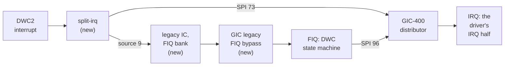

# 5. Input and network through a FIQ

By the evening of day one the machine had a desktop and a disc, but no way to
touch either. A `usb-kbd` had been attached to every run for hours, and RISC OS
never enumerated it. This chapter is the longest single investigation in the
fork. It ends with a keyboard, a tablet pointer and a network, and with RISC OS's
USB stack running from the fast interrupt, exactly as it does on silicon.

## The symptom

The Pi 4's DWC2 USB controller was clearly alive. QEMU's model ran, and it produced
start-of-frame interrupts at a steady rate. But **it never programmed a single host
channel**, and without host channels no USB transfer ever happens.

The trace looked healthy, and that was misleading. `usb_dwc2_attach`, the bus start
and the flood of start-of-frame events are all the *model's* own reset-time work.
The design record's lesson from this: **the only trace that proves the guest's
driver has run is a write to `GINTMSK` or `GAHBCFG`** — the controller's interrupt
mask and bus configuration. Those writes never came.

## A trace that hid its own evidence

An earlier reading had cleared one suspect. The Pi 4's ARM control block keeps an
MPHI alias at `0xb200`. It looked harmless, because no writes to the `0xfe00b3xx`
range appeared anywhere in the trace.

That reading was wrong, for a reason worth remembering:

> **QEMU logs an access through an alias against the target device's own offsets.**

The writes *were* in the trace. They appeared as `mphi` offsets `0x110`, `0x120`,
`0x124` and `0x128`. Through the alias at `0xb200` those are `0xb310` to `0xb328`,
the enable and disable registers of the BCM2711's **FIQ controller** at `0xb300`.
They were being swallowed.

## What RISC OS does with USB on a Pi 4

Reading the RISC OS sources explained where those writes were meant to go. In
outline:

- **The DWC driver always runs the host controller from its FIQ handler.** It
  claims the MPHI device's interrupt vector, not the USB one. It arms the controller
  by enabling FIQ source 9, and nothing ever enables the USB *IRQ* at the GIC.
- **On a Pi 4, the HAL's FIQ enable** writes `1 << 9` to the legacy controller's
  FIQ enable register at `0xfe00b310`. Its FIQ-source routine reads the pending
  registers, one with a byte-sized `LDRB`, and scans them for the highest set bit.
- **A Pi 4 has no MPHI block**, so the FIQ handler passes work to the IRQ side
  through the GIC itself. It sets the pending bit for SPI 96 in `GICD_ISPENDR`, and
  the IRQ handler clears it through `GICD_ICPENDR`. QEMU's GIC already handles
  that part.
- **The HAL's GIC set-up** explains how the FIQ is meant to arrive. The boot stub
  leaves the GIC unable to raise FIQs from non-secure state. So the HAL leaves the
  GIC's *interrupt signal bypass* enabled, and takes its FIQs from the BCM2711's
  legacy controller instead.

So on real hardware the path runs: the DWC2's interrupt line → the BCM2711 legacy
interrupt controller's FIQ bank for core 0 → the GIC-400's legacy nFIQ input → the
CPU, through the bypass. **QEMU had none of that path.**


<!-- doccrate:keep-together:start -->

### The FIQ path, as modelled



<!-- doccrate:keep-together:end -->


<!-- doccrate:keep-together:start -->

## Piece 1: the BCM2711 legacy interrupt controller

The datasheet (BCM2711 ARM Peripherals, §6.5.3) gives the whole register map.
Commit `873dccc24c` adds `hw/intc/bcm2838_ic.c`, about 200 lines, which follows
it closely:

| Offset from ARMC | Contents |
|:---|:---|
| `+0x200 + 0x40 × n` | the IRQ bank for core *n*: `PENDING0-2`, `SET_EN_0-2`, `CLR_EN_0-2` |
| `+0x300 + 0x40 × n` | the FIQ bank for core *n*, laid out the same way |
| `+0x230` | `IRQ_STATUS0-2`, the raw lines, in the first bank only |
| `+0x3f0` | `SWIRQ_SET/CLEAR`, left to the existing MPHI model |

<!-- doccrate:keep-together:end -->


Eight banks of enables cover the same 80 sources. A bank's output is the OR of its
enabled sources, and the pending registers show only enabled ones. There is nothing
to acknowledge: a source stays pending until the device drops its line.

```c
static bool bcm2838_ic_bank_active(BCM2838ICState *s, int bank)
{
    return (s->level[0] & s->enable[bank][0])
        || (s->level[1] & s->enable[bank][1])
        || (s->level[2] & s->enable[bank][2] & WORD2_SOURCES);
}

static void bcm2838_ic_update(BCM2838ICState *s)
{
    for (int bank = 0; bank < BCM2838_IC_NUM_BANKS; bank++) {
        qemu_irq out = bank < BCM2838_IC_NUM_CORES
                       ? s->irq[bank] : s->fiq[bank - BCM2838_IC_NUM_CORES];

        qemu_set_irq(out, bcm2838_ic_bank_active(s, bank));
    }
}
```

Word 2 of each bank is special. It holds sixteen more sources, then two summary
bits saying whether words 0 and 1 have anything pending, then a copy of the core's
own line. Only the sixteen sources gate the output.

The model is mapped at priority 1 over the `0xb200` region. That puts it above both
the BCM2835 controller the shared code maps there and the MPHI alias, which between
them had hidden the registers. It accepts byte-sized reads, for the HAL's `LDRB`.

## Piece 2: the GIC's legacy FIQ input

A GIC-400 has a legacy nIRQ and nFIQ input for each CPU, beside the distributor.
Its CPU interface passes the legacy signal straight to the processor whenever it is
not signalling that class of interrupt itself. That is the *interrupt signal
bypass*. Commit `54eac9c9fb` adds a `legacy-fiq` input per CPU to QEMU's GIC:

```c
static inline bool gic_legacy_fiq_bypassed(GICState *s, int cpu, bool virt)
{
    uint32_t ctlr = s->cpu_ctlr[cpu];
    bool own_fiqs = (ctlr & GICC_CTLR_EN_GRP0) && (ctlr & GICC_CTLR_FIQ_EN);

    return !virt && s->legacy_fiq[cpu] && !own_fiqs;
}
```

It is folded into both places where the GIC drives a CPU's FIQ line. That includes
the early exit taken **while the GIC is disabled altogether**:

```c
if (!gic_irq_signaling_enabled(s, cpu, virt,
                               GICD_CTLR_EN_GRP0 | GICD_CTLR_EN_GRP1)) {
    qemu_irq_lower(irq_lines[cpu]);
    qemu_set_irq(fiq_lines[cpu],
                 gic_legacy_fiq_bypassed(s, cpu, virt));
    continue;
}
...
qemu_set_irq(fiq_lines[cpu],
             fiq_level || gic_legacy_fiq_bypassed(s, cpu, virt));
```

Three details matter. QEMU already masks the bypass-disable bits out of
`GICC_CTLR`, so the bypass counts as always permitted, which is also what the
register reads back as. The bypass is gated off for virtual CPU interfaces. And the
input's level travels in a migration subsection that is sent only when an input is
high, so existing snapshots of other machines are unaffected.

## Piece 3: the wiring

In `bcm2838_peripherals.c` the DWC2 line now goes through a `split-irq`. One leg
goes to the GIC as before, and the other to legacy source 9. In `bcm2838.c` the
legacy controller's four FIQ outputs go into the GIC's new inputs:

```c
/*
 * The legacy controller's FIQs reach each core through the GIC's
 * bypass. Its IRQ outputs are left unconnected: that bypass only opens
 * with the GIC's own signalling off, which no guest of this SoC does.
 */
for (int n = 0; n < BCM283X_NCPUS; n++) {
    qdev_connect_gpio_out_named(DEVICE(&ps->ic), BCM2838_IC_FIQ_OUT, n,
                qdev_get_gpio_in_named(gicdev, "legacy-fiq", n));
}
```

Chapter 6 adds two more splits of the same shape, for the SMI vsync latch and the
ARM timer.

## Piece 4: two DWC2 bugs that would have wedged the machine

Two bugs in QEMU's DWC2 model would have hung the guest the moment FIQs started
arriving. They were found by reviewing the plan before the FIQ path was switched
on, then confirmed in the code. Commit `622a7bde8c` fixes both.

**The host-channel interrupt summary ignored its mask.** `GINTSTS.HCHINT` is the
live OR of the channel interrupts and their mask. The model re-evaluated it only
when a channel raised or dropped its own bit, never when the mask changed. RISC OS's
FIQ state machine defers every channel it does not handle itself by *masking* that
channel, and it relies on the line falling as a result:

```c
if (addr == HAINTMSK) {
    /*
     * GINTSTS.HCHINT is the live OR of HAINT & HAINTMSK, so a new mask
     * moves it as much as a channel event does. A driver that defers a
     * channel interrupt by masking it relies on the line falling here.
     */
    if (s->haint & s->haintmsk) {
        dwc2_raise_global_irq(s, GINTSTS_HCHINT);
    } else {
        dwc2_lower_global_irq(s, GINTSTS_HCHINT);
    }
}
```

**The interrupt level was a `static`.** `dwc2_update_irq` remembered the last level
it had driven in a function-local `static int`. That one variable was shared by
every DWC2 controller in the process and never reset with the device. The level now
lives in the device state. It is not migrated; `post_load` recomputes it from the
registers.

## The evidence that it worked

In order:

1. `FIQ0_SET_EN_0` reads back `0x200`: bit 9, enabled.
2. `info registers` catches the CPU in FIQ mode, with the PC inside the DWC driver.
3. The DWC2 trace shows an enumeration's control transfers, followed by the
   keyboard's interrupt endpoint being polled.
4. `F12` opens the desktop's command line.

A keyboard and a mouse behind a `usb-hub` enumerate too, and the pointer goes where
QMP's `input-send-event` sends it. The FIQ fires once per USB start-of-frame, about
**a thousand times a second**. The design record notes that this is the design, not
a leak.

One rig lesson: a bare `-device usb-kbd` on this machine is placed behind a hub.
Adding `bus=usb-bus.0,port=1` puts it on the root port.

## The DHCP wait

With the card and the keyboard working, `!Boot` ran as far as `PreDesk` and stopped.
It stayed stopped for three minutes, with the progress bar not moving.

PC samples put the machine in the `Internet`, `DHCP` and `SharedCLibrary` modules.
The card image's Internet start-up file explained why. The RISC OS partition is
FileCore, not FAT, so the file was found by searching the raw image for its text.
It names `EtherUSB` as the Ethernet device, and runs the DHCP client with its
*wait for the interface to appear* option on `ej0`.

That wait loop has three exits: the interface binds, the client gives up, or Escape
is pressed. With no Ethernet-over-USB device there is no `ej0`, so it spins. This is
stock RISC OS behaviour on a Pi with no network. The stock remedy is Escape, which
takes the boot on to the desktop with a *machine startup has not completed
successfully* box.

## A network, without modelling GENET

Modelling the Pi 4's GENET Ethernet controller would have been the hardware
answer. The soft answer was to supply the interface the boot sequence was waiting
for, a different way.

RISC OS's `EtherUSB` driver has a generic **CDC Ethernet** backend. It needs a
communications-class interface of subclass 6, a union descriptor naming the data
interface, and an Ethernet functional descriptor carrying the MAC address. QEMU's
`usb-net` is exactly that device in its CDC configuration, and QEMU's user-mode
networking (slirp) behind it serves DHCP.

It did not bind the first time, and the trace said why: the device received only
control transfers, never a bulk pipe. `usb-net` lists two configurations, **RNDIS
first** and CDC second. RISC OS's USB driver selects the first configuration at
enumeration, and passes on only that configuration's descriptors when it announces
the device. So `EtherUSB` was shown an RNDIS interface with no Ethernet descriptor,
and declined it.

Commit `7aebb77a43` adds an `rndis` property. It defaults to on, so nothing changes
for anyone else. When it is off, the device offers only its CDC configuration,
through the per-device descriptor override QEMU already has:

```c
static void usb_net_realize(USBDevice *dev, Error **errp)
{
    USBNetState *s = USB_NET(dev);

    if (!s->offer_rndis) {
        dev->usb_desc = &desc_net_cdc;
    }
    usb_desc_create_serial(dev);
    usb_desc_init(dev);
    ...
}

static const Property net_properties[] = {
    DEFINE_PROP_BOOL("rndis", USBNetState, offer_rndis, true),
    DEFINE_NIC_PROPERTIES(USBNetState, conf),
};
```

With `usb-net,rndis=off`:

- the configuration is set twice: once by the USB driver, and again by `EtherUSB`
  before it selects the data interface's alternate setting
- 44 frames go out on the bulk pipe during boot: the DHCP exchange and ARP
- there is **no DHCP wait at all**

Power-on to the desktop, idling in the `Portable` module with NetSurf open on the
card image's Welcome page, took **27 seconds**. That was 19:57 on day one.

## A pointer frozen in the corner

The next morning brought one more USB fix. The mouse worked, but a mouse reports relative motion, and a desktop inside a host
window wants absolute positions. QEMU's `usb-tablet` provides those. Under RISC OS
the tablet's pointer sat frozen in the corner of the screen.

RISC OS's USB mouse driver switches every HID device it claims to *report
protocol* before opening its interrupt pipe, and treats a failure as fatal. QEMU
accepted that request only from keyboards and mice, and stalled it for tablets. So
the device was dropped. As commit `cc932f6a7f` notes, Linux and Windows never send
`SET_PROTOCOL` to a device that describes its own reports, which is why nobody had
seen this upstream. The tablet *is* a boot-capable HID device, so the request is
legitimate:

```c
case HID_SET_PROTOCOL:
    /* The tablet is a boot-capable HID device too (subclass 1,
     * protocol 2), and guests like RISC OS insist on switching it
     * to report protocol before they will open the interrupt pipe
     * -- stalling here makes them drop the device entirely. */
    if (hs->kind == HID_KEYBOARD || hs->kind == HID_MOUSE ||
        hs->kind == HID_TABLET) {
        hs->protocol = value;
    } else {
        goto fail;
    }
    break;
```

It was verified by injecting absolute events over QMP. An injected `8000,4000` out
of `0..32767` reads back through RISC OS's `MOUSE` command as `390,1058`, on a
screen 1600 by 1200 OS units in size.

## Snapshots, and the device that blocked them

One more network change came the next day. Upstream `usb-net` was marked
unmigratable, and a single unmigratable device blocks `savevm` for the whole machine.
Every standard RISC OS launch includes the network device.

Commit `bf68b11a71` gives it a real migration description, enough for the CDC path:
the USB core state, the control-request results the guest cached, and any frame
half-sent in either direction. The RNDIS response queue is not covered, because it
is always empty in CDC mode.

The result is a `-loadvm` cold start with the desktop painted in **0.68 seconds**.
The clock ticks, the caret blinks, the keyboard works, and a `*Ping` to the slirp
gateway answers in 2 ms over the restored network.


<!-- doccrate:keep-together:start -->

## The boot, measured

Sampling the PC every five seconds and naming the ROM module it was in gave the
day-one boot profile:

| Time | Where the machine is |
|:---|:---|
| 0–7 s | ROM: the HAL and the kernel |
| 12 s | `Internet` and `DHCP`: `PreDesk` finished |
| 27 s | `Portable`: the desktop is up and the Wimp is idle |

<!-- doccrate:keep-together:end -->


Without a network, the machine sits in `DHCP` from 12 seconds until Escape is
pressed, and is on the desktop five seconds after that. Everything slower in earlier
runs was the test harness waiting at fixed marks.
