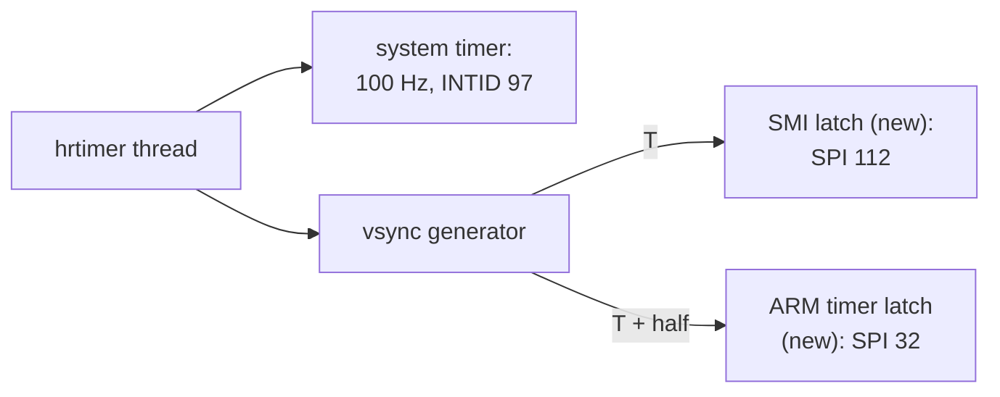

# 6. Time for an interrupt-driven OS

The day-one desktop worked, but it did not *keep time*. A centisecond ticker that
should arrive a hundred times a second arrived 88.7 times, and one gap lasted 222
milliseconds. Windows dragged across the screen left half-drawn wreckage behind
them. A restored snapshot came back with a dead clock.

This chapter covers the second day's work. It gave RISC OS its timing signals from
a dedicated host thread, replaced two unimplemented timer blocks with thin latches,
and fixed a DMA model that had been failing every window copy while reporting
success.

## What RISC OS waits for

RISC OS is interrupt-driven. Nothing in the desktop polls a clock; everything waits
for a signal. On a Pi those signals come from three blocks in the SoC and from the
GPU firmware.


<!-- doccrate:keep-together:start -->

### The signals

| Signal | Who waits for it | Source on a Pi | Rate |
|:---|:---|:---|:---|
| centisecond ticker | kernel: time, callbacks, Wimp | system timer compare 1 | 100 Hz |
| microsecond counter | kernel, between ticks | system timer counter | on demand |
| vertical sync | video driver, pointer, cursor | SMI interrupt, from firmware | per frame |
| half-frame update | video driver: palette, scroll | ARM timer, armed per vsync | per frame |
| USB start-of-frame | DWC driver's FIQ code | DWC2 frame interrupt | 1 kHz |

<!-- doccrate:keep-together:end -->


The vertical sync and the half-frame pulse are linked. At start-up the video driver
claims the SMI interrupt and counts arrivals for 20 centiseconds. It keeps the real
vsync **only if more than three arrive**. Otherwise it falls back to a fake vsync
derived from the ticker, so a rate below about 20 Hz puts it on the fallback. Once
on the real vsync, it uses the ARM timer's free-running counter to measure the frame
and arms the timer for half of it. The half-frame pulse and the counter are both
needed for its screen updates to keep flowing.

Upstream QEMU left both the ARM timer and the SMI block as unimplemented-device
stubs.

## A thread for the clock

QEMU's normal timers are serviced by the main loop. Under load the main loop gets
round to them late. Over an idle desktop the ticker lost one tick in nine, with a
worst gap of 222 ms.

Commit `d89e9bfb61` adds a new core facility, `system/hrtimer.c`: **one host thread,
one list of deadlines, and one wait.** Its whole interface is three calls:

```c
/* A timer whose callback runs on the timer thread, BQL held. */
HRTimer *hrtimer_new(HRTimerCB *cb, void *opaque);

/* Arm for an absolute QEMU_CLOCK_VIRTUAL deadline in ns; re-arming moves
 * it. Callable from any thread, including the callback itself. */
void hrtimer_mod_ns(HRTimer *t, int64_t deadline_ns);

/* Disarm. */
void hrtimer_del(HRTimer *t);
```

### The thread

The thread loop is short, and its ordering is the important part:

```c
for (;;) {
    now = qemu_clock_get_ns(QEMU_CLOCK_VIRTUAL);
    next = INT64_MAX;
    QTAILQ_FOREACH(t, &hr.armed, next) {
        next = MIN(next, t->deadline_ns);
    }
    if (next > now) {
        hrtimer_wait(MIN(next - now, (int64_t)HRTIMER_MAX_WAIT_NS));
        continue;
    }

    /* Something is due. Take the BQL first, then decide what fires,
     * so nothing re-arms behind our back between the two. */
    g_mutex_unlock(&hr.lock);
    bql_lock();
    g_mutex_lock(&hr.lock);
    now = qemu_clock_get_ns(QEMU_CLOCK_VIRTUAL);
    n = 0;
    QTAILQ_FOREACH_SAFE(t, &hr.armed, next, tnext) {
        if (t->deadline_ns <= now && n < HRTIMER_DUE_BATCH) {
            QTAILQ_REMOVE(&hr.armed, t, next);
            t->armed = false;
            due[n++] = t;
        }
    }
    g_mutex_unlock(&hr.lock);
    for (i = 0; i < n; i++) {
        due[i]->cb(due[i]->opaque);
    }
    bql_unlock();
    g_mutex_lock(&hr.lock);
}
```

Walking through it:

- **Find the earliest deadline** among the armed timers. If nothing is due, wait
  until it is, capped at 100 ms, so a stopped machine is re-checked now and then.
- **Something is due: take QEMU's big lock (the BQL) first, then decide what
  fires.** A guest write that re-arms a timer also runs under the BQL. Taking the
  lock *before* selecting the due timers means a re-arm cannot slip in between
  choosing a timer and firing it.
- **Re-read the clock under the lock**, take up to 16 due timers off the list, drop
  the list lock, and run their callbacks with the BQL held.

Deadlines are on QEMU's *virtual* clock. It runs with the host's monotonic clock
while the machine runs, and stands still while the machine is stopped. The thread
wakes at the host time a deadline would fall on. If the virtual clock has not got
there, for example because the machine is paused, it simply waits again.

### The wait itself

The wait is the one platform-specific piece:

```c
#ifdef _WIN32
    due.QuadPart = -MAX(wait_ns / 100, (int64_t)1);   /* relative, 100 ns */
    SetWaitableTimer(hr.timer, &due, 0, NULL, NULL, FALSE);
    g_mutex_unlock(&hr.lock);
    WaitForMultipleObjects(2, handles, FALSE, INFINITE);
    g_mutex_lock(&hr.lock);
#else
    g_cond_wait_until(&hr.cond, &hr.lock,
                      g_get_monotonic_time() + wait_ns / SCALE_US);
#endif
```

On Windows it is a *high-resolution waitable timer*. That takes its due time in
100 ns units and honours it to within tens of microseconds. On Windows versions
before 10 1803, which lack that timer, the code falls back to a plain waitable timer
and asks for a 1 ms scheduler period. Elsewhere it is a `GCond` wait with a
microsecond deadline. On either path, a re-arm from another thread signals the wait
so a nearer deadline is noticed at once. The thread also asks to be kept on the
host's performance cores; chapter 7 measures that.

### The system timer, rewired

The system timer's change is one line in the compare-register write. Each compare
becomes a deadline on the thread instead of a main-loop timer:

```c
triggers_delay_us = value - now;
trace_bcm2835_systmr_run(index, triggers_delay_us);
/* A deadline for the timer thread: RISC OS waits on this for its
 * 100 Hz ticker, so it fires when due, not at the next poll. */
hrtimer_mod_ns(s->tmr[index].timer,
               (now + triggers_delay_us) * SCALE_US);
```

## Latches instead of timers

The ARM timer and the SMI block needed to exist, but not to be *modelled*. The fork
replaces both unimplemented stubs with **latches**: registers that hold what the
guest writes, plus an interrupt raised by something outside.

**`hw/timer/bcm2835_armtimer.c`** is the SP804-derived timer in the ARM control
block, reduced to what the guest can observe. It has no countdown. Its interrupt is
raised by a `fire` input, and only if the guest has enabled the timer:

```c
static void bcm2835_armtimer_fire(void *opaque, int n, int level)
{
    BCM2835ARMTimerState *s = opaque;

    if (level && (s->control & CTRL_ENABLE)) {
        s->raw_irq = 1;
        s->fires++;
        bcm2835_armtimer_update_irq(s);
    }
}
```

The free-running counter the video driver uses to measure a frame is computed from
the virtual clock on each read, at 1 MHz. No thread is needed for it.

**`hw/misc/bcm2835_smi.c`** is the vsync latch. The SMI block is really a parallel
memory interface, but RISC OS uses it only for the firmware's vsync interrupt. So
the model keeps just the control-and-status register. **Any write acknowledges**:
RISC OS writes zero, and the datasheet's write-one-to-clear lands in the same place.

## A generator for the frame

Something has to pulse those latches. **`hw/misc/bcm2835_vsyncgen.c`** runs on the
timer thread with **two expiries per frame**: the vsync at time *T*, and the
half-frame pulse at *T* plus half a period.

```c
if (s->half_next) {
    qemu_irq_pulse(s->half_frame);
    s->half_next = false;
    hrtimer_mod_ns(s->timer, s->next_vsync_ns);
    return;
}
qemu_irq_pulse(s->vsync);
s->vsyncs++;
s->next_vsync_ns += period;
if (s->next_vsync_ns < now) {
    /* fell behind (machine stopped, host stalled): no catch-up burst */
    s->next_vsync_ns = now + period;
}
s->half_next = true;
hrtimer_mod_ns(s->timer, s->next_vsync_ns - period / 2);
```

Two design choices are visible here. **The schedule advances by whole periods**, so
it does not drift. But **if it falls behind** — the machine was stopped, or the host
stalled — it restarts from now instead of firing a burst of missed frames. A guest
that is handed ten vsyncs at once gains nothing from them.

The default rate is **30 Hz**, set by the `hz` property. `-display dx11,vsync=N` or
`-display metal,vsync=N` changes it, as does `-global bcm2835-vsyncgen.hz=N`. That
sits comfortably above the 20 Hz below which the video driver would reject it. The
host front end's render loop sends the guest nothing, so the guest's timing is
independent of how the window is drawn.


<!-- doccrate:keep-together:start -->

### One thread, three signals



<!-- doccrate:keep-together:end -->


Like the DWC2 line in chapter 5, the SMI and ARM timer interrupts are split so that
they reach both the GIC and the legacy controller.


<!-- doccrate:keep-together:start -->

### The result

| | Before | After |
|:---|---:|---:|
| ticks a second over an idle desktop | 88.7 | **100.0** |
| worst gap between ticks, Windows | 222 ms | **11.6 ms** |
| worst gap between ticks, macOS | — | **12.54 ms** (p99 12.38 ms) |

<!-- doccrate:keep-together:end -->


The macOS figure uses the thread's portable `GCond` branch. It was measured with a
*second* full machine running on the same Mac. Replacing the wait with
`mach_wait_until` on a real-time thread was considered and measured against first.
The numbers showed nothing worth that machinery, so it was not built.

The video driver now adopts the real vsync, arms its half-frame interrupt, and its
handler runs.

## The clamp that was undone

One timing change was committed and then reversed within 18 minutes. The episode
is a good example of the fork checking a fix against a trace before keeping it.

Commit `5a39b9150e` was work in progress saved as found in the tree, while a
"desktop freeze" investigation changed hands. It included a clamp in the system
timer: a compare value at or behind the counter would fire "on the next tick".

Commit `2a357a4a69` removed it, for three reasons:

1. **On silicon, the system timer matches on equality.** A compare value the counter
   has already passed is not reached until the 32-bit counter wraps. Guests that
   care handle this.
2. **RISC OS does handle it.** Its HAL rewrites the compare in a loop until the value
   is ahead of the counter. The trace showed exactly that: when a handler ran 40 ms
   late, four writes of "expire in 1 µs" came first, then a sane one, and the tick
   never stopped.
3. **The freeze was not the timer at all.** The keyboard had been sending the guest
   the wrong keys. The clamp could also add a spurious tick, whenever its
   one-microsecond expiry beat the guest's next write.

The net change to upstream's compare semantics is **none**.

## A snapshot with a dead clock

Snapshots exposed the thread's one blind spot. The compare registers migrate, but
**armed deadlines do not**: they were in flight on the timer thread, and would have
been in flight on an upstream QEMU timer too. After `-loadvm` every compare sat
below the counter with no match possible. The 100 Hz ticker was dead, the guest spun
on a clock that never moved, and typed keys were ignored.

The fix came as one of the "musts" in review commit `65c941595b`:

```c
static int bcm2835_systmr_post_load(void *opaque, int version_id)
{
    BCM2835SystemTimerState *s = opaque;
    uint64_t now = qemu_clock_get_us(QEMU_CLOCK_VIRTUAL);

    for (int index = 0; index < BCM2835_SYSTIMER_COUNT; index++) {
        int32_t delay = (int32_t)(s->reg.compare[index] - (uint32_t)now);

        if (delay > 0) {
            hrtimer_mod_ns(s->tmr[index].timer,
                           (now + (uint64_t)delay) * SCALE_US);
        }
    }
    return 0;
}
```

The virtual clock is restored to its value at save time. So a compare that was armed
for the future still is, and gets re-armed. One that is already due, or was never
armed, stays quiet: the HAL has already corrected past it. **INFERRED:** upstream's
version of the device has the same gap, as the code's own comment suggests.

The framebuffer device needed the same care in commit `6b90313543`. Its cached
console mapping is not migrated and was never rebuilt after a restore, so the first
screendump walked a zeroed mapping and crashed. Its console also kept a placeholder
size. `post_load` now forces a redraw and resizes the console. After both fixes a
snapshot cold start painted the desktop in 0.95 s. The migratable network device in
chapter 5 later brought that to 0.68 s.

## The half-drawn desktop

The last day-two fix is a display bug that was really a DMA bug. After every window
move or scroll, the desktop was left partly drawn.

RISC OS's kernel offers the video driver three render operations through
`GraphicsV`: copy a rectangle, fill a rectangle, and wait until idle. On the Pi, the
video driver implements only the copy, and it does it with the SoC's DMA controller
in **2D mode**. It builds a control block with source and destination both
incrementing, a **128-bit** transfer width, and a stride per row. For overlapping
copies there are three cases:


<!-- doccrate:keep-together:start -->

#### The three copy cases

| Case | How the copy runs |
|:---|:---|
| destination before source | forwards, from the top row |
| source before destination, rows not overlapping | from the bottom row upwards, with **negative** strides |
| rows overlapping | refused by the driver; the kernel copies in software |

<!-- doccrate:keep-together:end -->


QEMU's DMA model **refused any transfer with the 128-bit width bit set**, and any
length not a multiple of four bytes. It flagged an error and moved nothing. The video
driver never checks for that error, so it reported the copy complete, and the Wimp
redrew only the strips newly exposed. **That was the half-drawn desktop.** One drag
of the NetSurf window by 120 × 140 pixels is about fourteen such copies of 621 pixels
by up to 475, all backwards, on DMA channel 2.

Commit `7f4740ddc8` stops refusing, and moves each row whole when both ends
increment:

```c
/*
 * The width bits pick the bus transfer size on hardware; the bytes
 * moved are the same either way, so they are not a reason to
 * refuse, and neither is alignment: a transfer is whatever length
 * the guest asked for.
 */
bulk = (ch->ti & (BCM2708_DMA_S_INC | BCM2708_DMA_D_INC))
       == (BCM2708_DMA_S_INC | BCM2708_DMA_D_INC)
       && !(ch->ti & (BCM2708_DMA_S_IGNORE | BCM2708_DMA_D_IGNORE));
...
if (bulk && xlen) {
    /* both ends advance: move the row whole */
    dma_memory_read(&s->dma_as, ch->source_ad, row, xlen,
                    MEMTXATTRS_UNSPECIFIED);
    dma_memory_write(&s->dma_as, ch->dest_ad, row, xlen,
                     MEMTXATTRS_UNSPECIFIED);
    ch->source_ad += xlen;
    ch->dest_ad += xlen;
    xlen = 0;
}
```

The strides, including negative ones, are applied between rows as before. A new
trace point, `bcm2835_dma_2d`, counts the 2D copies. A later commit from the blitter
work, `64974a2686`, adds a fast path for pattern fills. **INFERRED
inconsistency:** that fast path's comment says the video driver uses DMA fills for
FillRectangle, but the design record says the driver does not implement
FillRectangle at all.

The drawing side of the story goes much further. The kernel's software plotting was
later taken onto the host by a paravirtual blitter. That is the subject of the
[graphics and sound walkthrough](../GraphicsSoundWalkthrough/index.md).
