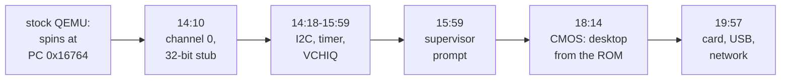

# RISC OS on a Pi 4, in QEMU

**How stock QEMU 11.1.0 was taught to boot the stock RISC OS 5.30 Raspberry Pi
ROM, on an emulated Raspberry Pi 4 whose Cortex-A72 runs in 32-bit mode — and why
almost none of the work was about the CPU.**

The fork runs `-M raspi4b -cpu cortex-a72,aarch64=off` and reaches a networked
desktop from the RISC OS Open SD card image, with a USB keyboard, a tablet pointer
and Ethernet. The first desktop arrived on the first day.

The finding that shapes everything in this document:

> **The CPU half was free. The machine half was the work.**

Stock QEMU already runs a Cortex-A72 in AArch32 on its `raspi4b` machine, given
the right option. Every blocker was somewhere else. Each was a Linux-shaped
assumption in QEMU's Raspberry Pi peripheral models, meeting an operating system
that boots a Pi very differently from Linux.

<!-- doccrate:keep-together:start -->

## These documents

| Chapter | What it covers |
|:---|:---|
| [1. The premise](01-the-premise.md) | why a 32-bit A72, and why the CPU was free |
| [2. First light](02-first-light.md) | a silent mailbox, and cores running garbage |
| [3. Tracing beats theorising](03-tracing.md) | the method, and five blockers to a prompt |
| [4. QEMU is the firmware](04-qemu-is-the-firmware.md) | CMOS, a crashing driver, the card, EDID |

<!-- doccrate:keep-together:end -->

<!-- doccrate:keep-together:start -->

#### These documents, continued

| Chapter | What it covers |
|:---|:---|
| [5. Input and network through a FIQ](05-fiq.md) | USB from the fast interrupt; CDC network |
| [6. Time for an interrupt-driven OS](06-time.md) | a timer thread, latches, DMA copies |
| [7. Two hosts, and what is left](07-hosts-and-whats-left.md) | Macs, cores, upstreaming, open issues |

<!-- doccrate:keep-together:end -->

<!-- doccrate:keep-together:start -->

## At a glance

| | |
|:---|:---|
| **Base** | QEMU 11.1.0 (`84f07211cc`), plus 156 commits to `e885a1a429` |
| **Command line** | `-M raspi4b -cpu cortex-a72,aarch64=off` |
| **Guest** | the stock RISC OS Open 5.30 Pi ROM |
| **First desktop** | day one: 18:14 from ROM, 19:57 from card |
| **Boot** | ~27 s i7-12700, 20.8 s M4, 0.68 s snapshot |
| **Hosts** | Windows (Direct3D 11); macOS, Arm and Intel (Metal) |

<!-- doccrate:keep-together:end -->

The published branch has since grown to 193 commits; the extra 37 are almost all
HostFS, which has [its own walkthrough](../HostFSWalkthrough/index.md).

## The shortest possible summary

QEMU's Raspberry Pi 4 model was written for Linux. Linux boots a Pi in AArch64,
reads a device tree, powers devices through a modern property tag, and never
touches half of the SoC's legacy interfaces. RISC OS 5 differs on almost every
count. It runs in AArch32 and reads no device tree. It uses the legacy mailbox
channels, polls without timeouts, and drives USB from the fast interrupt.

So the fork is a catalogue of places where QEMU's model and a real Pi disagree in
ways Linux never exercises. Every one was found the same way: trace the guest's
device accesses, find the register it spins on, and work out what question it is
asking. Most of the fixes are small. The fork counts nine of them as ordinary QEMU
bugs that would affect other guests too.

The design principle that decided *how* to fix each one — answer the question
rather than model the silicon — has
[its own walkthrough](../FakeItInSoftwareWalkthrough/index.md). This document is
the account of the changes themselves.

<!-- doccrate:keep-together:start -->

### The road to a desktop, on day one

<!-- doccrate:keep-together:end -->

